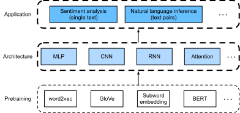

# Natural Language Processing: Applications
:label:`chap_nlp_app`



:label:`fig_nlp-map-app`

TODO@astonzhang

```toc
:maxdepth: 2

sentiment-analysis
sentiment-analysis-rnn
sentiment-analysis-cnn
natural-language-inference-and-dataset
natural-language-inference-attention
```

