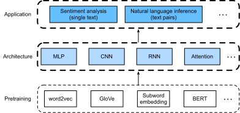

# Natural Language Processing: Applications
:label:`chap_nlp_app`

We have seen how to represent text tokens and train their representation in :numref:`chap_nlp_pretrain`.
Such pretrained text representation can be fed to various models for different downstream NLP tasks.

This book does not intend to cover NLP applications in a comprehensive manner.
Our focus is on *how to apply (deep) representation learning of languages to addressing NLP problems*.
Nonetheless, we have already discussed several NLP applications without pretraining in earlier chapters,
just for explaining deep learning architectures.
For instance, in :numref:`chap_rnn`,
we have relied on RNNs to design language models to generate novella-like text.
In :numref:`chap_modern_rnn` and :numref:`chap_attention`,
we have also designed models based on RNNs and attention mechanisms
for machine translation.
Given pretrained text representation,
in this chapter, we will consider two more downstream NLP tasks:
sentiment analysis and natural language inference.
These are popular and representative NLP tasks:
the former analyzes single text and the latter analyzes relationships of text pairs.


:label:`fig_nlp-map-app`

As depicted in :numref:`fig_nlp-map-app`,
this chapter focuses on describing the basic ideas of designing NLP models using different types of deep learning architectures, such as MLPs, CNNs, RNNs, and attention.
Though it is possible to combine any pretrained text representation with any architecture for either downstream NLP task in :numref:`fig_nlp-map-app`,
we consider a few representative combinations.
Specifically, we will explore popular architectures based on RNNs and CNNs for sentiment analysis.
For natural language inference, we choose attention and MLPs to demonstrate how to analyze text pairs.
In the experiments, we will see how to apply GloVe embeddings and fine-tune BERT in NLP downstream tasks.

```toc
:maxdepth: 2

sentiment-analysis-and-dataset
sentiment-analysis-rnn
sentiment-analysis-cnn
natural-language-inference-and-dataset
natural-language-inference-attention
natural-language-inference-bert
```

