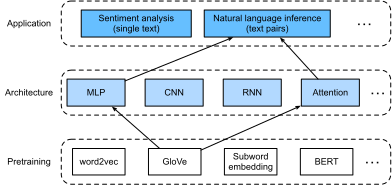
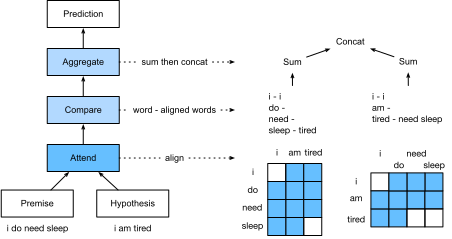

# Inférence en langage naturel : Using Attention
:label:`sec_natural-language-inference-attention` 

 Nous avons présenté la tâche d'inférence du langage naturel et le jeu de données SNLI dans :numref:`sec_natural-language-inference-and-dataset` . Au vu des nombreux modèles basés sur des architectures complexes et profondes, Parikh et al. ont proposé d'aborder l'inférence du langage naturel avec des mécanismes d'attention et l'ont appelé un " modèle d'attention décomposable " :cite:`Parikh.Tackstrom.Das.ea.2016` .
Il en résulte un modèle sans couches récurrentes ou convolutionnelles, qui obtient le meilleur résultat à l'époque sur le jeu de données SNLI avec beaucoup moins de paramètres.
Dans cette section, nous allons décrire et mettre en œuvre cette méthode basée sur l'attention (avec des MLP) pour l'inférence en langage naturel, comme illustré dans :numref:`fig_nlp-map-nli-attention` .


:label:`fig_nlp-map-nli-attention`


## Le modèle

Plus simple que de préserver l'ordre des tokens dans les prémisses et les hypothèses,
nous pouvons simplement aligner les tokens d'une séquence de texte sur chaque token de l'autre, et vice versa,
puis comparer et agréger ces informations pour prédire les relations logiques
entre les prémisses et les hypothèses.
Tout comme l'alignement des tokens entre les phrases source et cible dans la traduction automatique,
l'alignement des tokens entre les prémisses et les hypothèses
peut être accompli de manière simple par les mécanismes d'attention.

 
:label:`fig_nli_attention` 

 :numref:`fig_nli_attention` décrit la méthode d'inférence en langage naturel utilisant les mécanismes d'attention.
À un niveau élevé, elle se compose de trois étapes entraînées conjointement : l'attention, la comparaison et l'agrégation.
Nous allons les illustrer étape par étape dans ce qui suit.

```{.python .input}
#@tab mxnet
from d2l import mxnet as d2l
from mxnet import gluon, init, np, npx
from mxnet.gluon import nn

npx.set_np()
```

```{.python .input}
#@tab pytorch
from d2l import torch as d2l
import torch
from torch import nn
from torch.nn import functional as F
```

### Attending

La première étape consiste à aligner les jetons d'une séquence de texte sur chaque jeton de l'autre séquence.
Supposons que la prémisse soit "j'ai besoin de dormir" et que l'hypothèse soit "je suis fatigué".
En raison de la similarité sémantique,
nous pouvons souhaiter aligner "i" dans l'hypothèse avec "i" dans la prémisse,
et aligner "tired" dans l'hypothèse avec "sleep" dans la prémisse.
De même, nous pouvons souhaiter aligner "i" dans la prémisse avec "i" dans l'hypothèse,
et aligner "besoin" et "sommeil" dans la prémisse avec "fatigué" dans l'hypothèse.
Notez qu'un tel alignement est *doux* en utilisant la moyenne pondérée,
où idéalement des poids importants sont associés aux tokens à aligner.
Pour faciliter la démonstration, :numref:`fig_nli_attention` montre un tel alignement de manière *hard*.

Nous décrivons maintenant plus en détail l'alignement doux utilisant les mécanismes d'attention.
Désignons par $\mathbf{A} = (\mathbf{a}_1, \ldots, \mathbf{a}_m)$
 et $\mathbf{B} = (\mathbf{b}_1, \ldots, \mathbf{b}_n)$ la prémisse et l'hypothèse,
dont le nombre de tokens est $m$ et $n$, respectivement,
où $\mathbf{a}_i, \mathbf{b}_j \in \mathbb{R}^{d}$ ($i = 1, \ldots, m, j = 1, \ldots, n$) est un vecteur de mots de dimension $d$.
Pour l'alignement souple, nous calculons les poids d'attention $e_{ij} \in \mathbb{R}$ comme

$$e_{ij} = f(\mathbf{a}_i)^\top f(\mathbf{b}_j),$$ 
 :eqlabel:`eq_nli_e` 

 où la fonction $f$ est un MLP défini dans la fonction suivante `mlp`.
La dimension de sortie de $f$ est spécifiée par l'argument `num_hiddens` de `mlp`.

```{.python .input}
#@tab mxnet
def mlp(num_hiddens, flatten):
    net = nn.Sequential()
    net.add(nn.Dropout(0.2))
    net.add(nn.Dense(num_hiddens, activation='relu', flatten=flatten))
    net.add(nn.Dropout(0.2))
    net.add(nn.Dense(num_hiddens, activation='relu', flatten=flatten))
    return net
```

```{.python .input}
#@tab pytorch
def mlp(num_inputs, num_hiddens, flatten):
    net = []
    net.append(nn.Dropout(0.2))
    net.append(nn.Linear(num_inputs, num_hiddens))
    net.append(nn.ReLU())
    if flatten:
        net.append(nn.Flatten(start_dim=1))
    net.append(nn.Dropout(0.2))
    net.append(nn.Linear(num_hiddens, num_hiddens))
    net.append(nn.ReLU())
    if flatten:
        net.append(nn.Flatten(start_dim=1))
    return nn.Sequential(*net)
```

Il convient de souligner que, dans :eqref:`eq_nli_e` 
 $f$ prend les entrées $\mathbf{a}_i$ et $\mathbf{b}_j$ séparément plutôt que de prendre une paire d'entre elles ensemble comme entrée.
Cette astuce de *décomposition* conduit uniquement à des applications $m + n$ (complexité linéaire) de $f$ plutôt qu'à des applications $mn$
 (complexité quadratique).


En normalisant les poids d'attention dans :eqref:`eq_nli_e` ,
nous calculons la moyenne pondérée de tous les vecteurs de jeton dans l'hypothèse
pour obtenir la représentation de l'hypothèse qui est alignée de manière douce avec le jeton indexé par $i$ dans la prémisse :

$$
\boldsymbol{\beta}_i = \sum_{j=1}^{n}\frac{\exp(e_{ij})}{ \sum_{k=1}^{n} \exp(e_{ik})} \mathbf{b}_j.
$$

De la même manière, nous calculons l'alignement doux des tokens de la prémisse pour chaque token indexé par $j$ dans l'hypothèse :

$$
\boldsymbol{\alpha}_j = \sum_{i=1}^{m}\frac{\exp(e_{ij})}{ \sum_{k=1}^{m} \exp(e_{kj})} \mathbf{a}_i.
$$

Nous définissons ci-dessous la classe `Attend` pour calculer l'alignement souple des hypothèses (`beta`) avec les prémisses d'entrée `A` et l'alignement souple des prémisses (`alpha`) avec les hypothèses d'entrée `B`.

```{.python .input}
#@tab mxnet
class Attend(nn.Block):
    def __init__(self, num_hiddens, **kwargs):
        super(Attend, self).__init__(**kwargs)
        self.f = mlp(num_hiddens=num_hiddens, flatten=False)

    def forward(self, A, B):
        # Shape of `A`/`B`: (b`atch_size`, no. of tokens in sequence A/B,
        # `taille_intégrée`)
        # Shape of `f_A`/`f_B`: (`batch_size`, no. of tokens in sequence A/B,
        # `num_hiddens`)
        f_A = self.f(A)
        f_B = self.f(B)
        # Shape of `e`: (`batch_size`, no. of tokens in sequence A,
        # no. of tokens in sequence B)
        e = npx.batch_dot(f_A, f_B, transpose_b=True)
        # Shape of `beta`: (`batch_size`, no. of tokens in sequence A,
        # `taille_intégrée`), where sequence B is softly aligned with each token
        # (axis 1 of `bêta`) in sequence A
        beta = npx.batch_dot(npx.softmax(e), B)
        # Shape of `alpha`: (`batch_size`, no. of tokens in sequence B,
        # `taille_intégrée`), where sequence A is softly aligned with each token
        # (axis 1 of `alpha`) in sequence B
        alpha = npx.batch_dot(npx.softmax(e.transpose(0, 2, 1)), A)
        return beta, alpha
```

```{.python .input}
#@tab pytorch
class Attend(nn.Module):
    def __init__(self, num_inputs, num_hiddens, **kwargs):
        super(Attend, self).__init__(**kwargs)
        self.f = mlp(num_inputs, num_hiddens, flatten=False)

    def forward(self, A, B):
        # Shape of `A`/`B`: (`batch_size`, no. of tokens in sequence A/B,
        # `taille_intégrée`)
        # Shape of `f_A`/`f_B`: (`batch_size`, no. of tokens in sequence A/B,
        # `num_hiddens`)
        f_A = self.f(A)
        f_B = self.f(B)
        # Shape of `e`: (`batch_size`, no. of tokens in sequence A,
        # no. of tokens in sequence B)
        e = torch.bmm(f_A, f_B.permute(0, 2, 1))
        # Shape of `beta`: (`batch_size`, no. of tokens in sequence A,
        # `taille_intégrée`), where sequence B is softly aligned with each token
        # (axis 1 of `bêta`) in sequence A
        beta = torch.bmm(F.softmax(e, dim=-1), B)
        # Shape of `alpha`: (`batch_size`, no. of tokens in sequence B,
        # `taille_intégrée`), where sequence A is softly aligned with each token
        # (axis 1 of `alpha`) in sequence B
        alpha = torch.bmm(F.softmax(e.permute(0, 2, 1), dim=-1), A)
        return beta, alpha
```

### Comparaison de

Dans l'étape suivante, nous comparons un token dans une séquence avec l'autre séquence qui est alignée de manière douce avec ce token.
Notez que dans l'alignement doux, tous les tokens d'une séquence, bien qu'avec des poids d'attention probablement différents, seront comparés à un token de l'autre séquence.
Pour faciliter la démonstration, :numref:`fig_nli_attention` associe des jetons à des jetons alignés de manière *dure*.
Par exemple, supposons que l'étape de présence détermine que "besoin" et "sommeil" dans la prémisse sont tous deux alignés avec "fatigué" dans l'hypothèse, la paire "fatigué--besoin de sommeil" sera comparée.

Lors de l'étape de comparaison, nous introduisons la concaténation (opérateur $[\cdot, \cdot]$) des jetons d'une séquence et des jetons alignés de l'autre séquence dans une fonction $g$ (un MLP) :

$$\mathbf{v}_{A,i} = g([\mathbf{a}_i, \boldsymbol{\beta}_i]), i = 1, \ldots, m\\ \mathbf{v}_{B,j} = g([\mathbf{b}_j, \boldsymbol{\alpha}_j]), j = 1, \ldots, n.$$

:eqlabel:`eq_nli_v_ab`


Dans :eqref:`eq_nli_v_ab` , $\mathbf{v}_{A,i}$ est la comparaison entre le token $i$ dans la prémisse et tous les tokens de l'hypothèse qui sont légèrement alignés avec le token $i$;
tandis que $\mathbf{v}_{B,j}$ est la comparaison entre le token $j$ dans l'hypothèse et tous les tokens de la prémisse qui sont légèrement alignés avec le token $j$.
La classe suivante `Compare` définit une telle étape de comparaison.

```{.python .input}
#@tab mxnet
class Compare(nn.Block):
    def __init__(self, num_hiddens, **kwargs):
        super(Compare, self).__init__(**kwargs)
        self.g = mlp(num_hiddens=num_hiddens, flatten=False)

    def forward(self, A, B, beta, alpha):
        V_A = self.g(np.concatenate([A, beta], axis=2))
        V_B = self.g(np.concatenate([B, alpha], axis=2))
        return V_A, V_B
```

```{.python .input}
#@tab pytorch
class Compare(nn.Module):
    def __init__(self, num_inputs, num_hiddens, **kwargs):
        super(Compare, self).__init__(**kwargs)
        self.g = mlp(num_inputs, num_hiddens, flatten=False)

    def forward(self, A, B, beta, alpha):
        V_A = self.g(torch.cat([A, beta], dim=2))
        V_B = self.g(torch.cat([B, alpha], dim=2))
        return V_A, V_B
```

### Agrégation

Avec deux ensembles de vecteurs de comparaison $\mathbf{v}_{A,i}$ ($i = 1, \ldots, m$) et $\mathbf{v}_{B,j}$ ($j = 1, \ldots, n$) en main,
dans la dernière étape, nous allons agréger ces informations pour déduire la relation logique.
Nous commençons par additionner les deux ensembles :

$$
\mathbf{v}_A = \sum_{i=1}^{m} \mathbf{v}_{A,i}, \quad \mathbf{v}_B = \sum_{j=1}^{n}\mathbf{v}_{B,j}.
$$

Ensuite, nous introduisons la concaténation des deux résultats de la synthèse dans la fonction $h$ (un MLP) pour obtenir le résultat de la classification de la relation logique :

$$
\hat{\mathbf{y}} = h([\mathbf{v}_A, \mathbf{v}_B]).
$$

L'étape d'agrégation est définie dans la classe suivante `Aggregate`.

```{.python .input}
#@tab mxnet
class Aggregate(nn.Block):
    def __init__(self, num_hiddens, num_outputs, **kwargs):
        super(Aggregate, self).__init__(**kwargs)
        self.h = mlp(num_hiddens=num_hiddens, flatten=True)
        self.h.add(nn.Dense(num_outputs))

    def forward(self, V_A, V_B):
        # Sum up both sets of comparison vectors
        V_A = V_A.sum(axis=1)
        V_B = V_B.sum(axis=1)
        # Feed the concatenation of both summarization results into an MLP
        Y_hat = self.h(np.concatenate([V_A, V_B], axis=1))
        return Y_hat
```

```{.python .input}
#@tab pytorch
class Aggregate(nn.Module):
    def __init__(self, num_inputs, num_hiddens, num_outputs, **kwargs):
        super(Aggregate, self).__init__(**kwargs)
        self.h = mlp(num_inputs, num_hiddens, flatten=True)
        self.linear = nn.Linear(num_hiddens, num_outputs)

    def forward(self, V_A, V_B):
        # Sum up both sets of comparison vectors
        V_A = V_A.sum(dim=1)
        V_B = V_B.sum(dim=1)
        # Feed the concatenation of both summarization results into an MLP
        Y_hat = self.linear(self.h(torch.cat([V_A, V_B], dim=1)))
        return Y_hat
```

### Rassembler tout cela

En rassemblant les étapes d'attention, de comparaison et d'agrégation,
nous définissons le modèle d'attention décomposable pour entraîner conjointement ces trois étapes.

```{.python .input}
#@tab mxnet
class DecomposableAttention(nn.Block):
    def __init__(self, vocab, embed_size, num_hiddens, **kwargs):
        super(DecomposableAttention, self).__init__(**kwargs)
        self.embedding = nn.Embedding(len(vocab), embed_size)
        self.attend = Attend(num_hiddens)
        self.compare = Compare(num_hiddens)
        # There are 3 possible outputs: entailment, contradiction, and neutral
        self.aggregate = Aggregate(num_hiddens, 3)

    def forward(self, X):
        premises, hypotheses = X
        A = self.embedding(premises)
        B = self.embedding(hypotheses)
        beta, alpha = self.attend(A, B)
        V_A, V_B = self.compare(A, B, beta, alpha)
        Y_hat = self.aggregate(V_A, V_B)
        return Y_hat
```

```{.python .input}
#@tab pytorch
class DecomposableAttention(nn.Module):
    def __init__(self, vocab, embed_size, num_hiddens, num_inputs_attend=100,
                 num_inputs_compare=200, num_inputs_agg=400, **kwargs):
        super(DecomposableAttention, self).__init__(**kwargs)
        self.embedding = nn.Embedding(len(vocab), embed_size)
        self.attend = Attend(num_inputs_attend, num_hiddens)
        self.compare = Compare(num_inputs_compare, num_hiddens)
        # There are 3 possible outputs: entailment, contradiction, and neutral
        self.aggregate = Aggregate(num_inputs_agg, num_hiddens, num_outputs=3)

    def forward(self, X):
        premises, hypotheses = X
        A = self.embedding(premises)
        B = self.embedding(hypotheses)
        beta, alpha = self.attend(A, B)
        V_A, V_B = self.compare(A, B, beta, alpha)
        Y_hat = self.aggregate(V_A, V_B)
        return Y_hat
```

### Entraînement et évaluation du modèle

Nous allons maintenant entraîner et évaluer le modèle d'attention décomposable défini sur l'ensemble de données SNLI.
Nous commençons par lire le jeu de données.


### Lecture du jeu de données

Nous téléchargeons et lisons le jeu de données SNLI à l'aide de la fonction définie dans :numref:`sec_natural-language-inference-and-dataset` . La taille du lot et la longueur de la séquence sont fixées à $256$ et $50$, respectivement.

```{.python .input}
#@tab all
batch_size, num_steps = 256, 50
train_iter, test_iter, vocab = d2l.load_data_snli(batch_size, num_steps)
```

#### Création du modèle

Nous utilisons l'intégration GloVe 100-dimensionnelle pré-entraînée pour représenter les mots d'entrée.
Ainsi, nous prédéfinissons la dimension des vecteurs $\mathbf{a}_i$ et $\mathbf{b}_j$ dans :eqref:`eq_nli_e` comme 100.
La dimension de sortie des fonctions $f$ dans :eqref:`eq_nli_e` et $g$ dans :eqref:`eq_nli_v_ab` est fixée à 200.
Ensuite, nous créons une instance de modèle, nous initialisons ses paramètres,
et nous chargeons l'incorporation GloVe pour initialiser les vecteurs des jetons d'entrée.

```{.python .input}
#@tab mxnet
embed_size, num_hiddens, devices = 100, 200, d2l.try_all_gpus()
net = DecomposableAttention(vocab, embed_size, num_hiddens)
net.initialize(init.Xavier(), ctx=devices)
glove_embedding = d2l.TokenEmbedding('glove.6b.100d')
embeds = glove_embedding[vocab.idx_to_token]
net.embedding.weight.set_data(embeds)
```

```{.python .input}
#@tab pytorch
embed_size, num_hiddens, devices = 100, 200, d2l.try_all_gpus()
net = DecomposableAttention(vocab, embed_size, num_hiddens)
glove_embedding = d2l.TokenEmbedding('glove.6b.100d')
embeds = glove_embedding[vocab.idx_to_token]
net.embedding.weight.data.copy_(embeds);
```

### Formation et évaluation du modèle

Contrairement à la fonction `split_batch` dans :numref:`sec_multi_gpu` qui prend des entrées uniques telles que des séquences de texte (ou des images),
nous définissons une fonction `split_batch_multi_inputs` pour prendre des entrées multiples telles que des prémisses et des hypothèses dans des minibatchs.

```{.python .input}
#@tab mxnet
#@save
def split_batch_multi_inputs(X, y, devices):
    """Split multi-input `X` and `y` into multiple devices."""
    X = list(zip(*[gluon.utils.split_and_load(
        feature, devices, even_split=False) for feature in X]))
    return (X, gluon.utils.split_and_load(y, devices, even_split=False))
```

Nous pouvons maintenant entraîner et évaluer le modèle sur l'ensemble de données SNLI.

```{.python .input}
#@tab mxnet
lr, num_epochs = 0.001, 4
trainer = gluon.Trainer(net.collect_params(), 'adam', {'learning_rate': lr})
loss = gluon.loss.SoftmaxCrossEntropyLoss()
d2l.train_ch13(net, train_iter, test_iter, loss, trainer, num_epochs, devices,
               split_batch_multi_inputs)
```

```{.python .input}
#@tab pytorch
lr, num_epochs = 0.001, 4
trainer = torch.optim.Adam(net.parameters(), lr=lr)
loss = nn.CrossEntropyLoss(reduction="none")
d2l.train_ch13(net, train_iter, test_iter, loss, trainer, num_epochs, devices)
```

### Utilisation du modèle

Enfin, définissez la fonction de prédiction pour produire la relation logique entre une paire de prémisses et d'hypothèses.

```{.python .input}
#@tab mxnet
#@save
def predict_snli(net, vocab, premise, hypothesis):
    """Predict the logical relationship between the premise and hypothesis."""
    premise = np.array(vocab[premise], ctx=d2l.try_gpu())
    hypothesis = np.array(vocab[hypothesis], ctx=d2l.try_gpu())
    label = np.argmax(net([premise.reshape((1, -1)),
                           hypothesis.reshape((1, -1))]), axis=1)
    return 'entailment' if label == 0 else 'contradiction' if label == 1 \
            else 'neutral'
```

```{.python .input}
#@tab pytorch
#@save
def predict_snli(net, vocab, premise, hypothesis):
    """Predict the logical relationship between the premise and hypothesis."""
    net.eval()
    premise = torch.tensor(vocab[premise], device=d2l.try_gpu())
    hypothesis = torch.tensor(vocab[hypothesis], device=d2l.try_gpu())
    label = torch.argmax(net([premise.reshape((1, -1)),
                           hypothesis.reshape((1, -1))]), dim=1)
    return 'entailment' if label == 0 else 'contradiction' if label == 1 \
            else 'neutral'
```

Nous pouvons utiliser le modèle formé pour obtenir le résultat de l'inférence en langage naturel pour un échantillon de paires de phrases.

```{.python .input}
#@tab all
predict_snli(net, vocab, ['he', 'is', 'good', '.'], ['he', 'is', 'bad', '.'])
```

## Résumé

* Le modèle d'attention décomposable consiste en trois étapes pour prédire les relations logiques entre les prémisses et les hypothèses : assister, comparer et agréger.
* Grâce aux mécanismes d'attention, nous pouvons aligner les tokens d'une séquence de texte sur chaque token de l'autre, et vice versa. Un tel alignement est doux en utilisant la moyenne pondérée, où idéalement des poids importants sont associés aux tokens à aligner.
* L'astuce de décomposition conduit à une complexité linéaire plus souhaitable que la complexité quadratique lors du calcul des poids d'attention.
* Nous pouvons utiliser des vecteurs de mots pré-entraînés comme représentation d'entrée pour une tâche de traitement du langage naturel en aval, telle que l'inférence en langage naturel.


## Exercices

1. Entraînez le modèle avec d'autres combinaisons d'hyperparamètres. Pouvez-vous obtenir une meilleure précision sur l'ensemble de test ?
1. Quels sont les principaux inconvénients du modèle d'attention décomposable pour l'inférence en langage naturel ?
1. Supposons que nous voulions obtenir le niveau de similarité sémantique (par exemple, une valeur continue entre 0 et 1) pour toute paire de phrases. Comment allons-nous collecter et étiqueter l'ensemble de données ? Pouvez-vous concevoir un modèle avec des mécanismes d'attention ?

:begin_tab:`mxnet`
[Discussions](https://discuss.d2l.ai/t/395)
:end_tab:

:begin_tab:`pytorch`
[Discussions](https://discuss.d2l.ai/t/1530)
:end_tab:
