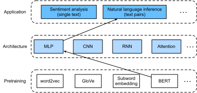

# Inférence en langage naturel : Réglage fin de BERT
:label:`sec_natural-language-inference-bert` 

 
 Dans les sections précédentes de ce chapitre,
nous avons conçu une architecture basée sur l'attention
(dans :numref:`sec_natural-language-inference-attention` )
pour la tâche d'inférence en langage naturel
sur l'ensemble de données SNLI (comme décrit dans :numref:`sec_natural-language-inference-and-dataset` ).
Nous revisitons maintenant cette tâche en ajustant BERT.
Comme nous l'avons vu dans :numref:`sec_finetuning-bert` ,
l'inférence en langage naturel est un problème de classification de paires de textes au niveau de la séquence,
et le réglage fin de BERT ne nécessite qu'une architecture MLP supplémentaire,
comme illustré dans :numref:`fig_nlp-map-nli-bert` .

 
 :label:`fig_nlp-map-nli-bert` 

 Dans cette section,
nous allons télécharger une petite version pré-entraînée de BERT,
puis la régler finement
pour l'inférence en langage naturel sur le jeu de données SNLI.

```{.python .input}
#@tab mxnet
from d2l import mxnet as d2l
import json
import multiprocessing
from mxnet import gluon, np, npx
from mxnet.gluon import nn
import os

npx.set_np()
```

```{.python .input}
#@tab pytorch
from d2l import torch as d2l
import json
import multiprocessing
import torch
from torch import nn
import os
```

## [**Loading Pretrained BERT**]

Nous avons expliqué comment prétraîner BERT sur le jeu de données WikiText-2 dans
:numref:`sec_bert-dataset` et :numref:`sec_bert-pretraining` 
 (notez que le modèle BERT original est prétraîné sur des corpus beaucoup plus importants).
Comme nous l'avons vu dans :numref:`sec_bert-pretraining` ,
le modèle original de BERT a des centaines de millions de paramètres.
Dans ce qui suit,
nous fournissons deux versions de BERT pré-entraîné :
"bert.base" est à peu près aussi grand que le modèle de base original de BERT qui nécessite beaucoup de ressources informatiques pour être ajusté finement,
tandis que "bert.small" est une petite version pour faciliter la démonstration.

```{.python .input}
#@tab mxnet
d2l.DATA_HUB['bert.base'] = (d2l.DATA_URL + 'bert.base.zip',
                             '7b3820b35da691042e5d34c0971ac3edbd80d3f4')
d2l.DATA_HUB['bert.small'] = (d2l.DATA_URL + 'bert.small.zip',
                              'a4e718a47137ccd1809c9107ab4f5edd317bae2c')
```

```{.python .input}
#@tab pytorch
d2l.DATA_HUB['bert.base'] = (d2l.DATA_URL + 'bert.base.torch.zip',
                             '225d66f04cae318b841a13d32af3acc165f253ac')
d2l.DATA_HUB['bert.small'] = (d2l.DATA_URL + 'bert.small.torch.zip',
                              'c72329e68a732bef0452e4b96a1c341c8910f81f')
```

Chaque modèle BERT prétraîné contient un fichier "vocab.json" qui définit le jeu de vocabulaire
et un fichier "pretrained.params" des paramètres prétraînés.
Nous implémentons la fonction suivante `load_pretrained_model` pour [**charger les paramètres BERT prétrainés**].

```{.python .input}
#@tab mxnet
def load_pretrained_model(pretrained_model, num_hiddens, ffn_num_hiddens,
                          num_heads, num_blks, dropout, max_len, devices):
    data_dir = d2l.download_extract(pretrained_model)
    # Define an empty vocabulary to load the predefined vocabulary
    vocab = d2l.Vocab()
    vocab.idx_to_token = json.load(open(os.path.join(data_dir, 'vocab.json')))
    vocab.token_to_idx = {token: idx for idx, token in enumerate(
        vocab.idx_to_token)}
    bert = d2l.BERTModel(len(vocab), num_hiddens, ffn_num_hiddens, num_heads, 
                         num_blks, dropout, max_len)
    # Load pretrained BERT parameters
    bert.load_parameters(os.path.join(data_dir, 'pretrained.params'),
                         ctx=devices)
    return bert, vocab
```

```{.python .input}
#@tab pytorch
def load_pretrained_model(pretrained_model, num_hiddens, ffn_num_hiddens,
                          num_heads, num_blks, dropout, max_len, devices):
    data_dir = d2l.download_extract(pretrained_model)
    # Define an empty vocabulary to load the predefined vocabulary
    vocab = d2l.Vocab()
    vocab.idx_to_token = json.load(open(os.path.join(data_dir, 'vocab.json')))
    vocab.token_to_idx = {token: idx for idx, token in enumerate(
        vocab.idx_to_token)}
    bert = d2l.BERTModel(
        len(vocab), num_hiddens, ffn_num_hiddens=ffn_num_hiddens, num_heads=4,
        num_blks=2, dropout=0.2, max_len=max_len)
    # Load pretrained BERT parameters
    bert.load_state_dict(torch.load(os.path.join(data_dir,
                                                 'pretrained.params')))
    return bert, vocab
```

Pour faciliter la démonstration sur la plupart des machines,
nous chargerons et ajusterons la petite version ("bert.small") du BERT prétraîné dans cette section.
Dans l'exercice, nous montrerons comment régler finement la version beaucoup plus grande "bert.base" pour améliorer de manière significative la précision des tests.

```{.python .input}
#@tab all
devices = d2l.try_all_gpus()
bert, vocab = load_pretrained_model(
    'bert.small', num_hiddens=256, ffn_num_hiddens=512, num_heads=4,
    num_blks=2, dropout=0.1, max_len=512, devices=devices)
```

## [**The Dataset for Fine-Tuning BERT**]

Pour la tâche en aval d'inférence en langage naturel sur le jeu de données SNLI,
nous définissons une classe de jeu de données personnalisée `SNLIBERTDataset`.
Dans chaque exemple,
, la prémisse et l'hypothèse forment une paire de séquences de texte
et sont regroupées dans une séquence d'entrée BERT, comme illustré sur :numref:`fig_bert-two-seqs` .
Rappelons que :numref:`subsec_bert_input_rep` que les ID de segment
sont utilisés pour distinguer la prémisse et l'hypothèse dans une séquence d'entrée d'ORET.
Avec la longueur maximale prédéfinie d'une séquence d'entrée d'ORET (`max_len`),
le dernier jeton de la plus longue des paires de textes d'entrée continue d'être supprimé jusqu'à ce que
`max_len` soit atteint.
Pour accélérer la génération de l'ensemble de données SNLI
pour le réglage fin de BERT,
nous utilisons 4 processus de travail pour générer des exemples d'entraînement ou de test en parallèle.

```{.python .input}
#@tab mxnet
class SNLIBERTDataset(gluon.data.Dataset):
    def __init__(self, dataset, max_len, vocab=None):
        all_premise_hypothesis_tokens = [[
            p_tokens, h_tokens] for p_tokens, h_tokens in zip(
            *[d2l.tokenize([s.lower() for s in sentences])
              for sentences in dataset[:2]])]
        
        self.labels = np.array(dataset[2])
        self.vocab = vocab
        self.max_len = max_len
        (self.all_token_ids, self.all_segments,
         self.valid_lens) = self._preprocess(all_premise_hypothesis_tokens)
        print('read ' + str(len(self.all_token_ids)) + ' examples')

    def _preprocess(self, all_premise_hypothesis_tokens):
        pool = multiprocessing.Pool(4)  # Use 4 worker processes
        out = pool.map(self._mp_worker, all_premise_hypothesis_tokens)
        all_token_ids = [
            token_ids for token_ids, segments, valid_len in out]
        all_segments = [segments for token_ids, segments, valid_len in out]
        valid_lens = [valid_len for token_ids, segments, valid_len in out]
        return (np.array(all_token_ids, dtype='int32'),
                np.array(all_segments, dtype='int32'), 
                np.array(valid_lens))

    def _mp_worker(self, premise_hypothesis_tokens):
        p_tokens, h_tokens = premise_hypothesis_tokens
        self._truncate_pair_of_tokens(p_tokens, h_tokens)
        tokens, segments = d2l.get_tokens_and_segments(p_tokens, h_tokens)
        token_ids = self.vocab[tokens] + [self.vocab['<pad>']] \
                             * (self.max_len - len(tokens))
        segments = segments + [0] * (self.max_len - len(segments))
        valid_len = len(tokens)
        return token_ids, segments, valid_len

    def _truncate_pair_of_tokens(self, p_tokens, h_tokens):
        # Reserve slots for '<CLS>', '<SEP>', and '<SEP>' tokens for the BERT
        # input
        while len(p_tokens) + len(h_tokens) > self.max_len - 3:
            if len(p_tokens) > len(h_tokens):
                p_tokens.pop()
            else:
                h_tokens.pop()

    def __getitem__(self, idx):
        return (self.all_token_ids[idx], self.all_segments[idx],
                self.valid_lens[idx]), self.labels[idx]

    def __len__(self):
        return len(self.all_token_ids)
```

```{.python .input}
#@tab pytorch
class SNLIBERTDataset(torch.utils.data.Dataset):
    def __init__(self, dataset, max_len, vocab=None):
        all_premise_hypothesis_tokens = [[
            p_tokens, h_tokens] for p_tokens, h_tokens in zip(
            *[d2l.tokenize([s.lower() for s in sentences])
              for sentences in dataset[:2]])]
        
        self.labels = torch.tensor(dataset[2])
        self.vocab = vocab
        self.max_len = max_len
        (self.all_token_ids, self.all_segments,
         self.valid_lens) = self._preprocess(all_premise_hypothesis_tokens)
        print('read ' + str(len(self.all_token_ids)) + ' examples')

    def _preprocess(self, all_premise_hypothesis_tokens):
        pool = multiprocessing.Pool(4)  # Use 4 worker processes
        out = pool.map(self._mp_worker, all_premise_hypothesis_tokens)
        all_token_ids = [
            token_ids for token_ids, segments, valid_len in out]
        all_segments = [segments for token_ids, segments, valid_len in out]
        valid_lens = [valid_len for token_ids, segments, valid_len in out]
        return (torch.tensor(all_token_ids, dtype=torch.long),
                torch.tensor(all_segments, dtype=torch.long), 
                torch.tensor(valid_lens))

    def _mp_worker(self, premise_hypothesis_tokens):
        p_tokens, h_tokens = premise_hypothesis_tokens
        self._truncate_pair_of_tokens(p_tokens, h_tokens)
        tokens, segments = d2l.get_tokens_and_segments(p_tokens, h_tokens)
        token_ids = self.vocab[tokens] + [self.vocab['<pad>']] \
                             * (self.max_len - len(tokens))
        segments = segments + [0] * (self.max_len - len(segments))
        valid_len = len(tokens)
        return token_ids, segments, valid_len

    def _truncate_pair_of_tokens(self, p_tokens, h_tokens):
        # Reserve slots for '<CLS>', '<SEP>', and '<SEP>' tokens for the BERT
        # input
        while len(p_tokens) + len(h_tokens) > self.max_len - 3:
            if len(p_tokens) > len(h_tokens):
                p_tokens.pop()
            else:
                h_tokens.pop()

    def __getitem__(self, idx):
        return (self.all_token_ids[idx], self.all_segments[idx],
                self.valid_lens[idx]), self.labels[idx]

    def __len__(self):
        return len(self.all_token_ids)
```

Après avoir téléchargé le jeu de données SNLI,
nous [**générons des exemples d'entraînement et de test**]
en instanciant la classe `SNLIBERTDataset`.
Ces exemples seront lus en minibatchs pendant l'entraînement et le test
de l'inférence en langage naturel.

```{.python .input}
#@tab mxnet
# Reduce `taille_batch` if there is an out of memory error. In the original BERT
# model, `max_len` = 512
batch_size, max_len, num_workers = 512, 128, d2l.get_dataloader_workers()
data_dir = d2l.download_extract('SNLI')
train_set = SNLIBERTDataset(d2l.read_snli(data_dir, True), max_len, vocab)
test_set = SNLIBERTDataset(d2l.read_snli(data_dir, False), max_len, vocab)
train_iter = gluon.data.DataLoader(train_set, batch_size, shuffle=True,
                                   num_workers=num_workers)
test_iter = gluon.data.DataLoader(test_set, batch_size,
                                  num_workers=num_workers)
```

```{.python .input}
#@tab pytorch
# Reduce `taille_batch` if there is an out of memory error. In the original BERT
# model, `max_len` = 512
batch_size, max_len, num_workers = 512, 128, d2l.get_dataloader_workers()
data_dir = d2l.download_extract('SNLI')
train_set = SNLIBERTDataset(d2l.read_snli(data_dir, True), max_len, vocab)
test_set = SNLIBERTDataset(d2l.read_snli(data_dir, False), max_len, vocab)
train_iter = torch.utils.data.DataLoader(train_set, batch_size, shuffle=True,
                                   num_workers=num_workers)
test_iter = torch.utils.data.DataLoader(test_set, batch_size,
                                  num_workers=num_workers)
```

## Réglage fin de BERT

Comme l'indique :numref:`fig_bert-two-seqs` ,
réglage fin de BERT pour l'inférence en langage naturel
ne nécessite qu'un MLP supplémentaire composé de deux couches entièrement connectées
(voir `self.hidden` et `self.output` dans la classe suivante `BERTClassifier` ).
[**Ce MLP transforme la représentation BERT
du token spécial "&lt;cls&gt;"**],
qui encode les informations de la prémisse et de l'hypothèse,
(**en trois sorties d'inférence en langage naturel**) :
entailment, contradiction, et neutre.

```{.python .input}
#@tab mxnet
class BERTClassifier(nn.Block):
    def __init__(self, bert):
        super(BERTClassifier, self).__init__()
        self.encoder = bert.encoder
        self.hidden = bert.hidden
        self.output = nn.Dense(3)

    def forward(self, inputs):
        tokens_X, segments_X, valid_lens_x = inputs
        encoded_X = self.encoder(tokens_X, segments_X, valid_lens_x)
        return self.output(self.hidden(encoded_X[:, 0, :]))
```

```{.python .input}
#@tab pytorch
class BERTClassifier(nn.Module):
    def __init__(self, bert):
        super(BERTClassifier, self).__init__()
        self.encoder = bert.encoder
        self.hidden = bert.hidden
        self.output = nn.LazyLinear(3)

    def forward(self, inputs):
        tokens_X, segments_X, valid_lens_x = inputs
        encoded_X = self.encoder(tokens_X, segments_X, valid_lens_x)
        return self.output(self.hidden(encoded_X[:, 0, :]))
```

Dans ce qui suit,
le modèle BERT pré-entraîné `bert` est introduit dans l'instance `BERTClassifier` `net` pour
l'application en aval.
Dans les implémentations courantes de l'ajustement fin de BERT,
, seuls les paramètres de la couche de sortie du MLP supplémentaire (`net.output`) seront appris à partir de zéro.
Tous les paramètres de l'encodeur BERT pré-entraîné (`net.encoder`) et de la couche cachée du MLP supplémentaire (`net.hidden`) seront affinés.

```{.python .input}
#@tab mxnet
net = BERTClassifier(bert)
net.output.initialize(ctx=devices)
```

```{.python .input}
#@tab pytorch
net = BERTClassifier(bert)
```

Rappelons que
dans :numref:`sec_bert` 
 la classe `MaskLM` et la classe `NextSentencePred`
 ont des paramètres dans leurs MLP employés.
Ces paramètres font partie de ceux du modèle BERT pré-entraîné
`bert` , et donc des paramètres de `net`.
Cependant, ces paramètres servent uniquement à calculer
la perte de modélisation du langage masqué
et la perte de prédiction de la phrase suivante
pendant le pré-entraînement.
Ces deux fonctions de perte ne sont pas pertinentes pour le réglage fin des applications en aval,
. Ainsi, les paramètres des MLP utilisés dans 
`MaskLM` et `NextSentencePred` ne sont pas mis à jour lors du réglage fin de BERT.

Pour autoriser les paramètres dont les gradients sont périmés,
, l'indicateur `ignore_stale_grad=True` est activé dans la fonction `step` de `d2l.train_batch_ch13`.
Nous utilisons cette fonction pour former et évaluer le modèle `net` en utilisant l'ensemble de formation
(`train_iter`) et l'ensemble de test (`test_iter`) de SNLI.
En raison des ressources de calcul limitées, [**la précision de l'entraînement**] et du test
peut être encore améliorée : nous laissons ces discussions dans les exercices.

```{.python .input}
#@tab mxnet
lr, num_epochs = 1e-4, 5
trainer = gluon.Trainer(net.collect_params(), 'adam', {'learning_rate': lr})
loss = gluon.loss.SoftmaxCrossEntropyLoss()
d2l.train_ch13(net, train_iter, test_iter, loss, trainer, num_epochs, devices,
               d2l.split_batch_multi_inputs)
```

```{.python .input}
#@tab pytorch
lr, num_epochs = 1e-4, 5
trainer = torch.optim.Adam(net.parameters(), lr=lr)
loss = nn.CrossEntropyLoss(reduction='none')
net(next(iter(train_iter))[0])
d2l.train_ch13(net, train_iter, test_iter, loss, trainer, num_epochs, devices)
```

## Résumé

* Nous pouvons affiner le modèle BERT pré-entraîné pour des applications en aval, comme l'inférence en langage naturel sur le jeu de données SNLI.
* Pendant le réglage fin, le modèle d'ORET devient une partie du modèle de l'application en aval. Les paramètres qui sont uniquement liés à la perte de pré-entraînement ne seront pas mis à jour pendant le réglage fin. 


## Exercices

1. Ajustez un modèle BERT pré-entraîné beaucoup plus grand qui est à peu près aussi grand que le modèle de base BERT original si vos ressources informatiques le permettent. Définissez les arguments de la fonction `load_pretrained_model` comme suit : en remplaçant 'bert.small' par 'bert.base', en augmentant les valeurs de `num_hiddens=256`, `ffn_num_hiddens=512`, `num_heads=4` et `num_blks=2` à 768, 3072, 12 et 12, respectivement. En augmentant les époques de réglage fin (et éventuellement en réglant d'autres hyperparamètres), pouvez-vous obtenir une précision de test supérieure à 0,86 ?
1. Comment tronquer une paire de séquences en fonction de leur rapport de longueur ? Comparez cette méthode de troncature de paires et celle utilisée dans la classe `SNLIBERTDataset`. Quels sont leurs avantages et leurs inconvénients ?

:begin_tab:`mxnet`
[Discussions](https://discuss.d2l.ai/t/397)
:end_tab:

:begin_tab:`pytorch`
[Discussions](https://discuss.d2l.ai/t/1526)
:end_tab:
