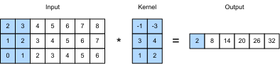

# Analyse des sentiments : Avec des CNN
:label:`sec_sentiment_cnn`

 
 Dans :numref:`chap_cnn`,
nous avons étudié les mécanismes
de traitement
des données d'images bidimensionnelles
avec des CNN bidimensionnels,
qui ont été appliqués à
des caractéristiques locales telles que les pixels adjacents.
Bien que conçus à l'origine
pour la vision par ordinateur,
les CNN sont également largement utilisés 
pour le traitement du langage naturel.
Pour faire simple,
il suffit de considérer toute séquence de texte
comme une image unidimensionnelle.
De cette manière,
CNN unidimensionnels
peuvent traiter des caractéristiques locales
telles que les $n$-grammes dans le texte.

Dans cette section,
nous utiliserons le modèle *textCNN*
pour démontrer
comment concevoir une architecture CNN
pour représenter un texte unique :cite:`Kim.2014`.
Par rapport à
:numref:`fig_nlp-map-sa-rnn` 
 qui utilise une architecture RNN avec un pré-entraînement GloVe
pour l'analyse des sentiments,
la seule différence dans :numref:`fig_nlp-map-sa-cnn` 
réside dans
le choix de l'architecture.


:label:`fig_nlp-map-sa-cnn` 

```{.python .input}
#@tab mxnet
from d2l import mxnet as d2l
from mxnet import gluon, init, np, npx
from mxnet.gluon import nn
npx.set_np()

batch_size = 64
train_iter, test_iter, vocab = d2l.load_data_imdb(batch_size)
```

```{.python .input}
#@tab pytorch
from d2l import torch as d2l
import torch
from torch import nn

batch_size = 64
train_iter, test_iter, vocab = d2l.load_data_imdb(batch_size)
```
 
## Convolutions unidimensionnelles

Avant de présenter le modèle,
voyons comment fonctionne une convolution unidimensionnelle.
Gardez à l'esprit qu'il s'agit simplement d'un cas particulier
d'une convolution bidimensionnelle
basée sur l'opération de corrélation croisée.


:label:`fig_conv1d` 

 Comme indiqué dans :numref:`fig_conv1d`,
dans le cas unidimensionnel,
la fenêtre de convolution
glisse de gauche à droite
sur le tenseur d'entrée.
Pendant le glissement,
le sous-tenseur d'entrée (par exemple, $0$ et $1$ dans :numref:`fig_conv1d` ) contenu dans la fenêtre de convolution
à une certaine position
et le tenseur du noyau (par exemple, $1$ et $2$ dans :numref:`fig_conv1d` ) sont multipliés par éléments.
La somme de ces multiplications
donne la valeur scalaire unique (par exemple, $0\times1+1\times2=2$ dans :numref:`fig_conv1d` )
à la position correspondante du tenseur de sortie.

Nous implémentons la corrélation croisée unidimensionnelle dans la fonction suivante `corr1d`.
Étant donné un tenseur d'entrée `X`
et un tenseur de noyau `K`,
elle renvoie le tenseur de sortie `Y`.

```{.python .input}
#@tab all
def corr1d(X, K):
    w = K.shape[0]
    Y = d2l.zeros((X.shape[0] - w + 1))
    for i in range(Y.shape[0]):
        Y[i] = (X[i: i + w] * K).sum()
    return Y
```

Nous pouvons construire le tenseur d'entrée `X` et le tenseur noyau `K` à partir de :numref:`fig_conv1d` pour valider la sortie de l'implémentation de la corrélation croisée unidimensionnelle ci-dessus.

```{.python .input}
#@tab all
X, K = d2l.tensor([0, 1, 2, 3, 4, 5, 6]), d2l.tensor([1, 2])
corr1d(X, K)
```

Pour toute entrée unidimensionnelle
avec plusieurs canaux,
le noyau de convolution
doit avoir le même nombre de canaux d'entrée.
Ensuite, pour chaque canal,
effectue une opération de corrélation croisée sur le tenseur unidimensionnel de l'entrée et le tenseur unidimensionnel du noyau de convolution,
en additionnant les résultats sur tous les canaux
pour produire le tenseur de sortie unidimensionnel.
:numref:`fig_conv1d_channel` montre une opération de corrélation croisée unidimensionnelle avec 3 canaux d'entrée.

!Opération de corrélation croisée unidimensionnelle avec 3 canaux d'entrée. Les parties ombragées sont le premier élément de sortie ainsi que les éléments du tenseur d'entrée et du noyau utilisés pour le calcul de la sortie: $0\times1+1\times2+1\times3+2\times4+2\times(-1)+3\times(-3)=2$.](../img/conv1d-channel.svg)
:label:`fig_conv1d_channel` 

 
Nous pouvons mettre en œuvre l'opération de corrélation croisée unidimensionnelle pour plusieurs canaux d'entrée
et valider les résultats dans :numref:`fig_conv1d_channel` .

```{.python .input}
#@tab all
def corr1d_multi_in(X, K):
    # First, iterate through the 0th dimension (channel dimension) of `X` and
    # `K`. Then, add them together
    return sum(corr1d(x, k) for x, k in zip(X, K))

X = d2l.tensor([[0, 1, 2, 3, 4, 5, 6],
              [1, 2, 3, 4, 5, 6, 7],
              [2, 3, 4, 5, 6, 7, 8]])
K = d2l.tensor([[1, 2], [3, 4], [-1, -3]])
corr1d_multi_in(X, K)
```

 Notez que
les corrélations croisées unidimensionnelles à canaux d'entrée multiples
sont équivalentes
à
les corrélations croisées bidimensionnelles à canal d'entrée unique
.

À titre d'exemple,
est une forme équivalente de
la corrélation croisée unidimensionnelle à canaux multiples
dans :numref:`fig_conv1d_channel` 
 est
la corrélation croisée bidimensionnelle à canal unique

 dans :numref:`fig_conv1d_2d` ,
où la hauteur du noyau de convolution
doit être la même que celle du tenseur d'entrée.


![Opération de corrélation croisée bidimensionnelle avec un seul canal d'entrée.)$ Les$
:label:`fig_conv1d_2d` 

 Les sorties de :numref:`fig_conv1d` et :numref:`fig_conv1d_channel` n'ont qu'un seul canal.
Comme pour les convolutions bidimensionnelles avec plusieurs canaux de sortie décrites dans :numref:`subsec_multi-output-channels` ,
nous pouvons également spécifier plusieurs canaux de sortie
pour les convolutions unidimensionnelles.

## Pooling max-sur-temps

De même, nous pouvons utiliser le pooling
pour extraire la valeur la plus élevée
des représentations de séquences
en tant que caractéristique la plus importante
à travers les pas de temps.
Le *max-over-time pooling* utilisé dans textCNN
fonctionne comme
le max-pooling global unidimensionnel
:cite:`Collobert.Weston.Bottou.ea.2011` .
Pour une entrée multicanal
où chaque canal stocke des valeurs
à différents pas de temps,
la sortie à chaque canal
est la valeur maximale
pour ce canal.
Notez que
le pooling max-over-time
permet différents nombres de pas de temps
sur différents canaux.

## Le modèle textCNN

À l'aide de la convolution unidimensionnelle
et de la mise en commun max-over-time,
le modèle textCNN
prend en entrée les représentations individuelles pré-entraînées de tokens
,
puis obtient et transforme les représentations de séquences
pour l'application en aval.

Pour une séquence de texte unique
avec $n$ tokens représentés par
$d$ -dimensional vectors,
la largeur, la hauteur, et le nombre de canaux
du tenseur d'entrée
sont $n$, $1$, et $d$, respectivement.
Le modèle textCNN transforme l'entrée
en sortie comme suit :

1. Définissez plusieurs noyaux de convolution unidimensionnels et effectuez des opérations de convolution séparément sur les entrées. Des noyaux de convolution de différentes largeurs peuvent capturer des caractéristiques locales parmi différents nombres de tokens adjacents.
1. Effectuez un regroupement max-over-time sur tous les canaux de sortie, puis concaténérez toutes les sorties du regroupement scalaire sous forme de vecteur.
1. Transformer le vecteur concaténé en catégories de sortie en utilisant la couche entièrement connectée. Le Dropout peut être utilisé pour réduire l'overfitting.

 
:label:`fig_conv1d_textcnn` 

 :numref:`fig_conv1d_textcnn` 
 illustre l'architecture du modèle textCNN
avec un exemple concret.
L'entrée est une phrase comportant 11 tokens,
où
chaque token est représenté par un vecteur à 6 dimensions.
Nous avons donc une entrée à 6 canaux de largeur 11.
Définissez
deux noyaux de convolution unidimensionnels
de largeur 2 et 4,
avec 4 et 5 canaux de sortie, respectivement.
Ils produisent
4 canaux de sortie de largeur $11-2+1=10$
 et 5 canaux de sortie de largeur $11-4+1=8$.
Malgré les différentes largeurs de ces 9 canaux,
le pooling max-over-time
donne un vecteur concaténé à 9 dimensions,
qui est finalement transformé
en un vecteur de sortie à 2 dimensions
pour les prédictions de sentiments binaires.


### Définition du modèle

Nous implémentons le modèle textCNN dans la classe suivante.
Par rapport au modèle RNN bidirectionnel dans
:numref:`sec_sentiment_rnn` ,
en plus de
remplacer les couches récurrentes par des couches convolutionnelles,
nous utilisons également deux couches d'intégration :
une avec des poids entraînables et l'autre
avec des poids fixes.

```{.python .input}
#@tab mxnet
class TextCNN(nn.Block):
    def __init__(self, vocab_size, embed_size, kernel_sizes, num_channels,
                 **kwargs):
        super(TextCNN, self).__init__(**kwargs)
        self.embedding = nn.Embedding(vocab_size, embed_size)
        # The embedding layer not to be trained
        self.constant_embedding = nn.Embedding(vocab_size, embed_size)
        self.dropout = nn.Dropout(0.5)
        self.decoder = nn.Dense(2)
        # The max-over-time pooling layer has no parameters, so this instance
        # can be shared
        self.pool = nn.GlobalMaxPool1D()
        # Create multiple one-dimensional convolutional layers
        self.convs = nn.Sequential()
        for c, k in zip(num_channels, kernel_sizes):
            self.convs.add(nn.Conv1D(c, k, activation='relu'))

    def forward(self, inputs):
        # Concatenate two embedding layer outputs with shape (batch size, no.
        # of tokens, token vector dimension) along vectors
        embeddings = np.concatenate((
            self.embedding(inputs), self.constant_embedding(inputs)), axis=2)
        # Per the input format of one-dimensional convolutional layers,
        # rearrange the tensor so that the second dimension stores channels
        embeddings = embeddings.transpose(0, 2, 1)
        # For each one-dimensional convolutional layer, after max-over-time
        # pooling, a tensor of shape (batch size, no. of channels, 1) is
        # obtained. Remove the last dimension and concatenate along channels
        encoding = np.concatenate([
            np.squeeze(self.pool(conv(embeddings)), axis=-1)
            for conv in self.convs], axis=1)
        outputs = self.decoder(self.dropout(encoding))
        return outputs
```

```{.python .input}
#@tab pytorch
class TextCNN(nn.Module):
    def __init__(self, vocab_size, embed_size, kernel_sizes, num_channels,
                 **kwargs):
        super(TextCNN, self).__init__(**kwargs)
        self.embedding = nn.Embedding(vocab_size, embed_size)
        # The embedding layer not to be trained
        self.constant_embedding = nn.Embedding(vocab_size, embed_size)
        self.dropout = nn.Dropout(0.5)
        self.decoder = nn.Linear(sum(num_channels), 2)
        # The max-over-time pooling layer has no parameters, so this instance
        # can be shared
        self.pool = nn.AdaptiveAvgPool1d(1)
        self.relu = nn.ReLU()
        # Create multiple one-dimensional convolutional layers
        self.convs = nn.ModuleList()
        for c, k in zip(num_channels, kernel_sizes):
            self.convs.append(nn.Conv1d(2 * embed_size, c, k))

    def forward(self, inputs):
        # Concatenate two embedding layer outputs with shape (batch size, no.
        # of tokens, token vector dimension) along vectors
        embeddings = torch.cat((
            self.embedding(inputs), self.constant_embedding(inputs)), dim=2)
        # Per the input format of one-dimensional convolutional layers,
        # rearrange the tensor so that the second dimension stores channels
        embeddings = embeddings.permute(0, 2, 1)
        # For each one-dimensional convolutional layer, after max-over-time
        # pooling, a tensor of shape (batch size, no. of channels, 1) is
        # obtained. Remove the last dimension and concatenate along channels
        encoding = torch.cat([
            torch.squeeze(self.relu(self.pool(conv(embeddings))), dim=-1)
            for conv in self.convs], dim=1)
        outputs = self.decoder(self.dropout(encoding))
        return outputs
```

Créons une instance textCNN.
Elle possède 3 couches convolutionnelles avec des largeurs de noyau de 3, 4 et 5, toutes avec 100 canaux de sortie.

```{.python .input}
#@tab mxnet
embed_size, kernel_sizes, nums_channels = 100, [3, 4, 5], [100, 100, 100]
devices = d2l.try_all_gpus()
net = TextCNN(len(vocab), embed_size, kernel_sizes, nums_channels)
net.initialize(init.Xavier(), ctx=devices)
```

```{.python .input}
#@tab pytorch
embed_size, kernel_sizes, nums_channels = 100, [3, 4, 5], [100, 100, 100]
devices = d2l.try_all_gpus()
net = TextCNN(len(vocab), embed_size, kernel_sizes, nums_channels)

def init_weights(module):
    if type(module) in (nn.Linear, nn.Conv1d):
        nn.init.xavier_uniform_(module.weight)

net.apply(init_weights);
```

### Chargement des vecteurs de mots pré-entraînés

Comme pour :numref:`sec_sentiment_rnn` ,
nous chargeons des embeddings GloVe 100-dimensionnels pré-entraînés
comme représentations de mots initialisées.
Ces représentations de mots (poids d'incorporation)
seront entraînées dans `embedding`
 et fixées dans `constant_embedding`.

```{.python .input}
#@tab mxnet
glove_embedding = d2l.TokenEmbedding('glove.6b.100d')
embeds = glove_embedding[vocab.idx_to_token]
net.embedding.weight.set_data(embeds)
net.constant_embedding.weight.set_data(embeds)
net.constant_embedding.collect_params().setattr('grad_req', 'null')
```

```{.python .input}
#@tab pytorch
glove_embedding = d2l.TokenEmbedding('glove.6b.100d')
embeds = glove_embedding[vocab.idx_to_token]
net.embedding.weight.data.copy_(embeds)
net.constant_embedding.weight.data.copy_(embeds)
net.constant_embedding.weight.requires_grad = False
```

### Formation et évaluation du modèle

Nous pouvons maintenant former le modèle textCNN pour l'analyse des sentiments.

```{.python .input}
#@tab mxnet
lr, num_epochs = 0.001, 5
trainer = gluon.Trainer(net.collect_params(), 'adam', {'learning_rate': lr})
loss = gluon.loss.SoftmaxCrossEntropyLoss()
d2l.train_ch13(net, train_iter, test_iter, loss, trainer, num_epochs, devices)
```

```{.python .input}
#@tab pytorch
lr, num_epochs = 0.001, 5
trainer = torch.optim.Adam(net.parameters(), lr=lr)
loss = nn.CrossEntropyLoss(reduction="none")
d2l.train_ch13(net, train_iter, test_iter, loss, trainer, num_epochs, devices)
```

Ci-dessous, nous utilisons le modèle entraîné pour prédire le sentiment pour deux phrases simples.

```{.python .input}
#@tab all
d2l.predict_sentiment(net, vocab, 'this movie is so great')
```

```{.python .input}
#@tab all
d2l.predict_sentiment(net, vocab, 'this movie is so bad')
```

### Résumé

* Les CNN unidimensionnels peuvent traiter des caractéristiques locales telles que les $n$-grammes dans le texte.
* Les corrélations croisées unidimensionnelles à canaux multiples sont équivalentes aux corrélations croisées bidimensionnelles à canal unique.
* Le pooling max-over-time permet différents nombres de pas de temps pour différents canaux.
* Le modèle textCNN transforme les représentations de jetons individuels en sorties d'applications en aval à l'aide de couches convolutionnelles unidimensionnelles et de couches de mise en commun max-over-time.


## Exercices

1. Réglez les hyperparamètres et comparez les deux architectures pour l'analyse des sentiments dans :numref:`sec_sentiment_rnn` et dans cette section, notamment en termes de précision de classification et d'efficacité de calcul.
1. Pouvez-vous améliorer davantage la précision de classification du modèle en utilisant les méthodes introduites dans les exercices de :numref:`sec_sentiment_rnn` ?
1. Ajoutez l'encodage positionnel dans les représentations d'entrée. Cela améliore-t-il la précision de la classification ?

:begin_tab:`mxnet`
[Discussions](https://discuss.d2l.ai/t/393)
:end_tab: 

 :begin_tab:`pytorch` 
[Discussions](https://discuss.d2l.ai/t/1425)
:end_tab:
