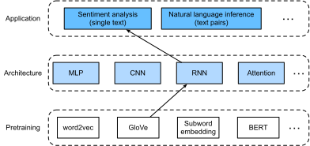

# Analyse des sentiments : Utilisation de réseaux neuronaux récurrents
:label:`sec_sentiment_rnn` 

 
 Comme pour les tâches de similarité et d'analogie de mots,
nous pouvons également appliquer des vecteurs de mots pré-entraînés
à l'analyse des sentiments.
Étant donné que l'ensemble de données de critiques IMDb
dans :numref:`sec_sentiment` 
 n'est pas très grand,
l'utilisation de représentations textuelles
qui ont été pré-entraînées
sur des corpus à grande échelle
peut réduire le surajustement du modèle.
À titre d'exemple spécifique
illustré dans :numref:`fig_nlp-map-sa-rnn` ,
nous représenterons chaque token
en utilisant le modèle GloVe pré-entraîné,
et nous introduirons ces représentations de token
dans un RNN bidirectionnel multicouche
pour obtenir la représentation de la séquence textuelle,
qui sera
transformée en résultats d'analyse de sentiment 
 :cite:`Maas.Daly.Pham.ea.2011` .
Pour la même application en aval,
nous envisagerons plus tard un choix architectural différent
.


:label:`fig_nlp-map-sa-rnn`

```{.python .input}
#@tab mxnet
from d2l import mxnet as d2l
from mxnet import gluon, init, np, npx
from mxnet.gluon import nn, rnn
npx.set_np()

batch_size = 64
train_iter, test_iter, vocab = d2l.load_data_imdb(batch_size)
```

```{.python .input}
#@tab pytorch
from d2l import torch as d2l
import torch
from torch import nn

batch_size = 64
train_iter, test_iter, vocab = d2l.load_data_imdb(batch_size)
```

## Représentation d'un texte unique avec des RNN

Dans les tâches de classification de textes,
telles que l'analyse des sentiments,
une séquence de texte de longueur variable 
sera transformée en catégories de longueur fixe.

Dans la classe suivante `BiRNN`,
alors que chaque token d'une séquence de texte
reçoit sa représentation GloVe
individuelle pré-entraînée via la couche d'intégration
(`self.embedding`),
la séquence entière
est codée par un RNN bidirectionnel (`self.encoder`).
Plus concrètement,
les états cachés (à la dernière couche)
du LSTM bidirectionnel
aux étapes temporelles initiale et finale
sont concaténés 
comme représentation de la séquence de texte.
Cette représentation textuelle unique
est ensuite transformée en catégories de sortie
par une couche entièrement connectée (`self.decoder`)
avec deux sorties ("positive" et "négative").

```{.python .input}
#@tab mxnet
class BiRNN(nn.Block):
    def __init__(self, vocab_size, embed_size, num_hiddens,
                 num_layers, **kwargs):
        super(BiRNN, self).__init__(**kwargs)
        self.embedding = nn.Embedding(vocab_size, embed_size)
        # Set `bidirectionnel` to True to get a bidirectional RNN
        self.encoder = rnn.LSTM(num_hiddens, num_layers=num_layers,
                                bidirectional=True, input_size=embed_size)
        self.decoder = nn.Dense(2)

    def forward(self, inputs):
        # The shape of `entrées` is (batch size, no. of time steps). Because
        # LSTM requires its input's first dimension to be the temporal
        # dimension, the input is transposed before obtaining token
        # representations. The output shape is (no. of time steps, batch size,
        # word vector dimension)
        embeddings = self.embedding(inputs.T)
        # Returns hidden states of the last hidden layer at different time
        # steps. The shape of `sorties` is (no. of time steps, batch size,
        # 2 * no. of hidden units)
        outputs = self.encoder(embeddings)
        # Concatenate the hidden states at the initial and final time steps as
        # the input of the fully connected layer. Its shape is (batch size,
        # 4 * no. of hidden units)
        encoding = np.concatenate((outputs[0], outputs[-1]), axis=1)
        outs = self.decoder(encoding)
        return outs
```

```{.python .input}
#@tab pytorch
class BiRNN(nn.Module):
    def __init__(self, vocab_size, embed_size, num_hiddens,
                 num_layers, **kwargs):
        super(BiRNN, self).__init__(**kwargs)
        self.embedding = nn.Embedding(vocab_size, embed_size)
        # Set `bidirectionnel` to True to get a bidirectional RNN
        self.encoder = nn.LSTM(embed_size, num_hiddens, num_layers=num_layers,
                                bidirectional=True)
        self.decoder = nn.Linear(4 * num_hiddens, 2)

    def forward(self, inputs):
        # The shape of `entrées` is (batch size, no. of time steps). Because
        # LSTM requires its input's first dimension to be the temporal
        # dimension, the input is transposed before obtaining token
        # representations. The output shape is (no. of time steps, batch size,
        # word vector dimension)
        embeddings = self.embedding(inputs.T)
        self.encoder.flatten_parameters()
        # Returns hidden states of the last hidden layer at different time
        # steps. The shape of `sorties` is (no. of time steps, batch size,
        # 2 * no. of hidden units)
        outputs, _ = self.encoder(embeddings)
        # Concatenate the hidden states at the initial and final time steps as
        # the input of the fully connected layer. Its shape is (batch size,
        # 4 * no. of hidden units)
        encoding = torch.cat((outputs[0], outputs[-1]), dim=1) 
        outs = self.decoder(encoding)
        return outs
```

Construisons un RNN bidirectionnel avec deux couches cachées pour représenter un texte unique pour l'analyse des sentiments.

```{.python .input}
#@tab all
embed_size, num_hiddens, num_layers, devices = 100, 100, 2, d2l.try_all_gpus()
net = BiRNN(len(vocab), embed_size, num_hiddens, num_layers)
```

```{.python .input}
#@tab mxnet
net.initialize(init.Xavier(), ctx=devices)
```

```{.python .input}
#@tab pytorch
def init_weights(module):
    if type(module) == nn.Linear:
        nn.init.xavier_uniform_(module.weight)
    if type(module) == nn.LSTM:
        for param in module._flat_weights_names:
            if "weight" in param:
                nn.init.xavier_uniform_(module._parameters[param])
net.apply(init_weights);
```

## Chargement des vecteurs de mots pré-entraînés

Ci-dessous, nous chargeons les encastrements GloVe pré-entraînés à 100 dimensions (doit être cohérent avec `embed_size`) pour les tokens du vocabulaire.

```{.python .input}
#@tab all
glove_embedding = d2l.TokenEmbedding('glove.6b.100d')
```

Imprimez la forme des vecteurs
pour tous les tokens du vocabulaire.

```{.python .input}
#@tab all
embeds = glove_embedding[vocab.idx_to_token]
embeds.shape
```

Nous utilisons ces vecteurs de mots pré-entraînés

 pour représenter les tokens dans les revues
et nous ne mettrons pas à jour
ces vecteurs pendant la formation.

```{.python .input}
#@tab mxnet
net.embedding.weight.set_data(embeds)
net.embedding.collect_params().setattr('grad_req', 'null')
```

```{.python .input}
#@tab pytorch
net.embedding.weight.data.copy_(embeds)
net.embedding.weight.requires_grad = False
```

## entrainement et évaluation du modèle

Nous pouvons maintenant former le RNN bidirectionnel pour l'analyse des sentiments.

```{.python .input}
#@tab mxnet
lr, num_epochs = 0.01, 5
trainer = gluon.Trainer(net.collect_params(), 'adam', {'learning_rate': lr})
loss = gluon.loss.SoftmaxCrossEntropyLoss()
d2l.train_ch13(net, train_iter, test_iter, loss, trainer, num_epochs, devices)
```

```{.python .input}
#@tab pytorch
lr, num_epochs = 0.01, 5
trainer = torch.optim.Adam(net.parameters(), lr=lr)
loss = nn.CrossEntropyLoss(reduction="none")
d2l.train_ch13(net, train_iter, test_iter, loss, trainer, num_epochs, devices)
```

Nous définissons la fonction suivante pour prédire le sentiment d'une séquence de texte en utilisant le modèle formé `net`.

```{.python .input}
#@tab mxnet
#@save
def predict_sentiment(net, vocab, sequence):
    """Predict the sentiment of a text sequence."""
    sequence = np.array(vocab[sequence.split()], ctx=d2l.try_gpu())
    label = np.argmax(net(sequence.reshape(1, -1)), axis=1)
    return 'positive' if label == 1 else 'negative'
```

```{.python .input}
#@tab pytorch
#@save
def predict_sentiment(net, vocab, sequence):
    """Predict the sentiment of a text sequence."""
    sequence = torch.tensor(vocab[sequence.split()], device=d2l.try_gpu())
    label = torch.argmax(net(sequence.reshape(1, -1)), dim=1)
    return 'positive' if label == 1 else 'negative'
```

Enfin, utilisons le modèle entraîné pour prédire le sentiment de deux phrases simples.

```{.python .input}
#@tab all
predict_sentiment(net, vocab, 'this movie is so great')
```

```{.python .input}
#@tab all
predict_sentiment(net, vocab, 'this movie is so bad')
```

## Résumé

* Les vecteurs de mots pré-entraînés peuvent représenter des tokens individuels dans une séquence de texte.
* Les RNN bidirectionnels peuvent représenter une séquence de texte, par exemple via la concaténation de ses états cachés aux étapes initiales et finales. Cette représentation textuelle unique peut être transformée en catégories à l'aide d'une couche entièrement connectée.


## Exercices

1. Augmentez le nombre d'époques. Pouvez-vous améliorer la précision de l'apprentissage et du test ? Et si vous ajustiez d'autres hyperparamètres ?
1. Utilisez des vecteurs de mots pré-entraînés plus grands, tels que des encastrements GloVe à 300 dimensions. Cela améliore-t-il la précision de la classification ?
1. Peut-on améliorer la précision de la classification en utilisant la tokénisation spaCy ? Vous devez installer spaCy (`pip install spacy`) et installer le paquetage anglais (`python -m spacy download en`). Dans le code, tout d'abord, importez spaCy (`import spacy`). Ensuite, chargez le paquetage anglais de spaCy (`spacy_en = spacy.load('en')`). Enfin, définissez la fonction `def tokenizer(text): return [tok.text for tok in spacy_en.tokenizer(text)]` et remplacez la fonction originale `tokenizer`. Notez les différentes formes des jetons de phrase dans GloVe et spaCy. Par exemple, le jeton de phrase "new york" prend la forme de "new-york" dans GloVe et la forme de "new york" après la tokenisation spaCy.

:begin_tab:`mxnet`
[Discussions](https://discuss.d2l.ai/t/392)
:end_tab:

:begin_tab:`pytorch`
[Discussions](https://discuss.d2l.ai/t/1424)
:end_tab:
