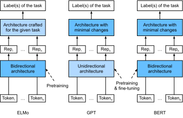

# BERT
:label:`sec_bert`

We have introduced several word embedding models for natural language understanding.
After pretraining, the output can be thought of as a matrix
where each row is a vector that represents a word of a predefined vocabulary.
In fact, these word embedding models are all *context-independent*.
Let us begin by illustrating this property.


## From Context-Independent to Context-Sensitive

Recall the experiments in :numref:`sec_word2vec_gluon` and :numref:`sec_synonyms`.
For instance, word2vec and GloVe both assign the same pretrained vector to the same word regardless of the context of the word (if any).
Formally, a context-independent representation of any token $x$
is a function $f(x)$ that only takes $x$ as its input.
Given the abundance of polysemy and complex semantics in natural languages,
context-independent representations have obvious limitations.
For instance, the word "crane" in contexts
"a crane is flying" and "a crane driver came" has completely different meanings;
thus, the same word may be assigned different representations depending on contexts.

This motivates the development of *context-sensitive* word representations,
where representations of words depend on their contexts.
Hence, a context-sensitive representation of token $x$ is a function $f(x, c(x))$
depending on both $x$ and its context $c(x)$.
Popular context-sensitive representations
include TagLM (language-model-augmented sequence tagger) :cite:`Peters.Ammar.Bhagavatula.ea.2017`,
CoVe (Context Vectors) :cite:`McCann.Bradbury.Xiong.ea.2017`,
and ELMo (Embeddings from Language Models) :cite:`Peters.Neumann.Iyyer.ea.2018`.

For example, by taking the entire sequence as the input,
ELMo is a function that assigns a representation to each word from the input sequence.
Specifically, ELMo combines all the intermediate layer representations from pretrained bidirectional LSTM as the output representation.
Then the ELMo representation will be added to a downstream task's existing supervised model
as additional features, such as by concatenating ELMo representation and the original representation (e.g., GloVe) of tokens in the existing model.
On one hand,
all the weights in the pretrained bidirectional LSTM model are frozen after ELMo representations are added.
On the other hand,
the existing supervised model is specifically customized for a given task.
Leveraging different best models for different tasks at that time,
adding ELMo improved the state of the art across 6 natural language processing tasks:
sentiment analysis, natural language inference,
semantic role labeling, coreference resolution,
named entity recognition, and question answering.


## From Task-Specific to Task-Agnostic

Although ELMo has significantly improved solutions to a diverse set of natural language processing tasks,
each solution still hinges on a *task-specific* architecture.
However, it is practically non-trivial to craft a specific architecture for every natural language processing task.
The GPT (Generative Pre-Training) model represents an effort in designing
a general *task-agnostic* model for context-sensitive representations :cite:`Radford.Narasimhan.Salimans.ea.2018`.
Built on a Transformer decoder,
GPT pretrains a language model that will be used to represent text sequences.
When applying GPT to a downstream task,
the output of the language model will be fed into an added linear output layer
to predict the label of the task.
In sharp contrast to ELMo that freezes parameters of the pretrained model,
GPT fine-tunes *all* the parameters in the pretrained Transformer decoder
during supervised learning of the downstream task.
GPT was evaluated on 12 tasks of natural language inference,
question answering, sentence similarity, and classification,
and improved the state of the art in 9 of them with minimal changes
to the model architecture.

However, due to the autoregressive nature of language models,
GPT only looks forward (left-to-right).
In contexts "i went to the bank to deposit cash" and "i went to the bank to sit down",
as "bank" is sensitive to the context to its left,
GPT will return the same representation for "bank",
though it has different meanings.


## BERT: Combining the Best of Both Worlds

As we have seen,
ELMo encodes context bidirectionally but uses task-specific architectures;
while GPT is task-agnostic but encodes context left-to-right.
Combining the best of both worlds,
BERT (Bidirectional Encoder Representations from Transformers)
encodes context bidirectionally and requires minimal architecture changes
for a wide range of natural language processing tasks :cite:`Devlin.Chang.Lee.ea.2018`.
Using a pretrained Transformer encoder,
BERT is able to represent any token based on its bidirectional context.
During supervised learning of downstream tasks,
BERT is similar to GPT in two aspects.
One one hand, BERT representations will be fed into an added output layer,
with minimal changes to the model architecture depending on nature of tasks,
such as predicting for every token vs. predicting for the entire sequence.
On the other hand,
all the parameters of the pretrained Transformer encoder are fine-tuned,
while the additional output layer will be trained from scratch.
:numref:`fig_elmo_gpt_bert` depicts the differences among ELMo, GPT, and BERT.


:label:`fig_elmo_gpt_bert`


BERT further improved the state of the art on 11 natural language processing tasks
under broad categories of i) single text classification (e.g., sentiment analysis), ii) text pair classification (e.g., natural language inference),
iii) question answering, iv) single text tagging (e.g., named entity recognition).
All proposed in 2018,
from context-sensitive ELMo to task-agnostic GPT and BERT,
conceptually simple yet empirically powerful pretraining of deep representations for natural languages have revolutionized solutions to various natural language processing tasks.

In the rest of this chapter,
we will dive into the pretraining of BERT.
When natural language processing applications are explained in :numref:`chap_nlp_app`,
we will illustrate fine-tuning of BERT for downstream applications.

```{.python .input  n=1}
import d2l
from mxnet import gluon, np, npx
from mxnet.gluon import nn

npx.set_np()
```

## Input Representation

In natural language processing,
some tasks (e.g., sentiment analysis) take single text as the input,
while in some other tasks (e.g., natural language inference),
the input is a pair of text sequences.
The BERT input sequence unambiguously represents both single text and text pairs.
In the former,
the BERT input sequence is the concatenation of
the special classification token “&lt;cls&gt;”,
tokens of a text sequence,
and the special separation token “&lt;sep&gt;”.
In the latter,
the BERT input sequence is the concatenation of
“&lt;cls&gt;”, tokens of the first text sequence,
“&lt;sep&gt;”, tokens of the second text sequence, and “&lt;sep&gt;”.
We will consistently distinguish the terminology "BERT input sequence"
from other types of "sequences".
For instance, 1 *BERT input sequence* may include either 1 *text sequence* or 2 *text sequences*.

To distinguish text pairs,
the learned segment embeddings $\mathbf{e}_A$ and $\mathbf{e}_B$
are added to the token embeddings of the first sequence and the second sequence, respectively.
For single text inputs, only $\mathbf{e}_A$ is used.
BERT chooses the Transformer encoder as its bidirectional architecture.
Common in the Transformer encoder,
positional embeddings are added at every position of the BERT input sequence.
However, different from the original Transformer encoder,
BERT uses *learnable* positional embeddings.
To sum up, :numref:`fig_bert-input` shows that
the embeddings of the BERT input sequence are the sum
of the token embeddings, segment embeddings, and positional embeddings.


:label:`fig_bert-input`

The following `BERTEncoder` class is similar to the `TransformerEncoder` class
as implemented in :numref:`sec_transformer`.
Different from `TransformerEncoder`, `BERTEncoder` uses
segment embeddings and learnable positional embeddings.

```{.python .input  n=2}
# Saved in the d2l package for later use
class BERTEncoder(nn.Block):
    def __init__(self, vocab_size, num_hiddens, ffn_num_hiddens, num_heads,
                 num_layers, dropout, max_len=1000, **kwargs):
        super(BERTEncoder, self).__init__(**kwargs)
        self.token_embedding = nn.Embedding(vocab_size, num_hiddens)
        self.segment_embedding = nn.Embedding(2, num_hiddens)
        
        self.blks = nn.Sequential()
        for _ in range(num_layers):
            self.blks.add(d2l.EncoderBlock(
                num_hiddens, ffn_num_hiddens, num_heads, dropout))
        # In BERT, positional embeddings are learnable, thus we create a
        # parameter of positional embeddings that are long enough
        self.pos_embedding = self.params.get('pos_embedding',
                                             shape=(1, max_len, num_hiddens))

    def forward(self, tokens, segments, valid_lens):
        # Shape of X remains unchanged in the following code snippet:
        # (batch size, max sequence length, num_hiddens)
        X = self.token_embedding(tokens) + self.segment_embedding(segments)
        X = X + self.pos_embedding.data(ctx=X.ctx)[:, :X.shape[1], :]
        for blk in self.blks:
            X = blk(X, valid_lens)
        return X
```

Suppose that the vocabulary size is 10,000.
To demonstrate forward inference of `BERTEncoder`,
let us create an instance of it and initialize its parameters.

```{.python .input  n=3}
vocab_size, num_hiddens, ffn_num_hiddens, num_heads = 10000, 768, 1024, 4
num_layers, dropout = 2, 0.2
encoder = BERTEncoder(vocab_size, num_hiddens, ffn_num_hiddens, num_heads,
                      num_layers, dropout)
encoder.initialize()
```

We define `tokens` to be 2 BERT input sequences of length 8,
where each token is an index of the vocabulary.
The forward inference of `BERTEncoder` with the input `tokens`
returns the encoded result where each token is represented by a vector
whose length is predefined by the hyperparameter `num_hiddens`.
This hyperparameter is usually referred to as the *hidden size*
(number of hidden units) of the Transformer encoder.

```{.python .input}
tokens = np.random.randint(0, vocab_size, (2, 8))
# 0 and 1 are marking segment A and B, respectively
segments = np.array([[0, 0, 0, 0, 1, 1, 1, 1],
                     [0, 0, 0, 1, 1, 1, 1, 1]])
encoded_X = encoder(tokens, segments, None)
encoded_X.shape
```

## Pretraining Tasks

The forward inference of `BERTEncoder` gives the BERT representation
of each token of the input text and the inserted
special tokens “&lt;cls&gt;” and “&lt;seq&gt;”. 
Next, we will use these representations to compute the loss function
for pretraining BERT.
The pretraining is composed of the following 2 tasks:
masked language modeling and next sentence prediction.

### A Masked Language Model
:label:`subsec_mlm`

As illustrated in :numref:`sec_language_model`,
a language model predicts a token using the context on its left.
To encode context bidirectionally for representing each token,
BERT randomly masks tokens and uses tokens from the bidirectional context to
predict the masked tokens.
This task is referred to as a *masked language model*.

In this pretraining task,
15% of tokens will be selected at random as the masked tokens for prediction.
To predict a masked token without cheating by using the label,
one straightforward approach is to always replace it with a special “&lt;mask&gt;” token in the BERT input sequence.
However, the artificial special token “&lt;mask&gt;” will never appear
in fine-tuning.
To avoid such a mismatch between pretraining and fine-tuning,
if a token is masked for prediction (e.g., "great" is selected to be masked and predicted in "this movie is great"),
in the input it will be replaced with:

* a special “&lt;mask&gt;” token for 80% of the time (e.g., "this movie is great" becomes "this movie is &lt;mask&gt;");
* a random token for 10% of the time (e.g., "this movie is great" becomes "this movie is drink");
* the unchanged label token for 10% of the time (e.g., "this movie is great" becomes "this movie is great").

Note that for 10% of 15% time a random token is inserted.
This occasional noise encourages BERT to be less biased towards the masked token (especially when the label token remains unchanged) in its bidirectional context encoding.

We implement the following `MaskLM` class to predict masked tokens
in the masked language model task of BERT pretraining.
The prediction uses a multilayer perceptron with 1 hidden layer (`self.mlp`).
In forward inference, it takes 2 inputs:
the encoded result of `BERTEncoder` and the token positions for prediction.
The output is the prediction results at these positions.

```{.python .input  n=4}
# Saved in the d2l package for later use
class MaskLM(nn.Block):
    def __init__(self, vocab_size, num_hiddens, **kwargs):
        super(MaskLM, self).__init__(**kwargs)
        self.mlp = nn.Sequential()
        self.mlp.add(
            nn.Dense(num_hiddens, flatten=False, activation='relu'))
        self.mlp.add(nn.LayerNorm())
        self.mlp.add(nn.Dense(vocab_size, flatten=False))

    def forward(self, X, pred_positions):
        num_pred_positions = pred_positions.shape[1]
        pred_positions = pred_positions.reshape(-1)
        batch_size = X.shape[0]
        batch_idx = np.arange(0, batch_size)
        # Suppose that batch_size = 2, num_pred_positions = 3, then batch_idx
        # is np.array([0, 0, 0, 1, 1, 1])
        batch_idx = np.repeat(batch_idx, num_pred_positions)
        masked_X = X[batch_idx, pred_positions]
        masked_X = masked_X.reshape((batch_size, num_pred_positions, -1))
        mlm_Y_hat = self.mlp(masked_X)
        return mlm_Y_hat
```

To demonstrate the forward inference of `MaskLM`,
we create its instance `mlm` and initialize it.
Recall that `encoded_X` from the forward inference of `BERTEncoder`
represents 2 BERT input sequences.
We define `mlm_positions` as the 3 indices to predict in either BERT input sequence of `encoded_X`.
The forward inference of `mlm` returns prediction results `mlm_Y_hat`
at all the masked positions `mlm_positions` of `encoded_X`.
For each prediction, the size of the result is equal to the vocabulary size.

```{.python .input  n=5}
mlm = MaskLM(vocab_size, num_hiddens)
mlm.initialize()
mlm_positions = np.array([[1, 3, 2], [6, 5, 7]])
mlm_Y_hat = mlm(encoded_X, mlm_positions)
mlm_Y_hat.shape
```

With the ground truth labels `mlm_Y` of the predicted tokens `mlm_Y_hat` under masks,
we can calculate the cross entropy loss of the masked language model task in BERT pretraining.

```{.python .input  n=6}
mlm_Y = np.array([[7, 8, 9], [10, 20, 30]])
loss = gluon.loss.SoftmaxCrossEntropyLoss()
mlm_l = loss(mlm_Y_hat.reshape((-1, vocab_size)), mlm_Y.reshape(-1))
mlm_l.shape
```

### Next Sentence Prediction

```{.python .input  n=7}
# Saved in the d2l package for later use
class NextSentencePred(nn.Block):
    def __init__(self, num_hiddens, **kwargs):
        super(NextSentencePred, self).__init__(**kwargs)
        self.mlp = nn.Sequential()
        self.mlp.add(nn.Dense(num_hiddens, activation='tanh'))
        self.mlp.add(nn.Dense(2))

    def forward(self, X):
        # 0 is the index of the CLS token
        X = X[:, 0, :]
        # X shape: (batch size, num_hiddens)
        return self.mlp(X)
```

...

```{.python .input  n=8}
nsp = NextSentencePred(num_hiddens)
nsp.initialize()
nsp_Y_hat = nsp(encoded_X)
nsp_Y_hat.shape
```

```{.python .input  n=9}
nsp_y = np.array([0, 1])
nsp_l = loss(nsp_Y_hat, nsp_y)
nsp_l.shape
```

## Putting All Things Together

highlight unsupervised learning for pretraining.

```{.python .input  n=10}
# Saved in the d2l package for later use
class BERTModel(nn.Block):
    def __init__(self, vocab_size, num_hiddens, ffn_num_hiddens, num_heads,
                 num_layers, dropout, max_len=1000):
        super(BERTModel, self).__init__()
        self.encoder = BERTEncoder(vocab_size, num_hiddens, ffn_num_hiddens,
                                   num_heads, num_layers, dropout, max_len)
        self.nsp = NextSentencePred(num_hiddens)
        self.mlm = MaskLM(vocab_size, num_hiddens)

    def forward(self, tokens, segments, valid_lens=None,
                pred_positions=None):
        encoded_X = self.encoder(tokens, segments, valid_lens)
        if pred_positions is not None:
            mlm_Y_hat = self.mlm(encoded_X, pred_positions)
        else:
            mlm_Y_hat = None
        nsp_Y_hat = self.nsp(encoded_X)
        return encoded_X, mlm_Y_hat, nsp_Y_hat
```

...


## Exercises

1. All other things being equal, will a masked language model require more or fewer pretraining steps to converge than a left-to-right language model? Why?
1. In the original implementation of BERT, the position-wise feed-forward network in `BERTEncoder` (via `d2l.EncoderBlock`) and the fully-connected layer in `MaskLM` both use the Gaussian error linear unit (GELU) :cite:`Hendrycks.Gimpel.2016` as the activation function. Research into the difference between GELU and ReLU.
