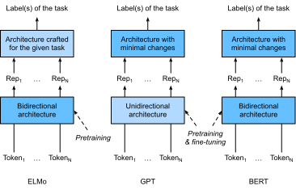

# Représentations d'encodeurs bidirectionnels à partir de transformateurs (BERT)
:label:`sec_bert` 

 Nous avons présenté plusieurs modèles d'intégration de mots pour la compréhension du langage naturel.
Après un pré-entraînement, la sortie peut être considérée comme une matrice
où chaque ligne est un vecteur qui représente un mot d'un vocabulaire prédéfini.
En fait, ces modèles d'intégration de mots sont tous *indépendants du contexte*.
Commençons par illustrer cette propriété.


## From Context-Independent to Context-Sensitive

Rappelez-vous les expériences menées dans :numref:`sec_word2vec_pretraining` et :numref:`sec_synonyms` .
Par exemple, word2vec et GloVe attribuent tous deux le même vecteur pré-formé au même mot, quel que soit le contexte du mot (le cas échéant).
Formellement, une représentation indépendante du contexte de tout token $x$
 est une fonction $f(x)$ qui ne prend que $x$ comme entrée.
Étant donné l'abondance de la polysémie et de la sémantique complexe dans les langues naturelles, les représentations indépendantes du contexte
ont des limites évidentes.
Par exemple, le mot "grue" dans les contextes
"une grue vole" et "un grutier est venu" a des significations complètement différentes ;
ainsi, le même mot peut se voir attribuer des représentations différentes selon les contextes.

Cela motive le développement de représentations de mots *sensibles au contexte*,
où les représentations des mots dépendent de leurs contextes.
Par conséquent, une représentation contextuelle d'un jeton $x$ est une fonction $f(x, c(x))$
 qui dépend à la fois de $x$ et de son contexte $c(x)$.
Parmi les représentations contextuelles populaires
, citons TagLM (Language-model-augmented sequence tagger) :cite:`Peters.Ammar.Bhagavatula.ea.2017` ,
CoVe (Context Vectors) :cite:`McCann.Bradbury.Xiong.ea.2017` ,
et ELMo (Embeddings from Language Models) :cite:`Peters.Neumann.Iyyer.ea.2018` .

Par exemple, en prenant la séquence entière comme entrée,
ELMo est une fonction qui attribue une représentation à chaque mot de la séquence d'entrée.
Plus précisément, ELMo combine toutes les représentations des couches intermédiaires des LSTM bidirectionnels pré-entraînés comme représentation de sortie.
Ensuite, la représentation ELMo sera ajoutée au modèle supervisé existant d'une tâche en aval
en tant que caractéristiques supplémentaires, par exemple en concaténant la représentation ELMo et la représentation originale (par exemple, GloVe) des tokens dans le modèle existant.
D'une part,
tous les poids dans le modèle LSTM bidirectionnel pré-entraîné sont gelés après l'ajout des représentations ELMo.
D'autre part,
le modèle supervisé existant est spécifiquement personnalisé pour une tâche donnée.
En tirant parti des meilleurs modèles pour différentes tâches à ce moment-là,
l'ajout d'ELMo a amélioré l'état de l'art dans six tâches de traitement du langage naturel :
analyse des sentiments, inférence du langage naturel,
étiquetage des rôles sémantiques, résolution des coréférences,
reconnaissance des entités nommées et réponse aux questions.


## From Task-Specific to Task-Agnostic

Bien que ELMo ait considérablement amélioré les solutions à un ensemble diversifié de tâches de traitement du langage naturel,
chaque solution repose toujours sur une architecture *spécifique à la tâche*.
Cependant, il est pratiquement impossible de concevoir une architecture spécifique pour chaque tâche de traitement du langage naturel.
Le modèle GPT (Generative Pre-Training) représente un effort de conception de
un modèle général *agnostique* pour les représentations sensibles au contexte :cite:`Radford.Narasimhan.Salimans.ea.2018` .
Construit sur un décodeur transformateur,
GPT pré-entraîne un modèle de langage qui sera utilisé pour représenter des séquences de texte.
Lorsqu'on applique GPT à une tâche en aval,
la sortie du modèle de langage sera introduite dans une couche de sortie linéaire ajoutée
pour prédire l'étiquette de la tâche.
Contrairement à ELMo qui fige les paramètres du modèle pré-entraîné,
GPT affine *tous* les paramètres du décodeur transformateur pré-entraîné
pendant l'apprentissage supervisé de la tâche en aval.
GPT a été évalué sur douze tâches d'inférence en langage naturel,
réponse aux questions, similarité de phrases et classification,
et a amélioré l'état de l'art dans neuf d'entre elles avec des changements minimes
à l'architecture du modèle.

Cependant, en raison de la nature autorégressive des modèles de langage,
GPT ne regarde que vers l'avant (de gauche à droite).
Dans les contextes "je suis allé à la banque pour déposer de l'argent" et "je suis allé à la banque pour m'asseoir",
comme "banque" est sensible au contexte à sa gauche,
GPT retournera la même représentation pour "banque",
bien qu'il ait des significations différentes.


## BERT : Combiner le meilleur des deux mondes

Comme nous l'avons vu,
ELMo encode le contexte de manière bidirectionnelle mais utilise des architectures spécifiques aux tâches ;
alors que GPT est agnostique aux tâches mais encode le contexte de gauche à droite.
Combinant le meilleur des deux mondes,
BERT (Bidirectional Encoder Representations from Transformers)
encode le contexte de manière bidirectionnelle et nécessite des modifications minimales de l'architecture
pour un large éventail de tâches de traitement du langage naturel :cite:`Devlin.Chang.Lee.ea.2018` .
À l'aide d'un encodeur de transformateur pré-entraîné,
BERT est capable de représenter n'importe quel token en fonction de son contexte bidirectionnel.
Pendant l'apprentissage supervisé de tâches en aval,
BERT est similaire à GPT sous deux aspects.
Premièrement, les représentations de BERT seront introduites dans une couche de sortie supplémentaire,
avec des modifications minimales de l'architecture du modèle en fonction de la nature des tâches,
telles que la prédiction pour chaque token ou la prédiction pour la séquence entière.
Deuxièmement,
tous les paramètres du codeur transformateur pré-entraîné sont affinés,
tandis que la couche de sortie supplémentaire sera entraînée à partir de zéro.
:numref:`fig_elmo-gpt-bert` illustre les différences entre ELMo, GPT et BERT.


:label:`fig_elmo-gpt-bert`


BERT a encore amélioré l'état de l'art sur onze tâches de traitement du langage naturel
sous les grandes catégories suivantes : (i) classification d'un seul texte (par exemple, analyse des sentiments), (ii) classification de paires de textes (par exemple, inférence du langage naturel),
(iii) réponse à des questions, (iv) étiquetage de textes (par exemple, reconnaissance d'entités nommées).
Toutes proposées en 2018,
de ELMo sensible au contexte à GPT et BERT agnostiques aux tâches,
conceptuellement simple mais empiriquement puissant pré-entraînement de représentations profondes pour les langues naturelles ont révolutionné les solutions à diverses tâches de traitement du langage naturel.

Dans la suite de ce chapitre,
nous allons nous plonger dans le pré-entraînement de BERT.
Lorsque les applications de traitement du langage naturel seront expliquées dans :numref:`chap_nlp_app` ,
nous illustrerons le réglage fin de BERT pour les applications en aval.

```{.python .input}
#@tab mxnet
from d2l import mxnet as d2l
from mxnet import gluon, np, npx
from mxnet.gluon import nn

npx.set_np()
```

```{.python .input}
#@tab pytorch
from d2l import torch as d2l
import torch
from torch import nn
```

## [**Input Representation**]
:label:`subsec_bert_input_rep` 

 Dans le traitement du langage naturel,
certaines tâches (par exemple, l'analyse des sentiments) prennent un seul texte en entrée,
alors que dans d'autres tâches (par exemple, l'inférence du langage naturel),
l'entrée est une paire de séquences de texte.
La séquence d'entrée de BERT représente sans ambiguïté à la fois un texte unique et des paires de textes.
Dans le premier cas,
la séquence d'entrée de l'ORET est la concaténation de
le jeton spécial de classification "&lt;cls&gt;",
les jetons d'une séquence de texte,
et le jeton spécial de séparation "&lt;sep&gt;".
Dans ce dernier cas,
la séquence d'entrée de l'ORET est la concaténation de
"&lt;cls&gt;", des jetons de la première séquence de texte,
"&lt;sep&gt;", des jetons de la deuxième séquence de texte, et "&lt;sep&gt;".
Nous distinguerons systématiquement la terminologie "séquence d'entrée BERT"
des autres types de "séquences".
Par exemple, une *séquence d'entrée BERT* peut inclure soit une *séquence de texte*, soit deux *séquences de texte*.

Pour distinguer les paires de textes,
les incorporations de segments apprises $\mathbf{e}_A$ et $\mathbf{e}_B$
 sont ajoutées aux incorporations de jetons de la première séquence et de la deuxième séquence, respectivement.
Pour les entrées de texte unique, seul $\mathbf{e}_A$ est utilisé.

La fonction suivante `get_tokens_and_segments` prend une ou deux phrases
en entrée, puis renvoie les tokens de la séquence d'entrée de BERT
et leurs ID de segment correspondants.

```{.python .input}
#@tab all
#@save
def get_tokens_and_segments(tokens_a, tokens_b=None):
    """Get tokens of the BERT input sequence and their segment IDs."""
    tokens = ['<cls>'] + tokens_a + ['<sep>']
    # 0 and 1 are marking segment A and B, respectively
    segments = [0] * (len(tokens_a) + 2)
    if tokens_b is not None:
        tokens += tokens_b + ['<sep>']
        segments += [1] * (len(tokens_b) + 1)
    return tokens, segments
```

BERT choisit le codeur transformateur comme architecture bidirectionnelle.
Comme dans l'encodeur transformateur, les encastrements positionnels
sont ajoutés à chaque position de la séquence d'entrée de BERT.
Cependant, à la différence du codeur transformateur original,
BERT utilise des encastrements positionnels *apprenables*.
En résumé, :numref:`fig_bert-input` montre que
les enchâssements de la séquence d'entrée de BERT sont la somme
des enchâssements de tokens, des enchâssements de segments et des enchâssements de positions.


:label:`fig_bert-input`

La [**`BERTEncoder` classe**] suivante est similaire à la classe `TransformerEncoder`
 telle qu'implémentée dans :numref:`sec_transformer` .
À la différence de `TransformerEncoder`, `BERTEncoder` utilise
embeddings de segment et embeddings de position apprenables.

```{.python .input}
#@tab mxnet
#@save
class BERTEncoder(nn.Block):
    """BERT encoder."""
    def __init__(self, vocab_size, num_hiddens, ffn_num_hiddens, num_heads,
                 num_blks, dropout, max_len=1000, **kwargs):
        super(BERTEncoder, self).__init__(**kwargs)
        self.token_embedding = nn.Embedding(vocab_size, num_hiddens)
        self.segment_embedding = nn.Embedding(2, num_hiddens)
        self.blks = nn.Sequential()
        for _ in range(num_blks):
            self.blks.add(d2l.TransformerEncoderBlock(
                num_hiddens, ffn_num_hiddens, num_heads, dropout, True))
        # In BERT, positional embeddings are learnable, thus we create a
        # parameter of positional embeddings that are long enough
        self.pos_embedding = self.params.get('pos_embedding',
                                             shape=(1, max_len, num_hiddens))

    def forward(self, tokens, segments, valid_lens):
        # Shape of `X` remains unchanged in the following code snippet:
        # (batch size, max sequence length, `num_hiddens`)
        X = self.token_embedding(tokens) + self.segment_embedding(segments)
        X = X + self.pos_embedding.data(ctx=X.ctx)[:, :X.shape[1], :]
        for blk in self.blks:
            X = blk(X, valid_lens)
        return X
```

```{.python .input}
#@tab pytorch
#@save
class BERTEncoder(nn.Module):
    """BERT encoder."""
    def __init__(self, vocab_size, num_hiddens, ffn_num_hiddens, num_heads,
                 num_blks, dropout, max_len=1000, **kwargs):
        super(BERTEncoder, self).__init__(**kwargs)
        self.token_embedding = nn.Embedding(vocab_size, num_hiddens)
        self.segment_embedding = nn.Embedding(2, num_hiddens)
        self.blks = nn.Sequential()
        for i in range(num_blks):
            self.blks.add_module(f"{i}", d2l.TransformerEncoderBlock(
                num_hiddens, ffn_num_hiddens, num_heads, dropout, True))
        # In BERT, positional embeddings are learnable, thus we create a
        # parameter of positional embeddings that are long enough
        self.pos_embedding = nn.Parameter(torch.randn(1, max_len,
                                                      num_hiddens))

    def forward(self, tokens, segments, valid_lens):
        # Shape of `X` remains unchanged in the following code snippet:
        # (batch size, max sequence length, `num_hiddens`)
        X = self.token_embedding(tokens) + self.segment_embedding(segments)
        X = X + self.pos_embedding[:, :X.shape[1], :]
        for blk in self.blks:
            X = blk(X, valid_lens)
        return X
```

Supposons que la taille du vocabulaire soit de 10000.
Pour démontrer l'inférence directe [**de `BERTEncoder`**],
créons une instance de celui-ci et initialisons ses paramètres.

```{.python .input}
#@tab mxnet
vocab_size, num_hiddens, ffn_num_hiddens, num_heads = 10000, 768, 1024, 4
num_blks, dropout = 2, 0.2
encoder = BERTEncoder(vocab_size, num_hiddens, ffn_num_hiddens, num_heads,
                      num_blks, dropout)
encoder.initialize()
```

```{.python .input}
#@tab pytorch
vocab_size, num_hiddens, ffn_num_hiddens, num_heads = 10000, 768, 1024, 4
ffn_num_input, num_blks, dropout = 768, 2, 0.2
encoder = BERTEncoder(vocab_size, num_hiddens, ffn_num_hiddens, num_heads,
                      num_blks, dropout)
```

Nous définissons `tokens` comme étant 2 séquences d'entrée BERT de longueur 8,
où chaque token est un index du vocabulaire.
L'inférence directe de `BERTEncoder` avec l'entrée `tokens`
 renvoie le résultat codé où chaque token est représenté par un vecteur
dont la longueur est prédéfinie par l'hyperparamètre `num_hiddens`.
Cet hyperparamètre est généralement appelé la *taille cachée*
(nombre d'unités cachées) de l'encodeur transformateur.

```{.python .input}
#@tab mxnet
tokens = np.random.randint(0, vocab_size, (2, 8))
segments = np.array([[0, 0, 0, 0, 1, 1, 1, 1], [0, 0, 0, 1, 1, 1, 1, 1]])
encoded_X = encoder(tokens, segments, None)
encoded_X.shape
```

```{.python .input}
#@tab pytorch
tokens = torch.randint(0, vocab_size, (2, 8))
segments = torch.tensor([[0, 0, 0, 0, 1, 1, 1, 1], [0, 0, 0, 1, 1, 1, 1, 1]])
encoded_X = encoder(tokens, segments, None)
encoded_X.shape
```

## Tâches de pré-formation
:label:`subsec_bert_pretraining_tasks` 

 L'inférence directe de `BERTEncoder` donne la représentation BERT
de chaque token du texte d'entrée et des tokens spéciaux insérés
"&lt;cls&gt;" et "&lt;seq&gt;".
Ensuite, nous allons utiliser ces représentations pour calculer la fonction de perte
pour le pré-entraînement de BERT.
Le pré-entraînement est composé des deux tâches suivantes :
modélisation du langage masqué et prédiction de la phrase suivante.

### [**Masked Language Modeling**]
:label:`subsec_mlm` 

 Comme illustré dans :numref:`sec_language-model` ,
un modèle de langage prédit un token en utilisant le contexte à sa gauche.
Pour encoder le contexte de manière bidirectionnelle pour représenter chaque token,
BERT masque aléatoirement les tokens et utilise les tokens du contexte bidirectionnel pour
prédire les tokens masqués de manière auto-supervisée.
Cette tâche est appelée modèle de langage *masqué*.

Dans cette tâche de pré-entraînement,
15% des tokens seront choisis au hasard comme tokens masqués pour la prédiction.
Pour prédire un token masqué sans tricher en utilisant l'étiquette,
une approche simple consiste à toujours le remplacer par un token spécial "&lt;mask&gt;" dans la séquence d'entrée de BERT.
Cependant, le token spécial artificiel "&lt;mask&gt;" n'apparaîtra jamais
dans le réglage fin.
Pour éviter un tel décalage entre la pré-formation et le réglage fin,
si un token est masqué pour la prédiction (par exemple, "great" est sélectionné pour être masqué et prédit dans "this movie is great"),
dans l'entrée il sera remplacé par :

* un token spécial "&lt;mask&gt;" pendant 80% du temps (par exemple, "this movie is great" devient "this movie is &lt;mask&gt;") ;
* un jeton aléatoire pour 10% du temps (par exemple, "this movie is great" devient "this movie is drink") ;
* le jeton de label inchangé pour 10% du temps (par exemple, "this movie is great" devient "this movie is great").

Notez que pendant 10% de 15% du temps, un jeton aléatoire est inséré.
Ce bruit occasionnel encourage BERT à être moins biaisé vers le token masqué (surtout lorsque le token étiquette reste inchangé) dans son encodage contextuel bidirectionnel.

Nous implémentons la classe suivante `MaskLM` pour prédire les tokens masqués
dans la tâche de modèle de langage masqué du pré-entraînement de BERT.
La prédiction utilise un MLP à une couche cachée (`self.mlp`).
En inférence directe, il prend deux entrées :
le résultat codé de `BERTEncoder` et les positions des tokens pour la prédiction.
La sortie est le résultat de la prédiction à ces positions.

```{.python .input}
#@tab mxnet
#@save
class MaskLM(nn.Block):
    """The masked language model task of BERT."""
    def __init__(self, vocab_size, num_hiddens, **kwargs):
        super(MaskLM, self).__init__(**kwargs)
        self.mlp = nn.Sequential()
        self.mlp.add(
            nn.Dense(num_hiddens, flatten=False, activation='relu'))
        self.mlp.add(nn.LayerNorm())
        self.mlp.add(nn.Dense(vocab_size, flatten=False))

    def forward(self, X, pred_positions):
        num_pred_positions = pred_positions.shape[1]
        pred_positions = pred_positions.reshape(-1)
        batch_size = X.shape[0]
        batch_idx = np.arange(0, batch_size)
        # Suppose that `batch_size` = 2, `num_pred_positions` = 3, then
        # `batch_idx` is `np.array([0, 0, 0, 1, 1, 1])`
        batch_idx = np.repeat(batch_idx, num_pred_positions)
        masked_X = X[batch_idx, pred_positions]
        masked_X = masked_X.reshape((batch_size, num_pred_positions, -1))
        mlm_Y_hat = self.mlp(masked_X)
        return mlm_Y_hat
```

```{.python .input}
#@tab pytorch
#@save
class MaskLM(nn.Module):
    """The masked language model task of BERT."""
    def __init__(self, vocab_size, num_hiddens, **kwargs):
        super(MaskLM, self).__init__(**kwargs)
        self.mlp = nn.Sequential(nn.LazyLinear(num_hiddens),
                                 nn.ReLU(),
                                 nn.LayerNorm(num_hiddens),
                                 nn.LazyLinear(vocab_size))

    def forward(self, X, pred_positions):
        num_pred_positions = pred_positions.shape[1]
        pred_positions = pred_positions.reshape(-1)
        batch_size = X.shape[0]
        batch_idx = torch.arange(0, batch_size)
        # Suppose that `batch_size` = 2, `num_pred_positions` = 3, then
        # `batch_idx` is `torch.tensor([0, 0, 0, 1, 1, 1])`
        batch_idx = torch.repeat_interleave(batch_idx, num_pred_positions)
        masked_X = X[batch_idx, pred_positions]
        masked_X = masked_X.reshape((batch_size, num_pred_positions, -1))
        mlm_Y_hat = self.mlp(masked_X)
        return mlm_Y_hat
```

Pour démontrer [**l'inférence directe de `MaskLM`**],
nous créons son instance `mlm` et l'initialisons.
Rappelons que `encoded_X`, issu de l'inférence directe de `BERTEncoder`
 , représente 2 séquences d'entrée BERT.
Nous définissons `mlm_positions` comme les 3 indices à prédire dans l'une ou l'autre des séquences d'entrée BERT de `encoded_X`.
L'inférence directe de `mlm` renvoie des résultats de prédiction `mlm_Y_hat`
 à toutes les positions masquées `mlm_positions` de `encoded_X`.
Pour chaque prédiction, la taille du résultat est égale à la taille du vocabulaire.

```{.python .input}
#@tab mxnet
mlm = MaskLM(vocab_size, num_hiddens)
mlm.initialize()
mlm_positions = np.array([[1, 5, 2], [6, 1, 5]])
mlm_Y_hat = mlm(encoded_X, mlm_positions)
mlm_Y_hat.shape
```

```{.python .input}
#@tab pytorch
mlm = MaskLM(vocab_size, num_hiddens)
mlm_positions = torch.tensor([[1, 5, 2], [6, 1, 5]])
mlm_Y_hat = mlm(encoded_X, mlm_positions)
mlm_Y_hat.shape
```

Avec les étiquettes de vérité terrain `mlm_Y` des tokens prédits `mlm_Y_hat` sous les masques,
nous pouvons calculer la perte d'entropie croisée de la tâche du modèle de langage masqué dans le pré-entraînement de BERT.

```{.python .input}
#@tab mxnet
mlm_Y = np.array([[7, 8, 9], [10, 20, 30]])
loss = gluon.loss.SoftmaxCrossEntropyLoss()
mlm_l = loss(mlm_Y_hat.reshape((-1, vocab_size)), mlm_Y.reshape(-1))
mlm_l.shape
```

```{.python .input}
#@tab pytorch
mlm_Y = torch.tensor([[7, 8, 9], [10, 20, 30]])
loss = nn.CrossEntropyLoss(reduction='none')
mlm_l = loss(mlm_Y_hat.reshape((-1, vocab_size)), mlm_Y.reshape(-1))
mlm_l.shape
```

### [**Next Sentence Prediction**]
:label:`subsec_nsp` 

 Bien que la modélisation du langage masqué soit capable d'encoder le contexte bidirectionnel
pour représenter les mots, elle ne modélise pas explicitement la relation logique
entre les paires de textes.
Pour aider à comprendre la relation entre deux séquences de texte,
BERT considère une tâche de classification binaire, la prédiction de la *prochaine phrase*, dans son pré-entraînement.
Lors de la génération de paires de phrases pour le pré-entraînement,
pour la moitié du temps, il s'agit effectivement de phrases consécutives avec l'étiquette "Vrai" ;
tandis que pour l'autre moitié du temps, la deuxième phrase est échantillonnée au hasard dans le corpus avec l'étiquette "Faux".

La classe suivante `NextSentencePred` utilise un MLP à une couche cachée
pour prédire si la deuxième phrase est la prochaine phrase de la première
dans la séquence d'entrée de BERT.
En raison de l'auto-attention dans l'encodeur transformateur,
la représentation BERT du token spécial "&lt;cls&gt;"
encode les deux phrases de l'entrée.
Par conséquent, la couche de sortie (`self.output`) du classificateur MLP prend `X` comme entrée,
où `X` est la sortie de la couche cachée MLP dont l'entrée est le token "&lt;cls&gt;" encodé.

```{.python .input}
#@tab mxnet
#@save
class NextSentencePred(nn.Block):
    """The next sentence prediction task of BERT."""
    def __init__(self, **kwargs):
        super(NextSentencePred, self).__init__(**kwargs)
        self.output = nn.Dense(2)

    def forward(self, X):
        # `X` shape: (batch size, `num_hiddens`)
        return self.output(X)
```

```{.python .input}
#@tab pytorch
#@save
class NextSentencePred(nn.Module):
    """The next sentence prediction task of BERT."""
    def __init__(self, **kwargs):
        super(NextSentencePred, self).__init__(**kwargs)
        self.output = nn.LazyLinear(2)

    def forward(self, X):
        # `X` shape: (batch size, `num_hiddens`)
        return self.output(X)
```

Nous pouvons voir que [**l'inférence directe d'une instance `NextSentencePred`**]
renvoie des prédictions binaires pour chaque séquence d'entrée BERT.

```{.python .input}
#@tab mxnet
nsp = NextSentencePred()
nsp.initialize()
nsp_Y_hat = nsp(encoded_X)
nsp_Y_hat.shape
```

```{.python .input}
#@tab pytorch
# PyTorch by default won't flatten the tensor as seen in mxnet where, if
# flatten=True, all but the first axis of input data are collapsed together
encoded_X = torch.flatten(encoded_X, start_dim=1)
# input_shape for NSP: (batch size, `num_hiddens`)
nsp = NextSentencePred()
nsp_Y_hat = nsp(encoded_X)
nsp_Y_hat.shape
```

La perte d'entropie croisée des deux classifications binaires peut également être calculée.

```{.python .input}
#@tab mxnet
nsp_y = np.array([0, 1])
nsp_l = loss(nsp_Y_hat, nsp_y)
nsp_l.shape
```

```{.python .input}
#@tab pytorch
nsp_y = torch.tensor([0, 1])
nsp_l = loss(nsp_Y_hat, nsp_y)
nsp_l.shape
```

Il est à noter que toutes les étiquettes dans les deux tâches de pré-entraînement susmentionnées
peuvent être obtenues trivialement à partir du corpus de pré-entraînement sans effort d'étiquetage manuel.
Le BERT original a été pré-entraîné sur la concaténation du BookCorpus :cite:`Zhu.Kiros.Zemel.ea.2015` 
 et du Wikipedia anglais.
Ces deux corpus de textes sont énormes :
ils comptent respectivement 800 millions et 2,5 milliards de mots.


## [**Putting All Things Together**]

Lors du pré-entraînement de BERT, la fonction de perte finale est une combinaison linéaire des deux fonctions de perte
pour la modélisation du langage masqué et la prédiction de la phrase suivante.
Nous pouvons maintenant définir la classe `BERTModel` en instanciant les trois classes
`BERTEncoder` , `MaskLM`, et `NextSentencePred`.
L'inférence directe renvoie les représentations BERT codées `encoded_X`,
les prédictions de la modélisation du langage masqué `mlm_Y_hat`,
et les prédictions de la phrase suivante `nsp_Y_hat`.

```{.python .input}
#@tab mxnet
#@save
class BERTModel(nn.Block):
    """The BERT model."""
    def __init__(self, vocab_size, num_hiddens, ffn_num_hiddens, num_heads,
                 num_blks, dropout, max_len=1000):
        super(BERTModel, self).__init__()
        self.encoder = BERTEncoder(vocab_size, num_hiddens, ffn_num_hiddens,
                                   num_heads, num_blks, dropout, max_len)
        self.hidden = nn.Dense(num_hiddens, activation='tanh')
        self.mlm = MaskLM(vocab_size, num_hiddens)
        self.nsp = NextSentencePred()

    def forward(self, tokens, segments, valid_lens=None, pred_positions=None):
        encoded_X = self.encoder(tokens, segments, valid_lens)
        if pred_positions is not None:
            mlm_Y_hat = self.mlm(encoded_X, pred_positions)
        else:
            mlm_Y_hat = None
        # The hidden layer of the MLP classifier for next sentence prediction.
        # 0 is the index of the '<cls>' token
        nsp_Y_hat = self.nsp(self.hidden(encoded_X[:, 0, :]))
        return encoded_X, mlm_Y_hat, nsp_Y_hat
```

```{.python .input}
#@tab pytorch
#@save
class BERTModel(nn.Module):
    """The BERT model."""
    def __init__(self, vocab_size, num_hiddens, ffn_num_hiddens, 
                 num_heads, num_blks, dropout, max_len=1000):
        super(BERTModel, self).__init__()
        self.encoder = BERTEncoder(vocab_size, num_hiddens, ffn_num_hiddens,
                                   num_heads, num_blks, dropout,
                                   max_len=max_len)
        self.hidden = nn.Sequential(nn.LazyLinear(num_hiddens),
                                    nn.Tanh())
        self.mlm = MaskLM(vocab_size, num_hiddens)
        self.nsp = NextSentencePred()

    def forward(self, tokens, segments, valid_lens=None, pred_positions=None):
        encoded_X = self.encoder(tokens, segments, valid_lens)
        if pred_positions is not None:
            mlm_Y_hat = self.mlm(encoded_X, pred_positions)
        else:
            mlm_Y_hat = None
        # The hidden layer of the MLP classifier for next sentence prediction.
        # 0 is the index of the '<cls>' token
        nsp_Y_hat = self.nsp(self.hidden(encoded_X[:, 0, :]))
        return encoded_X, mlm_Y_hat, nsp_Y_hat
```

## Résumé

* Les modèles d'intégration de mots tels que word2vec et GloVe sont indépendants du contexte. Ils attribuent le même vecteur pré-entraîné au même mot, quel que soit le contexte du mot (le cas échéant). Il est difficile pour eux de bien gérer la polysémie ou la sémantique complexe dans les langues naturelles.
* Pour les représentations de mots sensibles au contexte telles que ELMo et GPT, les représentations des mots dépendent de leurs contextes.
* ELMo encode le contexte de manière bidirectionnelle mais utilise des architectures spécifiques à chaque tâche (cependant, il est pratiquement impossible de concevoir une architecture spécifique pour chaque tâche de traitement du langage naturel) ; tandis que GPT est agnostique mais encode le contexte de gauche à droite.
* BERT combine le meilleur des deux mondes : il encode le contexte de manière bidirectionnelle et nécessite des modifications minimales de l'architecture pour un large éventail de tâches de traitement du langage naturel.
* Les incorporations de la séquence d'entrée de BERT sont la somme des incorporations de tokens, des incorporations de segments et des incorporations de positions.
* Le pré-entraînement de BERT est composé de deux tâches : la modélisation du langage masqué et la prédiction de la phrase suivante. La première est capable d'encoder le contexte bidirectionnel pour représenter les mots, tandis que la seconde modélise explicitement la relation logique entre les paires de textes.


## Exercices

1. Toutes choses égales par ailleurs, un modèle de langage masqué nécessitera-t-il plus ou moins d'étapes de pré-entraînement pour converger qu'un modèle de langage gauche-droite ? Pourquoi ?
1. Dans l'implémentation originale de BERT, le réseau feed-forward en position de `BERTEncoder` (via `d2l.TransformerEncoderBlock`) et la couche entièrement connectée de `MaskLM` utilisent tous deux l'unité linéaire d'erreur gaussienne (GELU) :cite:`Hendrycks.Gimpel.2016` comme fonction d'activation. Recherchez la différence entre GELU et ReLU.

:begin_tab:`mxnet`
[Discussions](https://discuss.d2l.ai/t/388)
:end_tab:

:begin_tab:`pytorch`
[Discussions](https://discuss.d2l.ai/t/1490)
:end_tab:
