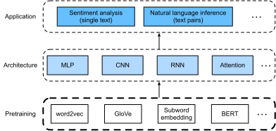

# Natural Language Processing: Pretraining
:label:`chap_nlp_pretrain`

Natural language processing is concerned with interactions between computers and humans using natural language. In practice, it is very common for us to use this technique to process and analyze large amounts of natural language data, such language models in :numref:`sec_language_model` and machine translation in :numref:`sec_machine_translation`.


:label:`fig_nlp-map-pretrain`

TODO@astonzhang

```toc
:maxdepth: 2

word2vec
approx-training
word2vec-dataset
word2vec-gluon
subword-embedding
glove
```

