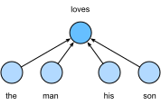

# Word Embedding (word2vec)
:label:`sec_word2vec`

Natural language is a complex system used to express meanings. 
In this system, words are the basic unit of the meaning.
As the name implies,
*word vectors* are vectors used to represent words,
and can also be considered as feature vectors or representations of words.
The technique of mapping words to real vectors 
is called *word embedding*.
In recent years,
word embedding has gradually become
the basic knowledge of natural language processing.

## One-Hot Vectors Are a Bad Choice

We used one-hot vectors to represent words (characters are words) in :numref:`sec_rnn_scratch`.
Suppose that the number of different words in the dictionary (the dictionary size) is $N$,
and each word corresponds to 
a different integer (index) from $0$ to $N−1$.
To obtain the one-hot vector representation
for any word with index $i$,
we create a length-$N$ vector with all 0s
and set the element at position $i$ to 1.
In this way, each word is represented as a vector of length $N$, and it
can be used directly by neural networks.

Although one-hot word vectors are easy to construct,
they are usually not a good choice.
A main reason is that one-hot word vectors cannot accurately express the similarity between different words, such as the *cosine similarity* that we often use. 
For vectors $\mathbf{x}, \mathbf{y} \in \mathbb{R}^d$, their cosine similarity is the cosine of the angle between them:

$$\frac{\mathbf{x}^\top \mathbf{y}}{\|\mathbf{x}\| \|\mathbf{y}\|} \in [-1, 1].$$

Since the cosine similarity between one-hot vectors of any two different words is 0, 
one-hot vectors cannot encode similarities among words.

The [word2vec](https://code.google.com/archive/p/word2vec/) tool was proposed to address the above issue. 
It represents each word as a fixed-length vector, and  these vectors can better express the similarity and analogy relationship among different words. 
The word2vec tool contains two models, namely *skip-gram* :cite:`Mikolov.Sutskever.Chen.ea.2013`  and *continuous bag of words* (CBOW) :cite:`Mikolov.Chen.Corrado.ea.2013`. In the following, we will introduce these two models and their training methods.

## The Skip-Gram Model

The skip-gram model assumes that a word can be used to generate its surrounding words in a text sequence.
Take the text sequence "the", "man", "loves", "his", "son" as an example. 
Let us choose "loves" as the *center word* and set the context window size to 2.
As shown in :numref:`fig_skip_gram`, 
given the center word "loves",
the skip-gram model considers
the conditional probability for generating the *context words*: "the", "man", "his", and "son",
which are no more than 2 words away from the center word:

$$P(\textrm{"the"},\textrm{"man"},\textrm{"his"},\textrm{"son"}\mid\textrm{"loves"}).$$

Assume that 
the context words are independently generated
given the center word (i.e., conditional independence).
In this case, the above conditional probability
can be rewritten as

$$P(\textrm{"the"}\mid\textrm{"loves"})\cdot P(\textrm{"man"}\mid\textrm{"loves"})\cdot P(\textrm{"his"}\mid\textrm{"loves"})\cdot P(\textrm{"son"}\mid\textrm{"loves"}).$$

:label:`fig_skip_gram`

In the skip-gram model, each word 
has two $d$-dimensional-vector representations
for calculating conditional probabilities.
More concretely,
for any word with index $i$ in the dictionary,
denote by $\mathbf{v}_i\in\mathbb{R}^d$
and $\mathbf{u}_i\in\mathbb{R}^d$
its two vectors
when used as a center word and a context word, respectively.
The conditional probability of generating any
context word $w_o$ (with index $o$ in the dictionary) given the center word $w_c$ (with index $c$ in the dictionary) can be modeled by
a softmax operation on vector inner products: 

$$P(w_o \mid w_c) = \frac{\text{exp}(\mathbf{u}_o^\top \mathbf{v}_c)}{ \sum_{i \in \mathcal{V}} \text{exp}(\mathbf{u}_i^\top \mathbf{v}_c)},$$
:eqlabel:`eq_skip-gram-softmax`

where the vocabulary index set $\mathcal{V} = \{0, 1, \ldots, |\mathcal{V}|-1\}$. 
Given a text sequence of length $T$, where the word at time step $t$ is denoted as $w^{(t)}$.
Assume that
context words are independently generated 
given any center word.
For context window size $m$,
the likelihood function of the skip-gram model
is the probability of generating all context words
given any center word:

$$ \prod_{t=1}^{T} \prod_{-m \leq j \leq m,\ j \neq 0} P(w^{(t+j)} \mid w^{(t)}),$$

where any time step that is less than $1$ or greater than $T$ can be omitted.

### Training

The skip-gram model parameters are the center word vector and context word vector for each word in the vocabulary.
In training, we learn the model parameters by maximizing the likelihood function (i.e., maximum likelihood estimation). This is equivalent to minimizing the following loss function:

$$ - \sum_{t=1}^{T} \sum_{-m \leq j \leq m,\ j \neq 0} \text{log}\, P(w^{(t+j)} \mid w^{(t)}).$$

When using stochastic gradient descent to minimize the loss, 
in each iteration
we can
randomly sample a shorter subsequence to calculate the (stochastic) gradient for this subsequence to update the model parameters. 
To calculate this (stochastic) gradient,
we need to obtain
the gradients of 
the log-probability with respect to the center word vector and the context word vector.
In general, according to :eqref:`eq_skip-gram-softmax`
the log-probability
involving any pair of the center word $w_c$ and 
the context word $w_o$ is

$$\log P(w_o \mid w_c) =
\mathbf{u}_o^\top \mathbf{v}_c - \log\left(\sum_{i \in \mathcal{V}} \text{exp}(\mathbf{u}_i^\top \mathbf{v}_c)\right).$$

Through differentiation, we can obtain its gradient 
with respect to the center word vector $\mathbf{v}_c$ as

$$
\begin{aligned}
\frac{\partial \text{log}\, P(w_o \mid w_c)}{\partial \mathbf{v}_c}
&= \mathbf{u}_o - \frac{\sum_{j \in \mathcal{V}} \exp(\mathbf{u}_j^\top \mathbf{v}_c)\mathbf{u}_j}{\sum_{i \in \mathcal{V}} \exp(\mathbf{u}_i^\top \mathbf{v}_c)}\\
&= \mathbf{u}_o - \sum_{j \in \mathcal{V}} \left(\frac{\text{exp}(\mathbf{u}_j^\top \mathbf{v}_c)}{ \sum_{i \in \mathcal{V}} \text{exp}(\mathbf{u}_i^\top \mathbf{v}_c)}\right) \mathbf{u}_j\\
&= \mathbf{u}_o - \sum_{j \in \mathcal{V}} P(w_j \mid w_c) \mathbf{u}_j.
\end{aligned}
$$

Note that this calculation requires the conditional probabilities of all words in the dictionary with $w_c$ as the center word.
The gradients for the other word vectors can be obtained in the same way.

After training, for any word with index $i$ in the dictionary, we obtain both word vectors 
$\mathbf{v}_i$ (as the center word) and $\mathbf{u}_i$ (as the context word).
In natural language processing applications, the center word vectors of the skip-gram model are typically
used as the word representations.

## The Continuous Bag of Words (CBOW) Model

The continuous bag of words (CBOW) model is similar to the skip-gram model. The biggest difference is that the CBOW model assumes that the center word is generated based on the context words before and after it in the text sequence. With the same text sequence "the", "man", "loves", "his" and "son", in which "loves" is the center word, given a context window size of 2, the CBOW model is concerned with the conditional probability of generating the target word "loves" based on the context words "the", "man", "his" and "son"(as shown in :numref:`fig_cbow`), such as

$$P(\textrm{"loves"}\mid\textrm{"the"},\textrm{"man"},\textrm{"his"},\textrm{"son"}).$$

:label:`fig_cbow`

Since there are multiple context words in the CBOW model, we will average their word vectors and then use the same method as the skip-gram model to compute the conditional probability. We assume that $\mathbf{v_i}\in\mathbb{R}^d$ and $\mathbf{u_i}\in\mathbb{R}^d$ are the context word vector and center word vector of the word with index $i$ in the dictionary (notice that the symbols are opposite to the ones in the skip-gram model). Let center word $w_c$ be indexed as $c$, and context words $w_{o_1}, \ldots, w_{o_{2m}}$ be indexed as $o_1, \ldots, o_{2m}$ in the dictionary. Thus, the conditional probability of generating a center word from the given context word is

$$P(w_c \mid w_{o_1}, \ldots, w_{o_{2m}}) = \frac{\text{exp}\left(\frac{1}{2m}\mathbf{u}_c^\top (\mathbf{v}_{o_1} + \ldots, + \mathbf{v}_{o_{2m}}) \right)}{ \sum_{i \in \mathcal{V}} \text{exp}\left(\frac{1}{2m}\mathbf{u}_i^\top (\mathbf{v}_{o_1} + \ldots, + \mathbf{v}_{o_{2m}}) \right)}.$$

For brevity, denote $\mathcal{W}_o= \{w_{o_1}, \ldots, w_{o_{2m}}\}$, and $\bar{\mathbf{v}}_o = \left(\mathbf{v}_{o_1} + \ldots, + \mathbf{v}_{o_{2m}} \right)/(2m)$. The equation above can be simplified as

$$P(w_c \mid \mathcal{W}_o) = \frac{\exp\left(\mathbf{u}_c^\top \bar{\mathbf{v}}_o\right)}{\sum_{i \in \mathcal{V}} \exp\left(\mathbf{u}_i^\top \bar{\mathbf{v}}_o\right)}.$$

Given a text sequence of length $T$, we assume that the word at time step $t$ is $w^{(t)}$, and the context window size is $m$.  The likelihood function of the CBOW model is the probability of generating any center word from the context words.

$$ \prod_{t=1}^{T}  P(w^{(t)} \mid  w^{(t-m)}, \ldots, w^{(t-1)}, w^{(t+1)}, \ldots, w^{(t+m)}).$$

### Training

CBOW model training is quite similar to skip-gram model training.  The maximum likelihood estimation of the CBOW model is equivalent to minimizing the loss function.

$$  -\sum_{t=1}^T  \text{log}\, P(w^{(t)} \mid  w^{(t-m)}, \ldots, w^{(t-1)}, w^{(t+1)}, \ldots, w^{(t+m)}).$$

Notice that

$$\log\,P(w_c \mid \mathcal{W}_o) = \mathbf{u}_c^\top \bar{\mathbf{v}}_o - \log\,\left(\sum_{i \in \mathcal{V}} \exp\left(\mathbf{u}_i^\top \bar{\mathbf{v}}_o\right)\right).$$

Through differentiation, we can compute the logarithm of the conditional probability of the gradient of any context word vector $\mathbf{v}_{o_i}$($i = 1, \ldots, 2m$) in the formula above.

$$\frac{\partial \log\, P(w_c \mid \mathcal{W}_o)}{\partial \mathbf{v}_{o_i}} = \frac{1}{2m} \left(\mathbf{u}_c - \sum_{j \in \mathcal{V}} \frac{\exp(\mathbf{u}_j^\top \bar{\mathbf{v}}_o)\mathbf{u}_j}{ \sum_{i \in \mathcal{V}} \text{exp}(\mathbf{u}_i^\top \bar{\mathbf{v}}_o)} \right) = \frac{1}{2m}\left(\mathbf{u}_c - \sum_{j \in \mathcal{V}} P(w_j \mid \mathcal{W}_o) \mathbf{u}_j \right).$$

We then use the same method to obtain the gradients for other word vectors. Unlike the skip-gram model, we usually use the context word vector as the representation vector for a word in the CBOW model.

## Summary

* A word vector is a vector used to represent a word. The technique of mapping words to vectors of real numbers is also known as word embedding.
* Word2vec includes both the continuous bag of words (CBOW) and skip-gram models. The skip-gram model assumes that context words are generated based on the center word. The CBOW model assumes that the center word is generated based on the context words.

## Exercises

1. What is the computational complexity of each gradient? If the dictionary contains a large volume of words, what problems will this cause?
1. There are some fixed phrases in the English language which consist of multiple words, such as "new york". How can you train their word vectors? Hint: See section 4 in the Word2vec paper :cite:`Mikolov.Sutskever.Chen.ea.2013`.
1. Use the skip-gram model as an example to think about the design of a word2vec model. What is the relationship between the inner product of two word vectors and the cosine similarity in the skip-gram model? For a pair of words with close semantical meaning, why it is likely for their word vector cosine similarity to be high?

[Discussions](https://discuss.d2l.ai/t/381)
