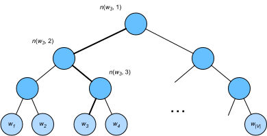

# Approximate Training
:label:`chapter_approx_train`

Recall content of the last section.  The core feature of the skip-gram model is the use of softmax operations to compute the conditional probability of generating context word $w_o$ based on the given central target word $w_c$.

$$\mathbb{P}(w_o \mid w_c) = \frac{\text{exp}(\mathbf{u}_o^\top \mathbf{v}_c)}{ \sum_{i \in \mathcal{V}} \text{exp}(\mathbf{u}_i^\top \mathbf{v}_c)}.$$

The logarithmic loss corresponding to the conditional probability is given as

$$-\log \mathbb{P}(w_o \mid w_c) =
-\mathbf{u}_o^\top \mathbf{v}_c + \log\left(\sum_{i \in \mathcal{V}} \text{exp}(\mathbf{u}_i^\top \mathbf{v}_c)\right).$$

Because the softmax operation has considered that the context word could be any word in the dictionary $\mathcal{V}$, the loss mentioned above actually includes the sum of the number of items in the dictionary size. From the last section, we know that for both the skip-gram model and CBOW model, because they both get the conditional probability using a softmax operation, the gradient computation for each step contains the sum of the number of items in the dictionary size. For larger dictionaries with hundreds of thousands or even millions of words, the overhead for computing each gradient may be too high.  In order to reduce such computational complexity, we will introduce two approximate training methods in this section: negative sampling and hierarchical softmax. Since there is no major difference between the skip-gram model and the CBOW model, we will only use the skip-gram model as an example to introduce these two training methods in this section.

## Negative Sampling

Negative sampling modifies the original objective function. Given a context window for the central target word $w_c$, we will treat it as an event for context word $w_o$ to appear in the context window and compute the probability of this event from

$$\mathbb{P}(D=1\mid w_c, w_o) = \sigma(\mathbf{u}_o^\top \mathbf{v}_c),$$

Here, the $\sigma$ function has the same definition as the sigmoid activation function:

$$\sigma(x) = \frac{1}{1+\exp(-x)}.$$

We will first consider training the word vector by maximizing the joint probability of all events in the text sequence. Given a text sequence of length $T$, we assume that the word at time step $t$ is $w^{(t)}$ and the context window size is $m$. Now we consider maximizing the joint probability

$$ \prod_{t=1}^{T} \prod_{-m \leq j \leq m,\ j \neq 0} \mathbb{P}(D=1\mid w^{(t)}, w^{(t+j)}).$$

However, the events included in the model only consider positive examples. In this case, only when all the word vectors are equal and their values approach infinity can the joint probability above be maximized to 1. Obviously, such word vectors are meaningless. Negative sampling makes the objective function more meaningful by sampling with an addition of negative examples. Assume that event $P$ occurs when context word $w_o$ appears in the context window of central target word $w_c$, and we sample $K$ words that do not appear in the context window according to the distribution $\mathbb{P}(w)$ to act as noise words. We assume the event for noise word $w_k$($k=1, \ldots, K$) to not appear in the context window of central target word $w_c$ is $N_k$. Suppose that events $P$ and $N_1, \ldots, N_K$ for both positive and negative examples are independent of each other. By considering negative sampling, we can rewrite the joint probability above, which only considers the positive examples, as

$$ \prod_{t=1}^{T} \prod_{-m \leq j \leq m,\ j \neq 0} \mathbb{P}(w^{(t+j)} \mid w^{(t)}),$$

Here, the conditional probability is approximated to be
$$ \mathbb{P}(w^{(t+j)} \mid w^{(t)}) =\mathbb{P}(D=1\mid w^{(t)}, w^{(t+j)})\prod_{k=1,\ w_k \sim \mathbb{P}(w)}^K \mathbb{P}(D=0\mid w^{(t)}, w_k).$$

Let the text sequence index of word $w^{(t)}$ at time step $t$ be $i_t$ and $h_k$ for noise word $w_k$ in the dictionary. The logarithmic loss for the conditional probability above is

$$
\begin{aligned}
-\log\mathbb{P}(w^{(t+j)} \mid w^{(t)})
=& -\log\mathbb{P}(D=1\mid w^{(t)}, w^{(t+j)}) - \sum_{k=1,\ w_k \sim \mathbb{P}(w)}^K \log\mathbb{P}(D=0\mid w^{(t)}, w_k)\\
=&-  \log\, \sigma\left(\mathbf{u}_{i_{t+j}}^\top \mathbf{v}_{i_t}\right) - \sum_{k=1,\ w_k \sim \mathbb{P}(w)}^K \log\left(1-\sigma\left(\mathbf{u}_{h_k}^\top \mathbf{v}_{i_t}\right)\right)\\
=&-  \log\, \sigma\left(\mathbf{u}_{i_{t+j}}^\top \mathbf{v}_{i_t}\right) - \sum_{k=1,\ w_k \sim \mathbb{P}(w)}^K \log\sigma\left(-\mathbf{u}_{h_k}^\top \mathbf{v}_{i_t}\right).
\end{aligned}
$$

Here, the gradient computation in each step of the training is no longer related to the dictionary size, but linearly related to $K$. When $K$ takes a smaller constant, the negative sampling has a lower computational overhead for each step.

## Hierarchical Softmax

Hierarchical softmax is another type of approximate training method. It uses a binary tree for data structure, with the leaf nodes of the tree representing every word in the dictionary $\mathcal{V}$.

We assume that $L(w)$ is the number of nodes on the path (including the root and leaf nodes) from the root node of the binary tree to the leaf node of word $w$. Let $n(w,j)$ be the $j$th node on this path, with the context word vector $\mathbf{u}_{n(w,j)}$. We use Figure 12.3 as an example, so $L(w_3) = 4$. Hierarchical softmax will approximate the conditional probability in the skip-gram model as

$$\mathbb{P}(w_o \mid w_c) = \prod_{j=1}^{L(w_o)-1} \sigma\left( [\![  n(w_o, j+1) = \text{leftChild}(n(w_o,j)) ]\!] \cdot \mathbf{u}_{n(w_o,j)}^\top \mathbf{v}_c\right),$$

Here the $\sigma$ function has the same definition as the sigmoid activation function, and $\text{leftChild}(n)$ is the left child node of node $n$. If $x$ is true, $[\![x]\!] = 1$; otherwise $[\![x]\!] = -1$.
Now, we will compute the conditional probability of generating word $w_3$ based on the given word $w_c$ in Figure 12.3. We need to find the inner product of word vector $\mathbf{v}_c$ (for word $w_c$) and each non-leaf node vector on the path from the root node to $w_3$. Because, in the binary tree, the path from the root node to leaf node $w_3$ needs to be traversed left, right, and left again (the path with the bold line in Figure 12.3), we get

$$\mathbb{P}(w_3 \mid w_c) = \sigma(\mathbf{u}_{n(w_3,1)}^\top \mathbf{v}_c) \cdot \sigma(-\mathbf{u}_{n(w_3,2)}^\top \mathbf{v}_c) \cdot \sigma(\mathbf{u}_{n(w_3,3)}^\top \mathbf{v}_c).$$

Because $\sigma(x)+\sigma(-x) = 1$, the condition that the sum of the conditional probability of any word generated based on the given central target word $w_c$ in dictionary $\mathcal{V}$ be 1 will also suffice:

$$\sum_{w \in \mathcal{V}} \mathbb{P}(w \mid w_c) = 1.$$

In addition, because the order of magnitude for $L(w_o)-1$ is $\mathcal{O}(\text{log}_2|\mathcal{V}|)$, when the size of dictionary $\mathcal{V}$ is large, the computational overhead for each step in the hierarchical softmax training is greatly reduced compared to situations where we do not use approximate training.

## Summary

* Negative sampling constructs the loss function by considering independent events that contain both positive and negative examples. The gradient computational overhead for each step in the training process is linearly related to the number of noise words we sample.
* Hierarchical softmax uses a binary tree and constructs the loss function based on the path from the root node to the leaf node. The gradient computational overhead for each step in the training process is related to the logarithm of the dictionary size.

## Exercises

* Before reading the next section, think about how we should sample noise words in negative sampling.
* What makes the last formula in this section hold?
* How can we apply negative sampling and hierarchical softmax in the skip-gram model?

## Scan the QR Code to [Discuss](https://discuss.mxnet.io/t/2386)

