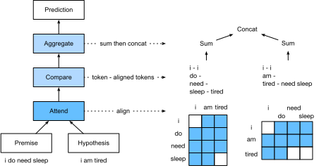

# Natural Language Inference: Using Attention
:label:`sec_natural-language-inference-attention`

We introduced the natural language inference (NLI) task and the SNLI dataset in :numref:`sec_natural-language-inference-and-dataset`. In view of many models that are based on complex and deep architectures, Parikh et al. proposed to address NLI with attention mechanisms ("decomposable attention model") :cite:`Parikh.Tackstrom.Das.ea.2016`.
This results in a model without recurrent or convolutional layers, achieving the best result at the time on the SNLI dataset with much fewer parameters.
In this section, we will describe and implement this attention-based method for NLI.


## Method

Simpler than preserving the order of words in premises and hypotheses,
we can just align words in one text sequence to every word in the other, and vice versa,
then compare and aggregate such information to predict the logical relationships
between premises and hypotheses.
Similar to alignment of words between source and target sentences in machine translation,
the alignment of words between premises and hypotheses
can be neatly accomplished by attention mechanisms.


:label:`fig_nli_attention`

:numref:`fig_nli_attention` depicts the NLI method using attention mechanisms.
At a high level, it consists of three jointly trained steps: attending, comparing, and aggregating.
We will illustrate them step by step in the following.

```{.python .input  n=1}
import d2l
import mxnet as mx
from mxnet import autograd, gluon, init, np, npx
from mxnet.contrib import text
from mxnet.gluon import nn

npx.set_np()
```

### Attending

The first step is to align words in one text sequence to each word in the other sequence.
Suppose that the premise is "i do need sleep" and the hypothesis is "i am tired".
Due to semantical similarity,
we may wish to align "i" in the hypothesis with "i" in the premise,
and align "tired" in the hypothesis with "sleep" in the premise.
Likewise, we may wish to align "i" in the premise with "i" in the hypothesis,
and align "need" and "sleep" in the premise with "tired" in the hypothesis.
Note that such alignment is *soft* using weighted average,
where ideally large weights are associated with the words to be aligned.
For ease of demonstration, :numref:`fig_nli_attention` shows such alignment in a *hard* way.

Now we describe the soft alignment using attention mechanisms in more detail.
Denote by $\mathbf{A} = (\mathbf{a}_1, \ldots, \mathbf{a}_m)$
and $\mathbf{B} = (\mathbf{b}_1, \ldots, \mathbf{b}_n)$ the premise and hypothesis, 
whose number of words are $m$ and $n$, respectively,
where $\mathbf{a}_i, \mathbf{b}_j \in \mathbb{R}^{d}$ ($i = 1, \ldots, m, j = 1, \ldots, n$) is a $d$-dimensional word embedding vector.
For soft alignment, we compute the attention weights $e_{ij} \in \mathbb{R}$ as

$$e_{ij} = f(\mathbf{a}_i)^\top f(\mathbf{b}_j),$$
:eqlabel:`eq_nli_e`

where the function $f$ is a multilayer perceptron defined in the following `mlp` function.
The output dimension of $f$ is specified by the `num_hiddens` argument of `mlp`.

```{.python .input  n=2}
def mlp(num_hiddens, flatten):
    net = nn.Sequential()
    net.add(nn.Dropout(0.2))
    net.add(nn.Dense(num_hiddens, activation='relu', flatten=flatten))
    net.add(nn.Dropout(0.2))
    net.add(nn.Dense(num_hiddens, activation='relu', flatten=flatten))
    return net
```

Normalizing the attention weights in :eqref:`eq_nli_e`,
we compute the weighted average of all the word embeddings in the hypothesis
to obtain representation of the hypothesis that is softly aligned with the word indexed by $i$ in the premise:

$$
\boldsymbol{\beta}_i = \sum_{j=1}^{n}\frac{\exp(e_{ij})}{ \sum_{k=1}^{n} \exp(e_{ik})} \mathbf{b}_j.
$$

Likewise, we compute soft alignment of premise words for each word indexed by $j$ in the hypothesis:

$$
\boldsymbol{\alpha}_j = \sum_{i=1}^{m}\frac{\exp(e_{ij})}{ \sum_{k=1}^{m} \exp(e_{kj})} \mathbf{a}_i.
$$

Below we define the `Attend` class to compute the soft alignment of hypotheses (`beta`) with input premises `A` and soft alignment of premises (`alpha`) with input hypotheses `B`.

```{.python .input  n=3}
class Attend(nn.Block):
    def __init__(self, num_hiddens, **kwargs):
        super(Attend, self).__init__(**kwargs)
        self.f = mlp(num_hiddens=num_hiddens, flatten=False)

    def forward(self, A, B):
        # Shape of A/B: (batch_size, #words in sequence A/B, embed_size)
        # Shape of f_A/f_B: (batch_size, #words in sequence A/B, num_hiddens)
        f_A = self.f(A)
        f_B = self.f(B)
        # Shape of e: (batch_size, #words in sequence A, #words in sequence B)
        e = npx.batch_dot(f_A, f_B, transpose_b=True)
        # Shape of beta: (batch_size, #words in sequence A, embed_size), where
        # sequence B is softly aligned with each word (axis 1 of beta) in
        # sequence A
        beta = npx.batch_dot(npx.softmax(e), B)
        # Shape of alpha: (batch_size, #words in sequence B, embed_size),
        # where sequence A is softly aligned with each word (axis 1 of alpha)
        # in sequence B
        alpha = npx.batch_dot(npx.softmax(e.transpose(0, 2, 1)), A)
        return beta, alpha
```

### Comparing

In the next step, we compare a word in one sequence with the other sequence that is softly aligned with that word. 
Note that in soft alignment, all the words from one sequence, though with probably different attention weights, will be compared with a word in the other sequence.
For easy of demonstration, :numref:`fig_nli_attention` pairs words with aligned words in a *hard* way.
For example, suppose that the attending step determines that "need" and "sleep" in the premise are both aligned with "tired" in the hypothesis, the pair "tired--need sleep" will be compared.

In the comparing step, we feed the concatenation (operator $[\cdot, \cdot]$) of words from one sequence and aligned words from the other sequence into a function $g$ (a multilayer perceptron):

$$
\mathbf{v}_{A,i} = g([\mathbf{a}_i, \boldsymbol{\beta}_i]), i = 1, \ldots, m\\
\mathbf{v}_{B,j} = g([\mathbf{b}_j, \boldsymbol{\alpha}_j]), j = 1, \ldots, n.
$$
:eqlabel:`eq_nli_v_ab`


In :eqref:`eq_nli_v_ab`, $\mathbf{v}_{A,i}$ is the comparison between word $i$ in the premise and all the hypothesis words that are softly aligned with word $i$; 
while $\mathbf{v}_{B,j}$ is the comparison between word $j$ in the hypothesis and all the premise words that are softly aligned with word $j$.
The following `Compare` class defines such as comparing step.

```{.python .input  n=4}
class Compare(nn.Block):
    def __init__(self, num_hiddens, **kwargs):
        super(Compare, self).__init__(**kwargs)
        self.g = mlp(num_hiddens=num_hiddens, flatten=False)

    def forward(self, A, B, beta, alpha):
        V_A = self.g(np.concatenate([A, beta], axis=2))
        V_B = self.g(np.concatenate([B, alpha], axis=2))
        return V_A, V_B
```

### Aggregating

With two sets of comparison vectors $\mathbf{v}_{A,i}$ ($i = 1, \ldots, m$) and $\mathbf{v}_{B,j}$ ($j = 1, \ldots, n$) on hand,
in the last step we will aggregate such information to infer the logical relationship.
We begin by summing up both sets:

$$
\mathbf{v}_A = \sum_{i=1}^{m} \mathbf{v}_{A,i}, \quad \mathbf{v}_B = \sum_{j=1}^{n}\mathbf{v}_{B,j}.
$$

Next we feed the concatenation of both summarization results into function $h$ (a multilayer perceptron) to obtain the classification result of the logical relationship:

$$
\hat{\mathbf{y}} = h([\mathbf{v}_A, \mathbf{v}_B]).
$$

The aggregation step is defined in the following `Aggregate` class.

```{.python .input  n=5}
class Aggregate(nn.Block):
    def __init__(self, num_hiddens, num_outputs, **kwargs):
        super(Aggregate, self).__init__(**kwargs)
        self.h = mlp(num_hiddens=num_hiddens, flatten=True)
        self.h.add(nn.Dense(num_outputs))

    def forward(self, V_A, V_B):
        # Sum up both sets of comparison vectors
        V_A = V_A.sum(axis=1)
        V_B = V_B.sum(axis=1)
        # Feed the concatenation of both summarization results into an MLP
        Y_hat = self.h(np.concatenate([V_A, V_B], axis=1))
        return Y_hat
```

## The use of decomposable attention model

We combine the above three steps of "attention", "comparison" and "aggregation".

```{.python .input  n=6}
class DecomposableAttention(nn.Block):
    def __init__(self, vocab, embed_size, num_hiddens, **kwargs):
        super(DecomposableAttention, self).__init__(**kwargs)
        self.embedding = nn.Embedding(len(vocab), embed_size)
        self.attend = Attend(num_hiddens)
        self.compare = Compare(num_hiddens)
        self.aggregate = Aggregate(num_hiddens, 3)

    def forward(self, X):
        premises, hypotheses = X
        A = self.embedding(premises)
        B = self.embedding(hypotheses)
        beta, alpha = self.attend(A, B)
        V_A, V_B = self.compare(A, B, beta, alpha)
        Y_hat = self.aggregate(V_A, V_B)
        return Y_hat
```

### Read dataset

We use the Stanford natural language inference dataset to formulate examples of training set and testing set, as well as define iterators of training set and testing set.

```{.python .input  n=7}
batch_size, num_steps = 256, 50
train_iter, test_iter, vocab = d2l.load_data_snli(batch_size, num_steps)
```

Create a `DecomposableAttention` instance.

```{.python .input  n=8}
embed_size, num_hiddens, ctx = 100, 200, d2l.try_all_gpus()
net = DecomposableAttention(vocab, embed_size, num_hiddens)
net.initialize(init.Xavier(), ctx=ctx)
```

### Training the model

We use the pre-trained word vector as the feature vector of every word. In this case, we load the 100-dimension GloVe vector for every word in vocab. It should be noted that the dimension of the pre-trained word vector needs to agree with embed_size of the embedded layer of established models.

```{.python .input  n=9}
glove_embedding = text.embedding.create(
    'glove', pretrained_file_name='glove.6B.100d.txt')
embeds = glove_embedding.get_vecs_by_tokens(vocab.idx_to_token)
net.embedding.weight.set_data(embeds)
```

We define the `split_batch_multi_input` function. This function divides and copies multiple small batches of data samples to video memories in ctx variables.

```{.python .input  n=10}
# Saved in the d2l package for later use
def split_batch_multi_inputs(X, y, ctx_list):
    """Split multi-input X and y into multiple devices specified by ctx"""
    X = list(zip(*[gluon.utils.split_and_load(
        feature, ctx_list, even_split=False) for feature in X]))
    return (X, gluon.utils.split_and_load(y, ctx_list, even_split=False))
```

Now, we can start training.

```{.python .input  n=11}
lr, num_epochs = 0.001, 4
trainer = gluon.Trainer(net.collect_params(), 'adam', {'learning_rate': lr})
loss = gluon.loss.SoftmaxCrossEntropyLoss()
d2l.train_ch13(net, train_iter, test_iter, loss, trainer, num_epochs, ctx,
               split_batch_multi_inputs)
```

### Evaluating the Model

Finally, define the prediction function.

```{.python .input  n=14}
# Saved in the d2l package for later use
def predict_snli(net, premise, hypothesis):
    premise = np.array(vocab[premise], ctx=d2l.try_gpu())
    hypothesis = np.array(vocab[hypothesis], ctx=d2l.try_gpu())
    label = np.argmax(net([premise.reshape((1, -1)),
                           hypothesis.reshape((1, -1))]), axis=1)
    return 'entailment' if label == 0 else 'contradiction' if label == 1 \
            else 'neutral'
```

Next, trained models are used to infer the relationship between two simple sentences.

```{.python .input  n=15}
predict_snli(net, ['he', 'is', 'good', '.'], ['he', 'is', 'bad', '.'])
```

## Summary

* Attention mechanism can be used to conduct the soft alignment of words.
* Decomposable attention model converts natural language inference to comparison of words after alignment.


## Exercises

1. What are major drawbacks of the decomposable attention model for NLI?


## [Discussions](https://discuss.mxnet.io/t/5518)


