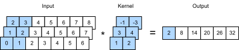
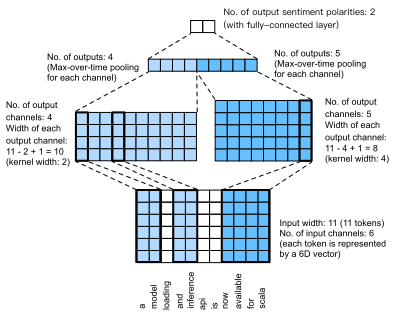

# Text Sentiment Classification: Using Convolutional Neural Networks (textCNN)
:label:`sec_sentiment_cnn`

In :numref:`chap_cnn`, we explored how to process
two-dimensional image data with two-dimensional convolutional neural
networks. In the previous language models and text classification tasks, we
treated text data as a time series with only one dimension, and naturally, we
used recurrent neural networks to process such data. In fact, we can also treat
text as a one-dimensional image, so that we can use one-dimensional
convolutional neural networks to capture associations between adjacent
words. This section describes a groundbreaking approach to applying
convolutional neural networks to text analysis: textCNN :cite:`Kim.2014`. First, import the packages and modules required for the experiment.

```{.python .input  n=1}
import d2l
from mxnet import gluon, init, np, npx
from mxnet.contrib import text
from mxnet.gluon import nn
npx.set_np()

batch_size = 64
train_iter, test_iter, vocab = d2l.load_data_imdb(batch_size)
```

```{.json .output n=1}
[
 {
  "name": "stdout",
  "output_type": "stream",
  "text": "Downloading ../data/aclImdb_v1.tar.gz from http://ai.stanford.edu/~amaas/data/sentiment/aclImdb_v1.tar.gz...\n"
 }
]
```

## One-Dimensional Convolutional Layer

Before introducing the model, let's explain how a one-dimensional convolutional layer works. Like a two-dimensional convolutional layer, a one-dimensional convolutional layer uses a one-dimensional cross-correlation operation. In the one-dimensional cross-correlation operation, the convolution window starts from the leftmost side of the input array and slides on the input array from left to right successively. When the convolution window slides to a certain position, the input subarray in the window and kernel array are multiplied and summed by element to get the element at the corresponding location in the output array. As shown in :numref:`fig_conv1d`, the input is a one-dimensional array with a width of 7 and the width of the kernel array is 2. As we can see, the output width is $7-2+1=6$ and the first element is obtained by performing multiplication by element on the leftmost input subarray with a width of 2 and kernel array and then summing the results.


:label:`fig_conv1d`

Next, we implement one-dimensional cross-correlation in the `corr1d` function. It accepts the input array `X` and kernel array `K` and outputs the array `Y`.

```{.python .input  n=2}
def corr1d(X, K):
    w = K.shape[0]
    Y = np.zeros((X.shape[0] - w + 1))
    for i in range(Y.shape[0]):
        Y[i] = (X[i: i + w] * K).sum()
    return Y
```

Now, we will reproduce the results of the one-dimensional cross-correlation operation in :numref:`fig_conv1d`.

```{.python .input  n=3}
X, K = np.array([0, 1, 2, 3, 4, 5, 6]), np.array([1, 2])
corr1d(X, K)
```

```{.json .output n=3}
[
 {
  "data": {
   "text/plain": "array([ 2.,  5.,  8., 11., 14., 17.])"
  },
  "execution_count": 3,
  "metadata": {},
  "output_type": "execute_result"
 }
]
```

The one-dimensional cross-correlation operation for multiple input channels is also similar to the two-dimensional cross-correlation operation for multiple input channels. On each channel, it performs the one-dimensional cross-correlation operation on the kernel and its corresponding input and adds the results of the channels to get the output. :numref:`fig_conv1d_channel` shows a one-dimensional cross-correlation operation with three input channels.


:label:`fig_conv1d_channel`

Now, we reproduce the results of the one-dimensional cross-correlation operation with multi-input channel in :numref:`fig_conv1d_channel`.

```{.python .input  n=4}
def corr1d_multi_in(X, K):
    # First, we traverse along the 0th dimension (channel dimension) of X and
    # K. Then, we add them together by using * to turn the result list into a
    # positional argument of the add_n function
    return sum(corr1d(x, k) for x, k in zip(X, K))

X = np.array([[0, 1, 2, 3, 4, 5, 6],
              [1, 2, 3, 4, 5, 6, 7],
              [2, 3, 4, 5, 6, 7, 8]])
K = np.array([[1, 2], [3, 4], [-1, -3]])
corr1d_multi_in(X, K)
```

```{.json .output n=4}
[
 {
  "data": {
   "text/plain": "array([ 2.,  8., 14., 20., 26., 32.])"
  },
  "execution_count": 4,
  "metadata": {},
  "output_type": "execute_result"
 }
]
```

The definition of a two-dimensional cross-correlation operation tells us that a one-dimensional cross-correlation operation with multiple input channels can be regarded as a two-dimensional cross-correlation operation with a single input channel. As shown in :numref:`fig_conv1d_2d`, we can also present the one-dimensional cross-correlation operation with multiple input channels in :numref:`fig_conv1d_channel` as the equivalent two-dimensional cross-correlation operation with a single input channel. Here, the height of the kernel is equal to the height of the input.


:label:`fig_conv1d_2d`

Both the outputs in :numref:`fig_conv1d` and :numref:`fig_conv1d_channel` have only one channel. We
discussed how to specify multiple output channels in a two-dimensional
convolutional layer in
:numref:`sec_channels`.
Similarly,
we can also specify multiple output channels in the one-dimensional
convolutional layer to extend the model parameters in the convolutional layer.


## Max-Over-Time Pooling Layer

Similarly, we have a one-dimensional pooling layer. The max-over-time pooling layer used in TextCNN actually corresponds to a one-dimensional global maximum pooling layer. Assuming that the input contains multiple channels, and each channel consists of values on different timesteps, the output of each channel will be the largest value of all timesteps in the channel. Therefore, the input of the max-over-time pooling layer can have different timesteps on each channel.

To improve computing performance, we often combine timing examples of different lengths into a minibatch and make the lengths of each timing example in the batch consistent by appending special characters (such as 0) to the end of shorter examples. Naturally, the added special characters have no intrinsic meaning. Because the main purpose of the max-over-time pooling layer is to capture the most important features of timing, it usually allows the model to be unaffected by the manually added characters.

## The TextCNN Model

TextCNN mainly uses a one-dimensional convolutional layer and max-over-time pooling layer. Suppose the input text sequence consists of $n$ words, and each word is represented by a $d$-dimension word vector. Then the input example has a width of $n$, a height of 1, and $d$ input channels. The calculation of textCNN can be mainly divided into the following steps:

1. Define multiple one-dimensional convolution kernels and use them to perform convolution calculations on the inputs. Convolution kernels with different widths may capture the correlation of different numbers of adjacent words.
2. Perform max-over-time pooling on all output channels, and then concatenate the pooling output values of these channels in a vector.
3. The concatenated vector is transformed into the output for each category through the fully connected layer. A dropout layer can be used in this step to deal with overfitting.


:label:`fig_conv1d_textcnn`

:numref:`fig_conv1d_textcnn` gives an example to illustrate the textCNN. The input here is a sentence with 11 words, with each word represented by a 6-dimensional word vector. Therefore, the input sequence has a width of 11 and 6 input channels. We assume there are two one-dimensional convolution kernels with widths of 2 and 4, and 4 and 5 output channels, respectively. Therefore, after one-dimensional convolution calculation, the width of the four output channels is $11-2+1=10$, while the width of the other five channels is $11-4+1=8$. Even though the width of each channel is different, we can still perform max-over-time pooling for each channel and concatenate the pooling outputs of the 9 channels into a 9-dimensional vector. Finally, we use a fully connected layer to transform the 9-dimensional vector into a 2-dimensional output: positive sentiment and negative sentiment predictions.

Next, we will implement a textCNN model. Compared with the previous section, in addition to replacing the recurrent neural network with a one-dimensional convolutional layer, here we use two embedding layers, one with a fixed weight and another that participates in training.

```{.python .input  n=5}
class TextCNN(nn.Block):
    def __init__(self, vocab_size, embed_size, kernel_sizes, num_channels,
                 **kwargs):
        super(TextCNN, self).__init__(**kwargs)
        self.embedding = nn.Embedding(vocab_size, embed_size)
        # The embedding layer does not participate in training
        self.constant_embedding = nn.Embedding(vocab_size, embed_size)
        self.dropout = nn.Dropout(0.5)
        self.decoder = nn.Dense(2)
        # The max-over-time pooling layer has no weight, so it can share an
        # instance
        self.pool = nn.GlobalMaxPool1D()
        # Create multiple one-dimensional convolutional layers
        self.convs = nn.Sequential()
        for c, k in zip(num_channels, kernel_sizes):
            self.convs.add(nn.Conv1D(c, k, activation='relu'))

    def forward(self, inputs):
        # Concatenate the output of two embedding layers with shape of
        # (batch size, number of words, word vector dimension) by word vector
        embeddings = np.concatenate((
            self.embedding(inputs), self.constant_embedding(inputs)), axis=2)
        # According to the input format required by Conv1D, the word vector
        # dimension, that is, the channel dimension of the one-dimensional
        # convolutional layer, is transformed into the previous dimension
        embeddings = embeddings.transpose(0, 2, 1)
        # For each one-dimensional convolutional layer, after max-over-time
        # pooling, an ndarray with the shape of (batch size, channel size, 1)
        # can be obtained. Use the flatten function to remove the last
        # dimension and then concatenate on the channel dimension
        encoding = np.concatenate([
            np.squeeze(self.pool(conv(embeddings)), axis=-1)
            for conv in self.convs], axis=1)
        # After applying the dropout method, use a fully connected layer to
        # obtain the output
        outputs = self.decoder(self.dropout(encoding))
        return outputs
```

Create a TextCNN instance. It has 3 convolutional layers with kernel widths of 3, 4, and 5, all with 100 output channels.

```{.python .input  n=6}
embed_size, kernel_sizes, nums_channels = 100, [3, 4, 5], [100, 100, 100]
ctx = d2l.try_all_gpus()
net = TextCNN(len(vocab), embed_size, kernel_sizes, nums_channels)
net.initialize(init.Xavier(), ctx=ctx)
```

### Load Pre-trained Word Vectors

As in the previous section, load pre-trained 100-dimensional GloVe word vectors and initialize the embedding layers `embedding` and `constant_embedding`. Here, the former participates in training while the latter has a fixed weight.

```{.python .input  n=7}
glove_embedding = text.embedding.create(
    'glove', pretrained_file_name='glove.6B.100d.txt')
embeds = glove_embedding.get_vecs_by_tokens(vocab.idx_to_token)
net.embedding.weight.set_data(embeds)
net.constant_embedding.weight.set_data(embeds)
net.constant_embedding.collect_params().setattr('grad_req', 'null')
```

### Train and Evaluate the Model

Now we can train the model.

```{.python .input  n=8}
lr, num_epochs = 0.001, 5
trainer = gluon.Trainer(net.collect_params(), 'adam', {'learning_rate': lr})
loss = gluon.loss.SoftmaxCrossEntropyLoss()
d2l.train_ch13(net, train_iter, test_iter, loss, trainer, num_epochs, ctx)
```

```{.json .output n=8}
[
 {
  "name": "stdout",
  "output_type": "stream",
  "text": "loss 0.000, train acc 1.000, test acc 1.000\n2927.3 examples/sec on [gpu(0), gpu(1), gpu(2), gpu(3)]\n"
 },
 {
  "data": {
   "image/svg+xml": "<?xml version=\"1.0\" encoding=\"utf-8\" standalone=\"no\"?>\n<!DOCTYPE svg PUBLIC \"-//W3C//DTD SVG 1.1//EN\"\n  \"http://www.w3.org/Graphics/SVG/1.1/DTD/svg11.dtd\">\n<!-- Created with matplotlib (https://matplotlib.org/) -->\n<svg height=\"184.455469pt\" version=\"1.1\" viewBox=\"0 0 235.784375 184.455469\" width=\"235.784375pt\" xmlns=\"http://www.w3.org/2000/svg\" xmlns:xlink=\"http://www.w3.org/1999/xlink\">\n <defs>\n  <style type=\"text/css\">\n*{stroke-linecap:butt;stroke-linejoin:round;}\n  </style>\n </defs>\n <g id=\"figure_1\">\n  <g id=\"patch_1\">\n   <path d=\"M 0 184.455469 \nL 235.784375 184.455469 \nL 235.784375 -0 \nL 0 -0 \nz\n\" style=\"fill:none;\"/>\n  </g>\n  <g id=\"axes_1\">\n   <g id=\"patch_2\">\n    <path d=\"M 30.103125 146.899219 \nL 225.403125 146.899219 \nL 225.403125 10.999219 \nL 30.103125 10.999219 \nz\n\" style=\"fill:#ffffff;\"/>\n   </g>\n   <g id=\"matplotlib.axis_1\">\n    <g id=\"xtick_1\">\n     <g id=\"line2d_1\">\n      <path clip-path=\"url(#pce0a1dc5b6)\" d=\"M 30.103125 146.899219 \nL 30.103125 10.999219 \n\" style=\"fill:none;stroke:#b0b0b0;stroke-linecap:square;stroke-width:0.8;\"/>\n     </g>\n     <g id=\"line2d_2\">\n      <defs>\n       <path d=\"M 0 0 \nL 0 3.5 \n\" id=\"m19c3993016\" style=\"stroke:#000000;stroke-width:0.8;\"/>\n      </defs>\n      <g>\n       <use style=\"stroke:#000000;stroke-width:0.8;\" x=\"30.103125\" xlink:href=\"#m19c3993016\" y=\"146.899219\"/>\n      </g>\n     </g>\n     <g id=\"text_1\">\n      <!-- 0 -->\n      <defs>\n       <path d=\"M 31.78125 66.40625 \nQ 24.171875 66.40625 20.328125 58.90625 \nQ 16.5 51.421875 16.5 36.375 \nQ 16.5 21.390625 20.328125 13.890625 \nQ 24.171875 6.390625 31.78125 6.390625 \nQ 39.453125 6.390625 43.28125 13.890625 \nQ 47.125 21.390625 47.125 36.375 \nQ 47.125 51.421875 43.28125 58.90625 \nQ 39.453125 66.40625 31.78125 66.40625 \nz\nM 31.78125 74.21875 \nQ 44.046875 74.21875 50.515625 64.515625 \nQ 56.984375 54.828125 56.984375 36.375 \nQ 56.984375 17.96875 50.515625 8.265625 \nQ 44.046875 -1.421875 31.78125 -1.421875 \nQ 19.53125 -1.421875 13.0625 8.265625 \nQ 6.59375 17.96875 6.59375 36.375 \nQ 6.59375 54.828125 13.0625 64.515625 \nQ 19.53125 74.21875 31.78125 74.21875 \nz\n\" id=\"DejaVuSans-48\"/>\n      </defs>\n      <g transform=\"translate(26.921875 161.497656)scale(0.1 -0.1)\">\n       <use xlink:href=\"#DejaVuSans-48\"/>\n      </g>\n     </g>\n    </g>\n    <g id=\"xtick_2\">\n     <g id=\"line2d_3\">\n      <path clip-path=\"url(#pce0a1dc5b6)\" d=\"M 69.163125 146.899219 \nL 69.163125 10.999219 \n\" style=\"fill:none;stroke:#b0b0b0;stroke-linecap:square;stroke-width:0.8;\"/>\n     </g>\n     <g id=\"line2d_4\">\n      <g>\n       <use style=\"stroke:#000000;stroke-width:0.8;\" x=\"69.163125\" xlink:href=\"#m19c3993016\" y=\"146.899219\"/>\n      </g>\n     </g>\n     <g id=\"text_2\">\n      <!-- 1 -->\n      <defs>\n       <path d=\"M 12.40625 8.296875 \nL 28.515625 8.296875 \nL 28.515625 63.921875 \nL 10.984375 60.40625 \nL 10.984375 69.390625 \nL 28.421875 72.90625 \nL 38.28125 72.90625 \nL 38.28125 8.296875 \nL 54.390625 8.296875 \nL 54.390625 0 \nL 12.40625 0 \nz\n\" id=\"DejaVuSans-49\"/>\n      </defs>\n      <g transform=\"translate(65.981875 161.497656)scale(0.1 -0.1)\">\n       <use xlink:href=\"#DejaVuSans-49\"/>\n      </g>\n     </g>\n    </g>\n    <g id=\"xtick_3\">\n     <g id=\"line2d_5\">\n      <path clip-path=\"url(#pce0a1dc5b6)\" d=\"M 108.223125 146.899219 \nL 108.223125 10.999219 \n\" style=\"fill:none;stroke:#b0b0b0;stroke-linecap:square;stroke-width:0.8;\"/>\n     </g>\n     <g id=\"line2d_6\">\n      <g>\n       <use style=\"stroke:#000000;stroke-width:0.8;\" x=\"108.223125\" xlink:href=\"#m19c3993016\" y=\"146.899219\"/>\n      </g>\n     </g>\n     <g id=\"text_3\">\n      <!-- 2 -->\n      <defs>\n       <path d=\"M 19.1875 8.296875 \nL 53.609375 8.296875 \nL 53.609375 0 \nL 7.328125 0 \nL 7.328125 8.296875 \nQ 12.9375 14.109375 22.625 23.890625 \nQ 32.328125 33.6875 34.8125 36.53125 \nQ 39.546875 41.84375 41.421875 45.53125 \nQ 43.3125 49.21875 43.3125 52.78125 \nQ 43.3125 58.59375 39.234375 62.25 \nQ 35.15625 65.921875 28.609375 65.921875 \nQ 23.96875 65.921875 18.8125 64.3125 \nQ 13.671875 62.703125 7.8125 59.421875 \nL 7.8125 69.390625 \nQ 13.765625 71.78125 18.9375 73 \nQ 24.125 74.21875 28.421875 74.21875 \nQ 39.75 74.21875 46.484375 68.546875 \nQ 53.21875 62.890625 53.21875 53.421875 \nQ 53.21875 48.921875 51.53125 44.890625 \nQ 49.859375 40.875 45.40625 35.40625 \nQ 44.1875 33.984375 37.640625 27.21875 \nQ 31.109375 20.453125 19.1875 8.296875 \nz\n\" id=\"DejaVuSans-50\"/>\n      </defs>\n      <g transform=\"translate(105.041875 161.497656)scale(0.1 -0.1)\">\n       <use xlink:href=\"#DejaVuSans-50\"/>\n      </g>\n     </g>\n    </g>\n    <g id=\"xtick_4\">\n     <g id=\"line2d_7\">\n      <path clip-path=\"url(#pce0a1dc5b6)\" d=\"M 147.283125 146.899219 \nL 147.283125 10.999219 \n\" style=\"fill:none;stroke:#b0b0b0;stroke-linecap:square;stroke-width:0.8;\"/>\n     </g>\n     <g id=\"line2d_8\">\n      <g>\n       <use style=\"stroke:#000000;stroke-width:0.8;\" x=\"147.283125\" xlink:href=\"#m19c3993016\" y=\"146.899219\"/>\n      </g>\n     </g>\n     <g id=\"text_4\">\n      <!-- 3 -->\n      <defs>\n       <path d=\"M 40.578125 39.3125 \nQ 47.65625 37.796875 51.625 33 \nQ 55.609375 28.21875 55.609375 21.1875 \nQ 55.609375 10.40625 48.1875 4.484375 \nQ 40.765625 -1.421875 27.09375 -1.421875 \nQ 22.515625 -1.421875 17.65625 -0.515625 \nQ 12.796875 0.390625 7.625 2.203125 \nL 7.625 11.71875 \nQ 11.71875 9.328125 16.59375 8.109375 \nQ 21.484375 6.890625 26.8125 6.890625 \nQ 36.078125 6.890625 40.9375 10.546875 \nQ 45.796875 14.203125 45.796875 21.1875 \nQ 45.796875 27.640625 41.28125 31.265625 \nQ 36.765625 34.90625 28.71875 34.90625 \nL 20.21875 34.90625 \nL 20.21875 43.015625 \nL 29.109375 43.015625 \nQ 36.375 43.015625 40.234375 45.921875 \nQ 44.09375 48.828125 44.09375 54.296875 \nQ 44.09375 59.90625 40.109375 62.90625 \nQ 36.140625 65.921875 28.71875 65.921875 \nQ 24.65625 65.921875 20.015625 65.03125 \nQ 15.375 64.15625 9.8125 62.3125 \nL 9.8125 71.09375 \nQ 15.4375 72.65625 20.34375 73.4375 \nQ 25.25 74.21875 29.59375 74.21875 \nQ 40.828125 74.21875 47.359375 69.109375 \nQ 53.90625 64.015625 53.90625 55.328125 \nQ 53.90625 49.265625 50.4375 45.09375 \nQ 46.96875 40.921875 40.578125 39.3125 \nz\n\" id=\"DejaVuSans-51\"/>\n      </defs>\n      <g transform=\"translate(144.101875 161.497656)scale(0.1 -0.1)\">\n       <use xlink:href=\"#DejaVuSans-51\"/>\n      </g>\n     </g>\n    </g>\n    <g id=\"xtick_5\">\n     <g id=\"line2d_9\">\n      <path clip-path=\"url(#pce0a1dc5b6)\" d=\"M 186.343125 146.899219 \nL 186.343125 10.999219 \n\" style=\"fill:none;stroke:#b0b0b0;stroke-linecap:square;stroke-width:0.8;\"/>\n     </g>\n     <g id=\"line2d_10\">\n      <g>\n       <use style=\"stroke:#000000;stroke-width:0.8;\" x=\"186.343125\" xlink:href=\"#m19c3993016\" y=\"146.899219\"/>\n      </g>\n     </g>\n     <g id=\"text_5\">\n      <!-- 4 -->\n      <defs>\n       <path d=\"M 37.796875 64.3125 \nL 12.890625 25.390625 \nL 37.796875 25.390625 \nz\nM 35.203125 72.90625 \nL 47.609375 72.90625 \nL 47.609375 25.390625 \nL 58.015625 25.390625 \nL 58.015625 17.1875 \nL 47.609375 17.1875 \nL 47.609375 0 \nL 37.796875 0 \nL 37.796875 17.1875 \nL 4.890625 17.1875 \nL 4.890625 26.703125 \nz\n\" id=\"DejaVuSans-52\"/>\n      </defs>\n      <g transform=\"translate(183.161875 161.497656)scale(0.1 -0.1)\">\n       <use xlink:href=\"#DejaVuSans-52\"/>\n      </g>\n     </g>\n    </g>\n    <g id=\"xtick_6\">\n     <g id=\"line2d_11\">\n      <path clip-path=\"url(#pce0a1dc5b6)\" d=\"M 225.403125 146.899219 \nL 225.403125 10.999219 \n\" style=\"fill:none;stroke:#b0b0b0;stroke-linecap:square;stroke-width:0.8;\"/>\n     </g>\n     <g id=\"line2d_12\">\n      <g>\n       <use style=\"stroke:#000000;stroke-width:0.8;\" x=\"225.403125\" xlink:href=\"#m19c3993016\" y=\"146.899219\"/>\n      </g>\n     </g>\n     <g id=\"text_6\">\n      <!-- 5 -->\n      <defs>\n       <path d=\"M 10.796875 72.90625 \nL 49.515625 72.90625 \nL 49.515625 64.59375 \nL 19.828125 64.59375 \nL 19.828125 46.734375 \nQ 21.96875 47.46875 24.109375 47.828125 \nQ 26.265625 48.1875 28.421875 48.1875 \nQ 40.625 48.1875 47.75 41.5 \nQ 54.890625 34.8125 54.890625 23.390625 \nQ 54.890625 11.625 47.5625 5.09375 \nQ 40.234375 -1.421875 26.90625 -1.421875 \nQ 22.3125 -1.421875 17.546875 -0.640625 \nQ 12.796875 0.140625 7.71875 1.703125 \nL 7.71875 11.625 \nQ 12.109375 9.234375 16.796875 8.0625 \nQ 21.484375 6.890625 26.703125 6.890625 \nQ 35.15625 6.890625 40.078125 11.328125 \nQ 45.015625 15.765625 45.015625 23.390625 \nQ 45.015625 31 40.078125 35.4375 \nQ 35.15625 39.890625 26.703125 39.890625 \nQ 22.75 39.890625 18.8125 39.015625 \nQ 14.890625 38.140625 10.796875 36.28125 \nz\n\" id=\"DejaVuSans-53\"/>\n      </defs>\n      <g transform=\"translate(222.221875 161.497656)scale(0.1 -0.1)\">\n       <use xlink:href=\"#DejaVuSans-53\"/>\n      </g>\n     </g>\n    </g>\n    <g id=\"text_7\">\n     <!-- epoch -->\n     <defs>\n      <path d=\"M 56.203125 29.59375 \nL 56.203125 25.203125 \nL 14.890625 25.203125 \nQ 15.484375 15.921875 20.484375 11.0625 \nQ 25.484375 6.203125 34.421875 6.203125 \nQ 39.59375 6.203125 44.453125 7.46875 \nQ 49.3125 8.734375 54.109375 11.28125 \nL 54.109375 2.78125 \nQ 49.265625 0.734375 44.1875 -0.34375 \nQ 39.109375 -1.421875 33.890625 -1.421875 \nQ 20.796875 -1.421875 13.15625 6.1875 \nQ 5.515625 13.8125 5.515625 26.8125 \nQ 5.515625 40.234375 12.765625 48.109375 \nQ 20.015625 56 32.328125 56 \nQ 43.359375 56 49.78125 48.890625 \nQ 56.203125 41.796875 56.203125 29.59375 \nz\nM 47.21875 32.234375 \nQ 47.125 39.59375 43.09375 43.984375 \nQ 39.0625 48.390625 32.421875 48.390625 \nQ 24.90625 48.390625 20.390625 44.140625 \nQ 15.875 39.890625 15.1875 32.171875 \nz\n\" id=\"DejaVuSans-101\"/>\n      <path d=\"M 18.109375 8.203125 \nL 18.109375 -20.796875 \nL 9.078125 -20.796875 \nL 9.078125 54.6875 \nL 18.109375 54.6875 \nL 18.109375 46.390625 \nQ 20.953125 51.265625 25.265625 53.625 \nQ 29.59375 56 35.59375 56 \nQ 45.5625 56 51.78125 48.09375 \nQ 58.015625 40.1875 58.015625 27.296875 \nQ 58.015625 14.40625 51.78125 6.484375 \nQ 45.5625 -1.421875 35.59375 -1.421875 \nQ 29.59375 -1.421875 25.265625 0.953125 \nQ 20.953125 3.328125 18.109375 8.203125 \nz\nM 48.6875 27.296875 \nQ 48.6875 37.203125 44.609375 42.84375 \nQ 40.53125 48.484375 33.40625 48.484375 \nQ 26.265625 48.484375 22.1875 42.84375 \nQ 18.109375 37.203125 18.109375 27.296875 \nQ 18.109375 17.390625 22.1875 11.75 \nQ 26.265625 6.109375 33.40625 6.109375 \nQ 40.53125 6.109375 44.609375 11.75 \nQ 48.6875 17.390625 48.6875 27.296875 \nz\n\" id=\"DejaVuSans-112\"/>\n      <path d=\"M 30.609375 48.390625 \nQ 23.390625 48.390625 19.1875 42.75 \nQ 14.984375 37.109375 14.984375 27.296875 \nQ 14.984375 17.484375 19.15625 11.84375 \nQ 23.34375 6.203125 30.609375 6.203125 \nQ 37.796875 6.203125 41.984375 11.859375 \nQ 46.1875 17.53125 46.1875 27.296875 \nQ 46.1875 37.015625 41.984375 42.703125 \nQ 37.796875 48.390625 30.609375 48.390625 \nz\nM 30.609375 56 \nQ 42.328125 56 49.015625 48.375 \nQ 55.71875 40.765625 55.71875 27.296875 \nQ 55.71875 13.875 49.015625 6.21875 \nQ 42.328125 -1.421875 30.609375 -1.421875 \nQ 18.84375 -1.421875 12.171875 6.21875 \nQ 5.515625 13.875 5.515625 27.296875 \nQ 5.515625 40.765625 12.171875 48.375 \nQ 18.84375 56 30.609375 56 \nz\n\" id=\"DejaVuSans-111\"/>\n      <path d=\"M 48.78125 52.59375 \nL 48.78125 44.1875 \nQ 44.96875 46.296875 41.140625 47.34375 \nQ 37.3125 48.390625 33.40625 48.390625 \nQ 24.65625 48.390625 19.8125 42.84375 \nQ 14.984375 37.3125 14.984375 27.296875 \nQ 14.984375 17.28125 19.8125 11.734375 \nQ 24.65625 6.203125 33.40625 6.203125 \nQ 37.3125 6.203125 41.140625 7.25 \nQ 44.96875 8.296875 48.78125 10.40625 \nL 48.78125 2.09375 \nQ 45.015625 0.34375 40.984375 -0.53125 \nQ 36.96875 -1.421875 32.421875 -1.421875 \nQ 20.0625 -1.421875 12.78125 6.34375 \nQ 5.515625 14.109375 5.515625 27.296875 \nQ 5.515625 40.671875 12.859375 48.328125 \nQ 20.21875 56 33.015625 56 \nQ 37.15625 56 41.109375 55.140625 \nQ 45.0625 54.296875 48.78125 52.59375 \nz\n\" id=\"DejaVuSans-99\"/>\n      <path d=\"M 54.890625 33.015625 \nL 54.890625 0 \nL 45.90625 0 \nL 45.90625 32.71875 \nQ 45.90625 40.484375 42.875 44.328125 \nQ 39.84375 48.1875 33.796875 48.1875 \nQ 26.515625 48.1875 22.3125 43.546875 \nQ 18.109375 38.921875 18.109375 30.90625 \nL 18.109375 0 \nL 9.078125 0 \nL 9.078125 75.984375 \nL 18.109375 75.984375 \nL 18.109375 46.1875 \nQ 21.34375 51.125 25.703125 53.5625 \nQ 30.078125 56 35.796875 56 \nQ 45.21875 56 50.046875 50.171875 \nQ 54.890625 44.34375 54.890625 33.015625 \nz\n\" id=\"DejaVuSans-104\"/>\n     </defs>\n     <g transform=\"translate(112.525 175.175781)scale(0.1 -0.1)\">\n      <use xlink:href=\"#DejaVuSans-101\"/>\n      <use x=\"61.523438\" xlink:href=\"#DejaVuSans-112\"/>\n      <use x=\"125\" xlink:href=\"#DejaVuSans-111\"/>\n      <use x=\"186.181641\" xlink:href=\"#DejaVuSans-99\"/>\n      <use x=\"241.162109\" xlink:href=\"#DejaVuSans-104\"/>\n     </g>\n    </g>\n   </g>\n   <g id=\"matplotlib.axis_2\">\n    <g id=\"ytick_1\">\n     <g id=\"line2d_13\">\n      <path clip-path=\"url(#pce0a1dc5b6)\" d=\"M 30.103125 146.899219 \nL 225.403125 146.899219 \n\" style=\"fill:none;stroke:#b0b0b0;stroke-linecap:square;stroke-width:0.8;\"/>\n     </g>\n     <g id=\"line2d_14\">\n      <defs>\n       <path d=\"M 0 0 \nL -3.5 0 \n\" id=\"m474daf4279\" style=\"stroke:#000000;stroke-width:0.8;\"/>\n      </defs>\n      <g>\n       <use style=\"stroke:#000000;stroke-width:0.8;\" x=\"30.103125\" xlink:href=\"#m474daf4279\" y=\"146.899219\"/>\n      </g>\n     </g>\n     <g id=\"text_8\">\n      <!-- 0.0 -->\n      <defs>\n       <path d=\"M 10.6875 12.40625 \nL 21 12.40625 \nL 21 0 \nL 10.6875 0 \nz\n\" id=\"DejaVuSans-46\"/>\n      </defs>\n      <g transform=\"translate(7.2 150.698437)scale(0.1 -0.1)\">\n       <use xlink:href=\"#DejaVuSans-48\"/>\n       <use x=\"63.623047\" xlink:href=\"#DejaVuSans-46\"/>\n       <use x=\"95.410156\" xlink:href=\"#DejaVuSans-48\"/>\n      </g>\n     </g>\n    </g>\n    <g id=\"ytick_2\">\n     <g id=\"line2d_15\">\n      <path clip-path=\"url(#pce0a1dc5b6)\" d=\"M 30.103125 119.719219 \nL 225.403125 119.719219 \n\" style=\"fill:none;stroke:#b0b0b0;stroke-linecap:square;stroke-width:0.8;\"/>\n     </g>\n     <g id=\"line2d_16\">\n      <g>\n       <use style=\"stroke:#000000;stroke-width:0.8;\" x=\"30.103125\" xlink:href=\"#m474daf4279\" y=\"119.719219\"/>\n      </g>\n     </g>\n     <g id=\"text_9\">\n      <!-- 0.2 -->\n      <g transform=\"translate(7.2 123.518437)scale(0.1 -0.1)\">\n       <use xlink:href=\"#DejaVuSans-48\"/>\n       <use x=\"63.623047\" xlink:href=\"#DejaVuSans-46\"/>\n       <use x=\"95.410156\" xlink:href=\"#DejaVuSans-50\"/>\n      </g>\n     </g>\n    </g>\n    <g id=\"ytick_3\">\n     <g id=\"line2d_17\">\n      <path clip-path=\"url(#pce0a1dc5b6)\" d=\"M 30.103125 92.539219 \nL 225.403125 92.539219 \n\" style=\"fill:none;stroke:#b0b0b0;stroke-linecap:square;stroke-width:0.8;\"/>\n     </g>\n     <g id=\"line2d_18\">\n      <g>\n       <use style=\"stroke:#000000;stroke-width:0.8;\" x=\"30.103125\" xlink:href=\"#m474daf4279\" y=\"92.539219\"/>\n      </g>\n     </g>\n     <g id=\"text_10\">\n      <!-- 0.4 -->\n      <g transform=\"translate(7.2 96.338437)scale(0.1 -0.1)\">\n       <use xlink:href=\"#DejaVuSans-48\"/>\n       <use x=\"63.623047\" xlink:href=\"#DejaVuSans-46\"/>\n       <use x=\"95.410156\" xlink:href=\"#DejaVuSans-52\"/>\n      </g>\n     </g>\n    </g>\n    <g id=\"ytick_4\">\n     <g id=\"line2d_19\">\n      <path clip-path=\"url(#pce0a1dc5b6)\" d=\"M 30.103125 65.359219 \nL 225.403125 65.359219 \n\" style=\"fill:none;stroke:#b0b0b0;stroke-linecap:square;stroke-width:0.8;\"/>\n     </g>\n     <g id=\"line2d_20\">\n      <g>\n       <use style=\"stroke:#000000;stroke-width:0.8;\" x=\"30.103125\" xlink:href=\"#m474daf4279\" y=\"65.359219\"/>\n      </g>\n     </g>\n     <g id=\"text_11\">\n      <!-- 0.6 -->\n      <defs>\n       <path d=\"M 33.015625 40.375 \nQ 26.375 40.375 22.484375 35.828125 \nQ 18.609375 31.296875 18.609375 23.390625 \nQ 18.609375 15.53125 22.484375 10.953125 \nQ 26.375 6.390625 33.015625 6.390625 \nQ 39.65625 6.390625 43.53125 10.953125 \nQ 47.40625 15.53125 47.40625 23.390625 \nQ 47.40625 31.296875 43.53125 35.828125 \nQ 39.65625 40.375 33.015625 40.375 \nz\nM 52.59375 71.296875 \nL 52.59375 62.3125 \nQ 48.875 64.0625 45.09375 64.984375 \nQ 41.3125 65.921875 37.59375 65.921875 \nQ 27.828125 65.921875 22.671875 59.328125 \nQ 17.53125 52.734375 16.796875 39.40625 \nQ 19.671875 43.65625 24.015625 45.921875 \nQ 28.375 48.1875 33.59375 48.1875 \nQ 44.578125 48.1875 50.953125 41.515625 \nQ 57.328125 34.859375 57.328125 23.390625 \nQ 57.328125 12.15625 50.6875 5.359375 \nQ 44.046875 -1.421875 33.015625 -1.421875 \nQ 20.359375 -1.421875 13.671875 8.265625 \nQ 6.984375 17.96875 6.984375 36.375 \nQ 6.984375 53.65625 15.1875 63.9375 \nQ 23.390625 74.21875 37.203125 74.21875 \nQ 40.921875 74.21875 44.703125 73.484375 \nQ 48.484375 72.75 52.59375 71.296875 \nz\n\" id=\"DejaVuSans-54\"/>\n      </defs>\n      <g transform=\"translate(7.2 69.158437)scale(0.1 -0.1)\">\n       <use xlink:href=\"#DejaVuSans-48\"/>\n       <use x=\"63.623047\" xlink:href=\"#DejaVuSans-46\"/>\n       <use x=\"95.410156\" xlink:href=\"#DejaVuSans-54\"/>\n      </g>\n     </g>\n    </g>\n    <g id=\"ytick_5\">\n     <g id=\"line2d_21\">\n      <path clip-path=\"url(#pce0a1dc5b6)\" d=\"M 30.103125 38.179219 \nL 225.403125 38.179219 \n\" style=\"fill:none;stroke:#b0b0b0;stroke-linecap:square;stroke-width:0.8;\"/>\n     </g>\n     <g id=\"line2d_22\">\n      <g>\n       <use style=\"stroke:#000000;stroke-width:0.8;\" x=\"30.103125\" xlink:href=\"#m474daf4279\" y=\"38.179219\"/>\n      </g>\n     </g>\n     <g id=\"text_12\">\n      <!-- 0.8 -->\n      <defs>\n       <path d=\"M 31.78125 34.625 \nQ 24.75 34.625 20.71875 30.859375 \nQ 16.703125 27.09375 16.703125 20.515625 \nQ 16.703125 13.921875 20.71875 10.15625 \nQ 24.75 6.390625 31.78125 6.390625 \nQ 38.8125 6.390625 42.859375 10.171875 \nQ 46.921875 13.96875 46.921875 20.515625 \nQ 46.921875 27.09375 42.890625 30.859375 \nQ 38.875 34.625 31.78125 34.625 \nz\nM 21.921875 38.8125 \nQ 15.578125 40.375 12.03125 44.71875 \nQ 8.5 49.078125 8.5 55.328125 \nQ 8.5 64.0625 14.71875 69.140625 \nQ 20.953125 74.21875 31.78125 74.21875 \nQ 42.671875 74.21875 48.875 69.140625 \nQ 55.078125 64.0625 55.078125 55.328125 \nQ 55.078125 49.078125 51.53125 44.71875 \nQ 48 40.375 41.703125 38.8125 \nQ 48.828125 37.15625 52.796875 32.3125 \nQ 56.78125 27.484375 56.78125 20.515625 \nQ 56.78125 9.90625 50.3125 4.234375 \nQ 43.84375 -1.421875 31.78125 -1.421875 \nQ 19.734375 -1.421875 13.25 4.234375 \nQ 6.78125 9.90625 6.78125 20.515625 \nQ 6.78125 27.484375 10.78125 32.3125 \nQ 14.796875 37.15625 21.921875 38.8125 \nz\nM 18.3125 54.390625 \nQ 18.3125 48.734375 21.84375 45.5625 \nQ 25.390625 42.390625 31.78125 42.390625 \nQ 38.140625 42.390625 41.71875 45.5625 \nQ 45.3125 48.734375 45.3125 54.390625 \nQ 45.3125 60.0625 41.71875 63.234375 \nQ 38.140625 66.40625 31.78125 66.40625 \nQ 25.390625 66.40625 21.84375 63.234375 \nQ 18.3125 60.0625 18.3125 54.390625 \nz\n\" id=\"DejaVuSans-56\"/>\n      </defs>\n      <g transform=\"translate(7.2 41.978437)scale(0.1 -0.1)\">\n       <use xlink:href=\"#DejaVuSans-48\"/>\n       <use x=\"63.623047\" xlink:href=\"#DejaVuSans-46\"/>\n       <use x=\"95.410156\" xlink:href=\"#DejaVuSans-56\"/>\n      </g>\n     </g>\n    </g>\n    <g id=\"ytick_6\">\n     <g id=\"line2d_23\">\n      <path clip-path=\"url(#pce0a1dc5b6)\" d=\"M 30.103125 10.999219 \nL 225.403125 10.999219 \n\" style=\"fill:none;stroke:#b0b0b0;stroke-linecap:square;stroke-width:0.8;\"/>\n     </g>\n     <g id=\"line2d_24\">\n      <g>\n       <use style=\"stroke:#000000;stroke-width:0.8;\" x=\"30.103125\" xlink:href=\"#m474daf4279\" y=\"10.999219\"/>\n      </g>\n     </g>\n     <g id=\"text_13\">\n      <!-- 1.0 -->\n      <g transform=\"translate(7.2 14.798437)scale(0.1 -0.1)\">\n       <use xlink:href=\"#DejaVuSans-49\"/>\n       <use x=\"63.623047\" xlink:href=\"#DejaVuSans-46\"/>\n       <use x=\"95.410156\" xlink:href=\"#DejaVuSans-48\"/>\n      </g>\n     </g>\n    </g>\n   </g>\n   <g id=\"line2d_25\">\n    <path clip-path=\"url(#pce0a1dc5b6)\" d=\"M 37.795248 146.402266 \nL 45.587268 146.650742 \nL 53.379289 146.728734 \nL 61.171309 146.768776 \nL 68.96333 146.792396 \nL 76.855248 146.890154 \nL 84.647268 146.891618 \nL 92.439289 146.892075 \nL 100.231309 146.893012 \nL 108.02333 146.893551 \nL 115.915248 146.899219 \nL 123.707268 146.899219 \nL 131.499289 146.897482 \nL 139.291309 146.897138 \nL 147.08333 146.897268 \nL 154.975248 146.899219 \nL 162.767268 146.899219 \nL 170.559289 146.898643 \nL 178.351309 146.898787 \nL 186.14333 146.898403 \nL 194.035248 146.89772 \nL 201.827268 146.898262 \nL 209.619289 146.898448 \nL 217.411309 146.89864 \nL 225.20333 146.898701 \n\" style=\"fill:none;stroke:#1f77b4;stroke-linecap:square;stroke-width:1.5;\"/>\n   </g>\n   <g id=\"line2d_26\">\n    <path clip-path=\"url(#pce0a1dc5b6)\" d=\"M 37.795248 11.189784 \nL 45.587268 11.094501 \nL 53.379289 11.06274 \nL 61.171309 11.04686 \nL 68.96333 11.037332 \nL 76.855248 10.999219 \nL 84.647268 10.999219 \nL 92.439289 10.999219 \nL 100.231309 10.999219 \nL 108.02333 10.999219 \nL 115.915248 10.999219 \nL 123.707268 10.999219 \nL 131.499289 10.999219 \nL 139.291309 10.999219 \nL 147.08333 10.999219 \nL 154.975248 10.999219 \nL 162.767268 10.999219 \nL 170.559289 10.999219 \nL 178.351309 10.999219 \nL 186.14333 10.999219 \nL 194.035248 10.999219 \nL 201.827268 10.999219 \nL 209.619289 10.999219 \nL 217.411309 10.999219 \nL 225.20333 10.999219 \n\" style=\"fill:none;stroke:#ff7f0e;stroke-linecap:square;stroke-width:1.5;\"/>\n   </g>\n   <g id=\"line2d_27\">\n    <path clip-path=\"url(#pce0a1dc5b6)\" d=\"M 69.163125 10.999219 \nL 108.223125 10.999219 \nL 147.283125 10.999219 \nL 186.343125 10.999219 \nL 225.403125 10.999219 \n\" style=\"fill:none;stroke:#2ca02c;stroke-linecap:square;stroke-width:1.5;\"/>\n   </g>\n   <g id=\"patch_3\">\n    <path d=\"M 30.103125 146.899219 \nL 30.103125 10.999219 \n\" style=\"fill:none;stroke:#000000;stroke-linecap:square;stroke-linejoin:miter;stroke-width:0.8;\"/>\n   </g>\n   <g id=\"patch_4\">\n    <path d=\"M 225.403125 146.899219 \nL 225.403125 10.999219 \n\" style=\"fill:none;stroke:#000000;stroke-linecap:square;stroke-linejoin:miter;stroke-width:0.8;\"/>\n   </g>\n   <g id=\"patch_5\">\n    <path d=\"M 30.103125 146.899219 \nL 225.403125 146.899219 \n\" style=\"fill:none;stroke:#000000;stroke-linecap:square;stroke-linejoin:miter;stroke-width:0.8;\"/>\n   </g>\n   <g id=\"patch_6\">\n    <path d=\"M 30.103125 10.999219 \nL 225.403125 10.999219 \n\" style=\"fill:none;stroke:#000000;stroke-linecap:square;stroke-linejoin:miter;stroke-width:0.8;\"/>\n   </g>\n   <g id=\"legend_1\">\n    <g id=\"patch_7\">\n     <path d=\"M 140.634375 63.033594 \nL 218.403125 63.033594 \nQ 220.403125 63.033594 220.403125 61.033594 \nL 220.403125 17.999219 \nQ 220.403125 15.999219 218.403125 15.999219 \nL 140.634375 15.999219 \nQ 138.634375 15.999219 138.634375 17.999219 \nL 138.634375 61.033594 \nQ 138.634375 63.033594 140.634375 63.033594 \nz\n\" style=\"fill:#ffffff;opacity:0.8;stroke:#cccccc;stroke-linejoin:miter;\"/>\n    </g>\n    <g id=\"line2d_28\">\n     <path d=\"M 142.634375 24.097656 \nL 162.634375 24.097656 \n\" style=\"fill:none;stroke:#1f77b4;stroke-linecap:square;stroke-width:1.5;\"/>\n    </g>\n    <g id=\"line2d_29\"/>\n    <g id=\"text_14\">\n     <!-- train loss -->\n     <defs>\n      <path d=\"M 18.3125 70.21875 \nL 18.3125 54.6875 \nL 36.8125 54.6875 \nL 36.8125 47.703125 \nL 18.3125 47.703125 \nL 18.3125 18.015625 \nQ 18.3125 11.328125 20.140625 9.421875 \nQ 21.96875 7.515625 27.59375 7.515625 \nL 36.8125 7.515625 \nL 36.8125 0 \nL 27.59375 0 \nQ 17.1875 0 13.234375 3.875 \nQ 9.28125 7.765625 9.28125 18.015625 \nL 9.28125 47.703125 \nL 2.6875 47.703125 \nL 2.6875 54.6875 \nL 9.28125 54.6875 \nL 9.28125 70.21875 \nz\n\" id=\"DejaVuSans-116\"/>\n      <path d=\"M 41.109375 46.296875 \nQ 39.59375 47.171875 37.8125 47.578125 \nQ 36.03125 48 33.890625 48 \nQ 26.265625 48 22.1875 43.046875 \nQ 18.109375 38.09375 18.109375 28.8125 \nL 18.109375 0 \nL 9.078125 0 \nL 9.078125 54.6875 \nL 18.109375 54.6875 \nL 18.109375 46.1875 \nQ 20.953125 51.171875 25.484375 53.578125 \nQ 30.03125 56 36.53125 56 \nQ 37.453125 56 38.578125 55.875 \nQ 39.703125 55.765625 41.0625 55.515625 \nz\n\" id=\"DejaVuSans-114\"/>\n      <path d=\"M 34.28125 27.484375 \nQ 23.390625 27.484375 19.1875 25 \nQ 14.984375 22.515625 14.984375 16.5 \nQ 14.984375 11.71875 18.140625 8.90625 \nQ 21.296875 6.109375 26.703125 6.109375 \nQ 34.1875 6.109375 38.703125 11.40625 \nQ 43.21875 16.703125 43.21875 25.484375 \nL 43.21875 27.484375 \nz\nM 52.203125 31.203125 \nL 52.203125 0 \nL 43.21875 0 \nL 43.21875 8.296875 \nQ 40.140625 3.328125 35.546875 0.953125 \nQ 30.953125 -1.421875 24.3125 -1.421875 \nQ 15.921875 -1.421875 10.953125 3.296875 \nQ 6 8.015625 6 15.921875 \nQ 6 25.140625 12.171875 29.828125 \nQ 18.359375 34.515625 30.609375 34.515625 \nL 43.21875 34.515625 \nL 43.21875 35.40625 \nQ 43.21875 41.609375 39.140625 45 \nQ 35.0625 48.390625 27.6875 48.390625 \nQ 23 48.390625 18.546875 47.265625 \nQ 14.109375 46.140625 10.015625 43.890625 \nL 10.015625 52.203125 \nQ 14.9375 54.109375 19.578125 55.046875 \nQ 24.21875 56 28.609375 56 \nQ 40.484375 56 46.34375 49.84375 \nQ 52.203125 43.703125 52.203125 31.203125 \nz\n\" id=\"DejaVuSans-97\"/>\n      <path d=\"M 9.421875 54.6875 \nL 18.40625 54.6875 \nL 18.40625 0 \nL 9.421875 0 \nz\nM 9.421875 75.984375 \nL 18.40625 75.984375 \nL 18.40625 64.59375 \nL 9.421875 64.59375 \nz\n\" id=\"DejaVuSans-105\"/>\n      <path d=\"M 54.890625 33.015625 \nL 54.890625 0 \nL 45.90625 0 \nL 45.90625 32.71875 \nQ 45.90625 40.484375 42.875 44.328125 \nQ 39.84375 48.1875 33.796875 48.1875 \nQ 26.515625 48.1875 22.3125 43.546875 \nQ 18.109375 38.921875 18.109375 30.90625 \nL 18.109375 0 \nL 9.078125 0 \nL 9.078125 54.6875 \nL 18.109375 54.6875 \nL 18.109375 46.1875 \nQ 21.34375 51.125 25.703125 53.5625 \nQ 30.078125 56 35.796875 56 \nQ 45.21875 56 50.046875 50.171875 \nQ 54.890625 44.34375 54.890625 33.015625 \nz\n\" id=\"DejaVuSans-110\"/>\n      <path id=\"DejaVuSans-32\"/>\n      <path d=\"M 9.421875 75.984375 \nL 18.40625 75.984375 \nL 18.40625 0 \nL 9.421875 0 \nz\n\" id=\"DejaVuSans-108\"/>\n      <path d=\"M 44.28125 53.078125 \nL 44.28125 44.578125 \nQ 40.484375 46.53125 36.375 47.5 \nQ 32.28125 48.484375 27.875 48.484375 \nQ 21.1875 48.484375 17.84375 46.4375 \nQ 14.5 44.390625 14.5 40.28125 \nQ 14.5 37.15625 16.890625 35.375 \nQ 19.28125 33.59375 26.515625 31.984375 \nL 29.59375 31.296875 \nQ 39.15625 29.25 43.1875 25.515625 \nQ 47.21875 21.78125 47.21875 15.09375 \nQ 47.21875 7.46875 41.1875 3.015625 \nQ 35.15625 -1.421875 24.609375 -1.421875 \nQ 20.21875 -1.421875 15.453125 -0.5625 \nQ 10.6875 0.296875 5.421875 2 \nL 5.421875 11.28125 \nQ 10.40625 8.6875 15.234375 7.390625 \nQ 20.0625 6.109375 24.8125 6.109375 \nQ 31.15625 6.109375 34.5625 8.28125 \nQ 37.984375 10.453125 37.984375 14.40625 \nQ 37.984375 18.0625 35.515625 20.015625 \nQ 33.0625 21.96875 24.703125 23.78125 \nL 21.578125 24.515625 \nQ 13.234375 26.265625 9.515625 29.90625 \nQ 5.8125 33.546875 5.8125 39.890625 \nQ 5.8125 47.609375 11.28125 51.796875 \nQ 16.75 56 26.8125 56 \nQ 31.78125 56 36.171875 55.265625 \nQ 40.578125 54.546875 44.28125 53.078125 \nz\n\" id=\"DejaVuSans-115\"/>\n     </defs>\n     <g transform=\"translate(170.634375 27.597656)scale(0.1 -0.1)\">\n      <use xlink:href=\"#DejaVuSans-116\"/>\n      <use x=\"39.208984\" xlink:href=\"#DejaVuSans-114\"/>\n      <use x=\"80.322266\" xlink:href=\"#DejaVuSans-97\"/>\n      <use x=\"141.601562\" xlink:href=\"#DejaVuSans-105\"/>\n      <use x=\"169.384766\" xlink:href=\"#DejaVuSans-110\"/>\n      <use x=\"232.763672\" xlink:href=\"#DejaVuSans-32\"/>\n      <use x=\"264.550781\" xlink:href=\"#DejaVuSans-108\"/>\n      <use x=\"292.333984\" xlink:href=\"#DejaVuSans-111\"/>\n      <use x=\"353.515625\" xlink:href=\"#DejaVuSans-115\"/>\n      <use x=\"405.615234\" xlink:href=\"#DejaVuSans-115\"/>\n     </g>\n    </g>\n    <g id=\"line2d_30\">\n     <path d=\"M 142.634375 38.775781 \nL 162.634375 38.775781 \n\" style=\"fill:none;stroke:#ff7f0e;stroke-linecap:square;stroke-width:1.5;\"/>\n    </g>\n    <g id=\"line2d_31\"/>\n    <g id=\"text_15\">\n     <!-- train acc -->\n     <g transform=\"translate(170.634375 42.275781)scale(0.1 -0.1)\">\n      <use xlink:href=\"#DejaVuSans-116\"/>\n      <use x=\"39.208984\" xlink:href=\"#DejaVuSans-114\"/>\n      <use x=\"80.322266\" xlink:href=\"#DejaVuSans-97\"/>\n      <use x=\"141.601562\" xlink:href=\"#DejaVuSans-105\"/>\n      <use x=\"169.384766\" xlink:href=\"#DejaVuSans-110\"/>\n      <use x=\"232.763672\" xlink:href=\"#DejaVuSans-32\"/>\n      <use x=\"264.550781\" xlink:href=\"#DejaVuSans-97\"/>\n      <use x=\"325.830078\" xlink:href=\"#DejaVuSans-99\"/>\n      <use x=\"380.810547\" xlink:href=\"#DejaVuSans-99\"/>\n     </g>\n    </g>\n    <g id=\"line2d_32\">\n     <path d=\"M 142.634375 53.453906 \nL 162.634375 53.453906 \n\" style=\"fill:none;stroke:#2ca02c;stroke-linecap:square;stroke-width:1.5;\"/>\n    </g>\n    <g id=\"line2d_33\"/>\n    <g id=\"text_16\">\n     <!-- test acc -->\n     <g transform=\"translate(170.634375 56.953906)scale(0.1 -0.1)\">\n      <use xlink:href=\"#DejaVuSans-116\"/>\n      <use x=\"39.208984\" xlink:href=\"#DejaVuSans-101\"/>\n      <use x=\"100.732422\" xlink:href=\"#DejaVuSans-115\"/>\n      <use x=\"152.832031\" xlink:href=\"#DejaVuSans-116\"/>\n      <use x=\"192.041016\" xlink:href=\"#DejaVuSans-32\"/>\n      <use x=\"223.828125\" xlink:href=\"#DejaVuSans-97\"/>\n      <use x=\"285.107422\" xlink:href=\"#DejaVuSans-99\"/>\n      <use x=\"340.087891\" xlink:href=\"#DejaVuSans-99\"/>\n     </g>\n    </g>\n   </g>\n  </g>\n </g>\n <defs>\n  <clipPath id=\"pce0a1dc5b6\">\n   <rect height=\"135.9\" width=\"195.3\" x=\"30.103125\" y=\"10.999219\"/>\n  </clipPath>\n </defs>\n</svg>\n",
   "text/plain": "<Figure size 252x180 with 1 Axes>"
  },
  "metadata": {
   "needs_background": "light"
  },
  "output_type": "display_data"
 }
]
```

Below, we use the trained model to classify sentiments of two simple sentences.

```{.python .input  n=9}
d2l.predict_sentiment(net, vocab, 'this movie is so great')
```

```{.json .output n=9}
[
 {
  "data": {
   "text/plain": "'negative'"
  },
  "execution_count": 9,
  "metadata": {},
  "output_type": "execute_result"
 }
]
```

```{.python .input  n=10}
d2l.predict_sentiment(net, vocab, 'this movie is so bad')
```

```{.json .output n=10}
[
 {
  "data": {
   "text/plain": "'negative'"
  },
  "execution_count": 10,
  "metadata": {},
  "output_type": "execute_result"
 }
]
```

## Summary

* We can use one-dimensional convolution to process and analyze timing data.
* A one-dimensional cross-correlation operation with multiple input channels can be regarded as a two-dimensional cross-correlation operation with a single input channel.
* The input of the max-over-time pooling layer can have different numbers of timesteps on each channel.
* TextCNN mainly uses a one-dimensional convolutional layer and max-over-time pooling layer.


## Exercises

1. Tune the hyper-parameters and compare the two sentiment analysis methods, using recurrent neural networks and using convolutional neural networks, as regards accuracy and operational efficiency.
1. Can you further improve the accuracy of the model on the test set by using the three methods introduced in the previous section: tuning hyper-parameters, using larger pre-trained word vectors, and using the spaCy word tokenization tool?
1. What other natural language processing tasks can you use textCNN for?


## [Discussions](https://discuss.mxnet.io/t/2392)


