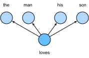
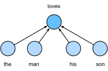

# Word Embedding (word2vec)

A natural language is a complex system that we use to express meanings. In this system, words are the basic unit of linguistic meaning. As its name implies, a word vector is a vector used to represent a word. It can also be thought of as the feature vector of a word. The technique of mapping words to vectors of real numbers is also known as word embedding. Over the last few years, word embedding has gradually become basic knowledge in natural language processing.

## But why not use one-hot vectors?

We used one-hot vectors to represent words (characters are words) in the ["Implementation of the Recurrent Neural Network from Scratch"](../chapter_recurrent-neural-networks/rnn-scratch.md) section. Recall that when we assume the number of different words in a dictionary (the dictionary size) is $N$, each word can correspond one-to-one with consecutive integers from 0 to $N-1$. These integers that correspond to words are called the indices of the words.
We assume that the index of a word is $i$. In order to get the one-hot vector representation of the word, we create a vector of all 0s with a length of $N$ and set element $i$ to 1. In this way, each word is represented as a vector of length $N$ that can be used directly by the neural network.

Although one-hot word vectors are easy to construct, they are usually not a good choice. One of the major reasons is that the one-hot word vectors cannot accurately express the similarity between different words, such as the cosine similarity that we commonly use. For the vectors $\boldsymbol{x}, \boldsymbol{y} \in \mathbb{R}^d$, their cosine similarities are the cosines of the angles between them:

$$\frac{\boldsymbol{x}^\top \boldsymbol{y}}{\|\boldsymbol{x}\| \|\boldsymbol{y}\|} \in [-1, 1].$$

Since the cosine similarity between the one-hot vectors of any two different words is 0, it is difficult to use the one-hot vector to accurately represent the similarity between multiple different words.

Word2vec is a tool that we came up with to solve the problem above[1].  It represents each word with a fixed-length vector and uses these vectors to better indicate the similarity and analogy relationships between different words. The Word2vec tool contains two models: skip-gram[2] and continuous bag of words (CBOW)[3]. Next, we will take a look at the two models and their training methods.

## The Skip-Gram Model

The skip-gram model assumes that a word can be used to generated the words that surround it in a text sequence. For example, we assume that the text sequence is "the", "man", "loves", "his", and "son". We use "loves" as the central target word and set the context window size to 2. As shown in Figure 10.1, given the central target word "loves", the skip-gram model is concerned with the conditional probability for generating the context words, "the", "man", "his" and "son", that are within a distance of no more than 2 words, which is

$$\mathbb{P}(\textrm{``the"},\textrm{``man"},\textrm{``his"},\textrm{``son"}\mid\textrm{``loves"}).$$

We assume that, given the central target word, the context words are generated independently of each other. In this case, the formula above can be rewritten as

$$\mathbb{P}(\textrm{``the"}\mid\textrm{``loves"})\cdot\mathbb{P}(\textrm{``man"}\mid\textrm{``loves"})\cdot\mathbb{P}(\textrm{``his"}\mid\textrm{``loves"})\cdot\mathbb{P}(\textrm{``son"}\mid\textrm{``loves"}).$$

In the skip-gram model, each word is represented as two $d$-dimension vectors, which are used to compute the conditional probability. We assume that the word is indexed as $i$ in the dictionary, its vector is represented as $\boldsymbol{v}_i\in\mathbb{R}^d$ when it is the central target word, and $\boldsymbol{u}_i\in\mathbb{R}^d$ when it is a context word.  Let the central target word $w_c$ and context word $w_o$ be indexed as $c$ and $o$ respectively in the dictionary. The conditional probability of generating the context word for the given central target word can be obtained by performing a softmax operation on the vector inner product:

$$\mathbb{P}(w_o \mid w_c) = \frac{\text{exp}(\boldsymbol{u}_o^\top \boldsymbol{v}_c)}{ \sum_{i \in \mathcal{V}} \text{exp}(\boldsymbol{u}_i^\top \boldsymbol{v}_c)},$$

其中词典索引集$\mathcal{V} = \{0, 1, \ldots, |\mathcal{V}|-1\}$。假设给定一个长度为$T$的文本序列，设时间步$t$的词为$w^{(t)}$。假设给定中心词的情况下背景词的生成相互独立，当背景窗口大小为$m$时，跳字模型的似然函数即给定任一中心词生成所有背景词的概率

$$ \prod_{t=1}^{T} \prod_{-m \leq j \leq m,\ j \neq 0} \mathbb{P}(w^{(t+j)} \mid w^{(t)}),$$

Here, any time step that is less than 1 or greater than $T$ can be ignored.

### Skip-Gram Model Training

The skip-gram model parameters are the central target word vector and context word vector for each individual word.  In the training process, we are going to learn the model parameters by maximizing the likelihood function, which is also known as maximum likelihood estimation. This is equivalent to minimizing the following loss function:

$$ - \sum_{t=1}^{T} \sum_{-m \leq j \leq m,\ j \neq 0} \text{log}\, \mathbb{P}(w^{(t+j)} \mid w^{(t)}).$$

If we use the SGD, in each iteration we are going to pick a shorter subsequence through random sampling to compute the loss for that subsequence, and then compute the gradient to update the model parameters. The key of gradient computation is to compute the gradient of the logarithmic conditional probability for the central word vector and the context word vector. By definition, we first have

$$\log \mathbb{P}(w_o \mid w_c) =
\boldsymbol{u}_o^\top \boldsymbol{v}_c - \log\left(\sum_{i \in \mathcal{V}} \text{exp}(\boldsymbol{u}_i^\top \boldsymbol{v}_c)\right)$$

Through differentiation, we can get the gradient $\boldsymbol{v}_c$ from the formula above.

$$
\begin{aligned}
\frac{\partial \text{log}\, \mathbb{P}(w_o \mid w_c)}{\partial \boldsymbol{v}_c}
&= \boldsymbol{u}_o - \frac{\sum_{j \in \mathcal{V}} \exp(\boldsymbol{u}_j^\top \boldsymbol{v}_c)\boldsymbol{u}_j}{\sum_{i \in \mathcal{V}} \exp(\boldsymbol{u}_i^\top \boldsymbol{v}_c)}\\
&= \boldsymbol{u}_o - \sum_{j \in \mathcal{V}} \left(\frac{\text{exp}(\boldsymbol{u}_j^\top \boldsymbol{v}_c)}{ \sum_{i \in \mathcal{V}} \text{exp}(\boldsymbol{u}_i^\top \boldsymbol{v}_c)}\right) \boldsymbol{u}_j\\
&= \boldsymbol{u}_o - \sum_{j \in \mathcal{V}} \mathbb{P}(w_j \mid w_c) \boldsymbol{u}_j.
\end{aligned}
$$

Its computation obtains the conditional probability for all the words in the dictionary given the central target word $w_c$. We then use the same method to obtain the gradients for other word vectors.

After the training, for any word in the dictionary with index $i$, we are going to get its two word vector sets $\boldsymbol{v}_i$ and $\boldsymbol{u}_i$.  In applications of natural language processing (NLP), the central target word vector in the skip-gram model is generally used as the representation vector of a word.

## The Continuous Bag Of Words (CBOW) Model

The continuous bag of words (CBOW) model is similar to the skip-gram model. The biggest difference is that the CBOW model assumes that the central target word is generated based on the context words before and after it in the text sequence. With the same text sequence "the", "man", "loves", "his" and "son", in which "loves" is the central target word, given a context window size of 2, the CBOW model is concerned with the conditional probability of generating the target word "loves" based on the context words "the", "man", "his" and "son"(as shown in Figure 10.2), such as

$$\mathbb{P}(\textrm{``loves"}\mid\textrm{``the"},\textrm{``man"},\textrm{``his"},\textrm{``son"}).$$

Since there are multiple context words in the CBOW model, we will average their word vectors and then use the same method as the skip-gram model to compute the conditional probability. We assume that $\boldsymbol{v_i}\in\mathbb{R}^d$ and $\boldsymbol{u_i}\in\mathbb{R}^d$ are the context word vector and central target word vector of the word with index $i$ in the dictionary (notice that the symbols are opposite to the ones in the skip-gram model). Let central target word $w_c$ be indexed as $c$, and context words $w_{o_1}, \ldots, w_{o_{2m}}$ be indexed as $o_1, \ldots, o_{2m}$ in the dictionary. Thus, the conditional probability of generating a central target word from the given context word is

$$\mathbb{P}(w_c \mid w_{o_1}, \ldots, w_{o_{2m}}) = \frac{\text{exp}\left(\frac{1}{2m}\boldsymbol{u}_c^\top (\boldsymbol{v}_{o_1} + \ldots + \boldsymbol{v}_{o_{2m}}) \right)}{ \sum_{i \in \mathcal{V}} \text{exp}\left(\frac{1}{2m}\boldsymbol{u}_i^\top (\boldsymbol{v}_{o_1} + \ldots + \boldsymbol{v}_{o_{2m}}) \right)}.$$

为了让符号更加简单，我们记$\mathcal{W}_o= \{w_{o_1}, \ldots, w_{o_{2m}}\}$，且$\bar{\boldsymbol{v}}_o = \left(\boldsymbol{v}_{o_1} + \ldots + \boldsymbol{v}_{o_{2m}} \right)/(2m)$，那么上式可以简写成

$$\mathbb{P}(w_c \mid \mathcal{W}_o) = \frac{\exp\left(\boldsymbol{u}_c^\top \bar{\boldsymbol{v}}_o\right)}{\sum_{i \in \mathcal{V}} \exp\left(\boldsymbol{u}_i^\top \bar{\boldsymbol{v}}_o\right)}.$$

Given a text sequence of length $T$, we assume that the word at time step $t$ is $w^{(t)}$, and the context window size is $m$.  The likelihood function of the CBOW model is the probability of generating any central target word from the context words.

$$ \prod_{t=1}^{T}  \mathbb{P}(w^{(t)} \mid  w^{(t-m)}, \ldots,  w^{(t-1)},  w^{(t+1)}, \ldots,  w^{(t+m)}).$$

### CBOW Model Training

CBOW model training is quite similar to skip-gram model training.  The maximum likelihood estimation of the CBOW model is equivalent to minimizing the loss function.

$$  -\sum_{t=1}^T  \text{log}\, \mathbb{P}(w^{(t)} \mid  w^{(t-m)}, \ldots,  w^{(t-1)},  w^{(t+1)}, \ldots,  w^{(t+m)}).$$

Notice that

$$\log\,\mathbb{P}(w_c \mid \mathcal{W}_o) = \boldsymbol{u}_c^\top \bar{\boldsymbol{v}}_o - \log\,\left(\sum_{i \in \mathcal{V}} \exp\left(\boldsymbol{u}_i^\top \bar{\boldsymbol{v}}_o\right)\right).$$

Through differentiation, we can compute the logarithm of the conditional probability of the gradient of any context word vector $\boldsymbol{v}_{o_i}$($i = 1, \ldots, 2m$) in the formula above.

$$\frac{\partial \log\, \mathbb{P}(w_c \mid \mathcal{W}_o)}{\partial \boldsymbol{v}_{o_i}} = \frac{1}{2m} \left(\boldsymbol{u}_c - \sum_{j \in \mathcal{V}} \frac{\exp(\boldsymbol{u}_j^\top \bar{\boldsymbol{v}}_o)\boldsymbol{u}_j}{ \sum_{i \in \mathcal{V}} \text{exp}(\boldsymbol{u}_i^\top \bar{\boldsymbol{v}}_o)} \right) = \frac{1}{2m}\left(\boldsymbol{u}_c - \sum_{j \in \mathcal{V}} \mathbb{P}(w_j \mid \mathcal{W}_o) \boldsymbol{u}_j \right).$$

We then use the same method to obtain the gradients for other word vectors. Unlike the skip-gram model, we usually use the context word vector as the representation vector for a word in the CBOW model.

## Summary

* A word vector is a vector used to represent a word. The technique of mapping words to vectors of real numbers is also known as word embedding.
* Word2vec includes both the continuous bag of words (CBOW) and skip-gram models. The skip-gram model assumes that context words are generated based on the central target word. The CBOW model assumes that the central target word is generated based on the context words.

## exercise

* What is the computational complexity of each gradient? If the dictionary contains a large volume of words, what problems will this cause?
* There are some fixed phrases in the English language which consist of multiple words, such as "new york". How can you train their word vectors? Hint: See section 4 in the Word2vec paper[2].
* Use the skip-gram model as an example to think about the design of a word2vec model. What is the relationship between the inner product of two word vectors and the cosine similarity in the skip-gram model? For a pair of words with close semantical meaning, why it is likely for their word vector cosine similarity to be high?

## Reference

[1] Word2vec tool.  https://code.google.com/archive/p/word2vec/

[2] Mikolov, T., Sutskever, I., Chen, K., Corrado, G. S., & Dean, J. (2013). Distributed representations of words and phrases and their compositionality. In Advances in neural information processing systems (pp. 3111-3119).

[3] Mikolov, T., Chen, K., Corrado, G., & Dean, J. (2013). Efficient estimation of word representations in vector space. arXiv preprint arXiv:1301.3781.

## Discuss on our Forum

