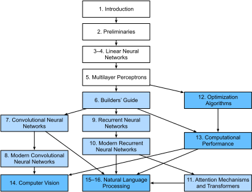

# Preface

Just a few years ago, there were no legions of deep learning scientists
developing intelligent products and services at major companies and startups.
When the youngest of us (the authors) entered the field,
machine learning didn't command headlines in daily newspapers.
Our parents had no idea what machine learning was,
let alone why we might prefer it to a career in medicine or law.
Machine learning was a forward-looking academic discipline
with a narrow set of real-world applications.
And those applications, e.g. speech recognition and computer vision,
required so much domain knowledge that they were often regarded
as separate areas entirely for which machine learning was one small component.
Neural networks, the antecedents of the deep learning models
that we focus on in this book, were regarded as outmoded tools.


In just the past five years, deep learning has taken the world by surprise,
driving rapid progress in fields as diverse as computer vision,
natural language processing, automatic speech recognition,
reinforcement learning, and statistical modeling.
With these advances in hand, we can now build cars that drive themselves
(with increasing autonomy), smart reply systems that anticipate mundane replies,
helping people dig out from mountains of email,
and software agents that dominate the world's best humans at board games like Go,
a feat once deemed to be decades away.
Already, these tools are exerting a widening impact,
changing the way movies are made, diseases are diagnosed,
and playing a growing role in basic sciences -- from astrophysics to biology.
This book represents our attempt to make deep learning approachable,
teaching you both the *concepts*, the *context*, and the *code*.


## About This Book

### One Medium Combining Code, Math, and HTML

For any computing technology to reach its full impact,
it must well-understood, well-documented, and supported by
mature, well-maintained tools.
The key ideas should be clearly distilled,
minimizing the onboarding time needing to bring new practitioners up to date.
Mature libraries should automate common tasks,
and exemplar code should make it easy for practitioners
to modify, apply, and extend common applications to suit their needs.
Take dynamic web applications as an example.
Despite a large number of companies, like Amazon,
developing successful database-driven web applications in the 1990s,
the full potential of this technology to aid creative entrepreneurs
has only been realized over the past ten years,
owing to the development of powerful, well-documented frameworks.


Realizing deep learning presents unique challenges because
any single application brings together various disciplines.
Applying deep learning requires simultaneously understanding
(i) the motivations for casting a problem in a particular way,
(ii) the mathematics of a given modeling approach,
(iii) the optimization algorithms for fitting the models to data,
(iv) and the engineering required to train models efficiently,
navigating the pitfalls of numerical computing and getting the most
out of available hardware.
Teaching both the critical thinking skills required to formulate problems,
the mathematics to solve them, and the software tools to implement those
solutions all in one place presents formidable challenges.
Our goal in this book is to present a unified resource
to bring would-be practitioners up to speed.


We started this book project in July 2017
when we needed to explain MXNet's (then new) Gluon interface to our users.
At the time, there were no resources that were simultaneously
(1) up to date, (2) covered the full breadth of modern machine learning
with anything resembling of technical depth,
and (3) interleaved the exposition one expects from an engaging textbook
with the clean runnable code one seeks in hands-on tutorials.
We found plenty of code examples for how to use a given deep learning
framework (e.g. how to do basic numerical computing with matrices in TensorFlow)
or for implementing particular techniques (e.g. code snippets for LeNet, AlexNet, ResNets, etc)
in the form of blog posts or on GitHub.
However, these examples typically focused on
*how* to implement a given approach,
but left out the discussion of *why* certain algorithmic decisions are made.
While sporadic topics have been covered in blog posts,
e.g. on the website [Distill](http://distill.pub) or personal blogs,
they only covered selected topics in deep learning, and often lacked associated code.
On the other hand, while several textbooks have emerged,
most notably [Goodfellow, Bengio and Courville, 2016](https://www.deeplearningbook.org/),
which offers an excellent survey of the concepts behind deep learning,
these resources don't marry the descriptions to realizations of the concepts in code,
sometimes leaving readers clueless as to how to implement them.
Moreover, too many resources are hidden behind the paywalls of commercial course providers.

We set out to create a resource that could
(1) be freely available for everyone,
(2) offer sufficient technical depth to provide a starting point on the path
to actually becoming an applied machine learning scientist,
(3) include runnable code, showing readers *how* to solve problems in practice,
and (4) that allowed for rapid updates, both by us, and also by the community at large,
and (5) be complemented by a [forum](http://discuss.mxnet.io)
for interactive discussion of technical details and to answer questions.

These goals were often in conflict.
Equations, theorems, and citations are best managed and laid out in LaTeX.
Code is best described in Python.
And webpages are native in HTML and JavaScript.
Furthermore, we want the content to be
accessible both as executable code, as a physical book,
as a downloadable PDF, and on the internet as a website.
At present there exist no tools and no workflow
perfectly suited to these demands, so we had to assemble our own.
We describe our approach in detail in the [appendix](../chapter_appendix/how-to-contribute.md).
We settled on Github to share the source and to allow for edits,
Jupyter notebooks for mixing code, equations and text,
Sphinx as a rendering engine to generate multiple outputs,
and Discourse for the forum.
While our system is not yet perfect, these choices provide a good compromise
among the competing concerns.
We believe that this might be the first book published using such an integrated workflow.


### Learning by Doing

Many textbooks teach a series of topics, each in exhaustive detail.
For example, Chris Bishop's excellent textbook,
[Pattern Recognition and Machine Learning](https://www.amazon.com/Pattern-Recognition-Learning-Information-Statistics/dp/0387310738),
teaches each topic so thoroughly, that getting to the chapter
on linear regression requires a non-trivial amount of work.
While experts love this book precisely for its thoroughness,
for beginners, this property limits its usefulness as an introductory text.

In this book, we'll teach most concepts *just in time*.
In other words, you'll learn concepts at the very moment
that they are needed to accomplish some practical end.
While we take some time at the outset to teach
fundamental preliminaries, like linear algebra and probability.
We want you to taste the satisfaction of training your first model
before worrying about more esoteric probability distributions.

Aside from a few preliminary notebooks that provide a crash course
in the basic mathematical background,
each subsequent notebook introduces both a reasonable number of new concepts
and provides a single self-contained working example -- using a real dataset.
This presents an organizational challenge.
Some models might logically be grouped together in a single notebook.
And some ideas might be best taught by executing several models in succession.
On the other hand, there's a big advantage to adhering
to a policy of *1 working example, 1 notebook*:
This makes it as easy as possible for you to
start your own research projects by leveraging our code.
Just copy a notebook and start modifying it.

We will interleave the runnable code with background material as needed.
In general, we will often err on the side of making tools
available before explaining them fully (and we will follow up by
explaining the background later).
For instance, we might use *stochastic gradient descent*
before fully explaining why it is useful or why it works.
This helps to give practitioners the necessary
ammunition to solve problems quickly,
at the expense of requiring the reader to trust us with some curatorial decisions.

Throughout, we'll be working with the MXNet library,
which has the rare property of being flexible enough for research
while being fast enough for production.
This book will teach deep learning concepts from scratch.
Sometimes, we want to delve into fine details about the models
that would typically be hidden from the user by ``Gluon``'s advanced abstractions.
This comes up especially in the basic tutorials,
where we want you to understand everything that happens in a given layer or optimizer.
In these cases, we'll often present two versions of the example:
one where we implement everything from scratch,
relying only on NDArray and automatic differentiation,
and another, more practical example, where we write succinct code using ``Gluon``.
Once we've taught you how some component works,
we can just use the ``Gluon`` version in subsequent tutorials.


### Content and Structure

The book can be roughly divided into three sections:

* The first part covers prerequisites and basics.
The first chapter offers an [Introduction to Deep Learning](../chapter_introduction/index.md).
In [Crashcourse](../chapter_crashcourse/index.md),
we'll quickly bring you up to speed on the prerequisites required for hands-on deep learning,
such as how to acquire and run the codes covered in the book.
[Deep Learning Basics](../chapter_deep-learning-basics/index.md)
covers the most basic concepts and techniques of deep learning,
such as multi-layer perceptrons and regularization.
<!--If you are short on time or you only want to learn only
about the most basic concepts and techniques of deep learning,
it is sufficient to read the first section only.-->
* The next three chapters focus on modern deep learning techniques.
[Deep Learning Computation](../chapter_deep-learning-computation/index.md)
describes the various key components of deep learning calculations
and lays the groundwork for the later implementation of more complex models.
Next we explain [Convolutional Neural Networks](../chapter_convolutional-neural-networks/index.md),
powerful tools that form the backbone of most modern computer vision systems in recent years.
Subsequently, we introduce [Recurrent Neural Networks](../chapter_recurrent-neural-networks/index.md),
models that exloit temporal or sequential structure in data,
and are commonly used for natural language processing and time series prediction.
These sections will get you up to speed on the basic tools behind most modern deep learning.

* Part three discusses scalability, efficiency and applications.
First we discuss several common [Optimization Algorithms](../chapter_optimization/index.md)
used to train deep learning models.
The next chapter, [Performance](../chapter_computational-performance/index.md),
examines several important factors that affect the computational performance of your deep learning code.
Chapters 9 and 10  illustrate major applications of deep learning
in computer vision and natural language processing, respectively.

An outline of the book together with possible flows for navigating it is given below.
The arrows provide a graph of prerequisites:




### Code

Most sections of this book feature executable code.
We recognize the importance of an interactive learning experience in deep learning.
At present certain intuitions can only be developed through trial and error,
tweaking the code in small ways and observing the results.
Ideally, an elegant mathematical theory might tell us
precisely how to tweak our code to achieve a desired result.
Unfortunately, at present such elegant theories elude us.
Despite our best attempts, our explanations for of various techniques might be lacking,
sometimes on account of our shortcomings,
and equally often on account of the nascent state of the science of deep learning.
We are hopeful that as the theory of deep learning progresses,
future editions of this book will be able to provide insights in places the present edition cannot.

Most of the code in this book is based on Apache MXNet.
MXNet is an open-source framework for deep learning
and the preferred choice of AWS (Amazon Cloud Services),
as well as many colleges and companies.
All of the code in this book has passed tests under MXNet 1.2.0.
However, due to the rapid development of deep learning,
some code *in the print edition* may not work properly in future versions of MXNet.
However, we plan to keep the online version remain up-to-date.
In case of such problems, please consult the section
["Installation and Running"](../chapter_prerequisite/install.md)
to update the code and runtime environment.
At times, to avoid unnecessary repetition,
we encapsulate the frequently-imported and referred-to functions, classes, etc.
in this book in the `gluonbook` package, version number 1.0.0.
We give a detailed overview of these functions and classes in the appendix [“gluonbook package index”](../chapter_appendix/gluonbook.md)


### Target Audience

This book is for students (undergraduate or graduate),
engineers, and researchers, who seek a solid grasp
of the practical techniques of deep learning.
Because we explain every concept from scratch,
no previous background in deep learning or machine learning is required.
Fully explaining the methods of deep learning
requires some mathematics and programming,
but we'll only assume that you come in with some basics,
including (the very basics of) linear algebra, calculus, probability,
and Python programming.
Moreover, this book's appendix provides a refresher
on most of the mathematics covered in this book.
Most of the time, we will prioritize intuition and ideas
over mathematical rigor.
There are many terrific books which can lead the interested reader further. For instance [Linear Analysis](https://www.amazon.com/Linear-Analysis-Introductory-Cambridge-Mathematical/dp/0521655773) by Bela Bollobas covers linear algebra and functional analysis in great depth. [All of Statistics](https://www.amazon.com/All-Statistics-Statistical-Inference-Springer/dp/0387402721) is a terrific guide to statistics.
And if you have not used Python before,
you may want to peruse the [Python tutorial](http://learnpython.org/).


### Forum

Associated with this book, we've launched a discussion forum,
located at [discuss.mxnet.io](https://discuss.mxnet.io/).
When you have questions on any section of the book,
you can find the associated discussion page by scanning the QR code
at the end of the section to participate in its discussions.
The authors of this book and broader MXNet developer community
frequently participate in forum discussions.


## Installing MXNet and Gluon

To get started, you'll need to download and install the code needed to run the notebooks
by executing the following steps:

1. Install conda
1. Download the code that goes with the book
1. Install GPU drivers if you have a GPU and haven't used it before
1. Build the conda environment to run MXNet and the examples of the book


### Installing Conda

For simplicity we recommend [conda](https://conda.io), a popular Python package manager to install all libraries.

1. Download and install [Miniconda](https://conda.io/miniconda.html) at [conda.io/miniconda.html](https://conda.io/miniconda.html) based on your operating system.
1. Update your shell by `source ~/.bashrc` (Linux) or `source ~/.bash_profile` (macOS). Make sure to add Anaconda to your PATH environment variable.
1. Download the tarball containing the notebooks from this book. This can be found at [www.d2l.ai/d2l-en-1.0.zip](https://www.d2l.ai/d2l-en-1.0.zip). Alternatively feel free to clone the latest version from GitHub.
1. Uncompress the ZIP file and move its contents to a folder for the tutorials.

On Linux this can be accomplished as follows from the command line; For MacOS replace Linux by MacOSX in the first line, for Windows follow the links provided above.

```
wget https://repo.anaconda.com/miniconda/Miniconda3-latest-Linux-x86_64.sh
sh Miniconda3-latest-Linux-x86_64.sh
mkdir d2l-en
cd d2l-en
curl https://www.d2l.ai/d2l-en-1.0.zip -o d2l-en.zip
unzip d2l-en-1.0.zip
rm d2l-en-1.0.zip
```

### GPU Support

By default MXNet is installed without GPU support
to ensure that it will run on any computer (including most laptops).
If you're fortunate enough to be running on a GPU-enabled computer,
you should modify the conda environment to download the CUDA enabled build.
Not that you will need to have the appropriate drivers installed.
In particular you need to:

1. Ensure that you install the [NVIDIA Drivers](https://www.nvidia.com/drivers)
for your specific GPU.
1. Install [CUDA](https://developer.nvidia.com/cuda-downloads),
the programming language for GPUs.
1. Install [CUDNN](https://developer.nvidia.com/cudnn),
which contains many optimized libraries for deep learning.
1. Install [TensorRT](https://developer.nvidia.com/tensorrt),
if appropriate, for further acceleration.

The installation process is somewhat lengthy
and you will need to agree to a number of different licenses.
Details will depend strongly on your choice of operating system and hardware.

Next, update the environment description in `environment.yml`.
Likely, you'll want to replace `mxnet` by `mxnet-cu92`.
The number following the hyphen (92 above)
corresponds to the version of CUDA you installed).
For instance, if you're on CUDA 8.0,
you need to replace `mxnet-cu92` with `mxnet-cu80`.
You should do this *before* creating the conda environment.
Otherwise you will need to rebuild it later.
On Linux this looks as follows
(on Windows you can use e.g. Notepad to edit `environment.yml` directly).

```
cd d2l
emacs environment.yml
```

### Conda Environment

Conda provides a mechanism for managing Python libraries
in a reproducible and reliable manner.
To set up your environment, you'll need to:

1. Create and activate the environment using conda. For convenience we created an `environment.yml` file to hold all configuration.
1. Activate the environment.
1. Open Jupyter notebooks to start experimenting.

### Windows

As before, open the command line terminal.

```
conda env create -f environment.yml
cd d2l-en
activate gluon
jupyter notebook
```

If you need to reactivate the set of libraries later, just skip the first line.
This will ensure that your setup is active.
Note that instead of Jupyter Notebooks you can also use JupyterLab
via `jupyter lab` instead of `jupyter notebook`.
This will give you a more powerful Jupyter environment
(if you have JupyterLab installed).
You can do this manually via `conda install jupyterlab`
from within an active conda gluon environment.

If your browser integration is working properly,
starting Jupyter will open a new window in your browser.
If this doesn't happen, go to http://localhost:8888 to open it manually.
Some notebooks will automatically download the data set and pre-training model.
You can adjust the location of the repository by overriding the `MXNET_GLUON_REPO` variable.

### Linux and MacOSX

The steps for Linux are similar but instead of `activate gluon`, you'll want to run `source activate gluon`.

```
conda env create -f environment.yml
cd d2l-en
source activate gluon
jupyter notebook
```


### Updating Gluon

In case you want to update the repository,
if you installed a new version of CUDA and (or) MXNet,
you can simply use the conda commands to do this.
As before, make sure you update the packages accordingly.

```
cd d2l-en
conda env update -f environment.yml
```


## Exercises

1. Register an account on the discussion forum of this book [discuss.mxnet.io](https://discuss.mxnet.io/).
1. Install Python on your computer.
1. Download the code for the book and install the runtime environment.
1. Follow the links at the bottom of the section to the forum,
where you'll be able to seek out help and discuss the book and find answers to your questions
by engaging the authors and broader community.
1. Create an account on the forum and introduce yourself.


## Summary
* Deep learning has revolutionized pattern recognition, introducing technology that now powers a wide range of  technologies, including computer vision, natural language processing, automatic speech recognition.
* To successfully apply deep learning, you must understand how to cast a problem, the mathematics of modeling, the algorithms for fitting your models to data, and the engineering techniques to implement it all.
* This book presents a comprehensive resource, including prose, figures, mathematics, and code, all in one place.
* To answer questions related to this book, visit our forum at https://discuss.mxnet.io/.
* Apache MXNet is a powerful library for coding up deep learning models and unning them in parallel across GPU cores.
* Gluon is a high level library that makes it easy to code up deep learning models using Apache MXNet.
* Conda is a Python package manager that ensures that all software dependencies are met.
* All notebooks are available for download on GitHub and  the conda configurations needed to run this book's code are expressed in the `environment.yml` file.
* If you plan to run this code on GPUs, don't forget to install the necessary drivers and update your configuration.


## Discuss on our Forum


<div id="discuss" topic_id="2315"></div>


## Acknowledgments

We are indebted to the hundreds of contributors for both
the English and the Chinese drafts.
They helped improve the content and offered valuable feedback.
Specifically, we thank every contributor of this English draft
for making it better for everyone.
Their GitHub IDs or names are (in no particular order):
alxnorden, avinashingit, bowen0701, brettkoonce, Chaitanya Prakash Bapat,
cryptonaut, edgarroman, gkutiel, John Mitro, Liang Pu, Rahul Agarwal, mohamed-ali,
mstewart141, Mike Müller, NRauschmayr, prakhar1989, sad-, sfermigier, sundeepteki,
topecongiro, vishaalkapoor, vishwesh5, YaYaB.
Moreover, we thank Amazon Web Services, especially Swami Sivasubramanian,
Raju Gulabani, Charlie Bell, and Andrew Jassy for their generous support in writing this book.
Without the available time, resources, discussions with colleagues,
and continuous encouragement this book would not have happened.

