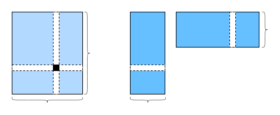

# Matrix Factorization for Recommender Systems

The first version of matrix factorization algorithm is proposed by simon funk in a famous [blog
post](https://sifter.org/~simon/journal/20061211.html) in which he described the idea of factorizing the interaction matrix. It then became widely known due to the Netflix contest. In 2006, Netflix, a media-streaming and video-rental company, announced a contest to improve its recommender systems.  The first team that can improve on the Netflix baseline by 10 percent will win a one million USD prize.  This contest attracts
a lot of attention and creates the hype of recommender systems research. Later on, the grand prize was won by the BellKor's Pragmatic Chaos team, a combined team of BellKor, Pragmatic Theory and BigChaos. Although it is an ensemble method that finally get the best score, matrix factorization plays a critical role in the final blend. The technical report: [the Netflix Grand Prize solution](https://www.netflixprize.com/assets/GrandPrize2009_BPC_BigChaos.pdf), provides a detailed introduction to the algorithm employed. In this section, we will delve into the details of the matrix factorization algorithm and how to implement it with MXnet.

  

## Introduction to matrix factorization 

Matrix factorization is a class of collaborative filtering algorithms. Simply put, matrix factorization factorizes the user-item interaction matrix into the product of two lower-rank matrices.  Let $\mathbf{R}  \in \mathbb{R}^{M  \times N}$ denote the interaction matrix with $M$ users and $N$ items, and the values of the $R$ represent explicit ratings. It will be factorized into a user latent matrix $P \in \mathbb{R}^{M \times f}$ and an item latent matrix $Q \in \mathbb{R}^{N \times f}$, where $f << M, N$.  These factors might measure obvious dimensions such as movies' genres or completely uninterpretable.  For a given item $i$, the elements of $Q_i$ measure the extent to which the item possesses those characteristics. For a given user $u$, the elements of $P_u$ measure the extent of interest the user has in items' characteristics.  The predicted ratings can be given by $\hat{R} = PQ^T$.

One major problem of this prediction rule is that users/items biases can not be modelled. For example, some users tend to give high ratings or some items get lower ratings due to poor quality. So we can also add both user biases and item biases into the model. Specifically, the predicted rating user $u$ gives to item $i$ is computed as.
$$
\hat{R}_{ui} = P_uQ^T_i + b_u + b_i
$$
Then, we train this model by minimizing the mean square error.  The loss function is defined as follows.
$$
\underset{P_*, Q_*, b_*}{\arg \min} \sum_{(u, i) \in \mathcal{K}} \parallel R_{ui} -
\hat{R}_{ui} \parallel^2 + \lambda (\parallel P \parallel^2_F + \parallel Q
\parallel^2_F + b_u^2 + b_i^2 )
$$
where $\lambda$ denotes regularization rate. The $(u, i)$ pairs for which $R_{ui}$ is known are stored in the set
$\mathcal{K}=\{(u, i) | R_{ui} \text{ is known}\}$. The model parameters can be learnt with standard optimizer such as  SGD, Adam or AdaGrad. 




## Implementation of matrix factorization 

Firstly, we implement the matrix factorization algorithm described above. The user and item latent factors can be created with the `nn.Embedding` in Gluon. The (`input_dim`) is the number of items/users and the (`output_dim`) is the dimension of the latent factors ($f$).  We can also use `nn.Embedding` to create the user/item biases by setting the `output_dim` to one. In the forward step, user and item ids are used to look up those embeddings.

```
from mxnet.gluon import nn
from mxnet import np, npx, init, gluon, autograd
import d2l
import mxnet as mx

class MatrixFactorization(nn.Block):

    def __init__(self, num_factors, num_users, num_items, **kwargs):
        super(MatrixFactorization, self).__init__(**kwargs)
        self.user_embeddings = nn.Embedding(input_dim=num_users, 
                                            output_dim=num_factors)
        self.item_embeddings = nn.Embedding(input_dim=num_items, 
                                            output_dim=num_factors)
        self.user_bias = nn.Embedding(input_dim=num_users, output_dim=1)
        self.item_bias = nn.Embedding(input_dim=num_items, output_dim=1)

    def forward(self, user_id, item_id):
        p = self.user_embeddings(user_id)
        q = self.item_embeddings(item_id)
        b_u = self.user_bias(user_id)
        b_i = self.item_bias(item_id)
        pred = (p * q).sum(axis=1) + np.squeeze(b_u) + np.squeeze(b_i)
        return pred.flatten()
```
## Evaluate the Model

We then implement the RMSE (root-mean-square error) measurement, which is commonly used to measure the performance of rating prediction models.  Here, we can use the RMSE function provided by `mx.metric`. Note that the evaluation is also done in batch mode.

```
def evaluate_network(network, data_iterator, ctx):
    root_mean_squared_error = mx.metric.RMSE()
    rmse_sum = 0
    for idx, (users, items, scores) in enumerate(data_iterator):
        users_ = gluon.utils.split_and_load(users, ctx)
        items_ = gluon.utils.split_and_load(items, ctx)
        scores_ = gluon.utils.split_and_load(scores, ctx)
        preds = [network(u, i) for u, i in zip(users_, items_)]
        root_mean_squared_error.update(labels=scores_, preds=preds)
        rmse_sum += root_mean_squared_error.get()[1]
    return rmse_sum /(idx+1)
```

## Train the Model

In the training function, we adopt the L2 loss with weight decay. The weight decay mechinsim has the same effects as the L2 regularization.

```
def train(model, train_data, test_data, epochs, learning_rate, weight_dacay, 
          optimizer, ctx):
    loss = gluon.loss.L2Loss()
    model.initialize(ctx=ctx, force_reinit=False, init=mx.init.Normal(0.001))
    trainer = gluon.Trainer(model.collect_params(), optimizer,  
                            {"learning_rate": learning_rate,  
                             'wd': weight_dacay})

    for epoch in range(epochs):
        loss_acc = 0.
        for index, (users, items, scores) in enumerate(train_data):
            u_split = gluon.utils.split_and_load(users, ctx)
            i_split = gluon.utils.split_and_load(items, ctx)
            scores_split = gluon.utils.split_and_load(scores, ctx)
            with autograd.record():
                preds = [model(u, i) for u, i in zip(u_split, i_split)]
                losses = [loss(p, s) for p, s in zip(preds, scores_split)]
            [l.backward() for l in losses]
            loss_acc += sum([l.asnumpy() for l in losses]).mean()/len(ctx)
            trainer.step(users.shape[0])
        test_loss = evaluate_network(model, test_data, ctx)
        train_loss = loss_acc/(index+1)
        print("Epoch [{}], Training RMSE {:.4f}, Test RMSE {:.4f}"
              .format(epoch, train_loss, test_loss))
```
Finally,  let's put all things together and train the model. Here, we use the `adam` optimizer, and set the learning rate to `0.001` and weight decay rate to `0.00001`.

```
ctx = d2l.try_all_gpus()
num_users, num_items, train_data, test_data = d2l.split_and_load_ml100k(
    test_size=0.1, batch_size=128)
model = MatrixFactorization(50, num_users, num_items)
train(model, train_data, test_data, epochs=50, optimizer='adam', 
      learning_rate=0.001, weight_dacay=0.00001, ctx=ctx)
```

## Summary 

* The matrix factorization algorithm is widely used in recommender systems.  It can be used to predict ratings that a user might give to an item.
* We can implement matrix factorization with standard MXnet operations, and train it with widely used neural network   optimizer.


## Exercise

* Vary the size of latent factors. How the size of latent factors impact the model performance?
* Try different optimizers, learning rate and weight decay rate.

