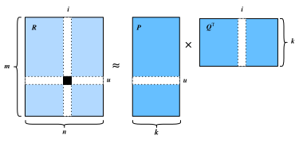

# Matrix Factorization

The first version of matrix factorization algorithm is proposed by Simon Funk in a famous [blog
post](https://sifter.org/~simon/journal/20061211.html) in which he described the idea of factorizing the interaction matrix. It then became widely known due to the Netflix contest. In 2006, Netflix, a media-streaming and video-rental company, announced a contest to improve its recommender systems.  The first team that can improve on the Netflix baseline by 10 percent will win a one million USD prize.  This contest attracted
a lot of attention and created the hype of recommender system research. Later on, the grand prize was won by the BellKor's Pragmatic Chaos team, a combined team of BellKor, Pragmatic Theory, and BigChaos. Although it is an ensemble method that finally achieved the best score, matrix factorization plays a critical role in the final blend. The technical report [the Netflix Grand Prize solution](https://www.netflixprize.com/assets/GrandPrize2009_BPC_BigChaos.pdf) provides a detailed introduction to the  employed algorithm. In this section, we will dive into the details of the matrix factorization algorithm and its implementation.


## The Matrix Factorization Model

Matrix factorization is a class of collaborative filtering algorithms. Simply put, this algorithm factorizes the user-item interaction matrix into the product of two lower-rank matrices.  Let $\mathbf{R}  \in \mathbb{R}^{M \times N}$ denote the interaction matrix with $M$ users and $N$ items, and the values of $\mathbf{R}$ represent explicit ratings. It will be factorized into a user latent matrix $\mathbf{P} \in \mathbb{R}^{M \times k}$ and an item latent matrix $\mathbf{Q} \in \mathbb{R}^{N \times k}$, where $k \ll M, N$.  These factors might measure obvious dimensions such as movies' genres or are completely uninterpretable.  For a given item $i$, the elements of $\mathbf{Q}_i$ measure the extent to which the item possesses those characteristics. For a given user $u$, the elements of $\mathbf{P}_u$ measure the extent of interest the user has in items' corresponding characteristics.  The predicted ratings can be estimated by 

$$\hat{\mathbf{R}} = \mathbf{PQ}^\top$$

One major problem of this prediction rule is that users/items biases can not be modeled. For example, some users tend to give higher ratings or some items always get lower ratings due to poorer quality. These biases are commonplace in real-world applications. To capture these biases, user specific and item specific bias terms are introduced. Specifically, the predicted rating user $u$ gives to item $i$ is calculated by

$$
\hat{\mathbf{R}}_{ui} = \mathbf{P}_u\mathbf{Q}^\top_i + b_u + b_i
$$

Then, we train this model by minimizing the mean squared error between predicted rating scores and real rating scores.  The objective function is defined as follows:

$$
\underset{\mathbf{P}_*, \mathbf{Q}_*, b_*}{\mathrm{argmin}} \sum_{(u, i) \in \mathcal{K}} \parallel \mathbf{R}_{ui} -
\hat{\mathbf{R}}_{ui} \parallel^2 + \lambda (\parallel \mathbf{P} \parallel^2_F + \| \mathbf{Q}
\|^2_F + b_u^2 + b_i^2 )
$$

where $\lambda$ denotes the regularization rate. The $(u, i)$ pairs for which $\mathbf{R}_{ui}$ is known are stored in the set
$\mathcal{K}=\{(u, i) \mid \mathbf{R}_{ui} \text{ is known}\}$. The model parameters can be learned with an optimization algorithm, such as SGD and Adam.

An intuitive illustration of the matrix factorization algorithm is shown below:



In the rest of this section, we will explain the implementation of matrix factorization and train the model on the MovieLens dataset.

```{.python .input  n=1}
import d2l
from mxnet import autograd, init, gluon, np, npx
from mxnet.gluon import nn
import mxnet as mx
npx.set_np()
```

## Model Implementation

First, we implement the matrix factorization algorithm described above. The user and item latent factors can be created with the `nn.Embedding`. The (`input_dim`) is the number of items/users and the (`output_dim`) is the dimension of the latent factors ($k$).  We can also use `nn.Embedding` to create the user/item biases by setting the `output_dim` to one. In the `forward` function, user and item ids are used to look up those embeddings.

```{.python .input  n=2}
class MF(nn.Block):
    def __init__(self, num_factors, num_users, num_items, **kwargs):
        super(MF, self).__init__(**kwargs)
        self.user_embeddings = nn.Embedding(num_users, num_factors)
        self.item_embeddings = nn.Embedding(num_items, num_factors)
        self.user_bias = nn.Embedding(num_users, 1)
        self.item_bias = nn.Embedding(num_items, 1)

    def forward(self, user_id, item_id):
        p_u = self.user_embeddings(user_id)
        q_u = self.item_embeddings(item_id)
        b_u = self.user_bias(user_id)
        b_i = self.item_bias(item_id)
        outputs = (p_u * q_u).sum(axis=1) + np.squeeze(b_u) + np.squeeze(b_i)
        return outputs.flatten()
```

## Evaluation Measures

We then implement the RMSE (root-mean-square error) measure, which is commonly used to measure the differences between rating scores predicted by the model and the actually observed ratings (ground truth). RMSE is defined as: 

$$
\mathrm{RMSE} = \sqrt{\frac{1}{|\mathcal{T}|}\sum_{(u,i) \in \mathcal{T}}(\mathbf{R}_{ui} -\hat{\mathbf{R}}_{ui})^2}
$$

where $\mathcal{T}$ is the set consisting of pairs of users and items that you want to evaluate on. We can use the RMSE function provided by `mx.metric`.

```{.python .input  n=3}
def evaluator(net, test_iter, ctx):
    rmse = mx.metric.RMSE() # Get the RMSE
    rmse_list = []
    for idx, (users, items, ratings) in enumerate(test_iter):
        u = gluon.utils.split_and_load(users, ctx, even_split=False)
        i = gluon.utils.split_and_load(items, ctx, even_split=False)
        r_ui = gluon.utils.split_and_load(ratings, ctx, even_split=False)
        r_hat = [net(u, i) for u, i in zip(u, i)]
        rmse.update(labels=r_ui, preds=r_hat)
        rmse_list.append(rmse.get()[1])
    return float(np.mean(np.array(rmse_list)))
```

## Training and Evaluating the Model


In the training function, we adopt the $L_2$ loss with weight decay. The weight decay mechanism has the same effect as the $L_2$ regularization.

```{.python .input  n=4}
# Save to the d2l package.
def train_recsys_rating(net, train_iter, test_iter, loss, trainer, num_epochs, 
                   ctx_list=d2l.try_all_gpus(), evaluator=None, **kwargs):
    num_batches, timer = len(train_iter), d2l.Timer()
    animator = d2l.Animator(xlabel='epoch', xlim=[0,num_epochs], ylim=[0,2],
                            legend=['train loss','test RMSE'])
    for epoch in range(num_epochs):
        metric, l = d2l.Accumulator(3), 0.
        for i, values in enumerate(train_iter):
            timer.start()
            input_data = []
            values = values if isinstance(values, list) else [values]
            for v in values:
                input_data.append(gluon.utils.split_and_load(v, ctx_list))
            train_feat = input_data[0:-1] if len(values) > 1 else input_data
            train_label = input_data[-1]
            with autograd.record():
                preds = [net(*t) for t in zip(*train_feat)]
                losses = [loss(p, s) for p, s in zip(preds, train_label)]
            [l.backward() for l in losses]
            l += sum([l.asnumpy() for l in losses]).mean() / len(ctx_list)
            trainer.step(values[0].shape[0])
            metric.add(l, values[0].shape[0], values[0].size)
            timer.stop()
        if len(kwargs) > 0:
            test_acc = evaluator(net, test_iter, kwargs['inter_mat'],ctx_list)
        else:
            test_acc = evaluator(net, test_iter, ctx_list)
        train_loss = l /(i+1)
        animator.add(epoch+1, (train_loss, None, test_acc))
    print('loss %.3f, test RMSE %.3f' % (metric[0]/metric[1], test_acc))
    print('%.1f exampes/sec on %s' % (metric[2]*num_epochs/timer.sum(), 
                                      ctx_list))
```

Finally,  let's put all things together and train the model. Here, we set the latent factor dimension to 50.

```{.python .input  n=5}
ctx = d2l.try_all_gpus()
num_users, num_items, train_iter, test_iter = d2l.split_and_load_ml100k(
    test_ratio=0.1, batch_size=128)
net = MF(50, num_users, num_items)
net.initialize(ctx=ctx, force_reinit=True, init = mx.init.Normal(0.01))
lr, num_epochs, wd, optimizer = 0.001, 25, 1e-5, 'adam'
loss = gluon.loss.L2Loss()
trainer = gluon.Trainer(net.collect_params(), optimizer, 
                        {"learning_rate": lr, 'wd': wd})
train_explicit(net, train_iter, test_iter, loss, trainer, num_epochs, ctx, 
               evaluator)
```

Below, we use the trained model to predict the rating that a user (ID 20) might give to an item (ID 30).

```{.python .input  n=6}
scores = net(np.array([20], dtype='int8', ctx=d2l.try_gpu()), 
             np.array([30], dtype='int8', ctx=d2l.try_gpu()))
print(scores)
```

## Summary 

* The matrix factorization algorithm is widely used in recommender systems.  It can be used to predict ratings that a user might give to an item.
* We can implement and train matrix factorization for recommender systems.


## Exercise

* Vary the size of latent factors. How does the size of latent factors influence the model performance?
* Try different optimizers, learning rates, and weight decay rates. 
* Check the predicted rating scores of other users for a specific movie.

## Reference
* Koren, Yehuda, Robert Bell, and Chris Volinsky. "Matrix factorization techniques for recommender systems." Computer 8 (2009): 30-37.
