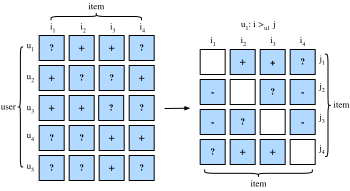

# Classement personnalisé pour les systèmes de recommandation

Dans les sections précédentes, seuls les commentaires explicites ont été pris en compte et les modèles ont été formés et testés sur les évaluations observées.  Ces méthodes présentent deux inconvénients : Premièrement, la plupart des commentaires ne sont pas explicites mais implicites dans les scénarios du monde réel, et les commentaires explicites peuvent être plus coûteux à collecter.  Deuxièmement, les paires utilisateur-article non observées qui peuvent être prédictives des intérêts des utilisateurs sont totalement ignorées, ce qui rend ces méthodes inadaptées aux cas où les évaluations ne sont pas manquantes au hasard mais en raison des préférences des utilisateurs.  Les paires utilisateur-article non observées sont un mélange de commentaires négatifs réels (les utilisateurs ne sont pas intéressés par les articles) et de valeurs manquantes (l'utilisateur pourrait interagir avec les articles à l'avenir). Nous ignorons simplement les paires non observées dans la factorisation matricielle et AutoRec. Il est clair que ces modèles sont incapables de faire la distinction entre les paires observées et non observées et ne sont généralement pas adaptés aux tâches de classement personnalisé.

À cette fin, une classe de modèles de recommandation visant à générer des listes de recommandations classées à partir de commentaires implicites a gagné en popularité. En général, les modèles de classement personnalisé peuvent être optimisés par des approches ponctuelles, par paires ou par listes. Les approches ponctuelles considèrent une seule interaction à la fois et entraînent un classifieur ou un régresseur pour prédire les préférences individuelles. La factorisation matricielle et AutoRec sont optimisés avec des objectifs ponctuels. Les approches par paire considèrent une paire d'éléments pour chaque utilisateur et visent à approximer l'ordre optimal pour cette paire. En général, les approches par paires sont plus adaptées à la tâche de classement car la prédiction de l'ordre relatif rappelle la nature du classement. Les approches par liste approchent l'ordre de la liste entière d'éléments, par exemple, en optimisant directement les mesures de classement telles que le gain cumulatif actualisé normalisé ([NDCG](https://en.wikipedia.org/wiki/Discounted_cumulative_gain)). Cependant, les approches par liste sont plus complexes et nécessitent plus de calculs que les approches par point ou par paire. Dans cette section, nous présenterons deux objectifs/pertes par paire, la perte de classement personnalisé bayésien et la perte de charnière, ainsi que leurs implémentations respectives.

## Perte de classement personnalisé bayésien et son implémentation

Classement personnalisé bayésien (BPR) :cite:`Rendle.Freudenthaler.Gantner.ea.2009` est une perte de classement personnalisé par paire qui est dérivée de l'estimateur du maximum postérieur. Elle a été largement utilisée dans de nombreux modèles de recommandation existants. Les données d'apprentissage du BPR sont constituées de paires positives et négatives (valeurs manquantes). Il suppose que l'utilisateur préfère l'élément positif à tous les autres éléments non observés.

De manière formelle, les données d'apprentissage sont construites par des tuples sous la forme de $(u, i, j)$, qui représente le fait que l'utilisateur $u$ préfère l'élément $i$ à l'élément $j$. La formulation bayésienne de BPR qui vise à maximiser la probabilité postérieure est donnée ci-dessous :

$$
p(\Theta \mid >_u )  \propto  p(>_u \mid \Theta) p(\Theta)
$$

Où $\Theta$ représente les paramètres d'un modèle de recommandation arbitraire, $>_u$ représente le classement total personnalisé souhaité de tous les articles pour l'utilisateur $u$. Nous pouvons formuler l'estimateur du maximum de probabilité postérieure pour dériver le critère d'optimisation générique pour la tâche de classement personnalisé.

$$
\begin{aligned}
\text{BPR-OPT} : &= \ln p(\Theta \mid >_u) \\
         & \propto \ln p(>_u \mid \Theta) p(\Theta) \\
         &= \ln \prod_{(u, i, j \in D)} \sigma(\hat{y}_{ui} - \hat{y}_{uj}) p(\Theta) \\
         &= \sum_{(u, i, j \in D)} \ln \sigma(\hat{y}_{ui} - \hat{y}_{uj}) + \ln p(\Theta) \\
         &= \sum_{(u, i, j \in D)} \ln \sigma(\hat{y}_{ui} - \hat{y}_{uj}) - \lambda_\Theta \|\Theta \|^2
\end{aligned}
$$


où $D := \{(u, i, j) \mid i \in I^+_u \wedge j \in I \backslash I^+_u \}$ est l'ensemble d'apprentissage, $I^+_u$ désignant les articles que l'utilisateur $u$ a aimés, $I$ désignant tous les articles et $I \backslash I^+_u$ indiquant tous les autres articles à l'exclusion de ceux que l'utilisateur a aimés. $\hat{y}_{ui}$ et $\hat{y}_{uj}$ sont les scores prédits de l'utilisateur $u$ aux articles $i$ et $j$, respectivement. L'antériorité $p(\Theta)$ est une distribution normale avec une moyenne nulle et une matrice de variance-covariance $\Sigma_\Theta$. Ici, nous laissons $\Sigma_\Theta = \lambda_\Theta I$.


Nous allons implémenter la classe de base `mxnet.gluon.loss.Loss` et remplacer la méthode `forward` pour construire la perte bayésienne de classement personnalisé. Nous commençons par importer la classe Loss et le module np.

```{.python .input  n=5}
#@tab mxnet
from mxnet import gluon, np, npx
npx.set_np()
```

L'implémentation de la perte BPR est la suivante.

```{.python .input  n=2}
#@tab mxnet
#@save
class BPRLoss(gluon.loss.Loss):
    def __init__(self, weight=None, batch_axis=0, **kwargs):
        super(BPRLoss, self).__init__(weight=None, batch_axis=0, **kwargs)

    def forward(self, positive, negative):
        distances = positive - negative
        loss = - np.sum(np.log(npx.sigmoid(distances)), 0, keepdims=True)
        return loss
```

## Perte charnière et son implémentation

La perte charnière pour le classement a une forme différente de la perte [hinge loss](https://mxnet.incubator.apache.org/api/python/gluon/loss.html#mxnet.gluon.loss.HingeLoss) fournie par la bibliothèque gluon qui est souvent utilisée dans les classifieurss tels que les SVM.  La perte utilisée pour le classement dans les systèmes de recommandation a la forme suivante.

$$
 \sum_{(u, i, j \in D)} \max( m - \hat{y}_{ui} + \hat{y}_{uj}, 0)
$$

où $m$ est la taille de la marge de sécurité. Elle vise à écarter les éléments négatifs des éléments positifs. Comme le BPR, elle vise à optimiser la distance pertinente entre les échantillons positifs et négatifs plutôt que les résultats absolus, ce qui la rend bien adaptée aux systèmes de recommandation.

```{.python .input  n=3}
#@tab mxnet
#@save
class HingeLossbRec(gluon.loss.Loss):
    def __init__(self, weight=None, batch_axis=0, **kwargs):
        super(HingeLossbRec, self).__init__(weight=None, batch_axis=0,
                                            **kwargs)

    def forward(self, positive, negative, margin=1):
        distances = positive - negative
        loss = np.sum(np.maximum(- distances + margin, 0))
        return loss
```

Ces deux pertes sont interchangeables pour le classement personnalisé dans la recommandation.

## Résumé

- Il existe trois types de pertes de classement disponibles pour la tâche de classement personnalisé dans les systèmes de recommandation, à savoir les méthodes par point, par paire et par liste.
- Les deux pertes par paire, la perte de classement personnalisé bayésien et la perte de charnière, peuvent être utilisées de manière interchangeable.

## Exercices

- Existe-t-il des variantes de BPR et de la perte charnière ?
- Pouvez-vous trouver des modèles de recommandation qui utilisent le BPR ou le hinge loss ?

:begin_tab:`mxnet`
[Discussions](https://discuss.d2l.ai/t/402)
:end_tab:
