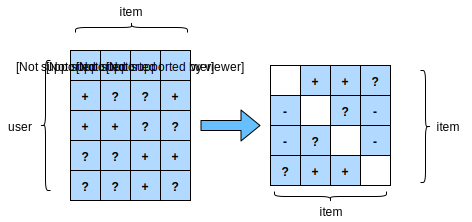

# Personalized Ranking for Recommender Systems

In the former sections, only explicit feedback are considered and models were trained and tested on observed ratings only.  There are two demerits of such methods: First, most feedback is not explicit but implicit in real-world scenarios.  Second,  non-observed user-item pairs which may be predictive for users' interests are totally ignored, making these methods unsuitable for cases where ratings are not missing at random.  Non-observed user-item pairs are a  mixture of real negative feedback (the user is not interested in the item) and missing values (the user might interact with the item in the future).  In the last two sections, we simple ignore the non-observed pairs. Clearly, these models are incapable of distinguish observed and non-observed pairs. 

In general,  learning to rank models can be optimized with pointwise, pairwise or Listwise approaches.  Pointwise approaches loot at a single interaction at a time and train a classifier/regressor to predict individual preferences.  Models in the last two sections are  based on pointwise objectives.   Pairwise approaches consider a pair of items for each user and aim to approximate the optimal ordering for that pair. Usually, pairwise approaches are more suitable for the ranking task because predicting relative order is reminiscent to the nature of ranking. Listwise approaches  approximate the ordering of the entire list of items, for example, direct optimizing  the ranking measures such as NDCG. However, Listwise approaches are more complex and compute-intensive than pointwise or pairwise approaches. In this section, we will introduce two pairwise objectives, Bayesian Personalized Ranking  loss and Hinge loss, and their implementations. 


## Bayesian Personalized Ranking Loss and its Implementation

Bayesian personalized ranking (BPR) is a pairwise personalized ranking loss that are derived from the maximum posterior estimator. It has been widely used in many existing recommendation models. The training data of BPR consists of both positive and negative pairs and missing values. It assumes that the user prefers the positive item over all other non-observed items. 

In formal,  the training data is constructed by tuples in the form of $(u, i, j)$, which represents that user $u$ prefers item $i$ over $j$.

The Bayesian formulation of BPR which aims to maximize the posterior probability is given below:
$$
p(\Theta | >_u )  =  p(>_u|\Theta) p(\Theta)
$$
Where $>_u$ represents the desired personalized total ranking of all items for user $u$.  Where, we
$$
BPR-OPT := \ln p(\theta|>_u) \\
         = \ln p(>_u | \theta) p(\theta) \\
         = \ln \prod_{(u, i, j \in D)} \sigma(\hat{y}_{uij}) p(\theta) \\
         = \sum_{(u, i, j \in D)} \ln(\hat{y}_{uij}) + \ln p(\theta) \\
         = \sum_{(u, i, j \in D)} \ln(\hat{y}_{uij}) - \lambda_\theta \parallel\theta \parallel^2
$$
The prior $p(\theta)$ is a normal distribution with zero mean and variance-covariance matrix $\sum_\theta$. 




We will implement the base class  `mxnet.gluon.loss.Loss`and override the `hybrid_forward` method to construct symbolic graph for the block. We beigin by importing the Loss class and the np module.

```{.python .input  n=3}
from mxnet.gluon.loss import Loss
from mxnet import np, npx
```

The implementation of BPR loss is as follows.

```{.python .input  n=4}
# Save to the d2l package.
class BPRLoss(Loss):
    def __init__(self, weight=None, batch_axis=0, **kwargs):
        super(BPRLoss, self).__init__(weight=None, batch_axis=0, **kwargs)

    def hybrid_forward(self, F, positive, negative):
        distances = positive - negative
        loss = - F.sum(F.log(F.sigmoid(distances)), 1, keepdims=True)
        return loss
```

## Hinge Loss and its Implementation

The Hinge Loss  for ranking has different forms to the [hinge loss](https://mxnet.incubator.apache.org/api/python/gluon/loss.html#mxnet.gluon.loss.HingeLoss) provided within the gluon library that is often used in classifiers such as SVMs.  The loss used for ranking in recommender systems has the following form. 
$$
loss = \sum(\max( m - y_{ui} + y_{uj}), 0)
$$
where $m$ is the safety margin size. It aims to push negative items away from positive items.   Its approach of optimizing for relevant distance instead of absolute outputs makes it well suited to recommenders.

```{.python .input  n=7}
# Save to the d2l package.
class HingeLossbRec(Loss):
    def __init__(self, weight=None, batch_axis=0, **kwargs):
        super(HingeLossbRec, self).__init__(weight=None, batch_axis=0, 
                                            **kwargs)

    def hybrid_forward(self, F, positive, negative, margin):
        distances = positive - negative
        loss = F.sum(np.maximum( - distances + margin, 0))
        return loss
```

Both losses are interchangeable for personalized ranking in recommendation. 

## Summary

- There are three types of ranking losses available for ranking in recommenders, namely, pointwise, pairwise and listwise methods.
- The two pairwise loses: Bayesian personalized ranking loss and hinge loss, can be used interchangeably.


## Exercise 

- Are there any variants of BPR and hinge loss available?
- What are the differences between pointwise, pairwise and listwise approaches?
