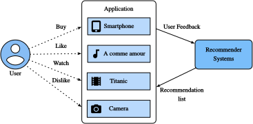

# Overview of Recommender Systems


In the last decade, the Internet has evolved into a platform for large-scale online services, which profoundly changed the way we communicate, read news, buy products, and watch movies.  In the meanwhile, the unprecedented number of items (we use the term *item* to refer to movies, news, books, and products.) offered online requires a system that can help us discover items that we preferred. Recommender systems are therefore powerful information filtering tools that can facilitate personalized services and provide tailored experience to individual users. In short, recommender systems play a pivotal role in utilizing the wealth of data available to make choices manageable. Nowadays, recommender systems are at the core of a number of online services providers such as Amazon, Netflix, and YouTube. Recall the example of Deep learning books recommended by Amazon in :numref:`subsec_recommender_systems`. The benefits of employing recommender systems are two-folds: On the one hand, it can largely reduce users' effort in finding items and alleviate the issue of information overload. On the other hand, it can add business value to  online
service providers and is an important source of revenue.  This chapter will introduce the fundamental concepts, classic models and recent advances with deep learning in the field of recommender systems, together with implemented examples.




## Collaborative Filtering

We start the journey with the important concept in recommender systems---collaborative filtering
(CF), which was first coined by the Tapestry system :cite:`Goldberg.Nichols.Oki.ea.1992`, referring to "people collaborate to help one another perform the filtering process  in order to handle the large amounts of email and messages posted to newsgroups". This term has been enriched with more senses. In a broad sense, it is the process of
filtering for information or patterns using techniques involving collaboration among multiple users, agents, and data sources. CF has many forms and numerous CF methods proposed since its advent.  

Overall, CF techniques can be categorized into: memory-based CF, model-based CF, and their hybrid :cite:`Su.Khoshgoftaar.2009`. Representative memory-based CF techniques are nearest neighbor-based CF such as user-based CF and item-based CF.  Latent factor models such as matrix factorization are examples of model-based CF.  Memory-based CF has limitations in dealing with sparse and large-scale data since it computes the similarity values based on common items.  Model-based methods become more popular with its
better capability in dealing with sparsity and scalability.  Many model-based CF approaches can be extended with neural networks, leading to more flexible and scalable models with the computation acceleration in deep learning :cite:`Zhang.Yao.Sun.ea.2019`.  In general, CF only uses the user-item interaction data to make predictions and recommendations. Besides CF, content-based and context-based recommender systems are also useful in incorporating the content descriptions of items/users and contextual signals such as timestamps and locations.  Obviously, we may need to adjust the model types/structures when different input data is available.


## Explicit Feedback and Implicit Feedback

To learn the preference of users, the system shall collect feedback from them.  The feedback can be either explicit or implicit. For example, [IMDB](https://www.imdb.com/) collects star ratings ranging from one to ten stars for movies. YouTube provides the thumbs-up and thumbs-down buttons for users to show their preferences.  It is apparent that gathering explicit feedback requires users to indicate their interests proactively.  Nonetheless, explicit feedback is not always readily available as many users may be reluctant to rate products. Relatively speaking, implicit feedback is often readily available since it is mainly concerned with modeling implicit behavior such user clicks. As such, many recommender systems are centered on implicit feedback which indirectly reflects user's opinion through observing user behavior.  There are diverse forms of implicit feedback including purchase history, browsing history, watches and even mouse movements. For example, a user that purchased many books by the same author probably likes that author.   Note that implicit feedback is inherently noisy.  We can only *guess* their preferences and true motives. A user watched a movie does not necessarily indicate a positive view of that movie.


## Recommendation Tasks

A number of recommendation tasks have been investigated in the past decades.  Based on the domain of applications, there are movies recommendation, news recommendations, point-of-interest recommendation and so forth.  It is also possible to differentiate the tasks based on the types of feedback and input data, for example, the rating prediction task aims to predict the explicit ratings. Top-$n$ recommendation (item ranking) ranks all items for each user personally based on the implicit feedback. If timestamp information is also included, we can build sequence-aware recommendation.  Another popular task is called click-through rate prediction, which is also based on implicit feedback, but various categorical features can be utilized.  


## Summary

* Recommender systems are important for individual users and industries. Collaborative filtering is a key concept in recommendation.
* There are two types of feedbacks: implicit feedback and explicit feedback.  A number recommendation tasks have been explored during the last decade.

## Exercises

1. Can you explain how recommender systems influence your daily life?
2. What interesting recommendation tasks do you think can be investigated?

## [Discussions](https://discuss.mxnet.io/t/5158)


```{.python .input}

```
