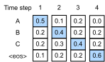

# Beam Search
:label:`sec_beam-search`

In :numref:`sec_seq2seq`, 
we introduced the encoder-decoder architecture,
and the standard techniques for training them end-to-end. However, when it came to test-time prediction,
we mentioned only the *greedy* strategy,
where we select at each time step 
the token given the highest 
predicted probability of coming next, 
until, at some time step, 
we find that we have predicted
the special end-of-sequence "&lt;eos&gt;" token.
In this section, we will begin 
by formalizing this *greedy search* strategy
and identifying some problems 
that practitioners tend to run into.
Subsequently, we compare this strategy
with two alternatives:
*exhaustive search* (illustrative but not practical)
and *beam search* (the standard method in practice).

Let's begin by setting up our mathematical notation,
borrowing conventions from :numref:`sec_seq2seq`.
At any time step $t'$, the decoder outputs 
predictions representing the probability 
of each token in the vocabulary 
coming next in the sequence 
(the likely value of $y_{t'+1}$, 
conditioned on the previous tokens
$y_1, \ldots, y_{t'}$ and 
the context variable $\mathbf{c}$,
produced by the encoder 
to represent the input sequence.
To quantify computational cost,
denote by $\mathcal{Y}$
the output vocabulary 
(including the special end-of-sequence token "&lt;eos&gt;").
Let's also specify the maximum number of tokens
of an output sequence as $T'$.
Our goal is to search for an ideal output from all 
$\mathcal{O}(\left|\mathcal{Y}\right|^{T'})$
possible output sequences.
Note that this slightly overestimates 
the number of distinct outputs 
because there are no subsequent tokens
after the  "&lt;eos&gt;" token occurs.
However, for our purposes, 
this number roughly captures 
the size of the search space.

## Greedy Search

Consider the simple *greedy search* strategy from :numref:`sec_seq2seq`.
Here, at any time step $t'$, 
we simply select the token 
with the highest conditional probability
from $\mathcal{Y}$, i.e., 

$$y_{t'} = \operatorname*{argmax}_{y \in \mathcal{Y}} P(y \mid y_1, \ldots, y_{t'-1}, \mathbf{c}).$$

Once our model outputs "&lt;eos&gt;" 
(or we reach the maximum length $T'$)
the output sequence is completed.

This strategy might look reasonable, 
and in fact it's not so bad!
Considering how computationally undemanding it is,
you'd be hard pressed to get more bang for your buck. 
However, if we put aside efficiency for a minute,
it might seem more reasonable to search 
for the *most likely sequence*, 
not the sequence of (greedily selected) *most likely tokens*.
It turns out that these two objects can be quite different. 
The most likely sequence is the one that maximizes the expression
$\prod_{t'=1}^{T'} P(y_{t'} \mid y_1, \ldots, y_{t'-1}, \mathbf{c})$.
In our machine translation example,
if the decoder truly recovered the probabilities
of the underlying generative process, 
then this would give us the most likely translation.
Unfortunately, there is no guarantee 
that greedy search will give us this sequence.

Let's illustrate it with an example.
Suppose that there are four tokens 
"A", "B", "C", and "&lt;eos&gt;" in the output dictionary.
In :numref:`fig_s2s-prob1`,
the four numbers under each time step represent
the conditional probabilities of generating "A", "B", "C", 
and "&lt;eos&gt;" at that time step, respectively.

:label:`fig_s2s-prob1`

At each time step, greedy search selects 
the token with the highest conditional probability. 
Therefore, the output sequence "A", "B", "C", and "&lt;eos&gt;" 
will be predicted (:numref:`fig_s2s-prob1`). 
The conditional probability of this output sequence
is $0.5\times0.4\times0.4\times0.6 = 0.048$.

Next, let's look at another example in :numref:`fig_s2s-prob2`. 
Unlike in :numref:`fig_s2s-prob1`, 
at time step 2 we select the token "C"
in :numref:`fig_s2s-prob2`, 
which has the *second* highest conditional probability.

:label:`fig_s2s-prob2`

Since the output subsequences at time steps 1 and 2, 
on which time step 3 is based, 
have changed from "A" and "B" in :numref:`fig_s2s-prob1` 
to "A" and "C" in :numref:`fig_s2s-prob2`, 
the conditional probability of each token 
at time step 3 has also changed in :numref:`fig_s2s-prob2`. 
Suppose that we choose the token "B" at time step 3. 
Now time step 4 is conditional on
the output subsequence at the first three time steps
"A", "C", and "B", 
which is different from "A", "B", and "C" in :numref:`fig_s2s-prob1`. 
Therefore, the conditional probability of generating 
each token at time step 4 in :numref:`fig_s2s-prob2` 
is also different from that in :numref:`fig_s2s-prob1`. 
As a result, the conditional probability of the output sequence 
"A", "C", "B", and "&lt;eos&gt;" in :numref:`fig_s2s-prob2`
is $0.5\times0.3 \times0.6\times0.6=0.054$, 
which is greater than that of greedy search in :numref:`fig_s2s-prob1`. 
In this example, the output sequence "A", "B", "C", and "&lt;eos&gt;" 
obtained by the greedy search is not the optimal sequence.

## Exhaustive Search

If the goal is to obtain the most likely sequence, 
we may consider using *exhaustive search*: 
exhaustively enumerate all the possible output sequences 
with their conditional probabilities,
and then output the one that scores 
the highest predicted probability.

While this would certainly give us what we desire,
it would come at a prohibitive computational cost 
of $\mathcal{O}(\left|\mathcal{Y}\right|^{T'})$,
exponential in the sequence length and with an enormous
base given by the vocabulary size.
For example, when $|\mathcal{Y}|=10000$ and $T'=10$, 
we will need to evaluate $10000^{10} = 10^{40}$ sequences. 
These are small numbers compared to real applications
but already beyond the capabilities any foreseeable computers.
On the other hand, the computational cost of greedy search is 
$\mathcal{O}(\left|\mathcal{Y}\right|T')$: 
miraculously cheap but far from optimal.
For example, when $|\mathcal{Y}|=10000$ and $T'=10$, 
we only need to evaluate $10000\times10=10^5$ sequences.

## Beam Search

You could view sequence decoding strategies as lying on a spectrum,
with *beam search* striking a compromise 
between the efficiency of greedy search
and the optimality of exhaustive search.
The most straightforward version of beam search 
is characterized by a single hyperparameter,
the *beam size*, $k$. 
At time step 1, we select the $k$ tokens 
with the highest predicted probabilities.
Each of them will be the first token of 
$k$ candidate output sequences, respectively.
At each subsequent time step, 
based on the $k$ candidate output sequences
at the previous time step,
we continue to select $k$ candidate output sequences 
with the highest predicted probabilities 
from $k\left|\mathcal{Y}\right|$ possible choices.

:label:`fig_beam-search`

:numref:`fig_beam-search` demonstrates the 
process of beam search with an example. 
Suppose that the output vocabulary
contains only five elements: 
$\mathcal{Y} = \{A, B, C, D, E\}$, 
where one of them is “&lt;eos&gt;”. 
Let the beam size be 2 and 
the maximum length of an output sequence be 3. 
At time step 1, 
suppose that the tokens with the highest conditional probabilities 
$P(y_1 \mid \mathbf{c})$ are $A$ and $C$. 
At time step 2, for all $y_2 \in \mathcal{Y},$ 
we compute 

$$\begin{aligned}P(A, y_2 \mid \mathbf{c}) = P(A \mid \mathbf{c})P(y_2 \mid A, \mathbf{c}),\\ P(C, y_2 \mid \mathbf{c}) = P(C \mid \mathbf{c})P(y_2 \mid C, \mathbf{c}),\end{aligned}$$  

and pick the largest two among these ten values, say
$P(A, B \mid \mathbf{c})$ and $P(C, E \mid \mathbf{c})$.
Then at time step 3, for all $y_3 \in \mathcal{Y}$, we compute 

$$\begin{aligned}P(A, B, y_3 \mid \mathbf{c}) = P(A, B \mid \mathbf{c})P(y_3 \mid A, B, \mathbf{c}),\\P(C, E, y_3 \mid \mathbf{c}) = P(C, E \mid \mathbf{c})P(y_3 \mid C, E, \mathbf{c}),\end{aligned}$$ 

and pick the largest two among these ten values, say 
$P(A, B, D \mid \mathbf{c})$   and  $P(C, E, D \mid  \mathbf{c}).$
As a result, we get six candidates output sequences: 
(i) $A$; (ii) $C$; (iii) $A$, $B$; (iv) $C$, $E$; (v) $A$, $B$, $D$; and (vi) $C$, $E$, $D$. 

In the end, we obtain the set of final candidate output sequences 
based on these six sequences (e.g., discard portions including and after “&lt;eos&gt;”).
Then we choose the sequence with the highest 
of the following score as the output sequence:

$$ \frac{1}{L^\alpha} \log P(y_1, \ldots, y_{L}\mid \mathbf{c}) = \frac{1}{L^\alpha} \sum_{t'=1}^L \log P(y_{t'} \mid y_1, \ldots, y_{t'-1}, \mathbf{c}),$$
:eqlabel:`eq_beam-search-score`

where $L$ is the length of the final candidate sequence 
and $\alpha$ is usually set to 0.75. 
Since a longer sequence has more logarithmic terms 
in the summation of :eqref:`eq_beam-search-score`,
the term $L^\alpha$ in the denominator penalizes
long sequences.

The computational cost of beam search is $\mathcal{O}(k\left|\mathcal{Y}\right|T')$. 
This result is in between that of greedy search and that of exhaustive search.
Greedy search can be treated as a special case of beam search 
arising when the beam size is set to 1.

## Summary

Sequence searching strategies include 
greedy search, exhaustive search, and beam search.
Beam search provides a tradeoff between accuracy versus 
computational cost via its flexible choice of the beam size.

## Exercises

1. Can we treat exhaustive search as a special type of beam search? Why or why not?
1. Apply beam search in the machine translation problem in :numref:`sec_seq2seq`. How does the beam size affect the translation results and the prediction speed?
1. We used language modeling for generating text following  user-provided prefixes in :numref:`sec_rnn-scratch`. Which kind of search strategy does it use? Can you improve it?

[Discussions](https://discuss.d2l.ai/t/338)
