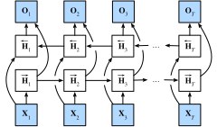

# Réseaux neuronaux récurrents bidirectionnels
:label:`sec_bi_rnn` 

Dans l'apprentissage séquentiel,
nous avons supposé jusqu'à présent que notre objectif était de modéliser la sortie suivante en fonction de ce que nous avons vu jusqu'à présent, par exemple dans le contexte d'une série temporelle ou d'un modèle de langage. Bien que ce soit un scénario typique, ce n'est pas le seul que nous pouvons rencontrer. Pour illustrer le problème, considérons les trois tâches suivantes consistant à remplir les blancs dans une séquence de texte :

* Je suis `___`.
* Je suis `___` affamé.
* Je suis `___` affamé, et je peux manger la moitié d'un cochon.

Selon la quantité d'informations disponibles, nous pourrions remplir les blancs avec des mots très différents tels que "heureux", "pas" et "très".
Il est clair que la fin de la phrase (si elle est disponible) transmet des informations importantes sur le mot à choisir.
Un modèle de séquence incapable d'en tirer parti aura des performances médiocres dans les tâches connexes.
Par exemple, pour obtenir de bons résultats dans la reconnaissance d'entités nommées (par exemple, pour reconnaître si "vert" fait référence à "M. Vert" ou à la couleur)
le contexte à plus longue portée est tout aussi vital.
Afin de nous inspirer pour aborder ce problème, faisons un détour par les modèles graphiques probabilistes.


## Programmation dynamique dans les modèles de Markov cachés

Cette sous-section sert à illustrer le problème de la programmation dynamique. Les détails techniques spécifiques n'ont pas d'importance pour la compréhension des modèles d'apprentissage profond
mais ils aident à motiver l'utilisation de l'apprentissage profond et le choix d'architectures spécifiques.

Si nous voulons résoudre le problème à l'aide de modèles graphiques probabilistes, nous pourrions par exemple concevoir un modèle à variables latentes comme suit.
À chaque pas de temps $t$,
nous supposons qu'il existe une variable latente $h_t$ qui régit notre émission observée $x_t$ via $P(x_t \mid h_t)$.
De plus, toute transition $h_t \to h_{t+1}$ est donnée par une certaine probabilité de transition d'état $P(h_{t+1} \mid h_{t})$. Ce modèle graphique probabiliste est alors un *modèle de Markov caché* comme dans :numref:`fig_hmm`.


:label:`fig_hmm`

Ainsi,
pour une séquence d'observations $T$, nous avons la distribution de probabilité conjointe suivante sur les états observés et cachés :

$$P(x_1, \ldots, x_T, h_1, \ldots, h_T) = \prod_{t=1}^T P(h_t \mid h_{t-1}) P(x_t \mid h_t), \text{ where } P(h_1 \mid h_0) = P(h_1).$$ 
:eqlabel:`eq_hmm_jointP` 

 
Supposons maintenant que nous observons tous les $x_i$ à l'exception de certains $x_j$ et que notre objectif est de calculer $P(x_j \mid x_{-j})$, où $x_{-j} = (x_1, \ldots, x_{j-1}, x_{j+1}, \ldots, x_{T})$.
Puisqu'il n'y a pas de variable latente
dans $P(x_j \mid x_{-j})$,
nous envisageons d'additionner sur
toutes les combinaisons possibles de choix pour $h_1, \ldots, h_T$.
Dans le cas où toute $h_i$ peut prendre $k$ valeurs distinctes (un nombre fini d'états), cela signifie que nous devons faire la somme de $k^T$ termes----mission généralement impossible ! Heureusement, il existe une solution élégante à ce problème : la *programmation dynamique*.

Pour voir comment cela fonctionne,
envisagez de faire la somme des variables latentes
$h_1, \ldots, h_T$ à tour de rôle.
D'après :eqref:`eq_hmm_jointP`,
cela donne :

$$\begin{aligned}
    &P(x_1, \ldots, x_T) \\
    =& \sum_{h_1, \ldots, h_T} P(x_1, \ldots, x_T, h_1, \ldots, h_T) \\
    =& \sum_{h_1, \ldots, h_T} \prod_{t=1}^T P(h_t \mid h_{t-1}) P(x_t \mid h_t) \\
    =& \sum_{h_2, \ldots, h_T} \underbrace{\left[\sum_{h_1} P(h_1) P(x_1 \mid h_1) P(h_2 \mid h_1)\right]}_{\pi_2(h_2) \stackrel{\mathrm{def}}{=}}
    P(x_2 \mid h_2) \prod_{t=3}^T P(h_t \mid h_{t-1}) P(x_t \mid h_t) \\
    =& \sum_{h_3, \ldots, h_T} \underbrace{\left[\sum_{h_2} \pi_2(h_2) P(x_2 \mid h_2) P(h_3 \mid h_2)\right]}_{\pi_3(h_3)\stackrel{\mathrm{def}}{=}}
    P(x_3 \mid h_3) \prod_{t=4}^T P(h_t \mid h_{t-1}) P(x_t \mid h_t)\\
    =& \dots \\
    =& \sum_{h_T} \pi_T(h_T) P(x_T \mid h_T).
\end{aligned}$$

En général, nous avons la *récursion avant* comme

$$\pi_{t+1}(h_{t+1}) = \sum_{h_t} \pi_t(h_t) P(x_t \mid h_t) P(h_{t+1} \mid h_t).$$ 

La récursion est initialisée comme $\pi_1(h_1) = P(h_1)$. En termes abstraits, on peut l'écrire sous la forme $\pi_{t+1} = f(\pi_t, x_t)$, où $f$ est une fonction apprenable. Cela ressemble beaucoup à l'équation de mise à jour des modèles à variables latentes dont nous avons parlé jusqu'à présent dans le contexte des RNN !

De manière tout à fait analogue à la récursion avant,
nous pouvons également
faire la somme sur le même ensemble de variables latentes avec une récursion arrière. Cela donne :

$$\begin{aligned}
    & P(x_1, \ldots, x_T) \\
     =& \sum_{h_1, \ldots, h_T} P(x_1, \ldots, x_T, h_1, \ldots, h_T) \\
    =& \sum_{h_1, \ldots, h_T} \prod_{t=1}^{T-1} P(h_t \mid h_{t-1}) P(x_t \mid h_t) \cdot P(h_T \mid h_{T-1}) P(x_T \mid h_T) \\
    =& \sum_{h_1, \ldots, h_{T-1}} \prod_{t=1}^{T-1} P(h_t \mid h_{t-1}) P(x_t \mid h_t) \cdot
    \underbrace{\left[\sum_{h_T} P(h_T \mid h_{T-1}) P(x_T \mid h_T)\right]}_{\rho_{T-1}(h_{T-1})\stackrel{\mathrm{def}}{=}} \\
    =& \sum_{h_1, \ldots, h_{T-2}} \prod_{t=1}^{T-2} P(h_t \mid h_{t-1}) P(x_t \mid h_t) \cdot
    \underbrace{\left[\sum_{h_{T-1}} P(h_{T-1} \mid h_{T-2}) P(x_{T-1} \mid h_{T-1}) \rho_{T-1}(h_{T-1}) \right]}_{\rho_{T-2}(h_{T-2})\stackrel{\mathrm{def}}{=}} \\
    =& \ldots \\
    =& \sum_{h_1} P(h_1) P(x_1 \mid h_1)\rho_{1}(h_{1}).
\end{aligned}$$


Nous pouvons donc écrire la *récursion arrière* comme suit :

$$\rho_{t-1}(h_{t-1})= \sum_{h_{t}} P(h_{t} \mid h_{t-1}) P(x_{t} \mid h_{t}) \rho_{t}(h_{t}),$$ 

avec initialisation $\rho_T(h_T) = 1$.
Les récursions avant et arrière nous permettent de faire la somme des variables latentes $T$ en temps (linéaire) $\mathcal{O}(kT)$ sur toutes les valeurs de $(h_1, \ldots, h_T)$ plutôt qu'en temps exponentiel.
C'est l'un des grands avantages de l'inférence probabiliste avec les modèles graphiques.
C'est
également une instance très spéciale de
un algorithme général de passage de messages :cite:`Aji.McEliece.2000`.
En combinant les récursions avant et arrière, nous sommes en mesure de calculer

$$P(x_j \mid x_{-j}) \propto \sum_{h_j} \pi_j(h_j) \rho_j(h_j) P(x_j \mid h_j).$$ 

Notez qu'en termes abstraits, la récursion arrière peut être écrite sous la forme $\rho_{t-1} = g(\rho_t, x_t)$, où $g$ est une fonction apprenable. Encore une fois, cela ressemble beaucoup à une équation de mise à jour, mais avec un retour en arrière, contrairement à ce que nous avons vu jusqu'à présent dans les RNN. En effet, les modèles de Markov cachés bénéficient de la connaissance des données futures lorsqu'elles sont disponibles. Les scientifiques spécialisés dans le traitement des signaux font la distinction entre les deux cas de connaissance et d'ignorance des observations futures : interpolation et extrapolation.
Voir le chapitre d'introduction du livre sur les algorithmes séquentiels de Monte Carlo pour plus de détails :cite:`Doucet.De-Freitas.Gordon.2001`.


## Modèle bidirectionnel

Si nous voulons disposer d'un mécanisme dans les RNN qui offre une capacité d'anticipation comparable à celle des modèles de Markov cachés, nous devons modifier la conception des RNN que nous avons vue jusqu'à présent. Heureusement, cela est facile d'un point de vue conceptuel. Au lieu d'exécuter un RNN uniquement en mode avant à partir du premier jeton, nous en lançons un autre à partir du dernier jeton, de l'arrière vers l'avant.
*Les RNN bidirectionnels* ajoutent une couche cachée qui transmet les informations dans le sens inverse afin de traiter ces informations de manière plus flexible. :numref:`fig_birnn` illustre l'architecture d'un RNN bidirectionnel avec une seule couche cachée.


:label:`fig_birnn`

En fait, cela n'est pas très différent des récursions avant et arrière dans la programmation dynamique des modèles de Markov cachés.
La principale distinction est que dans le cas précédent, ces équations avaient une signification statistique spécifique.
Aujourd'hui, elles sont dépourvues de telles interprétations facilement accessibles et nous pouvons simplement les traiter comme des fonctions génériques et apprenables
.
Cette transition incarne bon nombre des principes qui guident la conception des réseaux profonds modernes : d'abord, utiliser le type de dépendances fonctionnelles des modèles statistiques classiques, puis les paramétrer sous une forme générique.


#### Définition

Les RNN bidirectionnels ont été introduits par :cite:`Schuster.Paliwal.1997`.
Pour une discussion détaillée des différentes architectures, voir également l'article :cite:`Graves.Schmidhuber.2005`.
Examinons les spécificités d'un tel réseau.


Pour n'importe quel pas de temps $t$,
étant donné une entrée de minibatch $\mathbf{X}_t \in \mathbb{R}^{n \times d}$ (nombre d'exemples : $n$, nombre d'entrées dans chaque exemple : $d$) et que la fonction d'activation de la couche cachée est $\phi$. Dans l'architecture bidirectionnelle, nous supposons que les états cachés avant et arrière pour ce pas de temps sont respectivement $\overrightarrow{\mathbf{H}}_t  \in \mathbb{R}^{n \times h}$ et $\overleftarrow{\mathbf{H}}_t  \in \mathbb{R}^{n \times h}$,
où $h$ est le nombre d'unités cachées.
Les mises à jour des états cachés avant et arrière sont les suivantes :


$$
\begin{aligned}
\overrightarrow{\mathbf{H}}_t &= \phi(\mathbf{X}_t \mathbf{W}_{xh}^{(f)} + \overrightarrow{\mathbf{H}}_{t-1} \mathbf{W}_{hh}^{(f)}  + \mathbf{b}_h^{(f)}),\\
\overleftarrow{\mathbf{H}}_t &= \phi(\mathbf{X}_t \mathbf{W}_{xh}^{(b)} + \overleftarrow{\mathbf{H}}_{t+1} \mathbf{W}_{hh}^{(b)}  + \mathbf{b}_h^{(b)}),
\end{aligned}
$$

où les poids $\mathbf{W}_{xh}^{(f)} \in \mathbb{R}^{d \times h}, \mathbf{W}_{hh}^{(f)} \in \mathbb{R}^{h \times h}, \mathbf{W}_{xh}^{(b)} \in \mathbb{R}^{d \times h}, \text{ and } \mathbf{W}_{hh}^{(b)} \in \mathbb{R}^{h \times h}$, et les biais $\mathbf{b}_h^{(f)} \in \mathbb{R}^{1 \times h} \text{ and } \mathbf{b}_h^{(b)} \in \mathbb{R}^{1 \times h}$ sont tous les paramètres du modèle.

Ensuite, nous concaténons les états cachés avant et arrière $\overrightarrow{\mathbf{H}}_t$ et $\overleftarrow{\mathbf{H}}_t$
pour obtenir l'état caché $\mathbf{H}_t \in \mathbb{R}^{n \times 2h}$ à introduire dans la couche de sortie.
Dans les RNN bidirectionnels profonds avec plusieurs couches cachées,
ces informations
sont transmises comme *entrée* à la couche bidirectionnelle suivante. Enfin, la couche de sortie calcule la sortie $\mathbf{O}_t \in \mathbb{R}^{n \times q}$ (nombre de sorties : $q$) :

$$\mathbf{O}_t = \mathbf{H}_t \mathbf{W}_{hq} + \mathbf{b}_q.$$ 

Ici, la matrice de poids $\mathbf{W}_{hq} \in \mathbb{R}^{2h \times q}$ et le biais $\mathbf{b}_q \in \mathbb{R}^{1 \times q}$ sont les paramètres du modèle de la couche de sortie. En fait, les deux directions peuvent avoir un nombre différent d'unités cachées.

### Coût de calcul et applications

L'une des principales caractéristiques d'un RNN bidirectionnel est que les informations des deux extrémités de la séquence sont utilisées pour estimer la sortie. En d'autres termes, nous utilisons les informations des observations passées et futures pour prédire l'observation actuelle.
Dans le cas de la prédiction du prochain jeton, ce n'est pas tout à fait ce que nous voulons.
Après tout, nous n'avons pas le luxe de connaître le jeton suivant pour prédire le suivant. Par conséquent, si nous utilisions naïvement un RNN bidirectionnel, nous n'obtiendrions pas une très bonne précision : pendant la formation, nous disposons de données passées et futures pour estimer le présent. Au moment du test, nous ne disposons que des données passées et la précision est donc médiocre. Nous allons illustrer cela dans une expérience ci-dessous.

Pour ajouter l'insulte à la blessure, les RNN bidirectionnels sont également excessivement lents.
Les principales raisons en sont que
la propagation avant
nécessite des récursions avant et arrière
dans les couches bidirectionnelles
et que la rétropropagation dépend des résultats de la propagation avant. Par conséquent, les gradients auront une très longue chaîne de dépendance.

Dans la pratique, les couches bidirectionnelles sont utilisées très parcimonieusement et uniquement pour un ensemble étroit d'applications, telles que le remplissage de mots manquants, l'annotation de tokens (par exemple, pour la reconnaissance d'entités nommées) et l'encodage de séquences en gros comme étape d'un pipeline de traitement de séquences (par exemple, pour la traduction automatique).
Dans :numref:`sec_bert` et :numref:`sec_sentiment_rnn`,
nous présenterons comment utiliser les RNN bidirectionnels
pour encoder des séquences de texte.

```{.python .input}
%load_ext d2lbook.tab
tab.interact_select('mxnet', 'pytorch', 'tensorflow')
```

```{.python .input}
%%tab mxnet
from d2l import mxnet as d2l
from mxnet import npx, np
from mxnet.gluon import rnn
npx.set_np()
```

```{.python .input}
%%tab pytorch
from d2l import torch as d2l
import torch
from torch import nn
```

```{.python .input}
%%tab tensorflow
from d2l import tensorflow as d2l
import tensorflow as tf
```

## (**Training a Bidirectional RNN for a Wrong Application**)

Si nous devions ignorer tous les conseils concernant le fait que les RNN bidirectionnels utilisent des données passées et futures et les appliquer simplement aux modèles de langage, nous obtiendrions des estimations avec une perplexité acceptable. Néanmoins, la capacité du modèle à prédire les tokens futurs est gravement compromise, comme l'illustre l'expérience ci-dessous. Malgré une perplexité raisonnable, il ne génère que du charabia, même après de nombreuses itérations. Nous incluons le code ci-dessous à titre d'exemple pour éviter de l'utiliser dans un mauvais contexte.


### Implémentation à partir de zéro

Pour implémenter un RNN bidirectionnel à partir de zéro, nous pouvons
inclure deux instances `RNNScratch` unidirectionnelles
avec des paramètres apprenables séparés.

```{.python .input}
%%tab all
class BiRNNScratch(d2l.Module):
    def __init__(self, num_inputs, num_hiddens, sigma=0.01):
        super().__init__()
        self.save_hyperparameters()
        self.f_rnn = d2l.RNNScratch(num_inputs, num_hiddens, sigma)
        self.b_rnn = d2l.RNNScratch(num_inputs, num_hiddens, sigma)
        self.num_hiddens *= 2  # The output dimension will be doubled
```

Les états des RNN avant et arrière
sont mis à jour séparément,
tandis que les sorties de ces deux RNN sont concaténées.

```{.python .input}
%%tab all
@d2l.add_to_class(BiRNNScratch)
def forward(self, inputs, Hs=None):
    f_H, b_H = Hs if Hs is not None else (None, None)
    f_outputs, f_H = self.f_rnn(inputs, f_H)
    b_outputs, b_H = self.b_rnn(reversed(inputs), b_H)
    outputs = [d2l.concat((f, b), -1) for f, b in zip(f_outputs, b_outputs)]
    return outputs, (f_H, b_H)
```

La procédure d'apprentissage est la même
que dans :numref:`sec_rnn-scratch`.

```{.python .input}
%%tab all
data = d2l.TimeMachine(batch_size=1024, num_steps=32)
if tab.selected('mxnet', 'pytorch'):
    birnn = BiRNNScratch(num_inputs=len(data.vocab), num_hiddens=32)
    model = d2l.RNNLMScratch(birnn, vocab_size=len(data.vocab), lr=2)
    trainer = d2l.Trainer(max_epochs=50, gradient_clip_val=1, num_gpus=1)
if tab.selected('tensorflow'):
    with d2l.try_gpu():
        birnn = BiRNNScratch(num_inputs=len(data.vocab), num_hiddens=32)
        model = d2l.RNNLMScratch(birnn, vocab_size=len(data.vocab), lr=2)
    trainer = d2l.Trainer(max_epochs=50, gradient_clip_val=1)
trainer.fit(model, data)
```

### Mise en œuvre concise

En utilisant les API de haut niveau,
nous pouvons mettre en œuvre les RNN bidirectionnels de manière plus concise.
Nous prenons ici un modèle GRU comme exemple.

```{.python .input}
%%tab mxnet, pytorch
class BiGRU(d2l.RNN):
    def __init__(self, num_inputs, num_hiddens):
        d2l.Module.__init__(self)
        self.save_hyperparameters()
        if tab.selected('mxnet'):
            self.rnn = rnn.GRU(num_hiddens, bidirectional=True)
        if tab.selected('pytorch'):
            self.rnn = nn.GRU(num_inputs, num_hiddens, bidirectional=True)
        self.num_hiddens *= 2
```

```{.python .input}
%%tab mxnet, pytorch
gru = BiGRU(num_inputs=len(data.vocab), num_hiddens=32)
if tab.selected('mxnet', 'pytorch'):
    model = d2l.RNNLM(gru, vocab_size=len(data.vocab), lr=2)
if tab.selected('tensorflow'):
    with d2l.try_gpu():
        model = d2l.RNNLM(gru, vocab_size=len(data.vocab), lr=2)
trainer.fit(model, data)
```

```{.python .input}
%%tab mxnet, pytorch
model.predict('it has', 20, data.vocab, d2l.try_gpu())
```

Le résultat est clairement insatisfaisant pour les raisons décrites ci-dessus.
Pour une discussion sur
des utilisations plus efficaces des RNN bidirectionnels, veuillez consulter l'application d'analyse de sentiments

dans :numref:`sec_sentiment_rnn`.

## Résumé

* Dans les RNN bidirectionnels, l'état caché pour chaque pas de temps est déterminé simultanément par les données antérieures et postérieures au pas de temps actuel.
* Les RNN bidirectionnels ont une ressemblance frappante avec l'algorithme forward-backward des modèles graphiques probabilistes.
* Les RNN bidirectionnels sont surtout utiles pour le codage de séquences et l'estimation d'observations dans un contexte bidirectionnel.
* Les RNN bidirectionnels sont très coûteux à entraîner en raison des longues chaînes de gradient.

## Exercices

1. Si les différentes directions utilisent un nombre différent d'unités cachées, comment la forme de $\mathbf{H}_t$ changera-t-elle ?
1. Concevez un RNN bidirectionnel avec plusieurs couches cachées.
1. La polysémie est courante dans les langues naturelles. Par exemple, le mot "banque" a des significations différentes dans les contextes "je suis allé à la banque pour déposer de l'argent" et "je suis allé à la banque pour m'asseoir". Comment concevoir un modèle de réseau neuronal tel que, étant donné une séquence de contexte et un mot, une représentation vectorielle du mot dans le contexte sera renvoyée ? Quel type d'architectures neuronales est préférable pour traiter la polysémie ?

:begin_tab:`mxnet`
[Discussions](https://discuss.d2l.ai/t/339)
:end_tab:

:begin_tab:`pytorch`
[Discussions](https://discuss.d2l.ai/t/1059)
:end_tab:
