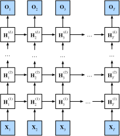

# Réseaux neuronaux récurrents profonds

:label:`sec_deep_rnn` 

 Jusqu'à présent, nous n'avons abordé que les RNN dotés d'une seule couche cachée unidirectionnelle.
Dans ce cas, la forme fonctionnelle spécifique de l'interaction entre les variables latentes et les observations est plutôt arbitraire.
Ce n'est pas un gros problème tant que nous avons suffisamment de flexibilité pour modéliser différents types d'interactions.
Avec une seule couche, cependant, cela peut être assez difficile.
Dans le cas des modèles linéaires,
, nous avons résolu ce problème en ajoutant des couches supplémentaires.
Avec les RNN, c'est un peu plus délicat, car nous devons d'abord décider comment et où ajouter une non-linéarité supplémentaire.

En fait,
, nous pouvons empiler plusieurs couches de RNN les unes sur les autres. Cela donne un mécanisme flexible,
grâce à la combinaison de plusieurs couches simples. En particulier, les données peuvent être pertinentes à différents niveaux de la pile. Par exemple, nous pouvons vouloir conserver des données de haut niveau sur les conditions du marché financier (marché haussier ou baissier), alors qu'à un niveau inférieur, nous n'enregistrons que les dynamiques temporelles à court terme.


Au-delà de toute la discussion abstraite ci-dessus
, il est probablement plus facile de comprendre la famille de modèles qui nous intéresse en examinant :numref:`fig_deep_rnn` . Il décrit un RNN profond avec $L$ couches cachées.
Chaque état caché est continuellement transmis à la fois au prochain pas de temps de la couche actuelle et au pas de temps actuel de la couche suivante.


:label:`fig_deep_rnn`

## Dépendances fonctionnelles

Nous pouvons formaliser les dépendances fonctionnelles

 dans l'architecture profonde
de $L$ couches cachées
décrite dans :numref:`fig_deep_rnn` .
La discussion suivante se concentre principalement sur
le modèle RNN vanille,
mais elle s'applique également à d'autres modèles de séquence.

Supposons que nous ayons une entrée de minilots
$\mathbf{X}_t \in \mathbb{R}^{n \times d}$ (nombre d'exemples : $n$, nombre d'entrées dans chaque exemple : $d$) au pas de temps $t$.
Au même pas de temps,
laisse
l'état caché de la couche cachée $l^\mathrm{th}$ ($l=1,\ldots,L$) être $\mathbf{H}_t^{(l)}  \in \mathbb{R}^{n \times h}$ (nombre d'unités cachées : $h$)
et
la variable de la couche de sortie être $\mathbf{O}_t \in \mathbb{R}^{n \times q}$ (nombre de sorties : $q$).
En définissant $\mathbf{H}_t^{(0)} = \mathbf{X}_t$,
l'état caché de
la couche cachée $l^\mathrm{th}$
 qui utilise la fonction d'activation $\phi_l$
 est exprimée comme suit :

$$\mathbf{H}_t^{(l)} = \phi_l(\mathbf{H}_t^{(l-1)} \mathbf{W}_{xh}^{(l)} + \mathbf{H}_{t-1}^{(l)} \mathbf{W}_{hh}^{(l)}  + \mathbf{b}_h^{(l)}),$$ 
 :eqlabel:`eq_deep_rnn_H` 

 où les poids $\mathbf{W}_{xh}^{(l)} \in \mathbb{R}^{h \times h}$ et $\mathbf{W}_{hh}^{(l)} \in \mathbb{R}^{h \times h}$, ainsi que
le biais $\mathbf{b}_h^{(l)} \in \mathbb{R}^{1 \times h}$, sont les paramètres du modèle de
la couche cachée $l^\mathrm{th}$.

Au final,
le calcul de la couche de sortie est uniquement basé sur l'état caché de la couche cachée finale $L^\mathrm{th}$:

$$\mathbf{O}_t = \mathbf{H}_t^{(L)} \mathbf{W}_{hq} + \mathbf{b}_q,$$ 

 où le poids $\mathbf{W}_{hq} \in \mathbb{R}^{h \times q}$ et le biais $\mathbf{b}_q \in \mathbb{R}^{1 \times q}$ sont les paramètres du modèle de la couche de sortie.

Comme pour les MLP, le nombre de couches cachées $L$ et le nombre d'unités cachées $h$ sont des hyperparamètres.
En d'autres termes, ils peuvent être réglés ou spécifiés par nous.
En outre, nous pouvons facilement
obtenir un RNN profond à déclenchement automatique
en remplaçant
le calcul de l'état caché dans
:eqref:`eq_deep_rnn_H` 
 par celui d'un GRU ou d'un LSTM.

```{.python .input}
%load_ext d2lbook.tab
tab.interact_select('mxnet', 'pytorch', 'tensorflow')
```

```{.python .input}
%%tab mxnet
from d2l import mxnet as d2l
from mxnet import npx
from mxnet.gluon import rnn
npx.set_np()
```

```{.python .input}
%%tab pytorch
from d2l import torch as d2l
import torch
from torch import nn
```

```{.python .input}
%%tab tensorflow
from d2l import tensorflow as d2l
import tensorflow as tf
```

## Implémentation à partir de zéro

Pour implémenter un RNN multicouche à partir de zéro,
nous pouvons traiter chaque couche comme une instance `RNNScratch`
 avec ses propres paramètres apprenables.

```{.python .input}
%%tab mxnet, tensorflow
class StackedRNNScratch(d2l.Module):
    def __init__(self, num_inputs, num_hiddens, num_layers, sigma=0.01):
        super().__init__()
        self.save_hyperparameters()
        self.rnns = [d2l.RNNScratch(num_inputs if i==0 else num_hiddens,
                                    num_hiddens, sigma)
                     for i in range(num_layers)]
```

```{.python .input}
%%tab pytorch
class StackedRNNScratch(d2l.Module):
    def __init__(self, num_inputs, num_hiddens, num_layers, sigma=0.01):
        super().__init__()
        self.save_hyperparameters()
        self.rnns = nn.Sequential(*[d2l.RNNScratch(
            num_inputs if i==0 else num_hiddens, num_hiddens, sigma)
                                    for i in range(num_layers)])
```

Le calcul direct multicouche
effectue simplement le calcul direct
couche par couche.

```{.python .input}
%%tab all
@d2l.add_to_class(StackedRNNScratch)
def forward(self, inputs, Hs=None):
    outputs = inputs
    if Hs is None: Hs = [None] * len(inputs)
    for i in range(self.num_layers):
        outputs, Hs[i] = self.rnns[i](outputs, Hs[i])
    return outputs, Hs
```

À titre d'exemple, nous entraînons un modèle GRU profond sur le jeu de données
*The Time Machine* (comme dans :numref:`sec_rnn-scratch` ).
Pour garder les choses simples, nous fixons le nombre de couches à 2.

```{.python .input}
%%tab all
data = d2l.TimeMachine(batch_size=1024, num_steps=32)
if tab.selected('mxnet', 'pytorch'):
    rnn_block = StackedRNNScratch(num_inputs=len(data.vocab),
                                  num_hiddens=32, num_layers=2)
    model = d2l.RNNLMScratch(rnn_block, vocab_size=len(data.vocab), lr=2)
    trainer = d2l.Trainer(max_epochs=100, gradient_clip_val=1, num_gpus=1)
if tab.selected('tensorflow'):
    with d2l.try_gpu():
        rnn_block = StackedRNNScratch(num_inputs=len(data.vocab),
                                  num_hiddens=32, num_layers=2)
        model = d2l.RNNLMScratch(rnn_block, vocab_size=len(data.vocab), lr=2)
    trainer = d2l.Trainer(max_epochs=100, gradient_clip_val=1)
trainer.fit(model, data)
```

## Mise en œuvre concise

Heureusement, de nombreux détails logistiques nécessaires à la mise en œuvre de couches multiples d'un RNN sont facilement disponibles dans des API de haut niveau.
Notre implémentation concise utilisera ces fonctionnalités intégrées.
Le code généralise celui que nous avons utilisé précédemment dans :numref:`sec_gru` ,
en permettant de spécifier explicitement le nombre de couches plutôt que de choisir par défaut une seule couche.

```{.python .input}
%%tab mxnet
class GRU(d2l.RNN):  #@save
    def __init__(self, num_hiddens, num_layers, dropout=0):
        d2l.Module.__init__(self)
        self.save_hyperparameters()
        self.rnn = rnn.GRU(num_hiddens, num_layers, dropout=dropout)
```

```{.python .input}
%%tab pytorch
class GRU(d2l.RNN):  #@save
    def __init__(self, num_inputs, num_hiddens, num_layers, dropout=0):
        d2l.Module.__init__(self)
        self.save_hyperparameters()
        self.rnn = nn.GRU(num_inputs, num_hiddens, num_layers,
                          dropout=dropout)
```

```{.python .input}
%%tab tensorflow
class GRU(d2l.RNN):  #@save
    def __init__(self, num_hiddens, num_layers, dropout=0):
        d2l.Module.__init__(self)
        self.save_hyperparameters()
        gru_cells = [tf.keras.layers.GRUCell(num_hiddens, dropout=dropout)
                     for _ in range(num_layers)]
        self.rnn = tf.keras.layers.RNN(gru_cells, return_sequences=True,
                                       return_state=True, time_major=True)

    def forward(self, X, state=None):
        outputs, *state = self.rnn(X, state)
        return outputs, state
```

Les décisions architecturales, telles que le choix des hyperparamètres, sont très similaires à celles de :numref:`sec_gru` .
Nous choisissons le même nombre d'entrées et de sorties que nous avons de tokens distincts, c'est-à-dire `vocab_size`.
Le nombre d'unités cachées est toujours de 32.
La seule différence est que nous (**sélectionnons maintenant un nombre non trivial de couches cachées en spécifiant la valeur de `num_layers`**)

```{.python .input}
%%tab all
if tab.selected('mxnet', 'tensorflow'):
    gru = GRU(num_hiddens=32, num_layers=2)
if tab.selected('pytorch'):
    gru = GRU(num_inputs=len(data.vocab), num_hiddens=32, num_layers=2)
if tab.selected('mxnet', 'pytorch'):
    model = d2l.RNNLM(gru, vocab_size=len(data.vocab), lr=2)
if tab.selected('tensorflow'):
    with d2l.try_gpu():
        model = d2l.RNNLM(gru, vocab_size=len(data.vocab), lr=2)
trainer.fit(model, data)
```

```{.python .input}
%%tab mxnet, pytorch
model.predict('it has', 20, data.vocab, d2l.try_gpu())
```

```{.python .input}
%%tab tensorflow
model.predict('it has', 20, data.vocab)
```

## Résumé

* Dans les RNN profonds, les informations sur l'état caché sont transmises au prochain pas de temps de la couche actuelle et au pas de temps actuel de la couche suivante.
* Il existe de nombreux modèles de RNN profonds, tels que les LSTM, les GRU ou les RNN classiques. De manière pratique, ces modèles sont tous disponibles dans les API de haut niveau des cadres d'apprentissage profond.
* L'initialisation des modèles nécessite une attention particulière. Dans l'ensemble, les RNN profonds nécessitent une quantité considérable de travail (comme le taux d'apprentissage et l'écrêtage) pour assurer une convergence correcte.

## Exercices

1. Remplacez le GRU par un LSTM et comparez la précision et la vitesse d'apprentissage.
1. Augmentez les données d'apprentissage pour inclure plusieurs livres. Jusqu'où pouvez-vous descendre sur l'échelle de perplexité ?
1. Voudriez-vous combiner les sources de différents auteurs lors de la modélisation du texte ? Pourquoi est-ce une bonne idée ? Qu'est-ce qui pourrait mal tourner ?

:begin_tab:`mxnet`
[Discussions](https://discuss.d2l.ai/t/340)
:end_tab:

:begin_tab:`pytorch`
[Discussions](https://discuss.d2l.ai/t/1058)
:end_tab:

:begin_tab:`tensorflow`
[Discussions](https://discuss.d2l.ai/t/3862)
:end_tab:
