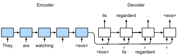

#  Sequence to Sequence Learning
:label:`sec_seq2seq`

As we have seen in :numref:`sec_machine_translation`,
in machine translation
both the input and output are a variable-length sequence.
To address this type of problem,
we have designed a general encoder-decoder architecture
in :numref:`sec_encoder-decoder`.
In this section,
we will
use two RNNs to design
the encoder and the decoder of
this architecture
and apply it to *sequence to sequence* learning
for machine translation
:cite:`Sutskever.Vinyals.Le.2014,Cho.Van-Merrienboer.Gulcehre.ea.2014`.

Following the design principle
of the encoder-decoder architecture,
the RNN encoder can
take a variable-length sequence as the input and transforms it into a fixed-shape hidden state.
In other words,
information of the input (source) sequence
is *encoded* in the hidden state of the RNN encoder.
To generate the output sequence token by token,
a separate RNN decoder
can predict the next token based on
what tokens have been seen (such as in language modeling) or generated,
together with the encoded information of the input sequence.
:numref:`fig_seq2seq` illustrates
how to use two RNNs
for sequence to sequence learning
in machine translation.



:label:`fig_seq2seq`

In :numref:`fig_seq2seq`,
the special "&lt;eos&gt;" token
marks the end of the sequence.
The model can stop making predictions
once this token is generated.
At the initial time step of the RNN decoder,
there are two special design decisions.
First, the special beginning-of-sequence "&lt;bos&gt;" token is an input.
Second,
the final hidden state of the RNN encoder is used
to initiate the hidden state of the decoder.
In designs such as :cite:`Sutskever.Vinyals.Le.2014`,
this is exactly
how the encoded input sequence information
is fed into the decoder for generating the output (target) sequence.
In some other designs such as :cite:`Cho.Van-Merrienboer.Gulcehre.ea.2014`,
the final hidden state of the encoder
is also fed into the decoder as
part of the inputs
at every time step as shown in :numref:`fig_seq2seq`.
Similar to the training of language models in
:numref:`sec_language_model`,
we can allow the labels to be the original output sequence,
shifted by one token:
"&lt;bos&gt;", "Ils", "regardent", "." $\rightarrow$
"Ils", "regardent", ".", "&lt;eos&gt;".


In the following,
we will explain the design of :numref:`fig_seq2seq`
in greater detail.
We will train this model for machine translation
on the English-French dataset as introduced in
:numref:`sec_machine_translation`.

```{.python .input  n=1}
%load_ext d2lbook.tab
tab.interact_select('mxnet', 'pytorch', 'tensorflow')
```

```{.python .input  n=18}
%%tab mxnet
import collections
from d2l import mxnet as d2l
import math
from mxnet import np, npx, init, gluon, autograd
from mxnet.gluon import nn, rnn
npx.set_np()
```

```{.python .input  n=19}
%%tab pytorch
import collections
from d2l import torch as d2l
import math
import torch
from torch import nn
from torch.nn import functional as F
```

```{.python .input  n=20}
%%tab tensorflow
import collections
from d2l import tensorflow as d2l
import math
import tensorflow as tf
```

## Encoder

Technically speaking,
the encoder transforms an input sequence of variable length into a fixed-shape *context variable* $\mathbf{c}$, and encodes the input sequence information in this context variable.
As depicted in :numref:`fig_seq2seq`,
we can use an RNN to design the encoder.

Let's consider a sequence example (batch size: 1).
Suppose that
the input sequence is $x_1, \ldots, x_T$, such that $x_t$ is the $t^{\mathrm{th}}$ token in the input text sequence.
At time step $t$, the RNN transforms
the input feature vector $\mathbf{x}_t$ for $x_t$
and the hidden state $\mathbf{h} _{t-1}$ from the previous time step
into the current hidden state $\mathbf{h}_t$.
We can use a function $f$ to express the transformation of the RNN's recurrent layer:

$$\mathbf{h}_t = f(\mathbf{x}_t, \mathbf{h}_{t-1}). $$

In general,
the encoder transforms the hidden states at
all the time steps
into the context variable through a customized function $q$:

$$\mathbf{c} =  q(\mathbf{h}_1, \ldots, \mathbf{h}_T).$$

For example, when choosing $q(\mathbf{h}_1, \ldots, \mathbf{h}_T) = \mathbf{h}_T$ such as in :numref:`fig_seq2seq`,
the context variable is just the hidden state $\mathbf{h}_T$
of the input sequence at the final time step.

So far we have used a unidirectional RNN
to design the encoder,
where
a hidden state only depends on
the input subsequence at and before the time step of the hidden state.
We can also construct encoders using bidirectional RNNs. In this case, a hidden state depends on
the subsequence before and after the time step (including the input at the current time step), which encodes the information of the entire sequence.


Now let's [**implement the RNN encoder**].
Note that we use an *embedding layer*
to obtain the feature vector for each token in the input sequence.
The weight
of an embedding layer
is a matrix
whose number of rows equals to the size of the input vocabulary (`vocab_size`)
and number of columns equals to the feature vector's dimension (`embed_size`).
For any input token index $i$,
the embedding layer
fetches the $i^{\mathrm{th}}$ row (starting from 0) of the weight matrix
to return its feature vector.
Besides,
here we choose a multilayer GRU to
implement the encoder.

```{.python .input  n=24}
%%tab all
class Seq2SeqEncoder(d2l.Module):  #@save
    """The RNN encoder for sequence to sequence learning."""
    def __init__(self, vocab_size, embed_size, num_hiddens, num_layers,
                 dropout=0):
        super().__init__()
        if tab.selected('mxnet'):
            self.embedding = nn.Embedding(vocab_size, embed_size)
            self.rnn = d2l.GRU(num_hiddens, num_layers, dropout)
            self.initialize()
        if tab.selected('pytorch'):
            self.embedding = nn.Embedding(vocab_size, embed_size)
            self.rnn = d2l.GRU(embed_size, num_hiddens, num_layers, dropout)
        if tab.selected('tensorflow'):
            self.embedding = tf.keras.layers.Embedding(vocab_size, embed_size)
            self.rnn = d2l.GRU(num_hiddens, num_layers, dropout)
            
    def forward(self, X):
        # X shape: (batch_size, num_steps)
        if tab.selected('pytorch'):
            embs = self.embedding(d2l.astype(d2l.transpose(X), d2l.int64))
        if tab.selected('mxnet', 'tensorflow'):
            embs = self.embedding(d2l.transpose(X))
        # embs shape: (num_steps, batch_size, embed_size)    
        output, state = self.rnn(embs)
        # output shape: (num_steps, batch_size, num_hiddens)
        # state shape: (num_layers, batch_size, num_hiddens)
        return output, state
```

The returned variables of recurrent layers
have been explained in :numref:`sec_rnn-concise`.
Let's still use a concrete example
to [**illustrate the above encoder implementation.**]
Below
we instantiate a two-layer GRU encoder
whose number of hidden units is 16.
Given
a minibatch of sequence inputs `X`
(batch size: 4, number of time steps: 7),
the hidden states of the last layer
at all the time steps
(`output` return by the encoder's recurrent layers)
are a tensor
of shape
(number of time steps, batch size, number of hidden units).

```{.python .input  n=25}
%%tab all
vocab_size, embed_size, num_hiddens, num_layers = 10, 8, 16, 2
batch_size, num_steps = 4, 7

encoder = Seq2SeqEncoder(vocab_size, embed_size, num_hiddens, num_layers)
X = d2l.zeros((batch_size, num_steps))
outputs, state = encoder(X)

d2l.check_shape(outputs, (num_steps, batch_size, num_hiddens))
if tab.selected('mxnet', 'pytorch'):
    d2l.check_shape(state, (num_layers, batch_size, num_hiddens))
if tab.selected('tensorflow'):
    d2l.check_len(state, num_layers)
    d2l.check_shape(state[0], (batch_size, num_hiddens))
```

Since a GRU is employed here,
the shape of the multilayer hidden states
at the final time step
is
(number of hidden layers, batch size, number of hidden units).
If an LSTM is used,
memory cell information will also be contained in `state`.

## [**Decoder**]
:label:`sec_seq2seq_decoder`

As we just mentioned,
the context variable $\mathbf{c}$ of the encoder's output encodes the entire input sequence $x_1, \ldots, x_T$. Given the output sequence $y_1, y_2, \ldots, y_{T'}$ from the training dataset,
for each time step $t'$
(the symbol differs from the time step $t$ of input sequences or encoders),
the probability of the decoder output $y_{t'}$
is conditional
on the previous output subsequence
$y_1, \ldots, y_{t'-1}$ and
the context variable $\mathbf{c}$, i.e., $P(y_{t'} \mid y_1, \ldots, y_{t'-1}, \mathbf{c})$.

To model this conditional probability on sequences,
we can use another RNN as the decoder.
At any time step $t^\prime$ on the output sequence,
the RNN takes the output $y_{t^\prime-1}$ from the previous time step
and the context variable $\mathbf{c}$ as its input,
then transforms
them and
the previous hidden state $\mathbf{s}_{t^\prime-1}$
into the
hidden state $\mathbf{s}_{t^\prime}$ at the current time step.
As a result, we can use a function $g$ to express the transformation of the decoder's hidden layer:

$$\mathbf{s}_{t^\prime} = g(y_{t^\prime-1}, \mathbf{c}, \mathbf{s}_{t^\prime-1}).$$
:eqlabel:`eq_seq2seq_s_t`

After obtaining the hidden state of the decoder,
we can use an output layer and the softmax operation to compute the conditional probability distribution
$P(y_{t^\prime} \mid y_1, \ldots, y_{t^\prime-1}, \mathbf{c})$ for the output at time step $t^\prime$.

Following :numref:`fig_seq2seq`,
when implementing the decoder as follows,
we directly use the hidden state at the final time step
of the encoder
to initialize the hidden state of the decoder.
This requires that the RNN encoder and the RNN decoder have the same number of layers and hidden units.
To further incorporate the encoded input sequence information,
the context variable is concatenated
with the decoder input at all the time steps.
To predict the probability distribution of the output token,
a fully connected layer is used to transform
the hidden state at the final layer of the RNN decoder.

```{.python .input  n=7}
%%tab all
class Seq2SeqDecoder(d2l.Module):
    """The RNN decoder for sequence to sequence learning."""
    def __init__(self, vocab_size, embed_size, num_hiddens, num_layers,
                 dropout=0):
        super(Seq2SeqDecoder, self).__init__()
        if tab.selected('mxnet'):
            self.embedding = nn.Embedding(vocab_size, embed_size)
            self.rnn = d2l.GRU(num_hiddens, num_layers, dropout)
            self.dense = nn.Dense(vocab_size, flatten=False)
            self.initialize()
        if tab.selected('pytorch'):
            self.embedding = nn.Embedding(vocab_size, embed_size)
            self.rnn = d2l.GRU(embed_size + num_hiddens, num_hiddens, num_layers, dropout)
            self.dense = nn.Linear(num_hiddens, vocab_size)
        if tab.selected('tensorflow'):
            self.embedding = tf.keras.layers.Embedding(vocab_size, embed_size)
            self.rnn = d2l.GRU(num_hiddens, num_layers, dropout)
            self.dense = tf.keras.layers.Dense(vocab_size)

    def forward(self, X, enc_state, state=None):
        # X shape: (batch_size, num_steps)
        # embs shape: (num_steps, batch_size, embed_size)
        if tab.selected('pytorch'):
            embs = self.embedding(d2l.astype(d2l.transpose(X), d2l.int32))
            # context shape: (batch_size, num_hiddens)
            context = enc_state[-1]            
            # broadcast to (num_steps, batch_size, num_hiddens)
            context = context.repeat(embs.shape[0], 1, 1)            
        if tab.selected('mxnet'):
            embs = self.embedding(d2l.transpose(X))
            # context shape: (batch_size, num_hiddens)
            context = enc_state[-1]
            # broadcast to (num_steps, batch_size, num_hiddens)
            context = np.tile(context, (embs.shape[0], 1, 1))            
        if tab.selected('tensorflow'):
            embs = self.embedding(d2l.transpose(X))
            # context shape: (batch_size, num_hiddens)
            context = enc_state[-1]
            # broadcast to (num_steps, batch_size, num_hiddens)
            context = tf.tile(tf.expand_dims(context, 0), (embs.shape[0], 1, 1))
        # concat at the feature dimension
        embs_and_context = d2l.concat((embs, context), -1)
        outputs, state = self.rnn(embs_and_context, state)
        if tab.selected('mxnet', 'pytorch'):        
            outputs = d2l.swapaxes(self.dense(outputs), 0, 1)
        if tab.selected('tensorflow'):        
            outputs = d2l.transpose(self.dense(outputs), (1, 0, 2))
        # outputs shape: (num_steps, batch_size, vocab_size)
        # state shape: (num_layers, batch_size, num_hiddens)
        return outputs, state
```

To [**illustrate the implemented decoder**],
below we instantiate it with the same hyperparameters from the aforementioned encoder.
As we can see, the output shape of the decoder becomes (batch size, number of time steps, vocabulary size),
where the last dimension of the tensor stores the predicted token distribution.

```{.python .input  n=8}
%%tab all
decoder = Seq2SeqDecoder(vocab_size, embed_size, num_hiddens, num_layers)
outputs, state = decoder(X, encoder(X)[1])

d2l.check_shape(outputs, (batch_size, num_steps, vocab_size))
if tab.selected('mxnet', 'pytorch'):
    d2l.check_shape(state, (num_layers, batch_size, num_hiddens))
if tab.selected('tensorflow'):
    d2l.check_len(state, num_layers)
    d2l.check_shape(state[0], (batch_size, num_hiddens))
```

To summarize,
the layers in the above RNN encoder-decoder model are illustrated in :numref:`fig_seq2seq_details`.


:label:`fig_seq2seq_details`


## Seq2seq model

```{.python .input  n=9}
%%tab all
class Seq2Seq(d2l.Classification):  #@save
    def __init__(self, encoder, decoder, tgt_pad, lr):
        super().__init__()
        self.save_hyperparameters()    
        
    def forward(self, src, tgt):
        return self.decoder(tgt, self.encoder(src)[1])[0]
```

## Loss Function

At each time step, the decoder
predicts a probability distribution for the output tokens.
Similar to language modeling,
we can apply softmax to obtain the distribution
and calculate the cross-entropy loss for optimization.
Recall :numref:`sec_machine_translation`
that the special padding tokens
are appended to the end of sequences
so sequences of varying lengths
can be efficiently loaded
in minibatches of the same shape.
However,
prediction of padding tokens
should be excluded from loss calculations.

To this end,
we can use the following
`sequence_mask` function
to [**mask irrelevant entries with zero values**]
so later
multiplication of any irrelevant prediction
with zero equals to zero.
For example,
if the valid length of two sequences
excluding padding tokens
are one and two, respectively,
the remaining entries after
the first one
and the first two entries are cleared to zeros.

```{.python .input  n=10}
%%tab all
@d2l.add_to_class(Seq2Seq)
def loss(self, Y_hat, Y):
    l = super(Seq2Seq, self).loss(Y_hat, Y, averaged=False)
    mask = d2l.astype(d2l.reshape(Y, -1) != self.tgt_pad, d2l.float32)
    return d2l.reduce_sum(l * mask) / d2l.reduce_sum(mask)
```

## [**Training**]
:label:`sec_seq2seq_training`

In the following training loop,
we concatenate the special beginning-of-sequence token
and the original output sequence excluding the final token as
the input to the decoder, as shown in :numref:`fig_seq2seq`.
This is called *teacher forcing* because
the original output sequence (token labels) is fed into the decoder.
Alternatively,
we could also feed the *predicted* token
from the previous time step
as the current input to the decoder.

```{.python .input  n=11}
%%tab all
@d2l.add_to_class(Seq2Seq)
def accuracy(self, X, Y):
    acc = super(Seq2Seq, self).accuracy(X, Y, averaged=False)    
    mask = d2l.astype(d2l.reshape(Y, -1) != self.tgt_pad, d2l.float32)
    return d2l.reduce_sum(acc * mask) / d2l.reduce_sum(mask)
```

```{.python .input  n=13}
%%tab all
data = d2l.MTFraEng(batch_size=64, num_steps=10) 
embed_size, num_hiddens, num_layers, dropout = 32, 32, 2, 0.1
encoder = Seq2SeqEncoder(
    len(data.src_vocab), embed_size, num_hiddens, num_layers, dropout)
decoder = Seq2SeqDecoder(
    len(data.tgt_vocab), embed_size, num_hiddens, num_layers, dropout)
model = Seq2Seq(encoder, decoder, tgt_pad=data.tgt_vocab['<pad>'], lr=0.005)
trainer = d2l.Trainer(max_epochs=5, gradient_clip_val=1)
trainer.fit(model, data)
```

Now we can [**create and train an RNN encoder-decoder model**]
for sequence to sequence learning on the machine translation dataset.


## [**Prediction**]

To predict the output sequence
token by token,
at each decoder time step
the predicted token from the previous
time step is fed into the decoder as an input.
Similar to training,
at the initial time step
the beginning-of-sequence ("&lt;bos&gt;") token
is fed into the decoder.
This prediction process
is illustrated in :numref:`fig_seq2seq_predict`.
When the end-of-sequence ("&lt;eos&gt;") token is predicted,
the prediction of the output sequence is complete.


:label:`fig_seq2seq_predict`

We will introduce different
strategies for sequence generation in
:numref:`sec_beam-search`.

```{.python .input  n=14}
%%tab all
@d2l.add_to_class(Seq2Seq)  #@save
def predict_step(self, batch):
    src, tgt, _ = batch
    enc_state = self.encoder(src)[1]
    dec_state = None
    outputs = [d2l.expand_dims(tgt[:,0], 1), ]
    for _ in range(tgt.shape[1]):
        Y, dec_state = self.decoder(outputs[-1], enc_state, dec_state)
        outputs.append(d2l.argmax(Y, 2))
    return d2l.concat(outputs[1:], 1)
```

```{.python .input  n=15}
%%tab all
batch = data.build(["hi !"], [""])
data.tgt_vocab.to_tokens(model.predict_step(batch)[0])
```

## Evaluation of Predicted Sequences

We can evaluate a predicted sequence
by comparing it with the
label sequence (the ground-truth).
BLEU (Bilingual Evaluation Understudy),
though originally proposed for evaluating
machine translation results :cite:`Papineni.Roukos.Ward.ea.2002`,
has been extensively used in measuring
the quality of output sequences for different applications.
In principle, for any $n$-grams in the predicted sequence,
BLEU evaluates whether this $n$-grams appears
in the label sequence.

Denote by $p_n$
the precision of $n$-grams,
which is
the ratio of
the number of matched $n$-grams in
the predicted and label sequences
to
the number of $n$-grams in the predicted sequence.
To explain,
given a label sequence $A$, $B$, $C$, $D$, $E$, $F$,
and a predicted sequence $A$, $B$, $B$, $C$, $D$,
we have $p_1 = 4/5$,  $p_2 = 3/4$, $p_3 = 1/3$, and $p_4 = 0$.
Besides,
let $\mathrm{len}_{\text{label}}$ and $\mathrm{len}_{\text{pred}}$
be
the numbers of tokens in the label sequence and the predicted sequence, respectively.
Then, BLEU is defined as

$$ \exp\left(\min\left(0, 1 - \frac{\mathrm{len}_{\text{label}}}{\mathrm{len}_{\text{pred}}}\right)\right) \prod_{n=1}^k p_n^{1/2^n},$$
:eqlabel:`eq_bleu`

where $k$ is the longest $n$-grams for matching.

Based on the definition of BLEU in :eqref:`eq_bleu`,
whenever the predicted sequence is the same as the label sequence, BLEU is 1.
Moreover,
since matching longer $n$-grams is more difficult,
BLEU assigns a greater weight
to a longer $n$-gram precision.
Specifically, when $p_n$ is fixed,
$p_n^{1/2^n}$ increases as $n$ grows (the original paper uses $p_n^{1/n}$).
Furthermore,
since
predicting shorter sequences
tends to obtain a higher $p_n$ value,
the coefficient before the multiplication term in :eqref:`eq_bleu`
penalizes shorter predicted sequences.
For example, when $k=2$,
given the label sequence $A$, $B$, $C$, $D$, $E$, $F$ and the predicted sequence $A$, $B$,
although $p_1 = p_2 = 1$, the penalty factor $\exp(1-6/2) \approx 0.14$ lowers the BLEU.

We [**implement the BLEU measure**] as follows.

```{.python .input  n=16}
%%tab all
def bleu(pred_seq, label_seq, k):  #@save
    """Compute the BLEU."""
    pred_tokens, label_tokens = pred_seq.split(' '), label_seq.split(' ')
    len_pred, len_label = len(pred_tokens), len(label_tokens)
    score = math.exp(min(0, 1 - len_label / len_pred))
    for n in range(1, k + 1):
        num_matches, label_subs = 0, collections.defaultdict(int)
        for i in range(len_label - n + 1):
            label_subs[''.join(label_tokens[i: i + n])] += 1
        for i in range(len_pred - n + 1):
            if label_subs[''.join(pred_tokens[i: i + n])] > 0:
                num_matches += 1
                label_subs[''.join(pred_tokens[i: i + n])] -= 1
        score *= math.pow(num_matches / (len_pred - n + 1), math.pow(0.5, n))
    return score
```

In the end,
we use the trained RNN encoder-decoder
to [**translate a few English sentences into French**]
and compute the BLEU of the results.

```{.python .input  n=17}
%%tab all
engs = ['go .', 'i lost .', 'he\'s calm .', 'i\'m home .']
fras = ['va !', 'j\'ai perdu .', 'il est calme .', 'je suis chez moi .']
batch = data.build(engs, fras)
preds = model.predict_step(batch)
for en, fr, p in zip(engs, fras, preds):
    translation = []
    for token in data.tgt_vocab.to_tokens(p):
        if token == '<eos>': break
        translation.append(token)        
    print(f'{en} => {translation}')#, bleu {bleu(" ".join(translation), fr, k=2):.3f}')  
```

## Summary

* Following the design of the encoder-decoder architecture, we can use two RNNs to design a model for sequence to sequence learning.
* When implementing the encoder and the decoder, we can use multilayer RNNs.
* We can use masks to filter out irrelevant computations, such as when calculating the loss.
* In encoder-decoder training, the teacher forcing approach feeds original output sequences (in contrast to predictions) into the decoder.
* BLEU is a popular measure for evaluating output sequences by matching $n$-grams between the predicted sequence and the label sequence.


## Exercises

1. Can you adjust the hyperparameters to improve the translation results?
1. Rerun the experiment without using masks in the loss calculation. What results do you observe? Why?
1. If the encoder and the decoder differ in the number of layers or the number of hidden units, how can we initialize the hidden state of the decoder?
1. In training, replace teacher forcing with feeding the prediction at the previous time step into the decoder. How does this influence the performance?
1. Rerun the experiment by replacing GRU with LSTM.
1. Are there any other ways to design the output layer of the decoder?

:begin_tab:`mxnet`
[Discussions](https://discuss.d2l.ai/t/345)
:end_tab:

:begin_tab:`pytorch`
[Discussions](https://discuss.d2l.ai/t/1062)
:end_tab:

:begin_tab:`tensorflow`
[Discussions](https://discuss.d2l.ai/t/3865)
:end_tab:
