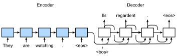

```{.python .input}
%load_ext d2lbook.tab
tab.interact_select('mxnet', 'pytorch', 'tensorflow')
```

# Apprentissage de séquence à séquence
:label:`sec_seq2seq` 

 Comme nous l'avons vu dans :numref:`sec_machine_translation` ,
dans la traduction automatique
, l'entrée et la sortie sont toutes deux une séquence de longueur variable.
Pour résoudre ce type de problème,
nous avons conçu une architecture générale de codeur-décodeur
dans :numref:`sec_encoder-decoder` .
Dans cette section,
nous allons
utiliser deux RNN pour concevoir
l'encodeur et le décodeur de
cette architecture
et l'appliquer à l'apprentissage *séquence à séquence*
pour la traduction automatique
:cite:`Sutskever.Vinyals.Le.2014,Cho.Van-Merrienboer.Gulcehre.ea.2014` .

Suivant le principe de conception
de l'architecture codeur-décodeur,
le codeur RNN peut
prendre une séquence de longueur variable en entrée et la transformer en un état caché de forme fixe.
En d'autres termes, l'information
de la séquence d'entrée (source)
est *codée* dans l'état caché du codeur RNN.
Pour générer la séquence de sortie mot à mot,
un décodeur RNN séparé
peut prédire le mot suivant sur la base de
ce que les mots ont vu (comme dans la modélisation du langage) ou généré,
avec les informations codées de la séquence d'entrée.
:numref:`fig_seq2seq` illustre
comment utiliser deux RNN
pour l'apprentissage de séquence à séquence
dans la traduction automatique.


:label:`fig_seq2seq`

Dans :numref:`fig_seq2seq` ,
le jeton spécial "&lt;eos&gt;"
marque la fin de la séquence.
Le modèle peut arrêter de faire des prédictions
une fois que ce jeton est généré.
Au premier pas de temps du décodeur RNN,
deux décisions de conception particulières sont prises.
Premièrement, le jeton spécial de début de séquence "&lt;bos&gt;" est une entrée.
Deuxièmement,
l'état caché final de l'encodeur RNN est utilisé
pour initier l'état caché du décodeur.
Dans des conceptions telles que :cite:`Sutskever.Vinyals.Le.2014` ,
c'est exactement
la façon dont les informations de la séquence d'entrée codée
sont introduites dans le décodeur pour générer la séquence de sortie (cible).
Dans d'autres modèles tels que :cite:`Cho.Van-Merrienboer.Gulcehre.ea.2014` ,
l'état caché final de l'encodeur
est également introduit dans le décodeur en tant que
partie des entrées
à chaque pas de temps, comme le montre :numref:`fig_seq2seq` .


## Forçage par l'enseignant

Alors que l'entrée de l'encodeur
n'est constituée que d'éléments de la séquence source,
l'entrée et la sortie du décodeur
ne sont pas aussi simples
dans l'apprentissage de l'encodeur-décodeur.
Une approche courante est le *forçage de l'enseignant*,
où la séquence cible originale (étiquettes de tokens)
est introduite dans le décodeur comme entrée.
Plus concrètement,
le token spécial de début de séquence
et la séquence cible originale à l'exclusion du token final 
sont concaténés comme
entrée du décodeur,
tandis que la sortie du décodeur (étiquettes pour l'entraînement) est
la séquence cible originale,
décalée d'un token :
"&lt;bos&gt;", "Ils", "regardent", "." $\rightarrow$
 "Ils", "regardent", ".", "&lt;eos&gt;" (:numref:`fig_seq2seq` ).

Notre mise en œuvre dans
:numref:`subsec_loading-seq-fixed-len` 
 a préparé des données de entrainement pour le forçage de l'enseignant,
où le déplacement des jetons pour l'apprentissage auto-supervisé
est similaire à l'entrainement des modèles de langue dans
:numref:`sec_language-model` .
Une approche alternative consiste à
alimenter le jeton *prédit*
de l'étape temporelle précédente
comme entrée actuelle du décodeur.


Dans la suite de cet article,
nous expliquerons plus en détail la conception de :numref:`fig_seq2seq` 
 .
Nous entraînerons ce modèle pour la traduction automatique
sur le jeu de données anglais-français tel qu'il est présenté dans
:numref:`sec_machine_translation` .

```{.python .input}
%%tab mxnet
import collections
from d2l import mxnet as d2l
import math
from mxnet import np, npx, init, gluon, autograd
from mxnet.gluon import nn, rnn
npx.set_np()
```

```{.python .input}
%%tab pytorch
import collections
from d2l import torch as d2l
import math
import torch
from torch import nn
from torch.nn import functional as F
```

```{.python .input}
%%tab tensorflow
import collections
from d2l import tensorflow as d2l
import math
import tensorflow as tf
```

## Encodeur

Techniquement parlant,
l'encodeur transforme une séquence d'entrée de longueur variable en une *variable de contexte* de forme fixe $\mathbf{c}$, et encode les informations de la séquence d'entrée dans cette variable de contexte.
Comme illustré sur :numref:`fig_seq2seq` ,
nous pouvons utiliser un RNN pour concevoir l'encodeur.

Considérons un exemple de séquence (taille du lot : 1).
Supposons que
la séquence d'entrée soit $x_1, \ldots, x_T$, de sorte que $x_t$ soit le token $t^{\mathrm{th}}$ dans la séquence de texte d'entrée.
Au pas de temps $t$, le RNN transforme
le vecteur de caractéristiques d'entrée $\mathbf{x}_t$ pour $x_t$
 et l'état caché $\mathbf{h} _{t-1}$ du pas de temps précédent
en l'état caché actuel $\mathbf{h}_t$.
Nous pouvons utiliser une fonction $f$ pour exprimer la transformation de la couche récurrente du RNN :

$$\mathbf{h}_t = f(\mathbf{x}_t, \mathbf{h}_{t-1}). $$ 

 En général,
le codeur transforme les états cachés à
tous les pas de temps
en la variable de contexte par une fonction personnalisée $q$:

$$\mathbf{c} =  q(\mathbf{h}_1, \ldots, \mathbf{h}_T).$$ 

 Par exemple, en choisissant $q(\mathbf{h}_1, \ldots, \mathbf{h}_T) = \mathbf{h}_T$ comme dans :numref:`fig_seq2seq` ,
la variable de contexte est juste l'état caché $\mathbf{h}_T$
 de la séquence d'entrée au dernier pas de temps.

Jusqu'à présent, nous avons utilisé un RNN unidirectionnel
pour concevoir l'encodeur,
où
un état caché ne dépend que de
la sous-séquence d'entrée à et avant le pas de temps de l'état caché.
Nous pouvons également construire des codeurs en utilisant des RNN bidirectionnels. Dans ce cas, un état caché dépend de
la sous-séquence avant et après le pas de temps (y compris l'entrée au pas de temps actuel), qui code l'information de la séquence entière.


Implémentons maintenant [**l'encodeur RNN**].
Notez que nous utilisons une *couche d'intégration*
pour obtenir le vecteur caractéristique pour chaque token de la séquence d'entrée.
Le poids
d'une couche d'intégration
est une matrice
dont le nombre de lignes est égal à la taille du vocabulaire d'entrée (`vocab_size`)
et le nombre de colonnes est égal à la dimension du vecteur de caractéristiques (`embed_size`).
Pour tout index de token d'entrée $i$,
la couche d'intégration
récupère la ligne $i^{\mathrm{th}}$ (en partant de 0) de la matrice de poids
pour retourner son vecteur de caractéristiques.
De plus,
nous choisissons ici un GRU multicouche pour
implémenter l'encodeur.

```{.python .input}
%%tab mxnet
class Seq2SeqEncoder(d2l.Encoder):  #@save
    """The RNN encoder for sequence to sequence learning."""
    def __init__(self, vocab_size, embed_size, num_hiddens, num_layers,
                 dropout=0):
        super().__init__()
        self.embedding = nn.Embedding(vocab_size, embed_size)
        self.rnn = d2l.GRU(num_hiddens, num_layers, dropout)
        self.initialize(init.Xavier())
            
    def forward(self, X, *args):
        # X shape: (batch_size, num_steps)
        embs = self.embedding(d2l.transpose(X))
        # embs shape: (num_steps, batch_size, embed_size)    
        output, state = self.rnn(embs)
        # output shape: (num_steps, batch_size, num_hiddens)
        # state shape: (num_layers, batch_size, num_hiddens)
        return output, state
```

```{.python .input}
%%tab pytorch
def init_seq2seq(module):  #@save
    """Initialize weights for Seq2Seq."""
    if type(module) == nn.Linear:
         nn.init.xavier_uniform_(module.weight)
    if type(module) == nn.GRU:
        for param in module._flat_weights_names:
            if "weight" in param:
                nn.init.xavier_uniform_(module._parameters[param])

class Seq2SeqEncoder(d2l.Encoder):  #@save
    """The RNN encoder for sequence to sequence learning."""
    def __init__(self, vocab_size, embed_size, num_hiddens, num_layers,
                 dropout=0):
        super().__init__()
        self.embedding = nn.Embedding(vocab_size, embed_size)
        self.rnn = d2l.GRU(embed_size, num_hiddens, num_layers, dropout)
        self.apply(init_seq2seq)
            
    def forward(self, X, *args):
        # X shape: (batch_size, num_steps)
        embs = self.embedding(d2l.astype(d2l.transpose(X), d2l.int64))
        # embs shape: (num_steps, batch_size, embed_size)    
        output, state = self.rnn(embs)
        # output shape: (num_steps, batch_size, num_hiddens)
        # state shape: (num_layers, batch_size, num_hiddens)
        return output, state
```

```{.python .input}
%%tab tensorflow
class Seq2SeqEncoder(d2l.Encoder):  #@save
    """The RNN encoder for sequence to sequence learning."""
    def __init__(self, vocab_size, embed_size, num_hiddens, num_layers,
                 dropout=0):
        super().__init__()
        self.embedding = tf.keras.layers.Embedding(vocab_size, embed_size)
        self.rnn = d2l.GRU(num_hiddens, num_layers, dropout)
            
    def call(self, X, *args):
        # X shape: (batch_size, num_steps)
        embs = self.embedding(d2l.transpose(X))
        # embs shape: (num_steps, batch_size, embed_size)    
        output, state = self.rnn(embs)
        # output shape: (num_steps, batch_size, num_hiddens)
        # state shape: (num_layers, batch_size, num_hiddens)
        return output, state
```

Les variables retournées des couches récurrentes
ont été expliquées dans :numref:`sec_rnn-concise` .
Utilisons encore un exemple concret
pour [**illustrer l'implémentation de l'encodeur ci-dessus.**]
Ci-dessous
nous instancions un encodeur GRU à deux couches
dont le nombre d'unités cachées est de 16.
Étant donné
un mini lot d'entrées de séquence `X`
 (taille du lot : 4, nombre de pas de temps : 9),
les états cachés de la dernière couche
à tous les pas de temps
(`outputs` retour par les couches récurrentes du codeur)
sont un tenseur
de forme
(nombre de pas de temps, taille du lot, nombre d'unités cachées).

```{.python .input}
%%tab all
vocab_size, embed_size, num_hiddens, num_layers = 10, 8, 16, 2
batch_size, num_steps = 4, 9

encoder = Seq2SeqEncoder(vocab_size, embed_size, num_hiddens, num_layers)
X = d2l.zeros((batch_size, num_steps))
outputs, state = encoder(X)

d2l.check_shape(outputs, (num_steps, batch_size, num_hiddens))
```

Puisqu'un GRU est employé ici,
la forme des états cachés multicouches
au dernier pas de temps
est
(nombre de couches cachées, taille du lot, nombre d'unités cachées).

```{.python .input}
%%tab all
if tab.selected('mxnet', 'pytorch'):
    d2l.check_shape(state, (num_layers, batch_size, num_hiddens))
if tab.selected('tensorflow'):
    d2l.check_len(state, num_layers)
    d2l.check_shape(state[0], (batch_size, num_hiddens))
```

## [**Décodeur**]
:label:`sec_seq2seq_decoder` 

 Comme nous venons de le mentionner,
la variable contextuelle $\mathbf{c}$ de la sortie du codeur code la séquence d'entrée entière $x_1, \ldots, x_T$. Étant donné la séquence de sortie $y_1, y_2, \ldots, y_{T'}$ de l'ensemble de données d'apprentissage,
pour chaque pas de temps $t'$
 (le symbole diffère du pas de temps $t$ des séquences d'entrée ou des codeurs),
la probabilité de la sortie du décodeur $y_{t'}$
 est conditionnelle
à la sous-séquence de sortie précédente
$y_1, \ldots, y_{t'-1}$ et
la variable contextuelle $\mathbf{c}$, c'est-à-dire $P(y_{t'} \mid y_1, \ldots, y_{t'-1}, \mathbf{c})$.

Pour modéliser cette probabilité conditionnelle sur les séquences,
nous pouvons utiliser un autre RNN comme décodeur.
A tout pas de temps $t^\prime$ sur la séquence de sortie,
le RNN prend la sortie $y_{t^\prime-1}$ du pas de temps précédent
et la variable de contexte $\mathbf{c}$ comme entrée,
puis les transforme
et
l'état caché précédent $\mathbf{s}_{t^\prime-1}$
 en l'état caché
 $\mathbf{s}_{t^\prime}$ au pas de temps courant.
Par conséquent, nous pouvons utiliser une fonction $g$ pour exprimer la transformation de la couche cachée du décodeur :

$$\mathbf{s}_{t^\prime} = g(y_{t^\prime-1}, \mathbf{c}, \mathbf{s}_{t^\prime-1}).$$ 
 :eqlabel:`eq_seq2seq_s_t` 

 Après avoir obtenu l'état caché du décodeur,
nous pouvons utiliser une couche de sortie et l'opération softmax pour calculer la distribution de probabilité conditionnelle
$P(y_{t^\prime} \mid y_1, \ldots, y_{t^\prime-1}, \mathbf{c})$ pour la sortie au pas de temps $t^\prime$.

En suivant :numref:`fig_seq2seq` ,
lors de la mise en œuvre du décodeur comme suit,
nous utilisons directement l'état caché à l'étape temporelle finale
du codeur
pour initialiser l'état caché du décodeur.
Cela nécessite que l'encodeur RNN et le décodeur RNN aient le même nombre de couches et d'unités cachées.
Pour intégrer davantage les informations de la séquence d'entrée codée,
la variable contextuelle est concaténée
avec l'entrée du décodeur à tous les pas de temps.
Pour prédire la distribution de probabilité du jeton de sortie,
une couche entièrement connectée est utilisée pour transformer
l'état caché de la couche finale du décodeur RNN.

```{.python .input}
%%tab mxnet
class Seq2SeqDecoder(d2l.Decoder):
    """The RNN decoder for sequence to sequence learning."""
    def __init__(self, vocab_size, embed_size, num_hiddens, num_layers,
                 dropout=0):
        super().__init__()
        self.embedding = nn.Embedding(vocab_size, embed_size)
        self.rnn = d2l.GRU(num_hiddens, num_layers, dropout)
        self.dense = nn.Dense(vocab_size, flatten=False)
        self.initialize(init.Xavier())
            
    def init_state(self, enc_outputs, *args):
        return enc_outputs[1] 

    def forward(self, X, enc_state):
        # X shape: (batch_size, num_steps)
        # embs shape: (num_steps, batch_size, embed_size)
        embs = self.embedding(d2l.transpose(X))
        # context shape: (batch_size, num_hiddens)
        context = enc_state[-1]
        # Broadcast context to (num_steps, batch_size, num_hiddens)
        context = np.tile(context, (embs.shape[0], 1, 1))
        # Concat at the feature dimension
        embs_and_context = d2l.concat((embs, context), -1)
        outputs, state = self.rnn(embs_and_context, enc_state)
        outputs = d2l.swapaxes(self.dense(outputs), 0, 1)
        # outputs shape: (batch_size, num_steps, vocab_size)
        # state shape: (num_layers, batch_size, num_hiddens)
        return outputs, state
```

```{.python .input}
%%tab pytorch
class Seq2SeqDecoder(d2l.Decoder):
    """The RNN decoder for sequence to sequence learning."""
    def __init__(self, vocab_size, embed_size, num_hiddens, num_layers,
                 dropout=0):
        super().__init__()
        self.embedding = nn.Embedding(vocab_size, embed_size)
        self.rnn = d2l.GRU(embed_size+num_hiddens, num_hiddens,
                           num_layers, dropout)
        self.dense = nn.LazyLinear(vocab_size)
        self.apply(init_seq2seq)
            
    def init_state(self, enc_outputs, *args):
        return enc_outputs[1] 

    def forward(self, X, enc_state):
        # X shape: (batch_size, num_steps)
        # embs shape: (num_steps, batch_size, embed_size)
        embs = self.embedding(d2l.astype(d2l.transpose(X), d2l.int32))
        # context shape: (batch_size, num_hiddens)
        context = enc_state[-1]            
        # Broadcast context to (num_steps, batch_size, num_hiddens)
        context = context.repeat(embs.shape[0], 1, 1)            
        # Concat at the feature dimension
        embs_and_context = d2l.concat((embs, context), -1)
        outputs, state = self.rnn(embs_and_context, enc_state)
        outputs = d2l.swapaxes(self.dense(outputs), 0, 1)
        # outputs shape: (batch_size, num_steps, vocab_size)
        # state shape: (num_layers, batch_size, num_hiddens)
        return outputs, state
```

```{.python .input}
%%tab tensorflow
class Seq2SeqDecoder(d2l.Decoder):
    """The RNN decoder for sequence to sequence learning."""
    def __init__(self, vocab_size, embed_size, num_hiddens, num_layers,
                 dropout=0):
        super().__init__()
        self.embedding = tf.keras.layers.Embedding(vocab_size, embed_size)
        self.rnn = d2l.GRU(num_hiddens, num_layers, dropout)
        self.dense = tf.keras.layers.Dense(vocab_size)
            
    def init_state(self, enc_outputs, *args):
        return enc_outputs[1] 

    def call(self, X, enc_state):
        # X shape: (batch_size, num_steps)
        # embs shape: (num_steps, batch_size, embed_size)
        embs = self.embedding(d2l.transpose(X))
        # context shape: (batch_size, num_hiddens)
        context = enc_state[-1]
        # Broadcast context to (num_steps, batch_size, num_hiddens)
        context = tf.tile(tf.expand_dims(context, 0), (embs.shape[0], 1, 1))
        # Concat at the feature dimension
        embs_and_context = d2l.concat((embs, context), -1)
        outputs, state = self.rnn(embs_and_context, enc_state)
        outputs = d2l.transpose(self.dense(outputs), (1, 0, 2))
        # outputs shape: (batch_size, num_steps, vocab_size)
        # state shape: (num_layers, batch_size, num_hiddens)
        return outputs, state
```

Pour [**illustrer le décodeur implémenté**],
ci-dessous, nous l'instancions avec les mêmes hyperparamètres que l'encodeur susmentionné.
Comme nous pouvons le voir, la forme de sortie du décodeur devient (taille du lot, nombre d'étapes temporelles, taille du vocabulaire),
où la dernière dimension du tenseur stocke la distribution prédite des jetons.

```{.python .input}
%%tab all
decoder = Seq2SeqDecoder(vocab_size, embed_size, num_hiddens, num_layers)
state = decoder.init_state(encoder(X))
outputs, state = decoder(X, state)

d2l.check_shape(outputs, (batch_size, num_steps, vocab_size))
if tab.selected('mxnet', 'pytorch'):
    d2l.check_shape(state, (num_layers, batch_size, num_hiddens))
if tab.selected('tensorflow'):
    d2l.check_len(state, num_layers)
    d2l.check_shape(state[0], (batch_size, num_hiddens))
```

Pour résumer,
les couches dans le modèle d'encodeur-décodeur RNN ci-dessus sont illustrées dans :numref:`fig_seq2seq_details` .


:label:`fig_seq2seq_details`


## Encodeur-décodeur pour l'apprentissage de séquence à séquence


 Sur la base de l'architecture décrite
dans :numref:`sec_encoder-decoder` ,
le modèle d'encodeur-décodeur RNN
pour l'apprentissage de séquence à séquence met simplement 
l'encodeur RNN et le décodeur RNN ensemble.

```{.python .input}
%%tab all
class Seq2Seq(d2l.EncoderDecoder):  #@save
    def __init__(self, encoder, decoder, tgt_pad, lr):
        super().__init__(encoder, decoder)
        self.save_hyperparameters()
        
    def validation_step(self, batch):
        Y_hat = self(*batch[:-1])
        self.plot('loss', self.loss(Y_hat, batch[-1]), train=False)
        
    def configure_optimizers(self):
        # Adam optimizer is used here
        if tab.selected('mxnet'):
            return gluon.Trainer(self.parameters(), 'adam',
                                 {'learning_rate': self.lr})
        if tab.selected('pytorch'):
            return torch.optim.Adam(self.parameters(), lr=self.lr)
        if tab.selected('tensorflow'):
            return tf.keras.optimizers.Adam(learning_rate=self.lr)
```

## Fonction de perte avec masquage

A chaque pas de temps, le décodeur
prédit une distribution de probabilité pour les tokens de sortie.
Comme pour la modélisation du langage,
nous pouvons appliquer la méthode softmax pour obtenir la distribution
et calculer la perte d'entropie croisée pour l'optimisation.
Rappelons que :numref:`sec_machine_translation` 
 que les jetons de remplissage spéciaux
sont ajoutés à la fin des séquences
afin que les séquences de différentes longueurs
puissent être chargées efficacement
en minibatchs de même forme.
Cependant, la prédiction des jetons de remplissage

 doit être exclue des calculs de perte.
À cette fin,
nous pouvons 
[**masquer les entrées non pertinentes avec des valeurs nulles**]
de sorte que
la multiplication de toute prédiction non pertinente
avec zéro soit égale à zéro.

```{.python .input}
%%tab all
@d2l.add_to_class(Seq2Seq)
def loss(self, Y_hat, Y):
    l = super(Seq2Seq, self).loss(Y_hat, Y, averaged=False)
    mask = d2l.astype(d2l.reshape(Y, -1) != self.tgt_pad, d2l.float32)
    return d2l.reduce_sum(l * mask) / d2l.reduce_sum(mask)
```

## [**Training**]
:label:`sec_seq2seq_training` 

 Nous pouvons maintenant [**créer et entraîner un modèle RNN encodeur-décodeur**]
pour l'apprentissage de séquence à séquence sur le jeu de données de traduction automatique.

```{.python .input}
%%tab all
data = d2l.MTFraEng(batch_size=128) 
embed_size, num_hiddens, num_layers, dropout = 256, 256, 2, 0.2
if tab.selected('mxnet', 'pytorch'):
    encoder = Seq2SeqEncoder(
        len(data.src_vocab), embed_size, num_hiddens, num_layers, dropout)
    decoder = Seq2SeqDecoder(
        len(data.tgt_vocab), embed_size, num_hiddens, num_layers, dropout)
    model = Seq2Seq(encoder, decoder, tgt_pad=data.tgt_vocab['<pad>'],
                    lr=0.001)
    trainer = d2l.Trainer(max_epochs=50, gradient_clip_val=1, num_gpus=1)
if tab.selected('tensorflow'):
    with d2l.try_gpu():
        encoder = Seq2SeqEncoder(
            len(data.src_vocab), embed_size, num_hiddens, num_layers, dropout)
        decoder = Seq2SeqDecoder(
            len(data.tgt_vocab), embed_size, num_hiddens, num_layers, dropout)
        model = Seq2Seq(encoder, decoder, tgt_pad=data.tgt_vocab['<pad>'],
                        lr=0.001)
    trainer = d2l.Trainer(max_epochs=50, gradient_clip_val=1)
trainer.fit(model, data)
```

## [**Prediction**]

To predict the output sequence
token by token,
at each decoder time step
the predicted token from the previous
time step is fed into the decoder as an input.
Similar to training,
at the initial time step
the beginning-of-sequence ("&lt;bos&gt;") le jeton
est introduit dans le décodeur.
Ce processus de prédiction
est illustré dans :numref:`fig_seq2seq_predict` .
Lorsque le token de fin de séquence ("&lt;eos&gt;") est prédit,
la prédiction de la séquence de sortie est terminée.



:label:`fig_seq2seq_predict`

Nous présenterons différentes stratégies
pour la génération de séquences dans
:numref:`sec_beam-search` .

```{.python .input}
%%tab all
@d2l.add_to_class(d2l.EncoderDecoder)  #@save
def predict_step(self, batch, device, num_steps,
                 save_attention_weights=False):
    if tab.selected('mxnet', 'pytorch'):
        batch = [d2l.to(a, device) for a in batch]
    src, tgt, src_valid_len, _ = batch
    if tab.selected('mxnet', 'pytorch'):
        enc_outputs = self.encoder(src, src_valid_len)
    if tab.selected('tensorflow'):
        enc_outputs = self.encoder(src, src_valid_len, training=False)
    dec_state = self.decoder.init_state(enc_outputs, src_valid_len)
    outputs, attention_weights = [d2l.expand_dims(tgt[:,0], 1), ], []
    for _ in range(num_steps):
        if tab.selected('mxnet', 'pytorch'):
            Y, dec_state = self.decoder(outputs[-1], dec_state)
        if tab.selected('tensorflow'):
            Y, dec_state = self.decoder(outputs[-1], dec_state, training=False)
        outputs.append(d2l.argmax(Y, 2))
        # Save attention weights (to be covered later)
        if save_attention_weights:
            attention_weights.append(self.decoder.attention_weights)
    return d2l.concat(outputs[1:], 1), attention_weights
```

## Évaluation des séquences prédites

Nous pouvons évaluer une séquence prédite
en la comparant à la séquence d'étiquettes
(la vérité du terrain).
Le test BLEU (Bilingual Evaluation Understudy),
bien qu'initialement proposé pour évaluer les résultats de la traduction automatique
 :cite:`Papineni.Roukos.Ward.ea.2002` ,
a été largement utilisé pour mesurer
la qualité des séquences de sortie pour différentes applications.
En principe, pour tout $n$-gramme dans la séquence prédite,
BLEU évalue si ce $n$-gramme apparaît
dans la séquence de l'étiquette.

On désigne par $p_n$
 la précision des $n$-grammes,
qui est
le rapport entre
le nombre de $n$-grammes appariés dans
la séquence prédite et la séquence d'étiquettes
et
le nombre de $n$-grammes dans la séquence prédite.
Pour expliquer,
étant donné une séquence d'étiquettes $A$, $B$, $C$, $D$, $E$, $F$,
et une séquence prédite $A$, $B$, $B$, $C$, $D$,
nous avons $p_1 = 4/5$, $p_2 = 3/4$, $p_3 = 1/3$, et $p_4 = 0$.
 $\mathrm{len}_{\text{label}}$ En outre,
et $\mathrm{len}_{\text{pred}}$
 sont
les nombres de tokens dans la séquence d'étiquettes et la séquence prédite, respectivement.
Ensuite, BLEU est défini comme

$$ \exp\left(\min\left(0, 1 - \frac{\mathrm{len}_{\text{label}}}{\mathrm{len}_{\text{pred}}}\right)\right) \prod_{n=1}^k p_n^{1/2^n},$$ 
 :eqlabel:`eq_bleu` 

 où $k$ est le plus long $n$-gramme pour la correspondance.

Sur la base de la définition de BLEU dans :eqref:`eq_bleu` ,
chaque fois que la séquence prédite est identique à la séquence de l'étiquette, BLEU est égal à 1.
En outre,
étant donné que la mise en correspondance des $n$-grammes les plus longs est plus difficile,
BLEU attribue un poids plus important
à la précision d'un $n$-gramme plus long.
Plus précisément, lorsque $p_n$ est fixe,
$p_n^{1/2^n}$ augmente avec $n$ (l'article original utilise $p_n^{1/n}$).
En outre,
étant donné que
prédisant des séquences plus courtes
a tendance à obtenir une valeur $p_n$ plus élevée,
le coefficient avant le terme de multiplication dans :eqref:`eq_bleu` 
 pénalise les séquences prédites plus courtes.
Par exemple, lorsque $k=2$,
donne la séquence d'étiquettes $A$, $B$, $C$, $D$, $E$, $F$ et la séquence prédite $A$, $B$,
bien que $p_1 = p_2 = 1$, le facteur de pénalité $\exp(1-6/2) \approx 0.14$ fait baisser le BLEU.

Nous [**mettons en œuvre la mesure BLEU**] comme suit.

```{.python .input}
%%tab all
def bleu(pred_seq, label_seq, k):  #@save
    """Compute the BLEU."""
    pred_tokens, label_tokens = pred_seq.split(' '), label_seq.split(' ')
    len_pred, len_label = len(pred_tokens), len(label_tokens)
    score = math.exp(min(0, 1 - len_label / len_pred))
    for n in range(1, min(k, len_pred) + 1):
        num_matches, label_subs = 0, collections.defaultdict(int)
        for i in range(len_label - n + 1):
            label_subs[' '.join(label_tokens[i: i + n])] += 1
        for i in range(len_pred - n + 1):
            if label_subs[' '.join(pred_tokens[i: i + n])] > 0:
                num_matches += 1
                label_subs[' '.join(pred_tokens[i: i + n])] -= 1
        score *= math.pow(num_matches / (len_pred - n + 1), math.pow(0.5, n))
    return score
```

Enfin,
nous utilisons le codeur-décodeur RNN entraîné
pour [**traduire quelques phrases anglaises en français**]
et calculons le BLEU des résultats.

```{.python .input}
%%tab all
engs = ['go .', 'i lost .', 'he\'s calm .', 'i\'m home .']
fras = ['va !', 'j\'ai perdu .', 'il est calme .', 'je suis chez moi .']
preds, _ = model.predict_step(
    data.build(engs, fras), d2l.try_gpu(), data.num_steps)
for en, fr, p in zip(engs, fras, preds):
    translation = []
    for token in data.tgt_vocab.to_tokens(p):
        if token == '<eos>':
            break
        translation.append(token)        
    print(f'{en} => {translation}, bleu,'
          f'{bleu(" ".join(translation), fr, k=2):.3f}')
```

## Résumé

* En suivant la conception de l'architecture de l'encodeur-décodeur, nous pouvons utiliser deux RNN pour concevoir un modèle d'apprentissage de séquence à séquence.
* Dans l'apprentissage de l'encodeur-décodeur, l'approche du forçage de l'enseignant alimente le décodeur en séquences de sortie originales (par opposition aux prédictions).
* Lors de la mise en œuvre de l'encodeur et du décodeur, nous pouvons utiliser des RNN multicouches.
* Nous pouvons utiliser des masques pour filtrer les calculs non pertinents, par exemple lors du calcul de la perte.
* BLEU est une mesure populaire pour évaluer les séquences de sortie en faisant correspondre $n$-grammes entre la séquence prédite et la séquence d'étiquette.


## Exercices

1. Pouvez-vous ajuster les hyperparamètres pour améliorer les résultats de la traduction ?
1. Relancez l'expérience sans utiliser les masques dans le calcul de la perte. Quels résultats observez-vous ? Pourquoi ?
1. Si le codeur et le décodeur diffèrent par le nombre de couches ou le nombre d'unités cachées, comment pouvons-nous initialiser l'état caché du décodeur ?
1. Lors de la formation, remplacez le forçage de l'enseignant par l'introduction de la prédiction du pas de temps précédent dans le décodeur. Comment cela influence-t-il les performances ?
1. Refaites l'expérience en remplaçant GRU par LSTM.
1. Existe-t-il d'autres façons de concevoir la couche de sortie du décodeur ?

:begin_tab:`mxnet`
[Discussions](https://discuss.d2l.ai/t/345)
:end_tab:

:begin_tab:`pytorch`
[Discussions](https://discuss.d2l.ai/t/1062)
:end_tab:

:begin_tab:`tensorflow`
[Discussions](https://discuss.d2l.ai/t/3865)
:end_tab:
