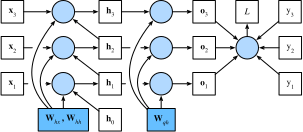

# Back-propagation Through Time

If you have done the exercise in the previous section, you will know that the model cannot be trained normally if you do not clip the gradient. To provide a better understanding of this issue, this section will introduce the gradient computation and storage method used in recurrent neural networks, namely, back-propagation through time.

In the ["Forward Propagation, Back Propagation, and Computational Graphs"](../chapter_deep-learning-basics/backprop.md) section, we discussed the general ideas behind gradient computation and storage in neural networks and emphasized the interdependence of forward propagation and back propagation. Forward propagation in a recurrent neural network is relatively straightforward. Back-propagation through time is actually a specific application of back propagation in recurrent neural networks. It requires us to expand the recurrent neural network by time step to obtain the dependencies between model variables and parameters. Then, based on the chain rule, we apply back propagation to compute and store gradients.

## Define the Model

To keep things simple, we consider an unbiased recurrent neural network, with the activation function set to identity mapping ($\phi(x)=x$). We set the input of the time step $t$ to a single example $\boldsymbol{x}_t \in \mathbb{R}^d$ and use the label $y_t$, so the calculation expression for the hidden state $\boldsymbol{h}_t \in \mathbb{R}^h$ is:

$$\boldsymbol{h}_t = \boldsymbol{W}_{hx} \boldsymbol{x}_t + \boldsymbol{W}_{hh} \boldsymbol{h}_{t-1},$$

Here, $\boldsymbol{W}_{hx} \in \mathbb{R}^{h \times d}$ and $\boldsymbol{W}_{hh} \in \mathbb{R}^{h \times h}$ are the weight parameters of the hidden layer. Assuming the output layer weight parameter is $\boldsymbol{W}_{qh} \in \mathbb{R}^{q \times h}$, the output layer variable $\boldsymbol{o}_t \in \mathbb{R}^q$ for time step $t$ can be calculated as follows:

$$\boldsymbol{o}_t = \boldsymbol{W}_{qh} \boldsymbol{h}_{t}.$$

Let the loss at time step $t$ be defined as $\ell(\boldsymbol{o}_t, y_t)$. Thus, the loss function $L$ for $T$ time steps is defined as:

$$L = \frac{1}{T} \sum_{t=1}^T \ell (\boldsymbol{o}_t, y_t).$$

In what follows, we will refer to $L$ as the "objective function" for the data instance of a given time step.

## Model Computational Graph

In order to visualize the dependencies between model variables and parameters during computation in a recurrent neural network, we can draw a computational graph for the model, as shown in Figure 6.3. For example, the computation of the hidden states of time step 3 $\boldsymbol{h}_3$ depends on the model parameters $\boldsymbol{W}_{hx} and \boldsymbol{W}_{hh}$, the hidden state of the last time step $\boldsymbol{h}_2$, and the input of the current time step $\boldsymbol{x}_3$.

## Back-propagation Through Time

As just mentioned, the model parameters in Figure 6.3 are $\boldsymbol{W}_{hx}$, $\boldsymbol{W}_{hh}$, and $\boldsymbol{W}_{qh}$. Similar to the ["Forward Propagation, Back Propagation, and Computational Graphs"](../chapter_deep-learning-basics/backprop.md) section, model training generally requires the model parameter gradients $\partial L/\partial \boldsymbol{W}_{hx}$, $\partial L/\partial \boldsymbol{W}_{hh}$, and $\partial L/\partial \boldsymbol{W}_{qh}$.
According to the dependencies shown in Figure 6.3, we can calculate and store the gradients in turn going in the opposite direction of the arrows in the figure. To simplify the explanation, we continue to use the chain rule operator "prod" from the ["Forward Propagation, Back Propagation, and Computational Graphs"](../chapter_deep-learning-basics/backprop.md) section.

First, calculate the output layer variable gradient of the objective function with respect to each time step $\partial L/\partial \boldsymbol{o}_t \in \mathbb{R}^q$ using the following formula:

$$\frac{\partial L}{\partial \boldsymbol{o}_t} =  \frac{\partial \ell (\boldsymbol{o}_t, y_t)}{T \cdot \partial \boldsymbol{o}_t}.$$

Now, we can calculate the gradient for the objective function model parameter $\boldsymbol{W}_{qh}$: $\partial L/\partial \boldsymbol{W}_{qh} \in \mathbb{R}^{q \times h}$. Based on Figure 6.3, $L$ depends on $\boldsymbol{W}_{qh}$ through $\boldsymbol{o}_1, \ldots, \boldsymbol{o}_T$. Applying the chain rule,

$$
\frac{\partial L}{\partial \boldsymbol{W}_{qh}}
= \sum_{t=1}^T \text{prod}\left(\frac{\partial L}{\partial \boldsymbol{o}_t}, \frac{\partial \boldsymbol{o}_t}{\partial \boldsymbol{W}_{qh}}\right)
= \sum_{t=1}^T \frac{\partial L}{\partial \boldsymbol{o}_t} \boldsymbol{h}_t^\top.
$$

Next, we must note that there are also dependencies between hidden states.
In Figure 6.3, $L$ depends on the hidden state $\boldsymbol{h}_T$ of the final time step $T$ only through $\boldsymbol{o}_T$. Therefore, we first calculate the objective function gradient with respect to the hidden state of the final time step: $\partial L/\partial \boldsymbol{h}_T \in \mathbb{R}^h$. According to the chain rule, we get

$$
\frac{\partial L}{\partial \boldsymbol{h}_T} = \text{prod}\left(\frac{\partial L}{\partial \boldsymbol{o}_T}, \frac{\partial \boldsymbol{o}_T}{\partial \boldsymbol{h}_T} \right) = \boldsymbol{W}_{qh}^\top \frac{\partial L}{\partial \boldsymbol{o}_T}.
$$

Then, for the time steps $t < T$,
$L$ depends on $\boldsymbol{h}_t$ through $\boldsymbol{h}_{t+1}$ and $\boldsymbol{o}_t$. Applying the chain rule,
the objective function gradient with respect to the hidden states of the time steps $t < T$ ($\partial L/\partial \boldsymbol{h}_t \in \mathbb{R}^h$) must be calculated for each time step in turn from large to small:

$$
\frac{\partial L}{\partial \boldsymbol{h}_t}
= \text{prod}\left(\frac{\partial L}{\partial \boldsymbol{h}_{t+1}}, \frac{\partial \boldsymbol{h}_{t+1}}{\partial \boldsymbol{h}_t} \right)
+ \text{prod}\left(\frac{\partial L}{\partial \boldsymbol{o}_t}, \frac{\partial \boldsymbol{o}_t}{\partial \boldsymbol{h}_t} \right)
= \boldsymbol{W}_{hh}^\top \frac{\partial L}{\partial \boldsymbol{h}_{t+1}} + \boldsymbol{W}_{qh}^\top \frac{\partial L}{\partial \boldsymbol{o}_t}.
$$

Expanding the recursive formula above, we can find a general formula for the objective function hidden state gradient for any time step $1 \leq t \leq T$.

$$
\frac{\partial L}{\partial \boldsymbol{h}_t}
= \sum_{i=t}^T {\left(\boldsymbol{W}_{hh}^\top\right)}^{T-i} \boldsymbol{W}_{qh}^\top \frac{\partial L}{\partial \boldsymbol{o}_{T+t-i}}.
$$

From the exponential term in the above formula, we can see that, when the number of time steps $T$ is large or the time step $t$ is small, the hidden state gradient of the objective function is prone to vanishing and explosion. This will also affect other gradients that contain the term $\partial L / \partial \boldsymbol{h}_t$, such as the gradients of model parameters in the hidden layer $\partial L / \partial \boldsymbol{W}_{hx} \in \mathbb{R}^{h \times d}$ and $\partial L / \partial \boldsymbol{W}_{hh} \in \mathbb{R}^{h \times h}$.
In Figure 6.3, $L$ depends on these model parameters through $\boldsymbol{h}_1, \ldots, \boldsymbol{h}_T$.
According to the chain rule, we get

$$
\begin{aligned}
\frac{\partial L}{\partial \boldsymbol{W}_{hx}}
&= \sum_{t=1}^T \text{prod}\left(\frac{\partial L}{\partial \boldsymbol{h}_t}, \frac{\partial \boldsymbol{h}_t}{\partial \boldsymbol{W}_{hx}}\right)
= \sum_{t=1}^T \frac{\partial L}{\partial \boldsymbol{h}_t} \boldsymbol{x}_t^\top,\\
\frac{\partial L}{\partial \boldsymbol{W}_{hh}}
&= \sum_{t=1}^T \text{prod}\left(\frac{\partial L}{\partial \boldsymbol{h}_t}, \frac{\partial \boldsymbol{h}_t}{\partial \boldsymbol{W}_{hh}}\right)
= \sum_{t=1}^T \frac{\partial L}{\partial \boldsymbol{h}_t} \boldsymbol{h}_{t-1}^\top.
\end{aligned}
$$

As we already explained in the ["Forward Propagation, Back Propagation, and Computational Graphs"](../chapter_deep-learning-basics/backprop.md) section, after we calculate the above gradients in turn for each iteration, we save them to avoid the need for repeat calculation. For example, after calculating and storing the hidden state gradient $\partial L/\partial \boldsymbol{h}_t$, subsequent calculations of the model parameter gradients $\partial L/\partial  \boldsymbol{W}_{hx}$ and $\partial L/\partial \boldsymbol{W}_{hh}$ can directly read the value of $\partial L/\partial \boldsymbol{h}_t$, so they do not need to be re-calculated.
In addition, gradient calculation in back propagation may depend on the current values of variables. These are calculated using forward propagation.
To give an example, the calculation of the parameter gradient $\partial L/\partial \boldsymbol{W}_{hh}$ must depend on the current hidden state value at the time step $t = 0, \ldots, T-1$: $\boldsymbol{h}_t$ ($\boldsymbol{h}_0$ is obtained during initialization). These values are obtained by calculation and storage via forward propagation from the input layer to the output layer.

## Summary

* Back-propagation through time is a specific application of back propagation in recurrent neural networks.
* When the number of time steps is large or the time step is small, the gradients in recurrent neural networks are prone to vanishing or explosion.

## exercise

* Besides gradient clipping, can you think of any other methods to cope with gradient explosion in recurrent neural networks?

## Discuss on our Forum

