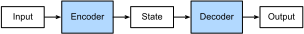

# Encoder-Decoder Architecture

The *encoder-decoder architecture* is a neural network design pattern. As shown in :numref:`fig_encoder_decoder`, the architecture is partitioned into two parts, the encoder and the decoder. The encoder's role is to encode the inputs into state, which often contains several tensors. Then the state is passed into the decoder to generate the outputs. In machine translation, the encoder transforms a source sentence, e.g., "Hello world.", into state, e.g., a vector, that captures its semantic information. The decoder then uses this state to generate the translated target sentence, e.g., "Bonjour le monde.".


:label:`fig_encoder_decoder`

In this section, we will show an interface to implement this encoder-decoder architecture.


## Encoder

The encoder is a normal neural network that takes inputs, e.g., a source sentence, and then returns states, which is a feature map in a form of vector or tensor.

```{.python .input  n=2}
from mxnet.gluon import nn

# Saved in the d2l package for later use
class Encoder(nn.Block):
    """The base encoder interface for the encoder-decoder architecture."""
    def __init__(self, **kwargs):
        super(Encoder, self).__init__(**kwargs)

    def forward(self, X):
        raise NotImplementedError
```

## Decoder

The decoder has an additional method `init_state` to parse the outputs of the encoder (the states) with possible additional information, e.g., returns the state it needs given the valid lengths of inputs. In the forward method, the decoder takes both inputs, e.g., a target sentence and the state. It returns outputs, with potentially modified state if the encoder contains RNN layers.

```{.python .input  n=3}
# Saved in the d2l package for later use
class Decoder(nn.Block):
    """The base decoder interface for the encoder-decoder architecture."""
    def __init__(self, **kwargs):
        super(Decoder, self).__init__(**kwargs)

    def init_state(self, enc_outputs, *args):
        raise NotImplementedError

    def forward(self, X, state):
        raise NotImplementedError
```

## Model

The encoder-decoder model contains both an encoder and an decoder. We implement its forward method for training. It takes both encoder inputs and decoder inputs, with optional additional arguments. During the computation, it first compute encoder outputs to initialize the decoder state, and then returns the decoder outputs.

```{.python .input  n=4}
# Saved in the d2l package for later use
class EncoderDecoder(nn.Block):
    """The base class for the encoder-decoder architecture."""
    def __init__(self, encoder, decoder, **kwargs):
        super(EncoderDecoder, self).__init__(**kwargs)
        self.encoder = encoder
        self.decoder = decoder

    def forward(self, enc_X, dec_X, *args):
        enc_outputs = self.encoder(enc_X, *args)
        dec_state = self.decoder.init_state(enc_outputs, *args)
        return self.decoder(dec_X, dec_state)
```

## Summary

* An encoder-decoder architecture is a neural network design pattern mainly in natural language processing.
* An encoder is a neural network (FC, CNN, RNN, etc.) that takes the input, and output a feature map.
* An decoder is a network usually the same network structure as encoder. 
* In the encoder-decoder architecture, the decoder takes the state output from the encoder, and gives the best closest match to the actual input or intended output.


## Exercises

1. Besides the machine translation use case, can you think of the other applied scenarios that an encoder-decoder architecture can fit? 
2. An *autoencoder* is a type of neural network used for unsupervised learning. The aim of an autoencoder is to learn a representation typically for dimensionality reduction. Can you compare it with the encoder-decoder architecture we introduced in this section?


## Scan the QR Code to [Discuss](https://discuss.mxnet.io/t/2396)


