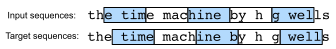

# Language Models
:label:`sec_language-model`

In :numref:`sec_text-sequence`, we see how to map text sequences into tokens, where these tokens can be viewed as a sequence of discrete observations, such as words or characters. Assume that the tokens in a text sequence of length $T$ are in turn $x_1, x_2, \ldots, x_T$.
The goal of *language models*
is to estimate the joint probability of the whole sequence:

$$P(x_1, x_2, \ldots, x_T),$$

where statistical tools
in :numref:`sec_sequence`
can be applied.

Language models are incredibly useful. For instance, an ideal language model would be able to generate natural text just on its own, simply by drawing one token at a time $x_t \sim P(x_t \mid x_{t-1}, \ldots, x_1)$.
Quite unlike the monkey using a typewriter, all text emerging from such a model would pass as natural language, e.g., English text. Furthermore, it would be sufficient for generating a meaningful dialog, simply by conditioning the text on previous dialog fragments.
Clearly we are still very far from designing such a system, since it would need to *understand* the text rather than just generate grammatically sensible content.

Nonetheless, language models are of great service even in their limited form.
For instance, the phrases "to recognize speech" and "to wreck a nice beach" sound very similar.
This can cause ambiguity in speech recognition,
which is easily resolved through a language model that rejects the second translation as outlandish.
Likewise, in a document summarization algorithm
it is worthwhile knowing that "dog bites man" is much more frequent than "man bites dog", or that "I want to eat grandma" is a rather disturbing statement, whereas "I want to eat, grandma" is much more benign.

```{.python .input  n=1}
%load_ext d2lbook.tab
tab.interact_select(['mxnet', 'pytorch', 'tensorflow', 'jax'])
```

```{.python .input  n=2}
%%tab mxnet
from d2l import mxnet as d2l
from mxnet import np, npx
npx.set_np()
```

```{.python .input  n=3}
%%tab pytorch
from d2l import torch as d2l
import torch
```

```{.python .input  n=4}
%%tab tensorflow
from d2l import tensorflow as d2l
import tensorflow as tf
```

```{.python .input}
%%tab jax
from d2l import jax as d2l
from jax import numpy as jnp
```

## Learning Language Models

The obvious question is how we should model a document, or even a sequence of tokens. 
Suppose that we tokenize text data at the word level.
Let's start by applying basic probability rules:

$$P(x_1, x_2, \ldots, x_T) = \prod_{t=1}^T P(x_t  \mid  x_1, \ldots, x_{t-1}).$$

For example, 
the probability of a text sequence containing four words would be given as:

$$\begin{aligned}&P(\text{deep}, \text{learning}, \text{is}, \text{fun}) \\
=&P(\text{deep}) P(\text{learning}  \mid  \text{deep}) P(\text{is}  \mid  \text{deep}, \text{learning}) P(\text{fun}  \mid  \text{deep}, \text{learning}, \text{is}).\end{aligned}$$

### Markov Models and $n$-grams

Among those sequence model analysis in :numref:`sec_sequence`,
let's apply Markov models to language modeling.
A distribution over sequences satisfies the Markov property of first order if $P(x_{t+1} \mid x_t, \ldots, x_1) = P(x_{t+1} \mid x_t)$. Higher orders correspond to longer dependencies. This leads to a number of approximations that we could apply to model a sequence:

$$
\begin{aligned}
P(x_1, x_2, x_3, x_4) &=  P(x_1) P(x_2) P(x_3) P(x_4),\\
P(x_1, x_2, x_3, x_4) &=  P(x_1) P(x_2  \mid  x_1) P(x_3  \mid  x_2) P(x_4  \mid  x_3),\\
P(x_1, x_2, x_3, x_4) &=  P(x_1) P(x_2  \mid  x_1) P(x_3  \mid  x_1, x_2) P(x_4  \mid  x_2, x_3).
\end{aligned}
$$

The probability formulae that involve one, two, and three variables are typically referred to as *unigram*, *bigram*, and *trigram* models, respectively. 
In order to compute the language model, we need to calculate the
probability of words and the conditional probability of a word given
the previous few words.
Note that
such probabilities are
language model parameters.


### Word Frequency

Here, we
assume that the training dataset is a large text corpus, such as all
Wikipedia entries, [Project Gutenberg](https://en.wikipedia.org/wiki/Project_Gutenberg),
and all text posted on the
Web.
The probability of words can be calculated from the relative word
frequency of a given word in the training dataset.
For example, the estimate $\hat{P}(\text{deep})$ can be calculated as the
probability of any sentence starting with the word "deep". A
slightly less accurate approach would be to count all occurrences of
the word "deep" and divide it by the total number of words in
the corpus.
This works fairly well, particularly for frequent
words. Moving on, we could attempt to estimate

$$\hat{P}(\text{learning} \mid \text{deep}) = \frac{n(\text{deep, learning})}{n(\text{deep})},$$

where $n(x)$ and $n(x, x')$ are the number of occurrences of singletons
and consecutive word pairs, respectively.
Unfortunately, 
estimating the
probability of a word pair is somewhat more difficult, since the
occurrences of "deep learning" are a lot less frequent. 
In particular, for some unusual word combinations it may be tricky to
find enough occurrences to get accurate estimates.
As suggested by the empirical results in :numref:`subsec_natural-lang-stat`,
things take a turn for the worse for three-word combinations and beyond.
There will be many plausible three-word combinations that we likely will not see in our dataset.
Unless we provide some solution to assign such word combinations nonzero count, we will not be able to use them in a language model. If the dataset is small or if the words are very rare, we might not find even a single one of them.

### Laplace Smoothing

A common strategy is to perform some form of *Laplace smoothing*.
The solution is to
add a small constant to all counts. 
Denote by $n$ the total number of words in
the training set
and $m$ the number of unique words.
This solution helps with singletons, e.g., via

$$\begin{aligned}
	\hat{P}(x) & = \frac{n(x) + \epsilon_1/m}{n + \epsilon_1}, \\
	\hat{P}(x' \mid x) & = \frac{n(x, x') + \epsilon_2 \hat{P}(x')}{n(x) + \epsilon_2}, \\
	\hat{P}(x'' \mid x,x') & = \frac{n(x, x',x'') + \epsilon_3 \hat{P}(x'')}{n(x, x') + \epsilon_3}.
\end{aligned}$$

Here $\epsilon_1,\epsilon_2$, and $\epsilon_3$ are hyperparameters.
Take $\epsilon_1$ as an example:
when $\epsilon_1 = 0$, no smoothing is applied;
when $\epsilon_1$ approaches positive infinity,
$\hat{P}(x)$ approaches the uniform probability $1/m$. 
The above is a rather primitive variant of what
other techniques can accomplish :cite:`Wood.Gasthaus.Archambeau.ea.2011`.


Unfortunately, models like this get unwieldy rather quickly
for the following reasons. 
First, 
as discussed in :numref:`subsec_natural-lang-stat`,
many $n$-grams occur very rarely, 
making Laplace smoothing rather unsuitable for language modeling.
Second, we need to store all counts.
Third, this entirely ignores the meaning of the words. For
instance, "cat" and "feline" should occur in related contexts.
It is quite difficult to adjust such models to additional contexts,
whereas, deep learning based language models are well suited to
take this into account.
Last, long word
sequences are almost certain to be novel, hence a model that simply
counts the frequency of previously seen word sequences is bound to perform poorly there.
Therefore, we focus on using neural networks for language modeling
in the rest of the chapter.


## Perplexity
:label:`subsec_perplexity`

Next, let's discuss about how to measure the language model quality, which will be used to evaluate our models in the subsequent sections.
One way is to check how surprising the text is.
A good language model is able to predict with
high-accuracy tokens that what we will see next.
Consider the following continuations of the phrase "It is raining", as proposed by different language models:

1. "It is raining outside"
1. "It is raining banana tree"
1. "It is raining piouw;kcj pwepoiut"

In terms of quality, example 1 is clearly the best. The words are sensible and logically coherent.
While it might not quite accurately reflect which word follows semantically ("in San Francisco" and "in winter" would have been perfectly reasonable extensions), the model is able to capture which kind of word follows.
Example 2 is considerably worse by producing a nonsensical extension. Nonetheless, at least the model has learned how to spell words and some degree of correlation between words. Last, example 3 indicates a poorly trained model that does not fit data properly.

We might measure the quality of the model by computing  the likelihood of the sequence.
Unfortunately this is a number that is hard to understand and difficult to compare.
After all, shorter sequences are much more likely to occur than the longer ones,
hence evaluating the model on Tolstoy's magnum opus
*War and Peace* will inevitably produce a much smaller likelihood than, say, on Saint-Exupery's novella *The Little Prince*. What is missing is the equivalent of an average.

Information theory comes handy here.
We have defined entropy, surprisal, and cross-entropy
when we introduced the softmax regression
(:numref:`subsec_info_theory_basics`).
If we want to compress text, we can ask about
predicting the next token given the current set of tokens.
A better language model should allow us to predict the next token more accurately.
Thus, it should allow us to spend fewer bits in compressing the sequence.
So we can measure it by the cross-entropy loss averaged
over all the $n$ tokens of a sequence:

$$\frac{1}{n} \sum_{t=1}^n -\log P(x_t \mid x_{t-1}, \ldots, x_1),$$
:eqlabel:`eq_avg_ce_for_lm`

where $P$ is given by a language model and $x_t$ is the actual token observed at time step $t$ from the sequence.
This makes the performance on documents of different lengths comparable. For historical reasons, scientists in natural language processing prefer to use a quantity called *perplexity*. In a nutshell, it is the exponential of :eqref:`eq_avg_ce_for_lm`:

$$\exp\left(-\frac{1}{n} \sum_{t=1}^n \log P(x_t \mid x_{t-1}, \ldots, x_1)\right).$$

Perplexity can be best understood as the geometric mean of the number of real choices that we have when deciding which token to pick next. Let's look at a number of cases:

* In the best case scenario, the model always perfectly estimates the probability of the target token as 1. In this case the perplexity of the model is 1.
* In the worst case scenario, the model always predicts the probability of the target token as 0. In this situation, the perplexity is positive infinity.
* At the baseline, the model predicts a uniform distribution over all the available tokens of the vocabulary. In this case, the perplexity equals the number of unique tokens of the vocabulary. In fact, if we were to store the sequence without any compression, this would be the best we could do to encode it. Hence, this provides a nontrivial upper bound that any useful model must beat.

## Partitioning Sequences
:label:`subsec_partitioning-seqs`

We will design language models using neural networks
and use perplexity to evaluate 
how good the model is at 
predicting the next token given the current set of tokens
in text sequences.
Before introducing the model,
let's assume that it
processes a minibatch of sequences with predefined length
at a time.
Now the question is how to [**read minibatches of input sequences and target sequences at random**].


Suppose that the dataset takes the form of a sequence of $T$ token indices in `corpus`.
We will
partition it
into subsequences, where each subsequence has $n$ tokens (time steps).
To iterate over 
(almost) all the tokens of the entire dataset 
for each epoch
and obtain all possible length-$n$ subsequences,
we can introduce randomness.
More concretely,
at the beginning of each epoch,
discard the first $d$ tokens,
where $d\in [0,n)$ is uniformly sampled at random.
The rest of the sequence
is then partitioned
into $m=\lfloor (T-d)/n \rfloor$ subsequences.
Denote by $\mathbf x_t = [x_t, \ldots, x_{t+n-1}]$ the length-$n$ subsequence starting from token $x_t$ at time step $t$. 
The resulting $m$ partitioned subsequences
are 
$\mathbf x_d, \mathbf x_{d+n}, \ldots, \mathbf x_{d+n(m-1)}.$
Each subsequence will be used as an input sequence into the language model.


For language modeling,
the goal is to predict the next token based on what tokens we have seen so far, hence the targets (labels) are the original sequence, shifted by one token.
The target sequence for any input sequence $\mathbf x_t$
is $\mathbf x_{t+1}$ with length $n$.

 
:label:`fig_lang_model_data`

:numref:`fig_lang_model_data` shows an example of obtaining 5 pairs of input sequences and target sequences with $n=5$ and $d=2$.

```{.python .input  n=5}
%%tab all
@d2l.add_to_class(d2l.TimeMachine)  #@save
def __init__(self, batch_size, num_steps, num_train=10000, num_val=5000):
    super(d2l.TimeMachine, self).__init__()
    self.save_hyperparameters()
    corpus, self.vocab = self.build(self._download())
    array = d2l.tensor([corpus[i:i+num_steps+1] 
                        for i in range(len(corpus)-num_steps)])
    self.X, self.Y = array[:,:-1], array[:,1:]
```

To train language models,
we will randomly sample 
pairs of input sequences and target sequences
in minibatches.
The following data loader randomly generates a minibatch from the dataset each time.
The argument `batch_size` specifies the number of subsequence examples in each minibatch
and `num_steps` is the subsequence length in tokens.

```{.python .input  n=6}
%%tab all
@d2l.add_to_class(d2l.TimeMachine)  #@save
def get_dataloader(self, train):
    idx = slice(0, self.num_train) if train else slice(
        self.num_train, self.num_train + self.num_val)
    return self.get_tensorloader([self.X, self.Y], train, idx)
```

As we can see in the following, 
a minibatch of target sequences
can be obtained 
by shifting the input sequences
by one token.

```{.python .input  n=7}
%%tab all
data = d2l.TimeMachine(batch_size=2, num_steps=10)
for X, Y in data.train_dataloader():
    print('X:', X, '\nY:', Y)
    break
```

## Summary and Discussion

Language models estimate the joint probability of a text sequence. For long sequences, $n$-grams provide a convenient model by truncating the dependence. However, there is a lot of structure but not enough frequency to deal with infrequent word combinations efficiently via Laplace smoothing. Thus, we will focus on neural language modeling in subsequent sections.
To train language models, we can randomly sample pairs of input sequences and target sequences in minibatches. After training, we will use perplexity to measure the language model quality.

Language models can be scaled up with increased data size, model size, and amount in training compute. Large language models can perform desired tasks by predicting output text given input text instructions. As we will discuss later (e.g., :numref:`sec_large-pretraining-transformers`),
at the present moment,
large language models form the basis of state-of-the-art systems across diverse tasks.


## Exercises

1. Suppose there are $100,000$ words in the training dataset. How much word frequency and multi-word adjacent frequency does a four-gram need to store?
1. How would you model a dialogue?
1. What other methods can you think of for reading long sequence data?
1. Consider our method for discarding a uniformly random number of the first few tokens at the beginning of each epoch.
    1. Does it really lead to a perfectly uniform distribution over the sequences on the document?
    1. What would you have to do to make things even more uniform? 
1. If we want a sequence example to be a complete sentence, what kind of problem does this introduce in minibatch sampling? How can we fix the problem?

:begin_tab:`mxnet`
[Discussions](https://discuss.d2l.ai/t/117)
:end_tab:

:begin_tab:`pytorch`
[Discussions](https://discuss.d2l.ai/t/118)
:end_tab:

:begin_tab:`tensorflow`
[Discussions](https://discuss.d2l.ai/t/1049)
:end_tab:
