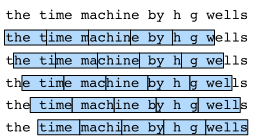

# Language Models and the Dataset
:label:`sec_language_model`


In :numref:`sec_text_preprocessing`, we see how to map text data into tokens, where these tokens can be viewed as a sequence of discrete observations, such as words or characters.
Assume that the tokens in a text sequence of length $T$ are in turn $x_1, x_2, \ldots, x_T$. 
Then, in the text sequence,
$x_t$($1 \leq t \leq T$) can be considered as the observation or label at time step $t$. Given such a text sequence,
the goal of a *language model* is to estimate the joint probability of the sequence

$$P(x_1, x_2, \ldots, x_T).$$

Language models are incredibly useful. For instance, an ideal language model would be able to generate natural text just on its own, simply by drawing one token at a time $x_t \sim P(x_t \mid x_{t-1}, \ldots, x_1)$.
Quite unlike the monkey using a typewriter, all text emerging from such a model would pass as natural language, e.g., English text. Furthermore, it would be sufficient for generating a meaningful dialog, simply by conditioning the text on previous dialog fragments.
Clearly we are still very far from designing such a system, since it would need to *understand* the text rather than just generate grammatically sensible content.

Nonetheless, language models are of great service even in their limited form.
For instance, the phrases "to recognize speech" and "to wreck a nice beach" sound very similar.
This can cause ambiguity in speech recognition,
which is easily resolved through a language model that rejects the second translation as outlandish.
Likewise, in a document summarization algorithm
it is worthwhile knowing that "dog bites man" is much more frequent than "man bites dog", or that "I want to eat grandma" is a rather disturbing statement, whereas "I want to eat, grandma" is much more benign.


## Learning a Language Model

The obvious question is how we should model a document, or even a sequence of tokens. 
Suppose that we tokenize text data at the word level.
We can take recourse to the analysis we applied to sequence models in :numref:`sec_sequence`.
Let us start by applying basic probability rules:

$$P(x_1, x_2, \ldots, x_T) = \prod_{t=1}^T P(x_t  \mid  x_1, \ldots, x_{t-1}).$$

For example, 
the probability of a text sequence containing four words would be given as:

$$P(\text{deep}, \text{learning}, \text{is}, \text{fun}) =  P(\text{deep}) P(\text{learning}  \mid  \text{deep}) P(\text{is}  \mid  \text{deep}, \text{learning}) P(\text{fun}  \mid  \text{deep}, \text{learning}, \text{is}).$$

In order to compute the language model, we need to calculate the
probability of words and the conditional probability of a word given
the previous few words.
Such probabilities are essentially
language model parameters.

Here, we
assume that the training dataset is a large text corpus, such as all
Wikipedia entries, [Project Gutenberg](https://en.wikipedia.org/wiki/Project_Gutenberg),
and all text posted on the
Web.
The probability of words can be calculated from the relative word
frequency of a given word in the training dataset.
For example, the estimate $\hat{P}(\text{deep})$ can be calculated as the
probability of any sentence starting with the word "deep". A
slightly less accurate approach would be to count all occurrences of
the word "deep" and divide it by the total number of words in
the corpus.
This works fairly well, particularly for frequent
words. Moving on, we could attempt to estimate

$$\hat{P}(\text{learning} \mid \text{deep}) = \frac{n(\text{deep, learning})}{n(\text{deep})},$$

where $n(x)$ and $n(x, x')$ are the number of occurrences of singletons
and consecutive word pairs, respectively.
Unfortunately, estimating the
probability of a word pair is somewhat more difficult, since the
occurrences of "deep learning" are a lot less frequent. In
particular, for some unusual word combinations it may be tricky to
find enough occurrences to get accurate estimates.
Things take a turn for the worse for three-word combinations and beyond.
There will be many plausible three-word combinations that we likely will not see in our dataset.
Unless we provide some solution to assign such word combinations nonzero count, we will not be able to use them in a language model. If the dataset is small or if the words are very rare, we might not find even a single one of them.

A common strategy is to perform some form of *Laplace smoothing*.
The solution is to
add a small constant to all counts. 
Denote by $n$ the total number of words in
the training set
and $m$ the number of unique words.
This solution helps with singletons, e.g., via

$$\begin{aligned}
	\hat{P}(x) & = \frac{n(x) + \epsilon_1/m}{n + \epsilon_1}, \\
	\hat{P}(x' \mid x) & = \frac{n(x, x') + \epsilon_2 \hat{P}(x')}{n(x) + \epsilon_2}, \\
	\hat{P}(x'' \mid x,x') & = \frac{n(x, x',x'') + \epsilon_3 \hat{P}(x'')}{n(x, x') + \epsilon_3}.
\end{aligned}$$

Here $\epsilon_1,\epsilon_2$, and $\epsilon_3$ are hyperparameters.
Take $\epsilon_1$ as an example:
when $\epsilon_1 = 0$, no smoothing is applied;
when $\epsilon_1$ approaches positive infinity,
$\hat{P}(x)$ approaches the uniform probability $1/m$. 
The above is a rather primitive variant of what
other techniques can accomplish :cite:`Wood.Gasthaus.Archambeau.ea.2011`.


Unfortunately, models like this get unwieldy rather quickly
for the following reasons. First, we need to store all counts.
Second, this entirely ignores the meaning of the words. For
instance, "cat" and "feline" should occur in related contexts.
It is quite difficult to adjust such models to additional contexts,
whereas, deep learning based language models are well suited to
take this into account.
Last, long word
sequences are almost certain to be novel, hence a model that simply
counts the frequency of previously seen word sequences is bound to perform poorly there.

## Markov Models and $n$-grams

Before we discuss solutions involving deep learning, we need some more terminology and concepts. Recall our discussion of Markov Models in :numref:`sec_sequence`.
Let us apply this to language modeling. A distribution over sequences satisfies the Markov property of first order if $P(x_{t+1} \mid x_t, \ldots, x_1) = P(x_{t+1} \mid x_t)$. Higher orders correspond to longer dependencies. This leads to a number of approximations that we could apply to model a sequence:

$$
\begin{aligned}
P(x_1, x_2, x_3, x_4) &=  P(x_1) P(x_2) P(x_3) P(x_4),\\
P(x_1, x_2, x_3, x_4) &=  P(x_1) P(x_2  \mid  x_1) P(x_3  \mid  x_2) P(x_4  \mid  x_3),\\
P(x_1, x_2, x_3, x_4) &=  P(x_1) P(x_2  \mid  x_1) P(x_3  \mid  x_1, x_2) P(x_4  \mid  x_2, x_3).
\end{aligned}
$$

The probability formulae that involve one, two, and three variables are typically referred to as *unigram*, *bigram*, and *trigram* models, respectively. In the following, we will learn how to design better models.

## Natural Language Statistics

Let us see how this works on real data.
We construct a vocabulary based on the time machine dataset as introduced in :numref:`sec_text_preprocessing` 
and print the top 10 most frequent words.

```{.python .input  n=1}
from d2l import mxnet as d2l
from mxnet import np, npx
import random
npx.set_np()
```

```python
#@tab pytorch
from d2l import torch as d2l
import torch
import random
```


```python
#@tab tensorflow
from d2l import tensorflow as d2l
import tensorflow as tf
import random
```


```{.python .input  n=2}
#@tab all
tokens = d2l.tokenize(d2l.read_time_machine())
# Since each text line is not necessarily a sentence or a paragraph, we
# concatenate all text lines 
corpus = [token for line in tokens for token in line]
vocab = d2l.Vocab(corpus)
vocab.token_freqs[:10]
```

```{.json .output n=2}
[
 {
  "name": "stdout",
  "output_type": "stream",
  "text": "Downloading ../data/timemachine.txt from http://d2l-data.s3-accelerate.amazonaws.com/timemachine.txt...\n"
 },
 {
  "data": {
   "text/plain": "[('the', 2261),\n ('i', 1267),\n ('and', 1245),\n ('of', 1155),\n ('a', 816),\n ('to', 695),\n ('was', 552),\n ('in', 541),\n ('that', 443),\n ('my', 440)]"
  },
  "execution_count": 2,
  "metadata": {},
  "output_type": "execute_result"
 }
]
```

As we can see, the most popular words are actually quite boring to look at.
They are often referred to as *stop words* and thus filtered out.
Nonetheless, they still carry meaning and we will still use them.
Besides, it is quite clear that the word frequency decays rather rapidly. The $10^{\mathrm{th}}$ most frequent word is less than $1/5$ as common as the most popular one. To get a better idea, we plot the figure of the word frequency.

```{.python .input  n=3}
#@tab all
freqs = [freq for token, freq in vocab.token_freqs]
d2l.plot(freqs, xlabel='token: x', ylabel='frequency: n(x)',
         xscale='log', yscale='log')
```

```{.json .output n=3}
[
 {
  "data": {
   "image/svg+xml": "<?xml version=\"1.0\" encoding=\"utf-8\" standalone=\"no\"?>\n<!DOCTYPE svg PUBLIC \"-//W3C//DTD SVG 1.1//EN\"\n  \"http://www.w3.org/Graphics/SVG/1.1/DTD/svg11.dtd\">\n<!-- Created with matplotlib (https://matplotlib.org/) -->\n<svg height=\"180.65625pt\" version=\"1.1\" viewBox=\"0 0 247.978125 180.65625\" width=\"247.978125pt\" xmlns=\"http://www.w3.org/2000/svg\" xmlns:xlink=\"http://www.w3.org/1999/xlink\">\n <defs>\n  <style type=\"text/css\">\n*{stroke-linecap:butt;stroke-linejoin:round;}\n  </style>\n </defs>\n <g id=\"figure_1\">\n  <g id=\"patch_1\">\n   <path d=\"M 0 180.65625 \nL 247.978125 180.65625 \nL 247.978125 0 \nL 0 0 \nz\n\" style=\"fill:none;\"/>\n  </g>\n  <g id=\"axes_1\">\n   <g id=\"patch_2\">\n    <path d=\"M 45.478125 143.1 \nL 240.778125 143.1 \nL 240.778125 7.2 \nL 45.478125 7.2 \nz\n\" style=\"fill:#ffffff;\"/>\n   </g>\n   <g id=\"matplotlib.axis_1\">\n    <g id=\"xtick_1\">\n     <g id=\"line2d_1\">\n      <path clip-path=\"url(#p32b9f31ab7)\" d=\"M 54.355398 143.1 \nL 54.355398 7.2 \n\" style=\"fill:none;stroke:#b0b0b0;stroke-linecap:square;stroke-width:0.8;\"/>\n     </g>\n     <g id=\"line2d_2\">\n      <defs>\n       <path d=\"M 0 0 \nL 0 3.5 \n\" id=\"mf342cb5dfe\" style=\"stroke:#000000;stroke-width:0.8;\"/>\n      </defs>\n      <g>\n       <use style=\"stroke:#000000;stroke-width:0.8;\" x=\"54.355398\" xlink:href=\"#mf342cb5dfe\" y=\"143.1\"/>\n      </g>\n     </g>\n     <g id=\"text_1\">\n      <!-- $\\mathdefault{10^{0}}$ -->\n      <defs>\n       <path d=\"M 12.40625 8.296875 \nL 28.515625 8.296875 \nL 28.515625 63.921875 \nL 10.984375 60.40625 \nL 10.984375 69.390625 \nL 28.421875 72.90625 \nL 38.28125 72.90625 \nL 38.28125 8.296875 \nL 54.390625 8.296875 \nL 54.390625 0 \nL 12.40625 0 \nz\n\" id=\"DejaVuSans-49\"/>\n       <path d=\"M 31.78125 66.40625 \nQ 24.171875 66.40625 20.328125 58.90625 \nQ 16.5 51.421875 16.5 36.375 \nQ 16.5 21.390625 20.328125 13.890625 \nQ 24.171875 6.390625 31.78125 6.390625 \nQ 39.453125 6.390625 43.28125 13.890625 \nQ 47.125 21.390625 47.125 36.375 \nQ 47.125 51.421875 43.28125 58.90625 \nQ 39.453125 66.40625 31.78125 66.40625 \nz\nM 31.78125 74.21875 \nQ 44.046875 74.21875 50.515625 64.515625 \nQ 56.984375 54.828125 56.984375 36.375 \nQ 56.984375 17.96875 50.515625 8.265625 \nQ 44.046875 -1.421875 31.78125 -1.421875 \nQ 19.53125 -1.421875 13.0625 8.265625 \nQ 6.59375 17.96875 6.59375 36.375 \nQ 6.59375 54.828125 13.0625 64.515625 \nQ 19.53125 74.21875 31.78125 74.21875 \nz\n\" id=\"DejaVuSans-48\"/>\n      </defs>\n      <g transform=\"translate(45.555398 157.698438)scale(0.1 -0.1)\">\n       <use transform=\"translate(0 0.765625)\" xlink:href=\"#DejaVuSans-49\"/>\n       <use transform=\"translate(63.623047 0.765625)\" xlink:href=\"#DejaVuSans-48\"/>\n       <use transform=\"translate(128.203125 39.046875)scale(0.7)\" xlink:href=\"#DejaVuSans-48\"/>\n      </g>\n     </g>\n    </g>\n    <g id=\"xtick_2\">\n     <g id=\"line2d_3\">\n      <path clip-path=\"url(#p32b9f31ab7)\" d=\"M 102.85613 143.1 \nL 102.85613 7.2 \n\" style=\"fill:none;stroke:#b0b0b0;stroke-linecap:square;stroke-width:0.8;\"/>\n     </g>\n     <g id=\"line2d_4\">\n      <g>\n       <use style=\"stroke:#000000;stroke-width:0.8;\" x=\"102.85613\" xlink:href=\"#mf342cb5dfe\" y=\"143.1\"/>\n      </g>\n     </g>\n     <g id=\"text_2\">\n      <!-- $\\mathdefault{10^{1}}$ -->\n      <g transform=\"translate(94.05613 157.698438)scale(0.1 -0.1)\">\n       <use transform=\"translate(0 0.684375)\" xlink:href=\"#DejaVuSans-49\"/>\n       <use transform=\"translate(63.623047 0.684375)\" xlink:href=\"#DejaVuSans-48\"/>\n       <use transform=\"translate(128.203125 38.965625)scale(0.7)\" xlink:href=\"#DejaVuSans-49\"/>\n      </g>\n     </g>\n    </g>\n    <g id=\"xtick_3\">\n     <g id=\"line2d_5\">\n      <path clip-path=\"url(#p32b9f31ab7)\" d=\"M 151.356861 143.1 \nL 151.356861 7.2 \n\" style=\"fill:none;stroke:#b0b0b0;stroke-linecap:square;stroke-width:0.8;\"/>\n     </g>\n     <g id=\"line2d_6\">\n      <g>\n       <use style=\"stroke:#000000;stroke-width:0.8;\" x=\"151.356861\" xlink:href=\"#mf342cb5dfe\" y=\"143.1\"/>\n      </g>\n     </g>\n     <g id=\"text_3\">\n      <!-- $\\mathdefault{10^{2}}$ -->\n      <defs>\n       <path d=\"M 19.1875 8.296875 \nL 53.609375 8.296875 \nL 53.609375 0 \nL 7.328125 0 \nL 7.328125 8.296875 \nQ 12.9375 14.109375 22.625 23.890625 \nQ 32.328125 33.6875 34.8125 36.53125 \nQ 39.546875 41.84375 41.421875 45.53125 \nQ 43.3125 49.21875 43.3125 52.78125 \nQ 43.3125 58.59375 39.234375 62.25 \nQ 35.15625 65.921875 28.609375 65.921875 \nQ 23.96875 65.921875 18.8125 64.3125 \nQ 13.671875 62.703125 7.8125 59.421875 \nL 7.8125 69.390625 \nQ 13.765625 71.78125 18.9375 73 \nQ 24.125 74.21875 28.421875 74.21875 \nQ 39.75 74.21875 46.484375 68.546875 \nQ 53.21875 62.890625 53.21875 53.421875 \nQ 53.21875 48.921875 51.53125 44.890625 \nQ 49.859375 40.875 45.40625 35.40625 \nQ 44.1875 33.984375 37.640625 27.21875 \nQ 31.109375 20.453125 19.1875 8.296875 \nz\n\" id=\"DejaVuSans-50\"/>\n      </defs>\n      <g transform=\"translate(142.556861 157.698438)scale(0.1 -0.1)\">\n       <use transform=\"translate(0 0.765625)\" xlink:href=\"#DejaVuSans-49\"/>\n       <use transform=\"translate(63.623047 0.765625)\" xlink:href=\"#DejaVuSans-48\"/>\n       <use transform=\"translate(128.203125 39.046875)scale(0.7)\" xlink:href=\"#DejaVuSans-50\"/>\n      </g>\n     </g>\n    </g>\n    <g id=\"xtick_4\">\n     <g id=\"line2d_7\">\n      <path clip-path=\"url(#p32b9f31ab7)\" d=\"M 199.857593 143.1 \nL 199.857593 7.2 \n\" style=\"fill:none;stroke:#b0b0b0;stroke-linecap:square;stroke-width:0.8;\"/>\n     </g>\n     <g id=\"line2d_8\">\n      <g>\n       <use style=\"stroke:#000000;stroke-width:0.8;\" x=\"199.857593\" xlink:href=\"#mf342cb5dfe\" y=\"143.1\"/>\n      </g>\n     </g>\n     <g id=\"text_4\">\n      <!-- $\\mathdefault{10^{3}}$ -->\n      <defs>\n       <path d=\"M 40.578125 39.3125 \nQ 47.65625 37.796875 51.625 33 \nQ 55.609375 28.21875 55.609375 21.1875 \nQ 55.609375 10.40625 48.1875 4.484375 \nQ 40.765625 -1.421875 27.09375 -1.421875 \nQ 22.515625 -1.421875 17.65625 -0.515625 \nQ 12.796875 0.390625 7.625 2.203125 \nL 7.625 11.71875 \nQ 11.71875 9.328125 16.59375 8.109375 \nQ 21.484375 6.890625 26.8125 6.890625 \nQ 36.078125 6.890625 40.9375 10.546875 \nQ 45.796875 14.203125 45.796875 21.1875 \nQ 45.796875 27.640625 41.28125 31.265625 \nQ 36.765625 34.90625 28.71875 34.90625 \nL 20.21875 34.90625 \nL 20.21875 43.015625 \nL 29.109375 43.015625 \nQ 36.375 43.015625 40.234375 45.921875 \nQ 44.09375 48.828125 44.09375 54.296875 \nQ 44.09375 59.90625 40.109375 62.90625 \nQ 36.140625 65.921875 28.71875 65.921875 \nQ 24.65625 65.921875 20.015625 65.03125 \nQ 15.375 64.15625 9.8125 62.3125 \nL 9.8125 71.09375 \nQ 15.4375 72.65625 20.34375 73.4375 \nQ 25.25 74.21875 29.59375 74.21875 \nQ 40.828125 74.21875 47.359375 69.109375 \nQ 53.90625 64.015625 53.90625 55.328125 \nQ 53.90625 49.265625 50.4375 45.09375 \nQ 46.96875 40.921875 40.578125 39.3125 \nz\n\" id=\"DejaVuSans-51\"/>\n      </defs>\n      <g transform=\"translate(191.057593 157.698438)scale(0.1 -0.1)\">\n       <use transform=\"translate(0 0.765625)\" xlink:href=\"#DejaVuSans-49\"/>\n       <use transform=\"translate(63.623047 0.765625)\" xlink:href=\"#DejaVuSans-48\"/>\n       <use transform=\"translate(128.203125 39.046875)scale(0.7)\" xlink:href=\"#DejaVuSans-51\"/>\n      </g>\n     </g>\n    </g>\n    <g id=\"xtick_5\">\n     <g id=\"line2d_9\">\n      <defs>\n       <path d=\"M 0 0 \nL 0 2 \n\" id=\"m25ed16ae26\" style=\"stroke:#000000;stroke-width:0.6;\"/>\n      </defs>\n      <g>\n       <use style=\"stroke:#000000;stroke-width:0.6;\" x=\"46.842539\" xlink:href=\"#m25ed16ae26\" y=\"143.1\"/>\n      </g>\n     </g>\n    </g>\n    <g id=\"xtick_6\">\n     <g id=\"line2d_10\">\n      <g>\n       <use style=\"stroke:#000000;stroke-width:0.6;\" x=\"49.655191\" xlink:href=\"#m25ed16ae26\" y=\"143.1\"/>\n      </g>\n     </g>\n    </g>\n    <g id=\"xtick_7\">\n     <g id=\"line2d_11\">\n      <g>\n       <use style=\"stroke:#000000;stroke-width:0.6;\" x=\"52.136126\" xlink:href=\"#m25ed16ae26\" y=\"143.1\"/>\n      </g>\n     </g>\n    </g>\n    <g id=\"xtick_8\">\n     <g id=\"line2d_12\">\n      <g>\n       <use style=\"stroke:#000000;stroke-width:0.6;\" x=\"68.955573\" xlink:href=\"#m25ed16ae26\" y=\"143.1\"/>\n      </g>\n     </g>\n    </g>\n    <g id=\"xtick_9\">\n     <g id=\"line2d_13\">\n      <g>\n       <use style=\"stroke:#000000;stroke-width:0.6;\" x=\"77.496128\" xlink:href=\"#m25ed16ae26\" y=\"143.1\"/>\n      </g>\n     </g>\n    </g>\n    <g id=\"xtick_10\">\n     <g id=\"line2d_14\">\n      <g>\n       <use style=\"stroke:#000000;stroke-width:0.6;\" x=\"83.555748\" xlink:href=\"#m25ed16ae26\" y=\"143.1\"/>\n      </g>\n     </g>\n    </g>\n    <g id=\"xtick_11\">\n     <g id=\"line2d_15\">\n      <g>\n       <use style=\"stroke:#000000;stroke-width:0.6;\" x=\"88.255954\" xlink:href=\"#m25ed16ae26\" y=\"143.1\"/>\n      </g>\n     </g>\n    </g>\n    <g id=\"xtick_12\">\n     <g id=\"line2d_16\">\n      <g>\n       <use style=\"stroke:#000000;stroke-width:0.6;\" x=\"92.096303\" xlink:href=\"#m25ed16ae26\" y=\"143.1\"/>\n      </g>\n     </g>\n    </g>\n    <g id=\"xtick_13\">\n     <g id=\"line2d_17\">\n      <g>\n       <use style=\"stroke:#000000;stroke-width:0.6;\" x=\"95.343271\" xlink:href=\"#m25ed16ae26\" y=\"143.1\"/>\n      </g>\n     </g>\n    </g>\n    <g id=\"xtick_14\">\n     <g id=\"line2d_18\">\n      <g>\n       <use style=\"stroke:#000000;stroke-width:0.6;\" x=\"98.155923\" xlink:href=\"#m25ed16ae26\" y=\"143.1\"/>\n      </g>\n     </g>\n    </g>\n    <g id=\"xtick_15\">\n     <g id=\"line2d_19\">\n      <g>\n       <use style=\"stroke:#000000;stroke-width:0.6;\" x=\"100.636858\" xlink:href=\"#m25ed16ae26\" y=\"143.1\"/>\n      </g>\n     </g>\n    </g>\n    <g id=\"xtick_16\">\n     <g id=\"line2d_20\">\n      <g>\n       <use style=\"stroke:#000000;stroke-width:0.6;\" x=\"117.456305\" xlink:href=\"#m25ed16ae26\" y=\"143.1\"/>\n      </g>\n     </g>\n    </g>\n    <g id=\"xtick_17\">\n     <g id=\"line2d_21\">\n      <g>\n       <use style=\"stroke:#000000;stroke-width:0.6;\" x=\"125.99686\" xlink:href=\"#m25ed16ae26\" y=\"143.1\"/>\n      </g>\n     </g>\n    </g>\n    <g id=\"xtick_18\">\n     <g id=\"line2d_22\">\n      <g>\n       <use style=\"stroke:#000000;stroke-width:0.6;\" x=\"132.05648\" xlink:href=\"#m25ed16ae26\" y=\"143.1\"/>\n      </g>\n     </g>\n    </g>\n    <g id=\"xtick_19\">\n     <g id=\"line2d_23\">\n      <g>\n       <use style=\"stroke:#000000;stroke-width:0.6;\" x=\"136.756686\" xlink:href=\"#m25ed16ae26\" y=\"143.1\"/>\n      </g>\n     </g>\n    </g>\n    <g id=\"xtick_20\">\n     <g id=\"line2d_24\">\n      <g>\n       <use style=\"stroke:#000000;stroke-width:0.6;\" x=\"140.597035\" xlink:href=\"#m25ed16ae26\" y=\"143.1\"/>\n      </g>\n     </g>\n    </g>\n    <g id=\"xtick_21\">\n     <g id=\"line2d_25\">\n      <g>\n       <use style=\"stroke:#000000;stroke-width:0.6;\" x=\"143.844003\" xlink:href=\"#m25ed16ae26\" y=\"143.1\"/>\n      </g>\n     </g>\n    </g>\n    <g id=\"xtick_22\">\n     <g id=\"line2d_26\">\n      <g>\n       <use style=\"stroke:#000000;stroke-width:0.6;\" x=\"146.656655\" xlink:href=\"#m25ed16ae26\" y=\"143.1\"/>\n      </g>\n     </g>\n    </g>\n    <g id=\"xtick_23\">\n     <g id=\"line2d_27\">\n      <g>\n       <use style=\"stroke:#000000;stroke-width:0.6;\" x=\"149.13759\" xlink:href=\"#m25ed16ae26\" y=\"143.1\"/>\n      </g>\n     </g>\n    </g>\n    <g id=\"xtick_24\">\n     <g id=\"line2d_28\">\n      <g>\n       <use style=\"stroke:#000000;stroke-width:0.6;\" x=\"165.957036\" xlink:href=\"#m25ed16ae26\" y=\"143.1\"/>\n      </g>\n     </g>\n    </g>\n    <g id=\"xtick_25\">\n     <g id=\"line2d_29\">\n      <g>\n       <use style=\"stroke:#000000;stroke-width:0.6;\" x=\"174.497591\" xlink:href=\"#m25ed16ae26\" y=\"143.1\"/>\n      </g>\n     </g>\n    </g>\n    <g id=\"xtick_26\">\n     <g id=\"line2d_30\">\n      <g>\n       <use style=\"stroke:#000000;stroke-width:0.6;\" x=\"180.557211\" xlink:href=\"#m25ed16ae26\" y=\"143.1\"/>\n      </g>\n     </g>\n    </g>\n    <g id=\"xtick_27\">\n     <g id=\"line2d_31\">\n      <g>\n       <use style=\"stroke:#000000;stroke-width:0.6;\" x=\"185.257418\" xlink:href=\"#m25ed16ae26\" y=\"143.1\"/>\n      </g>\n     </g>\n    </g>\n    <g id=\"xtick_28\">\n     <g id=\"line2d_32\">\n      <g>\n       <use style=\"stroke:#000000;stroke-width:0.6;\" x=\"189.097766\" xlink:href=\"#m25ed16ae26\" y=\"143.1\"/>\n      </g>\n     </g>\n    </g>\n    <g id=\"xtick_29\">\n     <g id=\"line2d_33\">\n      <g>\n       <use style=\"stroke:#000000;stroke-width:0.6;\" x=\"192.344735\" xlink:href=\"#m25ed16ae26\" y=\"143.1\"/>\n      </g>\n     </g>\n    </g>\n    <g id=\"xtick_30\">\n     <g id=\"line2d_34\">\n      <g>\n       <use style=\"stroke:#000000;stroke-width:0.6;\" x=\"195.157387\" xlink:href=\"#m25ed16ae26\" y=\"143.1\"/>\n      </g>\n     </g>\n    </g>\n    <g id=\"xtick_31\">\n     <g id=\"line2d_35\">\n      <g>\n       <use style=\"stroke:#000000;stroke-width:0.6;\" x=\"197.638321\" xlink:href=\"#m25ed16ae26\" y=\"143.1\"/>\n      </g>\n     </g>\n    </g>\n    <g id=\"xtick_32\">\n     <g id=\"line2d_36\">\n      <g>\n       <use style=\"stroke:#000000;stroke-width:0.6;\" x=\"214.457768\" xlink:href=\"#m25ed16ae26\" y=\"143.1\"/>\n      </g>\n     </g>\n    </g>\n    <g id=\"xtick_33\">\n     <g id=\"line2d_37\">\n      <g>\n       <use style=\"stroke:#000000;stroke-width:0.6;\" x=\"222.998323\" xlink:href=\"#m25ed16ae26\" y=\"143.1\"/>\n      </g>\n     </g>\n    </g>\n    <g id=\"xtick_34\">\n     <g id=\"line2d_38\">\n      <g>\n       <use style=\"stroke:#000000;stroke-width:0.6;\" x=\"229.057943\" xlink:href=\"#m25ed16ae26\" y=\"143.1\"/>\n      </g>\n     </g>\n    </g>\n    <g id=\"xtick_35\">\n     <g id=\"line2d_39\">\n      <g>\n       <use style=\"stroke:#000000;stroke-width:0.6;\" x=\"233.75815\" xlink:href=\"#m25ed16ae26\" y=\"143.1\"/>\n      </g>\n     </g>\n    </g>\n    <g id=\"xtick_36\">\n     <g id=\"line2d_40\">\n      <g>\n       <use style=\"stroke:#000000;stroke-width:0.6;\" x=\"237.598498\" xlink:href=\"#m25ed16ae26\" y=\"143.1\"/>\n      </g>\n     </g>\n    </g>\n    <g id=\"text_5\">\n     <!-- token: x -->\n     <defs>\n      <path d=\"M 18.3125 70.21875 \nL 18.3125 54.6875 \nL 36.8125 54.6875 \nL 36.8125 47.703125 \nL 18.3125 47.703125 \nL 18.3125 18.015625 \nQ 18.3125 11.328125 20.140625 9.421875 \nQ 21.96875 7.515625 27.59375 7.515625 \nL 36.8125 7.515625 \nL 36.8125 0 \nL 27.59375 0 \nQ 17.1875 0 13.234375 3.875 \nQ 9.28125 7.765625 9.28125 18.015625 \nL 9.28125 47.703125 \nL 2.6875 47.703125 \nL 2.6875 54.6875 \nL 9.28125 54.6875 \nL 9.28125 70.21875 \nz\n\" id=\"DejaVuSans-116\"/>\n      <path d=\"M 30.609375 48.390625 \nQ 23.390625 48.390625 19.1875 42.75 \nQ 14.984375 37.109375 14.984375 27.296875 \nQ 14.984375 17.484375 19.15625 11.84375 \nQ 23.34375 6.203125 30.609375 6.203125 \nQ 37.796875 6.203125 41.984375 11.859375 \nQ 46.1875 17.53125 46.1875 27.296875 \nQ 46.1875 37.015625 41.984375 42.703125 \nQ 37.796875 48.390625 30.609375 48.390625 \nz\nM 30.609375 56 \nQ 42.328125 56 49.015625 48.375 \nQ 55.71875 40.765625 55.71875 27.296875 \nQ 55.71875 13.875 49.015625 6.21875 \nQ 42.328125 -1.421875 30.609375 -1.421875 \nQ 18.84375 -1.421875 12.171875 6.21875 \nQ 5.515625 13.875 5.515625 27.296875 \nQ 5.515625 40.765625 12.171875 48.375 \nQ 18.84375 56 30.609375 56 \nz\n\" id=\"DejaVuSans-111\"/>\n      <path d=\"M 9.078125 75.984375 \nL 18.109375 75.984375 \nL 18.109375 31.109375 \nL 44.921875 54.6875 \nL 56.390625 54.6875 \nL 27.390625 29.109375 \nL 57.625 0 \nL 45.90625 0 \nL 18.109375 26.703125 \nL 18.109375 0 \nL 9.078125 0 \nz\n\" id=\"DejaVuSans-107\"/>\n      <path d=\"M 56.203125 29.59375 \nL 56.203125 25.203125 \nL 14.890625 25.203125 \nQ 15.484375 15.921875 20.484375 11.0625 \nQ 25.484375 6.203125 34.421875 6.203125 \nQ 39.59375 6.203125 44.453125 7.46875 \nQ 49.3125 8.734375 54.109375 11.28125 \nL 54.109375 2.78125 \nQ 49.265625 0.734375 44.1875 -0.34375 \nQ 39.109375 -1.421875 33.890625 -1.421875 \nQ 20.796875 -1.421875 13.15625 6.1875 \nQ 5.515625 13.8125 5.515625 26.8125 \nQ 5.515625 40.234375 12.765625 48.109375 \nQ 20.015625 56 32.328125 56 \nQ 43.359375 56 49.78125 48.890625 \nQ 56.203125 41.796875 56.203125 29.59375 \nz\nM 47.21875 32.234375 \nQ 47.125 39.59375 43.09375 43.984375 \nQ 39.0625 48.390625 32.421875 48.390625 \nQ 24.90625 48.390625 20.390625 44.140625 \nQ 15.875 39.890625 15.1875 32.171875 \nz\n\" id=\"DejaVuSans-101\"/>\n      <path d=\"M 54.890625 33.015625 \nL 54.890625 0 \nL 45.90625 0 \nL 45.90625 32.71875 \nQ 45.90625 40.484375 42.875 44.328125 \nQ 39.84375 48.1875 33.796875 48.1875 \nQ 26.515625 48.1875 22.3125 43.546875 \nQ 18.109375 38.921875 18.109375 30.90625 \nL 18.109375 0 \nL 9.078125 0 \nL 9.078125 54.6875 \nL 18.109375 54.6875 \nL 18.109375 46.1875 \nQ 21.34375 51.125 25.703125 53.5625 \nQ 30.078125 56 35.796875 56 \nQ 45.21875 56 50.046875 50.171875 \nQ 54.890625 44.34375 54.890625 33.015625 \nz\n\" id=\"DejaVuSans-110\"/>\n      <path d=\"M 11.71875 12.40625 \nL 22.015625 12.40625 \nL 22.015625 0 \nL 11.71875 0 \nz\nM 11.71875 51.703125 \nL 22.015625 51.703125 \nL 22.015625 39.3125 \nL 11.71875 39.3125 \nz\n\" id=\"DejaVuSans-58\"/>\n      <path id=\"DejaVuSans-32\"/>\n      <path d=\"M 54.890625 54.6875 \nL 35.109375 28.078125 \nL 55.90625 0 \nL 45.3125 0 \nL 29.390625 21.484375 \nL 13.484375 0 \nL 2.875 0 \nL 24.125 28.609375 \nL 4.6875 54.6875 \nL 15.28125 54.6875 \nL 29.78125 35.203125 \nL 44.28125 54.6875 \nz\n\" id=\"DejaVuSans-120\"/>\n     </defs>\n     <g transform=\"translate(122.916406 171.376563)scale(0.1 -0.1)\">\n      <use xlink:href=\"#DejaVuSans-116\"/>\n      <use x=\"39.208984\" xlink:href=\"#DejaVuSans-111\"/>\n      <use x=\"100.390625\" xlink:href=\"#DejaVuSans-107\"/>\n      <use x=\"154.675781\" xlink:href=\"#DejaVuSans-101\"/>\n      <use x=\"216.199219\" xlink:href=\"#DejaVuSans-110\"/>\n      <use x=\"279.578125\" xlink:href=\"#DejaVuSans-58\"/>\n      <use x=\"313.269531\" xlink:href=\"#DejaVuSans-32\"/>\n      <use x=\"345.056641\" xlink:href=\"#DejaVuSans-120\"/>\n     </g>\n    </g>\n   </g>\n   <g id=\"matplotlib.axis_2\">\n    <g id=\"ytick_1\">\n     <g id=\"line2d_41\">\n      <path clip-path=\"url(#p32b9f31ab7)\" d=\"M 45.478125 136.922727 \nL 240.778125 136.922727 \n\" style=\"fill:none;stroke:#b0b0b0;stroke-linecap:square;stroke-width:0.8;\"/>\n     </g>\n     <g id=\"line2d_42\">\n      <defs>\n       <path d=\"M 0 0 \nL -3.5 0 \n\" id=\"mb86b085b2f\" style=\"stroke:#000000;stroke-width:0.8;\"/>\n      </defs>\n      <g>\n       <use style=\"stroke:#000000;stroke-width:0.8;\" x=\"45.478125\" xlink:href=\"#mb86b085b2f\" y=\"136.922727\"/>\n      </g>\n     </g>\n     <g id=\"text_6\">\n      <!-- $\\mathdefault{10^{0}}$ -->\n      <g transform=\"translate(20.878125 140.721946)scale(0.1 -0.1)\">\n       <use transform=\"translate(0 0.765625)\" xlink:href=\"#DejaVuSans-49\"/>\n       <use transform=\"translate(63.623047 0.765625)\" xlink:href=\"#DejaVuSans-48\"/>\n       <use transform=\"translate(128.203125 39.046875)scale(0.7)\" xlink:href=\"#DejaVuSans-48\"/>\n      </g>\n     </g>\n    </g>\n    <g id=\"ytick_2\">\n     <g id=\"line2d_43\">\n      <path clip-path=\"url(#p32b9f31ab7)\" d=\"M 45.478125 100.09077 \nL 240.778125 100.09077 \n\" style=\"fill:none;stroke:#b0b0b0;stroke-linecap:square;stroke-width:0.8;\"/>\n     </g>\n     <g id=\"line2d_44\">\n      <g>\n       <use style=\"stroke:#000000;stroke-width:0.8;\" x=\"45.478125\" xlink:href=\"#mb86b085b2f\" y=\"100.09077\"/>\n      </g>\n     </g>\n     <g id=\"text_7\">\n      <!-- $\\mathdefault{10^{1}}$ -->\n      <g transform=\"translate(20.878125 103.889989)scale(0.1 -0.1)\">\n       <use transform=\"translate(0 0.684375)\" xlink:href=\"#DejaVuSans-49\"/>\n       <use transform=\"translate(63.623047 0.684375)\" xlink:href=\"#DejaVuSans-48\"/>\n       <use transform=\"translate(128.203125 38.965625)scale(0.7)\" xlink:href=\"#DejaVuSans-49\"/>\n      </g>\n     </g>\n    </g>\n    <g id=\"ytick_3\">\n     <g id=\"line2d_45\">\n      <path clip-path=\"url(#p32b9f31ab7)\" d=\"M 45.478125 63.258813 \nL 240.778125 63.258813 \n\" style=\"fill:none;stroke:#b0b0b0;stroke-linecap:square;stroke-width:0.8;\"/>\n     </g>\n     <g id=\"line2d_46\">\n      <g>\n       <use style=\"stroke:#000000;stroke-width:0.8;\" x=\"45.478125\" xlink:href=\"#mb86b085b2f\" y=\"63.258813\"/>\n      </g>\n     </g>\n     <g id=\"text_8\">\n      <!-- $\\mathdefault{10^{2}}$ -->\n      <g transform=\"translate(20.878125 67.058032)scale(0.1 -0.1)\">\n       <use transform=\"translate(0 0.765625)\" xlink:href=\"#DejaVuSans-49\"/>\n       <use transform=\"translate(63.623047 0.765625)\" xlink:href=\"#DejaVuSans-48\"/>\n       <use transform=\"translate(128.203125 39.046875)scale(0.7)\" xlink:href=\"#DejaVuSans-50\"/>\n      </g>\n     </g>\n    </g>\n    <g id=\"ytick_4\">\n     <g id=\"line2d_47\">\n      <path clip-path=\"url(#p32b9f31ab7)\" d=\"M 45.478125 26.426856 \nL 240.778125 26.426856 \n\" style=\"fill:none;stroke:#b0b0b0;stroke-linecap:square;stroke-width:0.8;\"/>\n     </g>\n     <g id=\"line2d_48\">\n      <g>\n       <use style=\"stroke:#000000;stroke-width:0.8;\" x=\"45.478125\" xlink:href=\"#mb86b085b2f\" y=\"26.426856\"/>\n      </g>\n     </g>\n     <g id=\"text_9\">\n      <!-- $\\mathdefault{10^{3}}$ -->\n      <g transform=\"translate(20.878125 30.226075)scale(0.1 -0.1)\">\n       <use transform=\"translate(0 0.765625)\" xlink:href=\"#DejaVuSans-49\"/>\n       <use transform=\"translate(63.623047 0.765625)\" xlink:href=\"#DejaVuSans-48\"/>\n       <use transform=\"translate(128.203125 39.046875)scale(0.7)\" xlink:href=\"#DejaVuSans-51\"/>\n      </g>\n     </g>\n    </g>\n    <g id=\"ytick_5\">\n     <g id=\"line2d_49\">\n      <defs>\n       <path d=\"M 0 0 \nL -2 0 \n\" id=\"mdf436de16a\" style=\"stroke:#000000;stroke-width:0.6;\"/>\n      </defs>\n      <g>\n       <use style=\"stroke:#000000;stroke-width:0.6;\" x=\"45.478125\" xlink:href=\"#mdf436de16a\" y=\"142.62807\"/>\n      </g>\n     </g>\n    </g>\n    <g id=\"ytick_6\">\n     <g id=\"line2d_50\">\n      <g>\n       <use style=\"stroke:#000000;stroke-width:0.6;\" x=\"45.478125\" xlink:href=\"#mdf436de16a\" y=\"140.492113\"/>\n      </g>\n     </g>\n    </g>\n    <g id=\"ytick_7\">\n     <g id=\"line2d_51\">\n      <g>\n       <use style=\"stroke:#000000;stroke-width:0.6;\" x=\"45.478125\" xlink:href=\"#mdf436de16a\" y=\"138.608065\"/>\n      </g>\n     </g>\n    </g>\n    <g id=\"ytick_8\">\n     <g id=\"line2d_52\">\n      <g>\n       <use style=\"stroke:#000000;stroke-width:0.6;\" x=\"45.478125\" xlink:href=\"#mdf436de16a\" y=\"125.835203\"/>\n      </g>\n     </g>\n    </g>\n    <g id=\"ytick_9\">\n     <g id=\"line2d_53\">\n      <g>\n       <use style=\"stroke:#000000;stroke-width:0.6;\" x=\"45.478125\" xlink:href=\"#mdf436de16a\" y=\"119.349418\"/>\n      </g>\n     </g>\n    </g>\n    <g id=\"ytick_10\">\n     <g id=\"line2d_54\">\n      <g>\n       <use style=\"stroke:#000000;stroke-width:0.6;\" x=\"45.478125\" xlink:href=\"#mdf436de16a\" y=\"114.747679\"/>\n      </g>\n     </g>\n    </g>\n    <g id=\"ytick_11\">\n     <g id=\"line2d_55\">\n      <g>\n       <use style=\"stroke:#000000;stroke-width:0.6;\" x=\"45.478125\" xlink:href=\"#mdf436de16a\" y=\"111.178294\"/>\n      </g>\n     </g>\n    </g>\n    <g id=\"ytick_12\">\n     <g id=\"line2d_56\">\n      <g>\n       <use style=\"stroke:#000000;stroke-width:0.6;\" x=\"45.478125\" xlink:href=\"#mdf436de16a\" y=\"108.261894\"/>\n      </g>\n     </g>\n    </g>\n    <g id=\"ytick_13\">\n     <g id=\"line2d_57\">\n      <g>\n       <use style=\"stroke:#000000;stroke-width:0.6;\" x=\"45.478125\" xlink:href=\"#mdf436de16a\" y=\"105.796112\"/>\n      </g>\n     </g>\n    </g>\n    <g id=\"ytick_14\">\n     <g id=\"line2d_58\">\n      <g>\n       <use style=\"stroke:#000000;stroke-width:0.6;\" x=\"45.478125\" xlink:href=\"#mdf436de16a\" y=\"103.660156\"/>\n      </g>\n     </g>\n    </g>\n    <g id=\"ytick_15\">\n     <g id=\"line2d_59\">\n      <g>\n       <use style=\"stroke:#000000;stroke-width:0.6;\" x=\"45.478125\" xlink:href=\"#mdf436de16a\" y=\"101.776108\"/>\n      </g>\n     </g>\n    </g>\n    <g id=\"ytick_16\">\n     <g id=\"line2d_60\">\n      <g>\n       <use style=\"stroke:#000000;stroke-width:0.6;\" x=\"45.478125\" xlink:href=\"#mdf436de16a\" y=\"89.003246\"/>\n      </g>\n     </g>\n    </g>\n    <g id=\"ytick_17\">\n     <g id=\"line2d_61\">\n      <g>\n       <use style=\"stroke:#000000;stroke-width:0.6;\" x=\"45.478125\" xlink:href=\"#mdf436de16a\" y=\"82.517461\"/>\n      </g>\n     </g>\n    </g>\n    <g id=\"ytick_18\">\n     <g id=\"line2d_62\">\n      <g>\n       <use style=\"stroke:#000000;stroke-width:0.6;\" x=\"45.478125\" xlink:href=\"#mdf436de16a\" y=\"77.915722\"/>\n      </g>\n     </g>\n    </g>\n    <g id=\"ytick_19\">\n     <g id=\"line2d_63\">\n      <g>\n       <use style=\"stroke:#000000;stroke-width:0.6;\" x=\"45.478125\" xlink:href=\"#mdf436de16a\" y=\"74.346337\"/>\n      </g>\n     </g>\n    </g>\n    <g id=\"ytick_20\">\n     <g id=\"line2d_64\">\n      <g>\n       <use style=\"stroke:#000000;stroke-width:0.6;\" x=\"45.478125\" xlink:href=\"#mdf436de16a\" y=\"71.429937\"/>\n      </g>\n     </g>\n    </g>\n    <g id=\"ytick_21\">\n     <g id=\"line2d_65\">\n      <g>\n       <use style=\"stroke:#000000;stroke-width:0.6;\" x=\"45.478125\" xlink:href=\"#mdf436de16a\" y=\"68.964155\"/>\n      </g>\n     </g>\n    </g>\n    <g id=\"ytick_22\">\n     <g id=\"line2d_66\">\n      <g>\n       <use style=\"stroke:#000000;stroke-width:0.6;\" x=\"45.478125\" xlink:href=\"#mdf436de16a\" y=\"66.828198\"/>\n      </g>\n     </g>\n    </g>\n    <g id=\"ytick_23\">\n     <g id=\"line2d_67\">\n      <g>\n       <use style=\"stroke:#000000;stroke-width:0.6;\" x=\"45.478125\" xlink:href=\"#mdf436de16a\" y=\"64.944151\"/>\n      </g>\n     </g>\n    </g>\n    <g id=\"ytick_24\">\n     <g id=\"line2d_68\">\n      <g>\n       <use style=\"stroke:#000000;stroke-width:0.6;\" x=\"45.478125\" xlink:href=\"#mdf436de16a\" y=\"52.171289\"/>\n      </g>\n     </g>\n    </g>\n    <g id=\"ytick_25\">\n     <g id=\"line2d_69\">\n      <g>\n       <use style=\"stroke:#000000;stroke-width:0.6;\" x=\"45.478125\" xlink:href=\"#mdf436de16a\" y=\"45.685503\"/>\n      </g>\n     </g>\n    </g>\n    <g id=\"ytick_26\">\n     <g id=\"line2d_70\">\n      <g>\n       <use style=\"stroke:#000000;stroke-width:0.6;\" x=\"45.478125\" xlink:href=\"#mdf436de16a\" y=\"41.083765\"/>\n      </g>\n     </g>\n    </g>\n    <g id=\"ytick_27\">\n     <g id=\"line2d_71\">\n      <g>\n       <use style=\"stroke:#000000;stroke-width:0.6;\" x=\"45.478125\" xlink:href=\"#mdf436de16a\" y=\"37.51438\"/>\n      </g>\n     </g>\n    </g>\n    <g id=\"ytick_28\">\n     <g id=\"line2d_72\">\n      <g>\n       <use style=\"stroke:#000000;stroke-width:0.6;\" x=\"45.478125\" xlink:href=\"#mdf436de16a\" y=\"34.597979\"/>\n      </g>\n     </g>\n    </g>\n    <g id=\"ytick_29\">\n     <g id=\"line2d_73\">\n      <g>\n       <use style=\"stroke:#000000;stroke-width:0.6;\" x=\"45.478125\" xlink:href=\"#mdf436de16a\" y=\"32.132198\"/>\n      </g>\n     </g>\n    </g>\n    <g id=\"ytick_30\">\n     <g id=\"line2d_74\">\n      <g>\n       <use style=\"stroke:#000000;stroke-width:0.6;\" x=\"45.478125\" xlink:href=\"#mdf436de16a\" y=\"29.996241\"/>\n      </g>\n     </g>\n    </g>\n    <g id=\"ytick_31\">\n     <g id=\"line2d_75\">\n      <g>\n       <use style=\"stroke:#000000;stroke-width:0.6;\" x=\"45.478125\" xlink:href=\"#mdf436de16a\" y=\"28.112194\"/>\n      </g>\n     </g>\n    </g>\n    <g id=\"ytick_32\">\n     <g id=\"line2d_76\">\n      <g>\n       <use style=\"stroke:#000000;stroke-width:0.6;\" x=\"45.478125\" xlink:href=\"#mdf436de16a\" y=\"15.339332\"/>\n      </g>\n     </g>\n    </g>\n    <g id=\"ytick_33\">\n     <g id=\"line2d_77\">\n      <g>\n       <use style=\"stroke:#000000;stroke-width:0.6;\" x=\"45.478125\" xlink:href=\"#mdf436de16a\" y=\"8.853546\"/>\n      </g>\n     </g>\n    </g>\n    <g id=\"text_10\">\n     <!-- frequency: n(x) -->\n     <defs>\n      <path d=\"M 37.109375 75.984375 \nL 37.109375 68.5 \nL 28.515625 68.5 \nQ 23.6875 68.5 21.796875 66.546875 \nQ 19.921875 64.59375 19.921875 59.515625 \nL 19.921875 54.6875 \nL 34.71875 54.6875 \nL 34.71875 47.703125 \nL 19.921875 47.703125 \nL 19.921875 0 \nL 10.890625 0 \nL 10.890625 47.703125 \nL 2.296875 47.703125 \nL 2.296875 54.6875 \nL 10.890625 54.6875 \nL 10.890625 58.5 \nQ 10.890625 67.625 15.140625 71.796875 \nQ 19.390625 75.984375 28.609375 75.984375 \nz\n\" id=\"DejaVuSans-102\"/>\n      <path d=\"M 41.109375 46.296875 \nQ 39.59375 47.171875 37.8125 47.578125 \nQ 36.03125 48 33.890625 48 \nQ 26.265625 48 22.1875 43.046875 \nQ 18.109375 38.09375 18.109375 28.8125 \nL 18.109375 0 \nL 9.078125 0 \nL 9.078125 54.6875 \nL 18.109375 54.6875 \nL 18.109375 46.1875 \nQ 20.953125 51.171875 25.484375 53.578125 \nQ 30.03125 56 36.53125 56 \nQ 37.453125 56 38.578125 55.875 \nQ 39.703125 55.765625 41.0625 55.515625 \nz\n\" id=\"DejaVuSans-114\"/>\n      <path d=\"M 14.796875 27.296875 \nQ 14.796875 17.390625 18.875 11.75 \nQ 22.953125 6.109375 30.078125 6.109375 \nQ 37.203125 6.109375 41.296875 11.75 \nQ 45.40625 17.390625 45.40625 27.296875 \nQ 45.40625 37.203125 41.296875 42.84375 \nQ 37.203125 48.484375 30.078125 48.484375 \nQ 22.953125 48.484375 18.875 42.84375 \nQ 14.796875 37.203125 14.796875 27.296875 \nz\nM 45.40625 8.203125 \nQ 42.578125 3.328125 38.25 0.953125 \nQ 33.9375 -1.421875 27.875 -1.421875 \nQ 17.96875 -1.421875 11.734375 6.484375 \nQ 5.515625 14.40625 5.515625 27.296875 \nQ 5.515625 40.1875 11.734375 48.09375 \nQ 17.96875 56 27.875 56 \nQ 33.9375 56 38.25 53.625 \nQ 42.578125 51.265625 45.40625 46.390625 \nL 45.40625 54.6875 \nL 54.390625 54.6875 \nL 54.390625 -20.796875 \nL 45.40625 -20.796875 \nz\n\" id=\"DejaVuSans-113\"/>\n      <path d=\"M 8.5 21.578125 \nL 8.5 54.6875 \nL 17.484375 54.6875 \nL 17.484375 21.921875 \nQ 17.484375 14.15625 20.5 10.265625 \nQ 23.53125 6.390625 29.59375 6.390625 \nQ 36.859375 6.390625 41.078125 11.03125 \nQ 45.3125 15.671875 45.3125 23.6875 \nL 45.3125 54.6875 \nL 54.296875 54.6875 \nL 54.296875 0 \nL 45.3125 0 \nL 45.3125 8.40625 \nQ 42.046875 3.421875 37.71875 1 \nQ 33.40625 -1.421875 27.6875 -1.421875 \nQ 18.265625 -1.421875 13.375 4.4375 \nQ 8.5 10.296875 8.5 21.578125 \nz\nM 31.109375 56 \nz\n\" id=\"DejaVuSans-117\"/>\n      <path d=\"M 48.78125 52.59375 \nL 48.78125 44.1875 \nQ 44.96875 46.296875 41.140625 47.34375 \nQ 37.3125 48.390625 33.40625 48.390625 \nQ 24.65625 48.390625 19.8125 42.84375 \nQ 14.984375 37.3125 14.984375 27.296875 \nQ 14.984375 17.28125 19.8125 11.734375 \nQ 24.65625 6.203125 33.40625 6.203125 \nQ 37.3125 6.203125 41.140625 7.25 \nQ 44.96875 8.296875 48.78125 10.40625 \nL 48.78125 2.09375 \nQ 45.015625 0.34375 40.984375 -0.53125 \nQ 36.96875 -1.421875 32.421875 -1.421875 \nQ 20.0625 -1.421875 12.78125 6.34375 \nQ 5.515625 14.109375 5.515625 27.296875 \nQ 5.515625 40.671875 12.859375 48.328125 \nQ 20.21875 56 33.015625 56 \nQ 37.15625 56 41.109375 55.140625 \nQ 45.0625 54.296875 48.78125 52.59375 \nz\n\" id=\"DejaVuSans-99\"/>\n      <path d=\"M 32.171875 -5.078125 \nQ 28.375 -14.84375 24.75 -17.8125 \nQ 21.140625 -20.796875 15.09375 -20.796875 \nL 7.90625 -20.796875 \nL 7.90625 -13.28125 \nL 13.1875 -13.28125 \nQ 16.890625 -13.28125 18.9375 -11.515625 \nQ 21 -9.765625 23.484375 -3.21875 \nL 25.09375 0.875 \nL 2.984375 54.6875 \nL 12.5 54.6875 \nL 29.59375 11.921875 \nL 46.6875 54.6875 \nL 56.203125 54.6875 \nz\n\" id=\"DejaVuSans-121\"/>\n      <path d=\"M 31 75.875 \nQ 24.46875 64.65625 21.28125 53.65625 \nQ 18.109375 42.671875 18.109375 31.390625 \nQ 18.109375 20.125 21.3125 9.0625 \nQ 24.515625 -2 31 -13.1875 \nL 23.1875 -13.1875 \nQ 15.875 -1.703125 12.234375 9.375 \nQ 8.59375 20.453125 8.59375 31.390625 \nQ 8.59375 42.28125 12.203125 53.3125 \nQ 15.828125 64.359375 23.1875 75.875 \nz\n\" id=\"DejaVuSans-40\"/>\n      <path d=\"M 8.015625 75.875 \nL 15.828125 75.875 \nQ 23.140625 64.359375 26.78125 53.3125 \nQ 30.421875 42.28125 30.421875 31.390625 \nQ 30.421875 20.453125 26.78125 9.375 \nQ 23.140625 -1.703125 15.828125 -13.1875 \nL 8.015625 -13.1875 \nQ 14.5 -2 17.703125 9.0625 \nQ 20.90625 20.125 20.90625 31.390625 \nQ 20.90625 42.671875 17.703125 53.65625 \nQ 14.5 64.65625 8.015625 75.875 \nz\n\" id=\"DejaVuSans-41\"/>\n     </defs>\n     <g transform=\"translate(14.798438 113.167187)rotate(-90)scale(0.1 -0.1)\">\n      <use xlink:href=\"#DejaVuSans-102\"/>\n      <use x=\"35.205078\" xlink:href=\"#DejaVuSans-114\"/>\n      <use x=\"74.068359\" xlink:href=\"#DejaVuSans-101\"/>\n      <use x=\"135.591797\" xlink:href=\"#DejaVuSans-113\"/>\n      <use x=\"199.068359\" xlink:href=\"#DejaVuSans-117\"/>\n      <use x=\"262.447266\" xlink:href=\"#DejaVuSans-101\"/>\n      <use x=\"323.970703\" xlink:href=\"#DejaVuSans-110\"/>\n      <use x=\"387.349609\" xlink:href=\"#DejaVuSans-99\"/>\n      <use x=\"442.330078\" xlink:href=\"#DejaVuSans-121\"/>\n      <use x=\"494.259766\" xlink:href=\"#DejaVuSans-58\"/>\n      <use x=\"527.951172\" xlink:href=\"#DejaVuSans-32\"/>\n      <use x=\"559.738281\" xlink:href=\"#DejaVuSans-110\"/>\n      <use x=\"623.117188\" xlink:href=\"#DejaVuSans-40\"/>\n      <use x=\"662.130859\" xlink:href=\"#DejaVuSans-120\"/>\n      <use x=\"721.310547\" xlink:href=\"#DejaVuSans-41\"/>\n     </g>\n    </g>\n   </g>\n   <g id=\"line2d_78\">\n    <path clip-path=\"url(#p32b9f31ab7)\" d=\"M -1 22.630819 \nL 54.355398 22.641392 \nL 68.955573 22.921582 \nL 77.496128 24.121839 \nL 83.555748 29.67948 \nL 88.255954 32.246865 \nL 92.096303 35.931745 \nL 95.343271 36.253723 \nL 98.155923 39.450499 \nL 102.85613 39.668628 \nL 104.863705 43.037948 \nL 106.696478 46.732081 \nL 108.382465 47.370841 \nL 111.396684 50.574172 \nL 112.756098 50.940227 \nL 114.033071 51.854528 \nL 115.237033 52.171289 \nL 116.375883 55.941884 \nL 117.456305 56.561158 \nL 118.484001 58.223127 \nL 119.46388 58.223127 \nL 120.400194 58.577295 \nL 121.296653 59.185578 \nL 122.156511 59.435519 \nL 122.982641 59.947432 \nL 123.777588 60.078011 \nL 125.282771 60.078011 \nL 126.687531 60.611258 \nL 127.356273 61.162896 \nL 128.004435 61.162896 \nL 128.633246 61.30383 \nL 129.243828 61.30383 \nL 129.837208 61.446017 \nL 130.414329 62.326748 \nL 130.976058 62.47837 \nL 131.523195 62.785993 \nL 132.05648 64.248567 \nL 133.084176 64.592578 \nL 133.579813 64.592578 \nL 134.064055 64.767399 \nL 134.537414 65.122878 \nL 136.331144 65.858452 \nL 137.173801 65.858452 \nL 137.582816 66.047755 \nL 137.984039 66.047755 \nL 138.377763 66.433217 \nL 139.143796 67.439582 \nL 139.516613 67.860551 \nL 139.882946 68.075265 \nL 140.597035 68.075265 \nL 141.956448 68.964155 \nL 142.60461 68.964155 \nL 142.921362 69.194316 \nL 143.233421 69.905363 \nL 143.540924 70.905433 \nL 144.437383 71.698782 \nL 144.72792 71.698782 \nL 145.014504 72.25042 \nL 145.576233 72.25042 \nL 145.851578 72.821763 \nL 146.123371 73.115275 \nL 146.3917 73.115275 \nL 147.684351 74.669498 \nL 148.90224 74.669498 \nL 149.13759 74.999322 \nL 149.370339 74.999322 \nL 149.600544 75.336091 \nL 149.828261 75.336091 \nL 150.053543 75.680102 \nL 150.715281 75.680102 \nL 150.93132 76.031675 \nL 151.145165 76.031675 \nL 151.566451 76.758887 \nL 151.979476 76.758887 \nL 152.182991 77.135279 \nL 152.384558 77.135279 \nL 152.781996 77.915722 \nL 153.364437 77.915722 \nL 153.743971 78.736206 \nL 153.931205 78.736206 \nL 154.116788 79.162789 \nL 154.843191 79.162789 \nL 155.020944 79.60106 \nL 155.887881 79.60106 \nL 156.057068 80.051679 \nL 156.720543 80.051679 \nL 156.883197 80.515361 \nL 157.678144 80.515361 \nL 157.833596 80.992887 \nL 158.141099 80.992887 \nL 158.293184 81.485108 \nL 158.890773 81.485108 \nL 159.037558 81.992957 \nL 159.328095 81.992957 \nL 159.471874 82.517461 \nL 159.756522 82.517461 \nL 159.897416 83.059747 \nL 160.037374 83.059747 \nL 160.176408 83.621065 \nL 160.858138 83.621065 \nL 160.991875 84.202798 \nL 161.518493 84.202798 \nL 161.648115 84.80649 \nL 162.409533 84.80649 \nL 162.533803 85.433861 \nL 162.902271 85.433861 \nL 163.023676 86.086846 \nL 163.502415 86.086846 \nL 163.620418 86.767626 \nL 164.200719 86.767626 \nL 164.314886 87.478673 \nL 165.423752 87.478673 \nL 165.638689 88.222803 \nL 166.374151 88.222803 \nL 166.579651 89.003246 \nL 167.675405 89.003246 \nL 167.86865 89.823729 \nL 168.716963 89.823729 \nL 168.900926 90.688584 \nL 169.173892 90.688584 \nL 169.353924 91.602885 \nL 169.972187 91.602885 \nL 170.145551 92.572632 \nL 171.483372 92.572632 \nL 171.64478 93.604984 \nL 172.433771 93.604984 \nL 172.588084 94.708589 \nL 173.490948 94.708589 \nL 173.637733 95.894013 \nL 175.256101 95.894013 \nL 175.391124 97.17437 \nL 176.37712 97.17437 \nL 176.505167 98.566197 \nL 178.33794 98.566197 \nL 178.454636 100.09077 \nL 180.451629 100.09077 \nL 180.609805 101.776108 \nL 182.42068 101.776108 \nL 182.564787 103.660156 \nL 185.257418 103.660156 \nL 185.383422 105.796112 \nL 188.528445 105.796112 \nL 188.672225 108.261894 \nL 191.67211 108.261894 \nL 191.796014 111.178294 \nL 195.754423 111.178294 \nL 195.882004 114.747679 \nL 200.724191 114.747679 \nL 200.84513 119.349418 \nL 207.214001 119.349418 \nL 207.332503 125.835203 \nL 216.282641 125.835203 \nL 216.398216 136.922727 \nL 231.900852 136.922727 \nL 231.900852 136.922727 \n\" style=\"fill:none;stroke:#1f77b4;stroke-linecap:square;stroke-width:1.5;\"/>\n   </g>\n   <g id=\"patch_3\">\n    <path d=\"M 45.478125 143.1 \nL 45.478125 7.2 \n\" style=\"fill:none;stroke:#000000;stroke-linecap:square;stroke-linejoin:miter;stroke-width:0.8;\"/>\n   </g>\n   <g id=\"patch_4\">\n    <path d=\"M 240.778125 143.1 \nL 240.778125 7.2 \n\" style=\"fill:none;stroke:#000000;stroke-linecap:square;stroke-linejoin:miter;stroke-width:0.8;\"/>\n   </g>\n   <g id=\"patch_5\">\n    <path d=\"M 45.478125 143.1 \nL 240.778125 143.1 \n\" style=\"fill:none;stroke:#000000;stroke-linecap:square;stroke-linejoin:miter;stroke-width:0.8;\"/>\n   </g>\n   <g id=\"patch_6\">\n    <path d=\"M 45.478125 7.2 \nL 240.778125 7.2 \n\" style=\"fill:none;stroke:#000000;stroke-linecap:square;stroke-linejoin:miter;stroke-width:0.8;\"/>\n   </g>\n  </g>\n </g>\n <defs>\n  <clipPath id=\"p32b9f31ab7\">\n   <rect height=\"135.9\" width=\"195.3\" x=\"45.478125\" y=\"7.2\"/>\n  </clipPath>\n </defs>\n</svg>\n",
   "text/plain": "<Figure size 252x180 with 1 Axes>"
  },
  "metadata": {
   "needs_background": "light"
  },
  "output_type": "display_data"
 }
]
```

We are on to something quite fundamental here: the word frequency decays rapidly in a well-defined way.
After dealing with the first few words as exceptions, all the remaining words roughly follow a straight line on a log-log plot. This means that words satisfy *Zipf's law*,
which states that the frequency $n_i$ of the $i^\mathrm{th}$ most frequent word
is:

$$n_i \propto \frac{1}{i^\alpha},$$
:eqlabel:`eq_zipf_law`

which is equivalent to

$$\log n_i = -\alpha \log i + c,$$

where $\alpha$ is the exponent that characterizes the distribution and $c$ is a constant.
This should already give us pause if we want to model words by count statistics and smoothing.
After all, we will significantly overestimate the frequency of the tail, also known as the infrequent words. But what about the other word combinations, such as bigrams, trigrams, and beyond?
Let us see whether the bigram frequency behaves in the same manner as the unigram frequency.

```{.python .input  n=4}
#@tab all
bigram_tokens = [pair for pair in zip(corpus[:-1], corpus[1:])]
bigram_vocab = d2l.Vocab(bigram_tokens)
bigram_vocab.token_freqs[:10]
```

```{.json .output n=4}
[
 {
  "data": {
   "text/plain": "[(('of', 'the'), 309),\n (('in', 'the'), 169),\n (('i', 'had'), 130),\n (('i', 'was'), 112),\n (('and', 'the'), 109),\n (('the', 'time'), 102),\n (('it', 'was'), 99),\n (('to', 'the'), 85),\n (('as', 'i'), 78),\n (('of', 'a'), 73)]"
  },
  "execution_count": 4,
  "metadata": {},
  "output_type": "execute_result"
 }
]
```

One thing is notable here. Out of the ten most frequent word pairs, nine are composed of both stop words and only one is relevant to the actual book---"the time". Furthermore, let us see whether the trigram frequency behaves in the same manner.

```{.python .input  n=5}
#@tab all
trigram_tokens = [triple for triple in zip(
    corpus[:-2], corpus[1:-1], corpus[2:])]
trigram_vocab = d2l.Vocab(trigram_tokens)
trigram_vocab.token_freqs[:10]
```

```{.json .output n=5}
[
 {
  "data": {
   "text/plain": "[(('the', 'time', 'traveller'), 59),\n (('the', 'time', 'machine'), 30),\n (('the', 'medical', 'man'), 24),\n (('it', 'seemed', 'to'), 16),\n (('here', 'and', 'there'), 15),\n (('it', 'was', 'a'), 15),\n (('i', 'did', 'not'), 14),\n (('seemed', 'to', 'me'), 14),\n (('i', 'began', 'to'), 13),\n (('i', 'saw', 'the'), 13)]"
  },
  "execution_count": 5,
  "metadata": {},
  "output_type": "execute_result"
 }
]
```

Last, let us visualize the token frequency among these three models: unigrams, bigrams, and trigrams.

```{.python .input  n=6}
#@tab all
bigram_freqs = [freq for token, freq in bigram_vocab.token_freqs]
trigram_freqs = [freq for token, freq in trigram_vocab.token_freqs]
d2l.plot([freqs, bigram_freqs, trigram_freqs], xlabel='token: x',
         ylabel='frequency: n(x)', xscale='log', yscale='log',
         legend=['unigram', 'bigram', 'trigram'])
```

```{.json .output n=6}
[
 {
  "data": {
   "image/svg+xml": "<?xml version=\"1.0\" encoding=\"utf-8\" standalone=\"no\"?>\n<!DOCTYPE svg PUBLIC \"-//W3C//DTD SVG 1.1//EN\"\n  \"http://www.w3.org/Graphics/SVG/1.1/DTD/svg11.dtd\">\n<!-- Created with matplotlib (https://matplotlib.org/) -->\n<svg height=\"180.65625pt\" version=\"1.1\" viewBox=\"0 0 247.978125 180.65625\" width=\"247.978125pt\" xmlns=\"http://www.w3.org/2000/svg\" xmlns:xlink=\"http://www.w3.org/1999/xlink\">\n <defs>\n  <style type=\"text/css\">\n*{stroke-linecap:butt;stroke-linejoin:round;}\n  </style>\n </defs>\n <g id=\"figure_1\">\n  <g id=\"patch_1\">\n   <path d=\"M 0 180.65625 \nL 247.978125 180.65625 \nL 247.978125 0 \nL 0 0 \nz\n\" style=\"fill:none;\"/>\n  </g>\n  <g id=\"axes_1\">\n   <g id=\"patch_2\">\n    <path d=\"M 45.478125 143.1 \nL 240.778125 143.1 \nL 240.778125 7.2 \nL 45.478125 7.2 \nz\n\" style=\"fill:#ffffff;\"/>\n   </g>\n   <g id=\"matplotlib.axis_1\">\n    <g id=\"xtick_1\">\n     <g id=\"line2d_1\">\n      <path clip-path=\"url(#p64b671cf9e)\" d=\"M 54.355398 143.1 \nL 54.355398 7.2 \n\" style=\"fill:none;stroke:#b0b0b0;stroke-linecap:square;stroke-width:0.8;\"/>\n     </g>\n     <g id=\"line2d_2\">\n      <defs>\n       <path d=\"M 0 0 \nL 0 3.5 \n\" id=\"m4304e5d1d3\" style=\"stroke:#000000;stroke-width:0.8;\"/>\n      </defs>\n      <g>\n       <use style=\"stroke:#000000;stroke-width:0.8;\" x=\"54.355398\" xlink:href=\"#m4304e5d1d3\" y=\"143.1\"/>\n      </g>\n     </g>\n     <g id=\"text_1\">\n      <!-- $\\mathdefault{10^{0}}$ -->\n      <defs>\n       <path d=\"M 12.40625 8.296875 \nL 28.515625 8.296875 \nL 28.515625 63.921875 \nL 10.984375 60.40625 \nL 10.984375 69.390625 \nL 28.421875 72.90625 \nL 38.28125 72.90625 \nL 38.28125 8.296875 \nL 54.390625 8.296875 \nL 54.390625 0 \nL 12.40625 0 \nz\n\" id=\"DejaVuSans-49\"/>\n       <path d=\"M 31.78125 66.40625 \nQ 24.171875 66.40625 20.328125 58.90625 \nQ 16.5 51.421875 16.5 36.375 \nQ 16.5 21.390625 20.328125 13.890625 \nQ 24.171875 6.390625 31.78125 6.390625 \nQ 39.453125 6.390625 43.28125 13.890625 \nQ 47.125 21.390625 47.125 36.375 \nQ 47.125 51.421875 43.28125 58.90625 \nQ 39.453125 66.40625 31.78125 66.40625 \nz\nM 31.78125 74.21875 \nQ 44.046875 74.21875 50.515625 64.515625 \nQ 56.984375 54.828125 56.984375 36.375 \nQ 56.984375 17.96875 50.515625 8.265625 \nQ 44.046875 -1.421875 31.78125 -1.421875 \nQ 19.53125 -1.421875 13.0625 8.265625 \nQ 6.59375 17.96875 6.59375 36.375 \nQ 6.59375 54.828125 13.0625 64.515625 \nQ 19.53125 74.21875 31.78125 74.21875 \nz\n\" id=\"DejaVuSans-48\"/>\n      </defs>\n      <g transform=\"translate(45.555398 157.698438)scale(0.1 -0.1)\">\n       <use transform=\"translate(0 0.765625)\" xlink:href=\"#DejaVuSans-49\"/>\n       <use transform=\"translate(63.623047 0.765625)\" xlink:href=\"#DejaVuSans-48\"/>\n       <use transform=\"translate(128.203125 39.046875)scale(0.7)\" xlink:href=\"#DejaVuSans-48\"/>\n      </g>\n     </g>\n    </g>\n    <g id=\"xtick_2\">\n     <g id=\"line2d_3\">\n      <path clip-path=\"url(#p64b671cf9e)\" d=\"M 94.026857 143.1 \nL 94.026857 7.2 \n\" style=\"fill:none;stroke:#b0b0b0;stroke-linecap:square;stroke-width:0.8;\"/>\n     </g>\n     <g id=\"line2d_4\">\n      <g>\n       <use style=\"stroke:#000000;stroke-width:0.8;\" x=\"94.026857\" xlink:href=\"#m4304e5d1d3\" y=\"143.1\"/>\n      </g>\n     </g>\n     <g id=\"text_2\">\n      <!-- $\\mathdefault{10^{1}}$ -->\n      <g transform=\"translate(85.226857 157.698438)scale(0.1 -0.1)\">\n       <use transform=\"translate(0 0.684375)\" xlink:href=\"#DejaVuSans-49\"/>\n       <use transform=\"translate(63.623047 0.684375)\" xlink:href=\"#DejaVuSans-48\"/>\n       <use transform=\"translate(128.203125 38.965625)scale(0.7)\" xlink:href=\"#DejaVuSans-49\"/>\n      </g>\n     </g>\n    </g>\n    <g id=\"xtick_3\">\n     <g id=\"line2d_5\">\n      <path clip-path=\"url(#p64b671cf9e)\" d=\"M 133.698316 143.1 \nL 133.698316 7.2 \n\" style=\"fill:none;stroke:#b0b0b0;stroke-linecap:square;stroke-width:0.8;\"/>\n     </g>\n     <g id=\"line2d_6\">\n      <g>\n       <use style=\"stroke:#000000;stroke-width:0.8;\" x=\"133.698316\" xlink:href=\"#m4304e5d1d3\" y=\"143.1\"/>\n      </g>\n     </g>\n     <g id=\"text_3\">\n      <!-- $\\mathdefault{10^{2}}$ -->\n      <defs>\n       <path d=\"M 19.1875 8.296875 \nL 53.609375 8.296875 \nL 53.609375 0 \nL 7.328125 0 \nL 7.328125 8.296875 \nQ 12.9375 14.109375 22.625 23.890625 \nQ 32.328125 33.6875 34.8125 36.53125 \nQ 39.546875 41.84375 41.421875 45.53125 \nQ 43.3125 49.21875 43.3125 52.78125 \nQ 43.3125 58.59375 39.234375 62.25 \nQ 35.15625 65.921875 28.609375 65.921875 \nQ 23.96875 65.921875 18.8125 64.3125 \nQ 13.671875 62.703125 7.8125 59.421875 \nL 7.8125 69.390625 \nQ 13.765625 71.78125 18.9375 73 \nQ 24.125 74.21875 28.421875 74.21875 \nQ 39.75 74.21875 46.484375 68.546875 \nQ 53.21875 62.890625 53.21875 53.421875 \nQ 53.21875 48.921875 51.53125 44.890625 \nQ 49.859375 40.875 45.40625 35.40625 \nQ 44.1875 33.984375 37.640625 27.21875 \nQ 31.109375 20.453125 19.1875 8.296875 \nz\n\" id=\"DejaVuSans-50\"/>\n      </defs>\n      <g transform=\"translate(124.898316 157.698438)scale(0.1 -0.1)\">\n       <use transform=\"translate(0 0.765625)\" xlink:href=\"#DejaVuSans-49\"/>\n       <use transform=\"translate(63.623047 0.765625)\" xlink:href=\"#DejaVuSans-48\"/>\n       <use transform=\"translate(128.203125 39.046875)scale(0.7)\" xlink:href=\"#DejaVuSans-50\"/>\n      </g>\n     </g>\n    </g>\n    <g id=\"xtick_4\">\n     <g id=\"line2d_7\">\n      <path clip-path=\"url(#p64b671cf9e)\" d=\"M 173.369775 143.1 \nL 173.369775 7.2 \n\" style=\"fill:none;stroke:#b0b0b0;stroke-linecap:square;stroke-width:0.8;\"/>\n     </g>\n     <g id=\"line2d_8\">\n      <g>\n       <use style=\"stroke:#000000;stroke-width:0.8;\" x=\"173.369775\" xlink:href=\"#m4304e5d1d3\" y=\"143.1\"/>\n      </g>\n     </g>\n     <g id=\"text_4\">\n      <!-- $\\mathdefault{10^{3}}$ -->\n      <defs>\n       <path d=\"M 40.578125 39.3125 \nQ 47.65625 37.796875 51.625 33 \nQ 55.609375 28.21875 55.609375 21.1875 \nQ 55.609375 10.40625 48.1875 4.484375 \nQ 40.765625 -1.421875 27.09375 -1.421875 \nQ 22.515625 -1.421875 17.65625 -0.515625 \nQ 12.796875 0.390625 7.625 2.203125 \nL 7.625 11.71875 \nQ 11.71875 9.328125 16.59375 8.109375 \nQ 21.484375 6.890625 26.8125 6.890625 \nQ 36.078125 6.890625 40.9375 10.546875 \nQ 45.796875 14.203125 45.796875 21.1875 \nQ 45.796875 27.640625 41.28125 31.265625 \nQ 36.765625 34.90625 28.71875 34.90625 \nL 20.21875 34.90625 \nL 20.21875 43.015625 \nL 29.109375 43.015625 \nQ 36.375 43.015625 40.234375 45.921875 \nQ 44.09375 48.828125 44.09375 54.296875 \nQ 44.09375 59.90625 40.109375 62.90625 \nQ 36.140625 65.921875 28.71875 65.921875 \nQ 24.65625 65.921875 20.015625 65.03125 \nQ 15.375 64.15625 9.8125 62.3125 \nL 9.8125 71.09375 \nQ 15.4375 72.65625 20.34375 73.4375 \nQ 25.25 74.21875 29.59375 74.21875 \nQ 40.828125 74.21875 47.359375 69.109375 \nQ 53.90625 64.015625 53.90625 55.328125 \nQ 53.90625 49.265625 50.4375 45.09375 \nQ 46.96875 40.921875 40.578125 39.3125 \nz\n\" id=\"DejaVuSans-51\"/>\n      </defs>\n      <g transform=\"translate(164.569775 157.698438)scale(0.1 -0.1)\">\n       <use transform=\"translate(0 0.765625)\" xlink:href=\"#DejaVuSans-49\"/>\n       <use transform=\"translate(63.623047 0.765625)\" xlink:href=\"#DejaVuSans-48\"/>\n       <use transform=\"translate(128.203125 39.046875)scale(0.7)\" xlink:href=\"#DejaVuSans-51\"/>\n      </g>\n     </g>\n    </g>\n    <g id=\"xtick_5\">\n     <g id=\"line2d_9\">\n      <path clip-path=\"url(#p64b671cf9e)\" d=\"M 213.041234 143.1 \nL 213.041234 7.2 \n\" style=\"fill:none;stroke:#b0b0b0;stroke-linecap:square;stroke-width:0.8;\"/>\n     </g>\n     <g id=\"line2d_10\">\n      <g>\n       <use style=\"stroke:#000000;stroke-width:0.8;\" x=\"213.041234\" xlink:href=\"#m4304e5d1d3\" y=\"143.1\"/>\n      </g>\n     </g>\n     <g id=\"text_5\">\n      <!-- $\\mathdefault{10^{4}}$ -->\n      <defs>\n       <path d=\"M 37.796875 64.3125 \nL 12.890625 25.390625 \nL 37.796875 25.390625 \nz\nM 35.203125 72.90625 \nL 47.609375 72.90625 \nL 47.609375 25.390625 \nL 58.015625 25.390625 \nL 58.015625 17.1875 \nL 47.609375 17.1875 \nL 47.609375 0 \nL 37.796875 0 \nL 37.796875 17.1875 \nL 4.890625 17.1875 \nL 4.890625 26.703125 \nz\n\" id=\"DejaVuSans-52\"/>\n      </defs>\n      <g transform=\"translate(204.241234 157.698438)scale(0.1 -0.1)\">\n       <use transform=\"translate(0 0.684375)\" xlink:href=\"#DejaVuSans-49\"/>\n       <use transform=\"translate(63.623047 0.684375)\" xlink:href=\"#DejaVuSans-48\"/>\n       <use transform=\"translate(128.203125 38.965625)scale(0.7)\" xlink:href=\"#DejaVuSans-52\"/>\n      </g>\n     </g>\n    </g>\n    <g id=\"xtick_6\">\n     <g id=\"line2d_11\">\n      <defs>\n       <path d=\"M 0 0 \nL 0 2 \n\" id=\"m8ccfab6828\" style=\"stroke:#000000;stroke-width:0.6;\"/>\n      </defs>\n      <g>\n       <use style=\"stroke:#000000;stroke-width:0.6;\" x=\"45.554334\" xlink:href=\"#m8ccfab6828\" y=\"143.1\"/>\n      </g>\n     </g>\n    </g>\n    <g id=\"xtick_7\">\n     <g id=\"line2d_12\">\n      <g>\n       <use style=\"stroke:#000000;stroke-width:0.6;\" x=\"48.210211\" xlink:href=\"#m8ccfab6828\" y=\"143.1\"/>\n      </g>\n     </g>\n    </g>\n    <g id=\"xtick_8\">\n     <g id=\"line2d_13\">\n      <g>\n       <use style=\"stroke:#000000;stroke-width:0.6;\" x=\"50.510836\" xlink:href=\"#m8ccfab6828\" y=\"143.1\"/>\n      </g>\n     </g>\n    </g>\n    <g id=\"xtick_9\">\n     <g id=\"line2d_14\">\n      <g>\n       <use style=\"stroke:#000000;stroke-width:0.6;\" x=\"52.540131\" xlink:href=\"#m8ccfab6828\" y=\"143.1\"/>\n      </g>\n     </g>\n    </g>\n    <g id=\"xtick_10\">\n     <g id=\"line2d_15\">\n      <g>\n       <use style=\"stroke:#000000;stroke-width:0.6;\" x=\"66.297697\" xlink:href=\"#m8ccfab6828\" y=\"143.1\"/>\n      </g>\n     </g>\n    </g>\n    <g id=\"xtick_11\">\n     <g id=\"line2d_16\">\n      <g>\n       <use style=\"stroke:#000000;stroke-width:0.6;\" x=\"73.283494\" xlink:href=\"#m8ccfab6828\" y=\"143.1\"/>\n      </g>\n     </g>\n    </g>\n    <g id=\"xtick_12\">\n     <g id=\"line2d_17\">\n      <g>\n       <use style=\"stroke:#000000;stroke-width:0.6;\" x=\"78.239996\" xlink:href=\"#m8ccfab6828\" y=\"143.1\"/>\n      </g>\n     </g>\n    </g>\n    <g id=\"xtick_13\">\n     <g id=\"line2d_18\">\n      <g>\n       <use style=\"stroke:#000000;stroke-width:0.6;\" x=\"82.084558\" xlink:href=\"#m8ccfab6828\" y=\"143.1\"/>\n      </g>\n     </g>\n    </g>\n    <g id=\"xtick_14\">\n     <g id=\"line2d_19\">\n      <g>\n       <use style=\"stroke:#000000;stroke-width:0.6;\" x=\"85.225793\" xlink:href=\"#m8ccfab6828\" y=\"143.1\"/>\n      </g>\n     </g>\n    </g>\n    <g id=\"xtick_15\">\n     <g id=\"line2d_20\">\n      <g>\n       <use style=\"stroke:#000000;stroke-width:0.6;\" x=\"87.88167\" xlink:href=\"#m8ccfab6828\" y=\"143.1\"/>\n      </g>\n     </g>\n    </g>\n    <g id=\"xtick_16\">\n     <g id=\"line2d_21\">\n      <g>\n       <use style=\"stroke:#000000;stroke-width:0.6;\" x=\"90.182295\" xlink:href=\"#m8ccfab6828\" y=\"143.1\"/>\n      </g>\n     </g>\n    </g>\n    <g id=\"xtick_17\">\n     <g id=\"line2d_22\">\n      <g>\n       <use style=\"stroke:#000000;stroke-width:0.6;\" x=\"92.21159\" xlink:href=\"#m8ccfab6828\" y=\"143.1\"/>\n      </g>\n     </g>\n    </g>\n    <g id=\"xtick_18\">\n     <g id=\"line2d_23\">\n      <g>\n       <use style=\"stroke:#000000;stroke-width:0.6;\" x=\"105.969156\" xlink:href=\"#m8ccfab6828\" y=\"143.1\"/>\n      </g>\n     </g>\n    </g>\n    <g id=\"xtick_19\">\n     <g id=\"line2d_24\">\n      <g>\n       <use style=\"stroke:#000000;stroke-width:0.6;\" x=\"112.954953\" xlink:href=\"#m8ccfab6828\" y=\"143.1\"/>\n      </g>\n     </g>\n    </g>\n    <g id=\"xtick_20\">\n     <g id=\"line2d_25\">\n      <g>\n       <use style=\"stroke:#000000;stroke-width:0.6;\" x=\"117.911455\" xlink:href=\"#m8ccfab6828\" y=\"143.1\"/>\n      </g>\n     </g>\n    </g>\n    <g id=\"xtick_21\">\n     <g id=\"line2d_26\">\n      <g>\n       <use style=\"stroke:#000000;stroke-width:0.6;\" x=\"121.756017\" xlink:href=\"#m8ccfab6828\" y=\"143.1\"/>\n      </g>\n     </g>\n    </g>\n    <g id=\"xtick_22\">\n     <g id=\"line2d_27\">\n      <g>\n       <use style=\"stroke:#000000;stroke-width:0.6;\" x=\"124.897252\" xlink:href=\"#m8ccfab6828\" y=\"143.1\"/>\n      </g>\n     </g>\n    </g>\n    <g id=\"xtick_23\">\n     <g id=\"line2d_28\">\n      <g>\n       <use style=\"stroke:#000000;stroke-width:0.6;\" x=\"127.553129\" xlink:href=\"#m8ccfab6828\" y=\"143.1\"/>\n      </g>\n     </g>\n    </g>\n    <g id=\"xtick_24\">\n     <g id=\"line2d_29\">\n      <g>\n       <use style=\"stroke:#000000;stroke-width:0.6;\" x=\"129.853754\" xlink:href=\"#m8ccfab6828\" y=\"143.1\"/>\n      </g>\n     </g>\n    </g>\n    <g id=\"xtick_25\">\n     <g id=\"line2d_30\">\n      <g>\n       <use style=\"stroke:#000000;stroke-width:0.6;\" x=\"131.883049\" xlink:href=\"#m8ccfab6828\" y=\"143.1\"/>\n      </g>\n     </g>\n    </g>\n    <g id=\"xtick_26\">\n     <g id=\"line2d_31\">\n      <g>\n       <use style=\"stroke:#000000;stroke-width:0.6;\" x=\"145.640615\" xlink:href=\"#m8ccfab6828\" y=\"143.1\"/>\n      </g>\n     </g>\n    </g>\n    <g id=\"xtick_27\">\n     <g id=\"line2d_32\">\n      <g>\n       <use style=\"stroke:#000000;stroke-width:0.6;\" x=\"152.626412\" xlink:href=\"#m8ccfab6828\" y=\"143.1\"/>\n      </g>\n     </g>\n    </g>\n    <g id=\"xtick_28\">\n     <g id=\"line2d_33\">\n      <g>\n       <use style=\"stroke:#000000;stroke-width:0.6;\" x=\"157.582914\" xlink:href=\"#m8ccfab6828\" y=\"143.1\"/>\n      </g>\n     </g>\n    </g>\n    <g id=\"xtick_29\">\n     <g id=\"line2d_34\">\n      <g>\n       <use style=\"stroke:#000000;stroke-width:0.6;\" x=\"161.427476\" xlink:href=\"#m8ccfab6828\" y=\"143.1\"/>\n      </g>\n     </g>\n    </g>\n    <g id=\"xtick_30\">\n     <g id=\"line2d_35\">\n      <g>\n       <use style=\"stroke:#000000;stroke-width:0.6;\" x=\"164.568711\" xlink:href=\"#m8ccfab6828\" y=\"143.1\"/>\n      </g>\n     </g>\n    </g>\n    <g id=\"xtick_31\">\n     <g id=\"line2d_36\">\n      <g>\n       <use style=\"stroke:#000000;stroke-width:0.6;\" x=\"167.224588\" xlink:href=\"#m8ccfab6828\" y=\"143.1\"/>\n      </g>\n     </g>\n    </g>\n    <g id=\"xtick_32\">\n     <g id=\"line2d_37\">\n      <g>\n       <use style=\"stroke:#000000;stroke-width:0.6;\" x=\"169.525213\" xlink:href=\"#m8ccfab6828\" y=\"143.1\"/>\n      </g>\n     </g>\n    </g>\n    <g id=\"xtick_33\">\n     <g id=\"line2d_38\">\n      <g>\n       <use style=\"stroke:#000000;stroke-width:0.6;\" x=\"171.554508\" xlink:href=\"#m8ccfab6828\" y=\"143.1\"/>\n      </g>\n     </g>\n    </g>\n    <g id=\"xtick_34\">\n     <g id=\"line2d_39\">\n      <g>\n       <use style=\"stroke:#000000;stroke-width:0.6;\" x=\"185.312074\" xlink:href=\"#m8ccfab6828\" y=\"143.1\"/>\n      </g>\n     </g>\n    </g>\n    <g id=\"xtick_35\">\n     <g id=\"line2d_40\">\n      <g>\n       <use style=\"stroke:#000000;stroke-width:0.6;\" x=\"192.297871\" xlink:href=\"#m8ccfab6828\" y=\"143.1\"/>\n      </g>\n     </g>\n    </g>\n    <g id=\"xtick_36\">\n     <g id=\"line2d_41\">\n      <g>\n       <use style=\"stroke:#000000;stroke-width:0.6;\" x=\"197.254373\" xlink:href=\"#m8ccfab6828\" y=\"143.1\"/>\n      </g>\n     </g>\n    </g>\n    <g id=\"xtick_37\">\n     <g id=\"line2d_42\">\n      <g>\n       <use style=\"stroke:#000000;stroke-width:0.6;\" x=\"201.098935\" xlink:href=\"#m8ccfab6828\" y=\"143.1\"/>\n      </g>\n     </g>\n    </g>\n    <g id=\"xtick_38\">\n     <g id=\"line2d_43\">\n      <g>\n       <use style=\"stroke:#000000;stroke-width:0.6;\" x=\"204.24017\" xlink:href=\"#m8ccfab6828\" y=\"143.1\"/>\n      </g>\n     </g>\n    </g>\n    <g id=\"xtick_39\">\n     <g id=\"line2d_44\">\n      <g>\n       <use style=\"stroke:#000000;stroke-width:0.6;\" x=\"206.896047\" xlink:href=\"#m8ccfab6828\" y=\"143.1\"/>\n      </g>\n     </g>\n    </g>\n    <g id=\"xtick_40\">\n     <g id=\"line2d_45\">\n      <g>\n       <use style=\"stroke:#000000;stroke-width:0.6;\" x=\"209.196672\" xlink:href=\"#m8ccfab6828\" y=\"143.1\"/>\n      </g>\n     </g>\n    </g>\n    <g id=\"xtick_41\">\n     <g id=\"line2d_46\">\n      <g>\n       <use style=\"stroke:#000000;stroke-width:0.6;\" x=\"211.225968\" xlink:href=\"#m8ccfab6828\" y=\"143.1\"/>\n      </g>\n     </g>\n    </g>\n    <g id=\"xtick_42\">\n     <g id=\"line2d_47\">\n      <g>\n       <use style=\"stroke:#000000;stroke-width:0.6;\" x=\"224.983533\" xlink:href=\"#m8ccfab6828\" y=\"143.1\"/>\n      </g>\n     </g>\n    </g>\n    <g id=\"xtick_43\">\n     <g id=\"line2d_48\">\n      <g>\n       <use style=\"stroke:#000000;stroke-width:0.6;\" x=\"231.96933\" xlink:href=\"#m8ccfab6828\" y=\"143.1\"/>\n      </g>\n     </g>\n    </g>\n    <g id=\"xtick_44\">\n     <g id=\"line2d_49\">\n      <g>\n       <use style=\"stroke:#000000;stroke-width:0.6;\" x=\"236.925832\" xlink:href=\"#m8ccfab6828\" y=\"143.1\"/>\n      </g>\n     </g>\n    </g>\n    <g id=\"xtick_45\">\n     <g id=\"line2d_50\">\n      <g>\n       <use style=\"stroke:#000000;stroke-width:0.6;\" x=\"240.770394\" xlink:href=\"#m8ccfab6828\" y=\"143.1\"/>\n      </g>\n     </g>\n    </g>\n    <g id=\"text_6\">\n     <!-- token: x -->\n     <defs>\n      <path d=\"M 18.3125 70.21875 \nL 18.3125 54.6875 \nL 36.8125 54.6875 \nL 36.8125 47.703125 \nL 18.3125 47.703125 \nL 18.3125 18.015625 \nQ 18.3125 11.328125 20.140625 9.421875 \nQ 21.96875 7.515625 27.59375 7.515625 \nL 36.8125 7.515625 \nL 36.8125 0 \nL 27.59375 0 \nQ 17.1875 0 13.234375 3.875 \nQ 9.28125 7.765625 9.28125 18.015625 \nL 9.28125 47.703125 \nL 2.6875 47.703125 \nL 2.6875 54.6875 \nL 9.28125 54.6875 \nL 9.28125 70.21875 \nz\n\" id=\"DejaVuSans-116\"/>\n      <path d=\"M 30.609375 48.390625 \nQ 23.390625 48.390625 19.1875 42.75 \nQ 14.984375 37.109375 14.984375 27.296875 \nQ 14.984375 17.484375 19.15625 11.84375 \nQ 23.34375 6.203125 30.609375 6.203125 \nQ 37.796875 6.203125 41.984375 11.859375 \nQ 46.1875 17.53125 46.1875 27.296875 \nQ 46.1875 37.015625 41.984375 42.703125 \nQ 37.796875 48.390625 30.609375 48.390625 \nz\nM 30.609375 56 \nQ 42.328125 56 49.015625 48.375 \nQ 55.71875 40.765625 55.71875 27.296875 \nQ 55.71875 13.875 49.015625 6.21875 \nQ 42.328125 -1.421875 30.609375 -1.421875 \nQ 18.84375 -1.421875 12.171875 6.21875 \nQ 5.515625 13.875 5.515625 27.296875 \nQ 5.515625 40.765625 12.171875 48.375 \nQ 18.84375 56 30.609375 56 \nz\n\" id=\"DejaVuSans-111\"/>\n      <path d=\"M 9.078125 75.984375 \nL 18.109375 75.984375 \nL 18.109375 31.109375 \nL 44.921875 54.6875 \nL 56.390625 54.6875 \nL 27.390625 29.109375 \nL 57.625 0 \nL 45.90625 0 \nL 18.109375 26.703125 \nL 18.109375 0 \nL 9.078125 0 \nz\n\" id=\"DejaVuSans-107\"/>\n      <path d=\"M 56.203125 29.59375 \nL 56.203125 25.203125 \nL 14.890625 25.203125 \nQ 15.484375 15.921875 20.484375 11.0625 \nQ 25.484375 6.203125 34.421875 6.203125 \nQ 39.59375 6.203125 44.453125 7.46875 \nQ 49.3125 8.734375 54.109375 11.28125 \nL 54.109375 2.78125 \nQ 49.265625 0.734375 44.1875 -0.34375 \nQ 39.109375 -1.421875 33.890625 -1.421875 \nQ 20.796875 -1.421875 13.15625 6.1875 \nQ 5.515625 13.8125 5.515625 26.8125 \nQ 5.515625 40.234375 12.765625 48.109375 \nQ 20.015625 56 32.328125 56 \nQ 43.359375 56 49.78125 48.890625 \nQ 56.203125 41.796875 56.203125 29.59375 \nz\nM 47.21875 32.234375 \nQ 47.125 39.59375 43.09375 43.984375 \nQ 39.0625 48.390625 32.421875 48.390625 \nQ 24.90625 48.390625 20.390625 44.140625 \nQ 15.875 39.890625 15.1875 32.171875 \nz\n\" id=\"DejaVuSans-101\"/>\n      <path d=\"M 54.890625 33.015625 \nL 54.890625 0 \nL 45.90625 0 \nL 45.90625 32.71875 \nQ 45.90625 40.484375 42.875 44.328125 \nQ 39.84375 48.1875 33.796875 48.1875 \nQ 26.515625 48.1875 22.3125 43.546875 \nQ 18.109375 38.921875 18.109375 30.90625 \nL 18.109375 0 \nL 9.078125 0 \nL 9.078125 54.6875 \nL 18.109375 54.6875 \nL 18.109375 46.1875 \nQ 21.34375 51.125 25.703125 53.5625 \nQ 30.078125 56 35.796875 56 \nQ 45.21875 56 50.046875 50.171875 \nQ 54.890625 44.34375 54.890625 33.015625 \nz\n\" id=\"DejaVuSans-110\"/>\n      <path d=\"M 11.71875 12.40625 \nL 22.015625 12.40625 \nL 22.015625 0 \nL 11.71875 0 \nz\nM 11.71875 51.703125 \nL 22.015625 51.703125 \nL 22.015625 39.3125 \nL 11.71875 39.3125 \nz\n\" id=\"DejaVuSans-58\"/>\n      <path id=\"DejaVuSans-32\"/>\n      <path d=\"M 54.890625 54.6875 \nL 35.109375 28.078125 \nL 55.90625 0 \nL 45.3125 0 \nL 29.390625 21.484375 \nL 13.484375 0 \nL 2.875 0 \nL 24.125 28.609375 \nL 4.6875 54.6875 \nL 15.28125 54.6875 \nL 29.78125 35.203125 \nL 44.28125 54.6875 \nz\n\" id=\"DejaVuSans-120\"/>\n     </defs>\n     <g transform=\"translate(122.916406 171.376563)scale(0.1 -0.1)\">\n      <use xlink:href=\"#DejaVuSans-116\"/>\n      <use x=\"39.208984\" xlink:href=\"#DejaVuSans-111\"/>\n      <use x=\"100.390625\" xlink:href=\"#DejaVuSans-107\"/>\n      <use x=\"154.675781\" xlink:href=\"#DejaVuSans-101\"/>\n      <use x=\"216.199219\" xlink:href=\"#DejaVuSans-110\"/>\n      <use x=\"279.578125\" xlink:href=\"#DejaVuSans-58\"/>\n      <use x=\"313.269531\" xlink:href=\"#DejaVuSans-32\"/>\n      <use x=\"345.056641\" xlink:href=\"#DejaVuSans-120\"/>\n     </g>\n    </g>\n   </g>\n   <g id=\"matplotlib.axis_2\">\n    <g id=\"ytick_1\">\n     <g id=\"line2d_51\">\n      <path clip-path=\"url(#p64b671cf9e)\" d=\"M 45.478125 136.922727 \nL 240.778125 136.922727 \n\" style=\"fill:none;stroke:#b0b0b0;stroke-linecap:square;stroke-width:0.8;\"/>\n     </g>\n     <g id=\"line2d_52\">\n      <defs>\n       <path d=\"M 0 0 \nL -3.5 0 \n\" id=\"m7b21f54579\" style=\"stroke:#000000;stroke-width:0.8;\"/>\n      </defs>\n      <g>\n       <use style=\"stroke:#000000;stroke-width:0.8;\" x=\"45.478125\" xlink:href=\"#m7b21f54579\" y=\"136.922727\"/>\n      </g>\n     </g>\n     <g id=\"text_7\">\n      <!-- $\\mathdefault{10^{0}}$ -->\n      <g transform=\"translate(20.878125 140.721946)scale(0.1 -0.1)\">\n       <use transform=\"translate(0 0.765625)\" xlink:href=\"#DejaVuSans-49\"/>\n       <use transform=\"translate(63.623047 0.765625)\" xlink:href=\"#DejaVuSans-48\"/>\n       <use transform=\"translate(128.203125 39.046875)scale(0.7)\" xlink:href=\"#DejaVuSans-48\"/>\n      </g>\n     </g>\n    </g>\n    <g id=\"ytick_2\">\n     <g id=\"line2d_53\">\n      <path clip-path=\"url(#p64b671cf9e)\" d=\"M 45.478125 100.09077 \nL 240.778125 100.09077 \n\" style=\"fill:none;stroke:#b0b0b0;stroke-linecap:square;stroke-width:0.8;\"/>\n     </g>\n     <g id=\"line2d_54\">\n      <g>\n       <use style=\"stroke:#000000;stroke-width:0.8;\" x=\"45.478125\" xlink:href=\"#m7b21f54579\" y=\"100.09077\"/>\n      </g>\n     </g>\n     <g id=\"text_8\">\n      <!-- $\\mathdefault{10^{1}}$ -->\n      <g transform=\"translate(20.878125 103.889989)scale(0.1 -0.1)\">\n       <use transform=\"translate(0 0.684375)\" xlink:href=\"#DejaVuSans-49\"/>\n       <use transform=\"translate(63.623047 0.684375)\" xlink:href=\"#DejaVuSans-48\"/>\n       <use transform=\"translate(128.203125 38.965625)scale(0.7)\" xlink:href=\"#DejaVuSans-49\"/>\n      </g>\n     </g>\n    </g>\n    <g id=\"ytick_3\">\n     <g id=\"line2d_55\">\n      <path clip-path=\"url(#p64b671cf9e)\" d=\"M 45.478125 63.258813 \nL 240.778125 63.258813 \n\" style=\"fill:none;stroke:#b0b0b0;stroke-linecap:square;stroke-width:0.8;\"/>\n     </g>\n     <g id=\"line2d_56\">\n      <g>\n       <use style=\"stroke:#000000;stroke-width:0.8;\" x=\"45.478125\" xlink:href=\"#m7b21f54579\" y=\"63.258813\"/>\n      </g>\n     </g>\n     <g id=\"text_9\">\n      <!-- $\\mathdefault{10^{2}}$ -->\n      <g transform=\"translate(20.878125 67.058032)scale(0.1 -0.1)\">\n       <use transform=\"translate(0 0.765625)\" xlink:href=\"#DejaVuSans-49\"/>\n       <use transform=\"translate(63.623047 0.765625)\" xlink:href=\"#DejaVuSans-48\"/>\n       <use transform=\"translate(128.203125 39.046875)scale(0.7)\" xlink:href=\"#DejaVuSans-50\"/>\n      </g>\n     </g>\n    </g>\n    <g id=\"ytick_4\">\n     <g id=\"line2d_57\">\n      <path clip-path=\"url(#p64b671cf9e)\" d=\"M 45.478125 26.426856 \nL 240.778125 26.426856 \n\" style=\"fill:none;stroke:#b0b0b0;stroke-linecap:square;stroke-width:0.8;\"/>\n     </g>\n     <g id=\"line2d_58\">\n      <g>\n       <use style=\"stroke:#000000;stroke-width:0.8;\" x=\"45.478125\" xlink:href=\"#m7b21f54579\" y=\"26.426856\"/>\n      </g>\n     </g>\n     <g id=\"text_10\">\n      <!-- $\\mathdefault{10^{3}}$ -->\n      <g transform=\"translate(20.878125 30.226075)scale(0.1 -0.1)\">\n       <use transform=\"translate(0 0.765625)\" xlink:href=\"#DejaVuSans-49\"/>\n       <use transform=\"translate(63.623047 0.765625)\" xlink:href=\"#DejaVuSans-48\"/>\n       <use transform=\"translate(128.203125 39.046875)scale(0.7)\" xlink:href=\"#DejaVuSans-51\"/>\n      </g>\n     </g>\n    </g>\n    <g id=\"ytick_5\">\n     <g id=\"line2d_59\">\n      <defs>\n       <path d=\"M 0 0 \nL -2 0 \n\" id=\"mef88a07331\" style=\"stroke:#000000;stroke-width:0.6;\"/>\n      </defs>\n      <g>\n       <use style=\"stroke:#000000;stroke-width:0.6;\" x=\"45.478125\" xlink:href=\"#mef88a07331\" y=\"142.62807\"/>\n      </g>\n     </g>\n    </g>\n    <g id=\"ytick_6\">\n     <g id=\"line2d_60\">\n      <g>\n       <use style=\"stroke:#000000;stroke-width:0.6;\" x=\"45.478125\" xlink:href=\"#mef88a07331\" y=\"140.492113\"/>\n      </g>\n     </g>\n    </g>\n    <g id=\"ytick_7\">\n     <g id=\"line2d_61\">\n      <g>\n       <use style=\"stroke:#000000;stroke-width:0.6;\" x=\"45.478125\" xlink:href=\"#mef88a07331\" y=\"138.608065\"/>\n      </g>\n     </g>\n    </g>\n    <g id=\"ytick_8\">\n     <g id=\"line2d_62\">\n      <g>\n       <use style=\"stroke:#000000;stroke-width:0.6;\" x=\"45.478125\" xlink:href=\"#mef88a07331\" y=\"125.835203\"/>\n      </g>\n     </g>\n    </g>\n    <g id=\"ytick_9\">\n     <g id=\"line2d_63\">\n      <g>\n       <use style=\"stroke:#000000;stroke-width:0.6;\" x=\"45.478125\" xlink:href=\"#mef88a07331\" y=\"119.349418\"/>\n      </g>\n     </g>\n    </g>\n    <g id=\"ytick_10\">\n     <g id=\"line2d_64\">\n      <g>\n       <use style=\"stroke:#000000;stroke-width:0.6;\" x=\"45.478125\" xlink:href=\"#mef88a07331\" y=\"114.747679\"/>\n      </g>\n     </g>\n    </g>\n    <g id=\"ytick_11\">\n     <g id=\"line2d_65\">\n      <g>\n       <use style=\"stroke:#000000;stroke-width:0.6;\" x=\"45.478125\" xlink:href=\"#mef88a07331\" y=\"111.178294\"/>\n      </g>\n     </g>\n    </g>\n    <g id=\"ytick_12\">\n     <g id=\"line2d_66\">\n      <g>\n       <use style=\"stroke:#000000;stroke-width:0.6;\" x=\"45.478125\" xlink:href=\"#mef88a07331\" y=\"108.261894\"/>\n      </g>\n     </g>\n    </g>\n    <g id=\"ytick_13\">\n     <g id=\"line2d_67\">\n      <g>\n       <use style=\"stroke:#000000;stroke-width:0.6;\" x=\"45.478125\" xlink:href=\"#mef88a07331\" y=\"105.796112\"/>\n      </g>\n     </g>\n    </g>\n    <g id=\"ytick_14\">\n     <g id=\"line2d_68\">\n      <g>\n       <use style=\"stroke:#000000;stroke-width:0.6;\" x=\"45.478125\" xlink:href=\"#mef88a07331\" y=\"103.660156\"/>\n      </g>\n     </g>\n    </g>\n    <g id=\"ytick_15\">\n     <g id=\"line2d_69\">\n      <g>\n       <use style=\"stroke:#000000;stroke-width:0.6;\" x=\"45.478125\" xlink:href=\"#mef88a07331\" y=\"101.776108\"/>\n      </g>\n     </g>\n    </g>\n    <g id=\"ytick_16\">\n     <g id=\"line2d_70\">\n      <g>\n       <use style=\"stroke:#000000;stroke-width:0.6;\" x=\"45.478125\" xlink:href=\"#mef88a07331\" y=\"89.003246\"/>\n      </g>\n     </g>\n    </g>\n    <g id=\"ytick_17\">\n     <g id=\"line2d_71\">\n      <g>\n       <use style=\"stroke:#000000;stroke-width:0.6;\" x=\"45.478125\" xlink:href=\"#mef88a07331\" y=\"82.517461\"/>\n      </g>\n     </g>\n    </g>\n    <g id=\"ytick_18\">\n     <g id=\"line2d_72\">\n      <g>\n       <use style=\"stroke:#000000;stroke-width:0.6;\" x=\"45.478125\" xlink:href=\"#mef88a07331\" y=\"77.915722\"/>\n      </g>\n     </g>\n    </g>\n    <g id=\"ytick_19\">\n     <g id=\"line2d_73\">\n      <g>\n       <use style=\"stroke:#000000;stroke-width:0.6;\" x=\"45.478125\" xlink:href=\"#mef88a07331\" y=\"74.346337\"/>\n      </g>\n     </g>\n    </g>\n    <g id=\"ytick_20\">\n     <g id=\"line2d_74\">\n      <g>\n       <use style=\"stroke:#000000;stroke-width:0.6;\" x=\"45.478125\" xlink:href=\"#mef88a07331\" y=\"71.429937\"/>\n      </g>\n     </g>\n    </g>\n    <g id=\"ytick_21\">\n     <g id=\"line2d_75\">\n      <g>\n       <use style=\"stroke:#000000;stroke-width:0.6;\" x=\"45.478125\" xlink:href=\"#mef88a07331\" y=\"68.964155\"/>\n      </g>\n     </g>\n    </g>\n    <g id=\"ytick_22\">\n     <g id=\"line2d_76\">\n      <g>\n       <use style=\"stroke:#000000;stroke-width:0.6;\" x=\"45.478125\" xlink:href=\"#mef88a07331\" y=\"66.828198\"/>\n      </g>\n     </g>\n    </g>\n    <g id=\"ytick_23\">\n     <g id=\"line2d_77\">\n      <g>\n       <use style=\"stroke:#000000;stroke-width:0.6;\" x=\"45.478125\" xlink:href=\"#mef88a07331\" y=\"64.944151\"/>\n      </g>\n     </g>\n    </g>\n    <g id=\"ytick_24\">\n     <g id=\"line2d_78\">\n      <g>\n       <use style=\"stroke:#000000;stroke-width:0.6;\" x=\"45.478125\" xlink:href=\"#mef88a07331\" y=\"52.171289\"/>\n      </g>\n     </g>\n    </g>\n    <g id=\"ytick_25\">\n     <g id=\"line2d_79\">\n      <g>\n       <use style=\"stroke:#000000;stroke-width:0.6;\" x=\"45.478125\" xlink:href=\"#mef88a07331\" y=\"45.685503\"/>\n      </g>\n     </g>\n    </g>\n    <g id=\"ytick_26\">\n     <g id=\"line2d_80\">\n      <g>\n       <use style=\"stroke:#000000;stroke-width:0.6;\" x=\"45.478125\" xlink:href=\"#mef88a07331\" y=\"41.083765\"/>\n      </g>\n     </g>\n    </g>\n    <g id=\"ytick_27\">\n     <g id=\"line2d_81\">\n      <g>\n       <use style=\"stroke:#000000;stroke-width:0.6;\" x=\"45.478125\" xlink:href=\"#mef88a07331\" y=\"37.51438\"/>\n      </g>\n     </g>\n    </g>\n    <g id=\"ytick_28\">\n     <g id=\"line2d_82\">\n      <g>\n       <use style=\"stroke:#000000;stroke-width:0.6;\" x=\"45.478125\" xlink:href=\"#mef88a07331\" y=\"34.597979\"/>\n      </g>\n     </g>\n    </g>\n    <g id=\"ytick_29\">\n     <g id=\"line2d_83\">\n      <g>\n       <use style=\"stroke:#000000;stroke-width:0.6;\" x=\"45.478125\" xlink:href=\"#mef88a07331\" y=\"32.132198\"/>\n      </g>\n     </g>\n    </g>\n    <g id=\"ytick_30\">\n     <g id=\"line2d_84\">\n      <g>\n       <use style=\"stroke:#000000;stroke-width:0.6;\" x=\"45.478125\" xlink:href=\"#mef88a07331\" y=\"29.996241\"/>\n      </g>\n     </g>\n    </g>\n    <g id=\"ytick_31\">\n     <g id=\"line2d_85\">\n      <g>\n       <use style=\"stroke:#000000;stroke-width:0.6;\" x=\"45.478125\" xlink:href=\"#mef88a07331\" y=\"28.112194\"/>\n      </g>\n     </g>\n    </g>\n    <g id=\"ytick_32\">\n     <g id=\"line2d_86\">\n      <g>\n       <use style=\"stroke:#000000;stroke-width:0.6;\" x=\"45.478125\" xlink:href=\"#mef88a07331\" y=\"15.339332\"/>\n      </g>\n     </g>\n    </g>\n    <g id=\"ytick_33\">\n     <g id=\"line2d_87\">\n      <g>\n       <use style=\"stroke:#000000;stroke-width:0.6;\" x=\"45.478125\" xlink:href=\"#mef88a07331\" y=\"8.853546\"/>\n      </g>\n     </g>\n    </g>\n    <g id=\"text_11\">\n     <!-- frequency: n(x) -->\n     <defs>\n      <path d=\"M 37.109375 75.984375 \nL 37.109375 68.5 \nL 28.515625 68.5 \nQ 23.6875 68.5 21.796875 66.546875 \nQ 19.921875 64.59375 19.921875 59.515625 \nL 19.921875 54.6875 \nL 34.71875 54.6875 \nL 34.71875 47.703125 \nL 19.921875 47.703125 \nL 19.921875 0 \nL 10.890625 0 \nL 10.890625 47.703125 \nL 2.296875 47.703125 \nL 2.296875 54.6875 \nL 10.890625 54.6875 \nL 10.890625 58.5 \nQ 10.890625 67.625 15.140625 71.796875 \nQ 19.390625 75.984375 28.609375 75.984375 \nz\n\" id=\"DejaVuSans-102\"/>\n      <path d=\"M 41.109375 46.296875 \nQ 39.59375 47.171875 37.8125 47.578125 \nQ 36.03125 48 33.890625 48 \nQ 26.265625 48 22.1875 43.046875 \nQ 18.109375 38.09375 18.109375 28.8125 \nL 18.109375 0 \nL 9.078125 0 \nL 9.078125 54.6875 \nL 18.109375 54.6875 \nL 18.109375 46.1875 \nQ 20.953125 51.171875 25.484375 53.578125 \nQ 30.03125 56 36.53125 56 \nQ 37.453125 56 38.578125 55.875 \nQ 39.703125 55.765625 41.0625 55.515625 \nz\n\" id=\"DejaVuSans-114\"/>\n      <path d=\"M 14.796875 27.296875 \nQ 14.796875 17.390625 18.875 11.75 \nQ 22.953125 6.109375 30.078125 6.109375 \nQ 37.203125 6.109375 41.296875 11.75 \nQ 45.40625 17.390625 45.40625 27.296875 \nQ 45.40625 37.203125 41.296875 42.84375 \nQ 37.203125 48.484375 30.078125 48.484375 \nQ 22.953125 48.484375 18.875 42.84375 \nQ 14.796875 37.203125 14.796875 27.296875 \nz\nM 45.40625 8.203125 \nQ 42.578125 3.328125 38.25 0.953125 \nQ 33.9375 -1.421875 27.875 -1.421875 \nQ 17.96875 -1.421875 11.734375 6.484375 \nQ 5.515625 14.40625 5.515625 27.296875 \nQ 5.515625 40.1875 11.734375 48.09375 \nQ 17.96875 56 27.875 56 \nQ 33.9375 56 38.25 53.625 \nQ 42.578125 51.265625 45.40625 46.390625 \nL 45.40625 54.6875 \nL 54.390625 54.6875 \nL 54.390625 -20.796875 \nL 45.40625 -20.796875 \nz\n\" id=\"DejaVuSans-113\"/>\n      <path d=\"M 8.5 21.578125 \nL 8.5 54.6875 \nL 17.484375 54.6875 \nL 17.484375 21.921875 \nQ 17.484375 14.15625 20.5 10.265625 \nQ 23.53125 6.390625 29.59375 6.390625 \nQ 36.859375 6.390625 41.078125 11.03125 \nQ 45.3125 15.671875 45.3125 23.6875 \nL 45.3125 54.6875 \nL 54.296875 54.6875 \nL 54.296875 0 \nL 45.3125 0 \nL 45.3125 8.40625 \nQ 42.046875 3.421875 37.71875 1 \nQ 33.40625 -1.421875 27.6875 -1.421875 \nQ 18.265625 -1.421875 13.375 4.4375 \nQ 8.5 10.296875 8.5 21.578125 \nz\nM 31.109375 56 \nz\n\" id=\"DejaVuSans-117\"/>\n      <path d=\"M 48.78125 52.59375 \nL 48.78125 44.1875 \nQ 44.96875 46.296875 41.140625 47.34375 \nQ 37.3125 48.390625 33.40625 48.390625 \nQ 24.65625 48.390625 19.8125 42.84375 \nQ 14.984375 37.3125 14.984375 27.296875 \nQ 14.984375 17.28125 19.8125 11.734375 \nQ 24.65625 6.203125 33.40625 6.203125 \nQ 37.3125 6.203125 41.140625 7.25 \nQ 44.96875 8.296875 48.78125 10.40625 \nL 48.78125 2.09375 \nQ 45.015625 0.34375 40.984375 -0.53125 \nQ 36.96875 -1.421875 32.421875 -1.421875 \nQ 20.0625 -1.421875 12.78125 6.34375 \nQ 5.515625 14.109375 5.515625 27.296875 \nQ 5.515625 40.671875 12.859375 48.328125 \nQ 20.21875 56 33.015625 56 \nQ 37.15625 56 41.109375 55.140625 \nQ 45.0625 54.296875 48.78125 52.59375 \nz\n\" id=\"DejaVuSans-99\"/>\n      <path d=\"M 32.171875 -5.078125 \nQ 28.375 -14.84375 24.75 -17.8125 \nQ 21.140625 -20.796875 15.09375 -20.796875 \nL 7.90625 -20.796875 \nL 7.90625 -13.28125 \nL 13.1875 -13.28125 \nQ 16.890625 -13.28125 18.9375 -11.515625 \nQ 21 -9.765625 23.484375 -3.21875 \nL 25.09375 0.875 \nL 2.984375 54.6875 \nL 12.5 54.6875 \nL 29.59375 11.921875 \nL 46.6875 54.6875 \nL 56.203125 54.6875 \nz\n\" id=\"DejaVuSans-121\"/>\n      <path d=\"M 31 75.875 \nQ 24.46875 64.65625 21.28125 53.65625 \nQ 18.109375 42.671875 18.109375 31.390625 \nQ 18.109375 20.125 21.3125 9.0625 \nQ 24.515625 -2 31 -13.1875 \nL 23.1875 -13.1875 \nQ 15.875 -1.703125 12.234375 9.375 \nQ 8.59375 20.453125 8.59375 31.390625 \nQ 8.59375 42.28125 12.203125 53.3125 \nQ 15.828125 64.359375 23.1875 75.875 \nz\n\" id=\"DejaVuSans-40\"/>\n      <path d=\"M 8.015625 75.875 \nL 15.828125 75.875 \nQ 23.140625 64.359375 26.78125 53.3125 \nQ 30.421875 42.28125 30.421875 31.390625 \nQ 30.421875 20.453125 26.78125 9.375 \nQ 23.140625 -1.703125 15.828125 -13.1875 \nL 8.015625 -13.1875 \nQ 14.5 -2 17.703125 9.0625 \nQ 20.90625 20.125 20.90625 31.390625 \nQ 20.90625 42.671875 17.703125 53.65625 \nQ 14.5 64.65625 8.015625 75.875 \nz\n\" id=\"DejaVuSans-41\"/>\n     </defs>\n     <g transform=\"translate(14.798438 113.167187)rotate(-90)scale(0.1 -0.1)\">\n      <use xlink:href=\"#DejaVuSans-102\"/>\n      <use x=\"35.205078\" xlink:href=\"#DejaVuSans-114\"/>\n      <use x=\"74.068359\" xlink:href=\"#DejaVuSans-101\"/>\n      <use x=\"135.591797\" xlink:href=\"#DejaVuSans-113\"/>\n      <use x=\"199.068359\" xlink:href=\"#DejaVuSans-117\"/>\n      <use x=\"262.447266\" xlink:href=\"#DejaVuSans-101\"/>\n      <use x=\"323.970703\" xlink:href=\"#DejaVuSans-110\"/>\n      <use x=\"387.349609\" xlink:href=\"#DejaVuSans-99\"/>\n      <use x=\"442.330078\" xlink:href=\"#DejaVuSans-121\"/>\n      <use x=\"494.259766\" xlink:href=\"#DejaVuSans-58\"/>\n      <use x=\"527.951172\" xlink:href=\"#DejaVuSans-32\"/>\n      <use x=\"559.738281\" xlink:href=\"#DejaVuSans-110\"/>\n      <use x=\"623.117188\" xlink:href=\"#DejaVuSans-40\"/>\n      <use x=\"662.130859\" xlink:href=\"#DejaVuSans-120\"/>\n      <use x=\"721.310547\" xlink:href=\"#DejaVuSans-41\"/>\n     </g>\n    </g>\n   </g>\n   <g id=\"line2d_88\">\n    <path clip-path=\"url(#p64b671cf9e)\" d=\"M -1 22.628465 \nL 54.355398 22.641392 \nL 66.297697 22.921582 \nL 73.283494 24.121839 \nL 78.239996 29.67948 \nL 82.084558 32.246865 \nL 85.225793 35.931745 \nL 87.88167 36.253723 \nL 90.182295 39.450499 \nL 94.026857 39.668628 \nL 95.668965 43.037948 \nL 97.168092 46.732081 \nL 98.547156 47.370841 \nL 101.012654 50.574172 \nL 102.124594 50.940227 \nL 103.169102 51.854528 \nL 104.15389 52.171289 \nL 105.085419 55.941884 \nL 105.969156 56.561158 \nL 106.809766 58.223127 \nL 107.611264 58.223127 \nL 108.377128 58.577295 \nL 109.110391 59.185578 \nL 109.813718 59.435519 \nL 110.489455 59.947432 \nL 111.139687 60.078011 \nL 112.37086 60.078011 \nL 113.519892 60.611258 \nL 114.066893 61.162896 \nL 114.597061 61.162896 \nL 115.111401 61.30383 \nL 115.61083 61.30383 \nL 116.096189 61.446017 \nL 116.568248 62.326748 \nL 117.027718 62.47837 \nL 117.475252 62.785993 \nL 117.911455 64.248567 \nL 118.752065 64.592578 \nL 119.157475 64.592578 \nL 119.553563 64.767399 \nL 119.94075 65.122878 \nL 121.407942 65.858452 \nL 122.097198 65.858452 \nL 122.431754 66.047755 \nL 122.759937 66.047755 \nL 123.081986 66.433217 \nL 123.708567 67.439582 \nL 124.013515 67.860551 \nL 124.313159 68.075265 \nL 124.897252 68.075265 \nL 126.009193 68.964155 \nL 126.53936 68.964155 \nL 126.798449 69.194316 \nL 127.553129 71.165535 \nL 128.038488 71.698782 \nL 128.276134 71.698782 \nL 128.510547 72.25042 \nL 128.970017 72.25042 \nL 129.417551 73.115275 \nL 129.637033 73.115275 \nL 130.898262 74.669498 \nL 131.690544 74.669498 \nL 131.883049 74.999322 \nL 132.073428 74.999322 \nL 132.261726 75.336091 \nL 132.447988 75.336091 \nL 132.632259 75.680102 \nL 133.173531 75.680102 \nL 133.350241 76.031675 \nL 133.525158 76.031675 \nL 133.869751 76.758887 \nL 134.207587 76.758887 \nL 134.374053 77.135279 \nL 134.538926 77.135279 \nL 134.864013 77.915722 \nL 135.340424 77.915722 \nL 135.650867 78.736206 \nL 135.804015 78.736206 \nL 135.955814 79.162789 \nL 136.54998 79.162789 \nL 136.695374 79.60106 \nL 137.40449 79.60106 \nL 137.542877 80.051679 \nL 138.085571 80.051679 \nL 138.218615 80.515361 \nL 138.868847 80.515361 \nL 138.995999 80.992887 \nL 139.247523 80.992887 \nL 139.371922 81.485108 \nL 139.860723 81.485108 \nL 139.980787 81.992957 \nL 140.218433 81.992957 \nL 140.336039 82.517461 \nL 140.568868 82.517461 \nL 140.684113 83.059747 \nL 140.798592 83.059747 \nL 141.025294 83.621065 \nL 141.469941 83.621065 \nL 141.688034 84.202798 \nL 142.010082 84.202798 \nL 142.221485 84.80649 \nL 142.738914 84.80649 \nL 142.941611 85.433861 \nL 143.141952 85.433861 \nL 143.33999 86.086846 \nL 143.632843 86.086846 \nL 143.825349 86.767626 \nL 144.204025 86.767626 \nL 144.390288 87.478673 \nL 145.204412 87.478673 \nL 145.380221 88.222803 \nL 145.981796 88.222803 \nL 146.149886 89.003246 \nL 147.046164 89.003246 \nL 147.204231 89.823729 \nL 147.898113 89.823729 \nL 148.048587 90.688584 \nL 148.271861 90.688584 \nL 148.419119 91.602885 \nL 148.924831 91.602885 \nL 149.066635 92.572632 \nL 150.160914 92.572632 \nL 150.292938 93.604984 \nL 150.938298 93.604984 \nL 151.064519 94.708589 \nL 151.803022 94.708589 \nL 151.923086 95.894013 \nL 153.246839 95.894013 \nL 153.41224 97.17437 \nL 154.163784 97.17437 \nL 154.320651 98.566197 \nL 155.767648 98.566197 \nL 155.910629 100.09077 \nL 157.496553 100.09077 \nL 157.625933 101.776108 \nL 159.107149 101.776108 \nL 159.225022 103.660156 \nL 161.427476 103.660156 \nL 161.56476 105.796112 \nL 164.103032 105.796112 \nL 164.220637 108.261894 \nL 166.674411 108.261894 \nL 166.801003 111.178294 \nL 170.013563 111.178294 \nL 170.138714 114.747679 \nL 174.078613 114.747679 \nL 174.193969 119.349418 \nL 179.386992 119.349418 \nL 179.508069 125.835203 \nL 186.804739 125.835203 \nL 186.922828 136.922727 \nL 199.579747 136.922727 \nL 199.579747 136.922727 \n\" style=\"fill:none;stroke:#1f77b4;stroke-linecap:square;stroke-width:1.5;\"/>\n   </g>\n   <g id=\"line2d_89\">\n    <path clip-path=\"url(#p64b671cf9e)\" d=\"M -1 54.851831 \nL 54.355398 54.8653 \nL 73.283494 61.446017 \nL 78.239996 61.880322 \nL 82.084558 62.942052 \nL 85.225793 63.419577 \nL 87.88167 65.858452 \nL 90.182295 67.23318 \nL 92.21159 68.2929 \nL 94.026857 69.427838 \nL 95.668965 69.664818 \nL 97.168092 70.905433 \nL 98.547156 71.165535 \nL 99.823969 71.165535 \nL 101.012654 71.429937 \nL 102.124594 74.029576 \nL 103.169102 74.029576 \nL 104.15389 74.669498 \nL 105.085419 74.669498 \nL 105.969156 75.336091 \nL 106.809766 75.336091 \nL 108.377128 76.031675 \nL 109.813718 76.031675 \nL 110.489455 76.391149 \nL 111.139687 76.391149 \nL 111.766268 77.520741 \nL 112.37086 77.915722 \nL 112.954953 77.915722 \nL 113.519892 78.320704 \nL 115.111401 78.320704 \nL 115.61083 79.162789 \nL 116.096189 79.60106 \nL 117.027718 79.60106 \nL 117.475252 80.515361 \nL 118.336886 80.515361 \nL 118.752065 81.485108 \nL 119.157475 81.485108 \nL 119.94075 82.517461 \nL 121.052691 82.517461 \nL 121.756017 83.621065 \nL 122.431754 83.621065 \nL 122.759937 84.202798 \nL 123.708567 84.202798 \nL 124.013515 84.80649 \nL 124.607681 84.80649 \nL 124.897252 85.433861 \nL 125.462191 85.433861 \nL 125.737863 86.086846 \nL 126.53936 86.086846 \nL 126.798449 86.767626 \nL 127.553129 86.767626 \nL 127.797518 87.478673 \nL 129.637033 87.478673 \nL 129.853754 88.222803 \nL 130.898262 88.222803 \nL 131.099774 89.003246 \nL 131.495862 89.003246 \nL 131.690544 89.823729 \nL 133.173531 89.823729 \nL 133.350241 90.688584 \nL 134.538926 90.688584 \nL 134.702236 91.602885 \nL 135.18308 91.602885 \nL 135.340424 92.572632 \nL 137.542877 92.572632 \nL 137.680162 93.604984 \nL 139.980787 93.604984 \nL 140.10002 94.708589 \nL 141.796053 94.708589 \nL 142.010082 95.894013 \nL 143.535777 95.894013 \nL 143.729364 97.17437 \nL 145.292541 97.17437 \nL 145.467457 98.566197 \nL 147.438644 98.566197 \nL 147.593166 100.09077 \nL 150.489097 100.09077 \nL 150.61864 101.776108 \nL 152.854615 101.776108 \nL 152.967594 103.660156 \nL 156.099442 103.660156 \nL 156.239707 105.796112 \nL 159.458377 105.796112 \nL 159.57388 108.261894 \nL 163.225504 108.261894 \nL 163.349233 111.178294 \nL 167.82918 111.178294 \nL 167.947593 114.747679 \nL 174.128146 114.747679 \nL 174.243171 119.349418 \nL 182.205262 119.349418 \nL 182.318375 125.835203 \nL 195.477351 125.835203 \nL 195.591578 136.922727 \nL 225.183092 136.922727 \nL 225.183092 136.922727 \n\" style=\"fill:none;stroke:#bf00bf;stroke-dasharray:5.55,2.4;stroke-dashoffset:0;stroke-width:1.5;\"/>\n   </g>\n   <g id=\"line2d_90\">\n    <path clip-path=\"url(#p64b671cf9e)\" d=\"M -1 82.502365 \nL 54.355398 82.517461 \nL 66.297697 86.086846 \nL 73.283494 92.572632 \nL 78.239996 93.604984 \nL 82.084558 93.604984 \nL 85.225793 94.708589 \nL 87.88167 94.708589 \nL 90.182295 95.894013 \nL 92.21159 95.894013 \nL 94.026857 97.17437 \nL 98.547156 97.17437 \nL 99.823969 98.566197 \nL 105.969156 98.566197 \nL 106.809766 100.09077 \nL 109.813718 100.09077 \nL 110.489455 101.776108 \nL 114.066893 101.776108 \nL 114.597061 103.660156 \nL 121.052691 103.660156 \nL 121.407942 105.796112 \nL 126.276316 105.796112 \nL 126.53936 108.261894 \nL 132.632259 108.261894 \nL 132.814579 111.178294 \nL 140.568868 111.178294 \nL 140.684113 114.747679 \nL 148.271861 114.747679 \nL 148.419119 119.349418 \nL 160.652212 119.349418 \nL 160.795788 125.835203 \nL 181.787567 125.835203 \nL 181.903446 136.922727 \nL 231.900852 136.922727 \nL 231.900852 136.922727 \n\" style=\"fill:none;stroke:#008000;stroke-dasharray:9.6,2.4,1.5,2.4;stroke-dashoffset:0;stroke-width:1.5;\"/>\n   </g>\n   <g id=\"patch_3\">\n    <path d=\"M 45.478125 143.1 \nL 45.478125 7.2 \n\" style=\"fill:none;stroke:#000000;stroke-linecap:square;stroke-linejoin:miter;stroke-width:0.8;\"/>\n   </g>\n   <g id=\"patch_4\">\n    <path d=\"M 240.778125 143.1 \nL 240.778125 7.2 \n\" style=\"fill:none;stroke:#000000;stroke-linecap:square;stroke-linejoin:miter;stroke-width:0.8;\"/>\n   </g>\n   <g id=\"patch_5\">\n    <path d=\"M 45.478125 143.1 \nL 240.778125 143.1 \n\" style=\"fill:none;stroke:#000000;stroke-linecap:square;stroke-linejoin:miter;stroke-width:0.8;\"/>\n   </g>\n   <g id=\"patch_6\">\n    <path d=\"M 45.478125 7.2 \nL 240.778125 7.2 \n\" style=\"fill:none;stroke:#000000;stroke-linecap:square;stroke-linejoin:miter;stroke-width:0.8;\"/>\n   </g>\n   <g id=\"legend_1\">\n    <g id=\"patch_7\">\n     <path d=\"M 159.996875 59.234375 \nL 233.778125 59.234375 \nQ 235.778125 59.234375 235.778125 57.234375 \nL 235.778125 14.2 \nQ 235.778125 12.2 233.778125 12.2 \nL 159.996875 12.2 \nQ 157.996875 12.2 157.996875 14.2 \nL 157.996875 57.234375 \nQ 157.996875 59.234375 159.996875 59.234375 \nz\n\" style=\"fill:#ffffff;opacity:0.8;stroke:#cccccc;stroke-linejoin:miter;\"/>\n    </g>\n    <g id=\"line2d_91\">\n     <path d=\"M 161.996875 20.298438 \nL 181.996875 20.298438 \n\" style=\"fill:none;stroke:#1f77b4;stroke-linecap:square;stroke-width:1.5;\"/>\n    </g>\n    <g id=\"line2d_92\"/>\n    <g id=\"text_12\">\n     <!-- unigram -->\n     <defs>\n      <path d=\"M 9.421875 54.6875 \nL 18.40625 54.6875 \nL 18.40625 0 \nL 9.421875 0 \nz\nM 9.421875 75.984375 \nL 18.40625 75.984375 \nL 18.40625 64.59375 \nL 9.421875 64.59375 \nz\n\" id=\"DejaVuSans-105\"/>\n      <path d=\"M 45.40625 27.984375 \nQ 45.40625 37.75 41.375 43.109375 \nQ 37.359375 48.484375 30.078125 48.484375 \nQ 22.859375 48.484375 18.828125 43.109375 \nQ 14.796875 37.75 14.796875 27.984375 \nQ 14.796875 18.265625 18.828125 12.890625 \nQ 22.859375 7.515625 30.078125 7.515625 \nQ 37.359375 7.515625 41.375 12.890625 \nQ 45.40625 18.265625 45.40625 27.984375 \nz\nM 54.390625 6.78125 \nQ 54.390625 -7.171875 48.1875 -13.984375 \nQ 42 -20.796875 29.203125 -20.796875 \nQ 24.46875 -20.796875 20.265625 -20.09375 \nQ 16.0625 -19.390625 12.109375 -17.921875 \nL 12.109375 -9.1875 \nQ 16.0625 -11.328125 19.921875 -12.34375 \nQ 23.78125 -13.375 27.78125 -13.375 \nQ 36.625 -13.375 41.015625 -8.765625 \nQ 45.40625 -4.15625 45.40625 5.171875 \nL 45.40625 9.625 \nQ 42.625 4.78125 38.28125 2.390625 \nQ 33.9375 0 27.875 0 \nQ 17.828125 0 11.671875 7.65625 \nQ 5.515625 15.328125 5.515625 27.984375 \nQ 5.515625 40.671875 11.671875 48.328125 \nQ 17.828125 56 27.875 56 \nQ 33.9375 56 38.28125 53.609375 \nQ 42.625 51.21875 45.40625 46.390625 \nL 45.40625 54.6875 \nL 54.390625 54.6875 \nz\n\" id=\"DejaVuSans-103\"/>\n      <path d=\"M 34.28125 27.484375 \nQ 23.390625 27.484375 19.1875 25 \nQ 14.984375 22.515625 14.984375 16.5 \nQ 14.984375 11.71875 18.140625 8.90625 \nQ 21.296875 6.109375 26.703125 6.109375 \nQ 34.1875 6.109375 38.703125 11.40625 \nQ 43.21875 16.703125 43.21875 25.484375 \nL 43.21875 27.484375 \nz\nM 52.203125 31.203125 \nL 52.203125 0 \nL 43.21875 0 \nL 43.21875 8.296875 \nQ 40.140625 3.328125 35.546875 0.953125 \nQ 30.953125 -1.421875 24.3125 -1.421875 \nQ 15.921875 -1.421875 10.953125 3.296875 \nQ 6 8.015625 6 15.921875 \nQ 6 25.140625 12.171875 29.828125 \nQ 18.359375 34.515625 30.609375 34.515625 \nL 43.21875 34.515625 \nL 43.21875 35.40625 \nQ 43.21875 41.609375 39.140625 45 \nQ 35.0625 48.390625 27.6875 48.390625 \nQ 23 48.390625 18.546875 47.265625 \nQ 14.109375 46.140625 10.015625 43.890625 \nL 10.015625 52.203125 \nQ 14.9375 54.109375 19.578125 55.046875 \nQ 24.21875 56 28.609375 56 \nQ 40.484375 56 46.34375 49.84375 \nQ 52.203125 43.703125 52.203125 31.203125 \nz\n\" id=\"DejaVuSans-97\"/>\n      <path d=\"M 52 44.1875 \nQ 55.375 50.25 60.0625 53.125 \nQ 64.75 56 71.09375 56 \nQ 79.640625 56 84.28125 50.015625 \nQ 88.921875 44.046875 88.921875 33.015625 \nL 88.921875 0 \nL 79.890625 0 \nL 79.890625 32.71875 \nQ 79.890625 40.578125 77.09375 44.375 \nQ 74.3125 48.1875 68.609375 48.1875 \nQ 61.625 48.1875 57.5625 43.546875 \nQ 53.515625 38.921875 53.515625 30.90625 \nL 53.515625 0 \nL 44.484375 0 \nL 44.484375 32.71875 \nQ 44.484375 40.625 41.703125 44.40625 \nQ 38.921875 48.1875 33.109375 48.1875 \nQ 26.21875 48.1875 22.15625 43.53125 \nQ 18.109375 38.875 18.109375 30.90625 \nL 18.109375 0 \nL 9.078125 0 \nL 9.078125 54.6875 \nL 18.109375 54.6875 \nL 18.109375 46.1875 \nQ 21.1875 51.21875 25.484375 53.609375 \nQ 29.78125 56 35.6875 56 \nQ 41.65625 56 45.828125 52.96875 \nQ 50 49.953125 52 44.1875 \nz\n\" id=\"DejaVuSans-109\"/>\n     </defs>\n     <g transform=\"translate(189.996875 23.798438)scale(0.1 -0.1)\">\n      <use xlink:href=\"#DejaVuSans-117\"/>\n      <use x=\"63.378906\" xlink:href=\"#DejaVuSans-110\"/>\n      <use x=\"126.757812\" xlink:href=\"#DejaVuSans-105\"/>\n      <use x=\"154.541016\" xlink:href=\"#DejaVuSans-103\"/>\n      <use x=\"218.017578\" xlink:href=\"#DejaVuSans-114\"/>\n      <use x=\"259.130859\" xlink:href=\"#DejaVuSans-97\"/>\n      <use x=\"320.410156\" xlink:href=\"#DejaVuSans-109\"/>\n     </g>\n    </g>\n    <g id=\"line2d_93\">\n     <path d=\"M 161.996875 34.976562 \nL 181.996875 34.976562 \n\" style=\"fill:none;stroke:#bf00bf;stroke-dasharray:5.55,2.4;stroke-dashoffset:0;stroke-width:1.5;\"/>\n    </g>\n    <g id=\"line2d_94\"/>\n    <g id=\"text_13\">\n     <!-- bigram -->\n     <defs>\n      <path d=\"M 48.6875 27.296875 \nQ 48.6875 37.203125 44.609375 42.84375 \nQ 40.53125 48.484375 33.40625 48.484375 \nQ 26.265625 48.484375 22.1875 42.84375 \nQ 18.109375 37.203125 18.109375 27.296875 \nQ 18.109375 17.390625 22.1875 11.75 \nQ 26.265625 6.109375 33.40625 6.109375 \nQ 40.53125 6.109375 44.609375 11.75 \nQ 48.6875 17.390625 48.6875 27.296875 \nz\nM 18.109375 46.390625 \nQ 20.953125 51.265625 25.265625 53.625 \nQ 29.59375 56 35.59375 56 \nQ 45.5625 56 51.78125 48.09375 \nQ 58.015625 40.1875 58.015625 27.296875 \nQ 58.015625 14.40625 51.78125 6.484375 \nQ 45.5625 -1.421875 35.59375 -1.421875 \nQ 29.59375 -1.421875 25.265625 0.953125 \nQ 20.953125 3.328125 18.109375 8.203125 \nL 18.109375 0 \nL 9.078125 0 \nL 9.078125 75.984375 \nL 18.109375 75.984375 \nz\n\" id=\"DejaVuSans-98\"/>\n     </defs>\n     <g transform=\"translate(189.996875 38.476562)scale(0.1 -0.1)\">\n      <use xlink:href=\"#DejaVuSans-98\"/>\n      <use x=\"63.476562\" xlink:href=\"#DejaVuSans-105\"/>\n      <use x=\"91.259766\" xlink:href=\"#DejaVuSans-103\"/>\n      <use x=\"154.736328\" xlink:href=\"#DejaVuSans-114\"/>\n      <use x=\"195.849609\" xlink:href=\"#DejaVuSans-97\"/>\n      <use x=\"257.128906\" xlink:href=\"#DejaVuSans-109\"/>\n     </g>\n    </g>\n    <g id=\"line2d_95\">\n     <path d=\"M 161.996875 49.654688 \nL 181.996875 49.654688 \n\" style=\"fill:none;stroke:#008000;stroke-dasharray:9.6,2.4,1.5,2.4;stroke-dashoffset:0;stroke-width:1.5;\"/>\n    </g>\n    <g id=\"line2d_96\"/>\n    <g id=\"text_14\">\n     <!-- trigram -->\n     <g transform=\"translate(189.996875 53.154688)scale(0.1 -0.1)\">\n      <use xlink:href=\"#DejaVuSans-116\"/>\n      <use x=\"39.208984\" xlink:href=\"#DejaVuSans-114\"/>\n      <use x=\"80.322266\" xlink:href=\"#DejaVuSans-105\"/>\n      <use x=\"108.105469\" xlink:href=\"#DejaVuSans-103\"/>\n      <use x=\"171.582031\" xlink:href=\"#DejaVuSans-114\"/>\n      <use x=\"212.695312\" xlink:href=\"#DejaVuSans-97\"/>\n      <use x=\"273.974609\" xlink:href=\"#DejaVuSans-109\"/>\n     </g>\n    </g>\n   </g>\n  </g>\n </g>\n <defs>\n  <clipPath id=\"p64b671cf9e\">\n   <rect height=\"135.9\" width=\"195.3\" x=\"45.478125\" y=\"7.2\"/>\n  </clipPath>\n </defs>\n</svg>\n",
   "text/plain": "<Figure size 252x180 with 1 Axes>"
  },
  "metadata": {
   "needs_background": "light"
  },
  "output_type": "display_data"
 }
]
```

This figure is quite exciting for a number of reasons. First, beyond unigram words, sequences of words also appear to be following Zipf's law, albeit with a smaller exponent $\alpha$ in :eqref:`eq_zipf_law`, depending on the sequence length.
Second, the number of distinct $n$-grams is not that large. This gives us hope that there is quite a lot of structure in language.
Third, many $n$-grams occur very rarely, which makes Laplace smoothing rather unsuitable for language modeling. Instead, we will use deep learning based models.


## Reading Long Sequence Data

Since sequence data are by their very nature sequential, we need to address
the issue of processing it.
We did so in a rather ad-hoc manner in :numref:`sec_sequence`.
When sequences get too long to be processed by models
all at once,
we may wish to split such sequences for reading.
Now let us describe general strategies.
Before introducing the model,
let us assume that we will use a neural network to train a language model,
where the network processes a minibatch of sequences with predefined length, say $n$ time steps, at a time.
Now the question is how to read minibatches of features and labels at random.

To begin with,
since a text sequence can be arbitrarily long,
such as the entire *The Time Machine* book,
we can partition such a long sequence into subsequences
with the same number of time steps.
When training our neural network,
a minibatch of such subsequences
will be fed into the model.
Suppose that the network processes a subsequence
of $n$ time steps
at a time.
:numref:`fig_timemachine_5gram`
shows all the different ways to obtain subsequences
from an original text sequence, where $n=5$ and a token at each time step corresponds to a character.
Note that we have quite some freedom since we could pick an arbitrary offset that indicates the initial position.


:label:`fig_timemachine_5gram`

Hence, which one should we pick from :numref:`fig_timemachine_5gram`?
In fact, all of them are equally good.
However, if we pick just one offset,
there is limited coverage of all the possible subsequences
for training our network.
Therefore,
we can start with a random offset to partition a sequence
to get both *coverage* and *randomness*.
In the following,
we describe how to accomplish this for both
*random sampling* and *sequential partitioning* strategies.


### Random Sampling

In random sampling, each example is a subsequence arbitrarily captured on the original long sequence.
The subsequences from two adjacent random minibatches
during iteration
are not necessarily adjacent on the original sequence.
For language modeling,
the target is to predict the next token based on what tokens we have seen so far, hence the labels are the original sequence, shifted by one token.

The following code randomly generates a minibatch from the data each time.
Here, the argument `batch_size` specifies the number of subsequence examples in each minibatch
and `num_steps` is the predefined number of time steps
in each subsequence.

```{.python .input  n=7}
#@tab all
def seq_data_iter_random(corpus, batch_size, num_steps):  #@save
    """Generate a minibatch of subsequences using random sampling."""
    # Start with a random offset (inclusive of `num_steps - 1`) to partition a
    # sequence
    corpus = corpus[random.randint(0, num_steps - 1):]
    # Subtract 1 since we need to account for labels
    num_subseqs = (len(corpus) - 1) // num_steps
    # The starting indices for subsequences of length `num_steps`
    initial_indices = list(range(0, num_subseqs * num_steps, num_steps))
    # In random sampling, the subsequences from two adjacent random
    # minibatches during iteration are not necessarily adjacent on the
    # original sequence
    random.shuffle(initial_indices)

    def data(pos):
        # Return a sequence of length `num_steps` starting from `pos`
        return corpus[pos: pos + num_steps]

    num_batches = num_subseqs // batch_size
    for i in range(0, batch_size * num_batches, batch_size):
        # Here, `initial_indices` contains randomized starting indices for
        # subsequences
        initial_indices_per_batch = initial_indices[i: i + batch_size]
        X = [data(j) for j in initial_indices_per_batch]
        Y = [data(j + 1) for j in initial_indices_per_batch]
        yield d2l.tensor(X), d2l.tensor(Y)
```

Let us manually generate a sequence from 0 to 34.
We assume that
the batch size and numbers of time steps are 2 and 5,
respectively.
This means that we can generate $\lfloor (35 - 1) / 5 \rfloor= 6$ feature-label subsequence pairs. With a minibatch size of 2, we only get 3 minibatches.

```{.python .input  n=8}
#@tab all
my_seq = list(range(35))
for X, Y in seq_data_iter_random(my_seq, batch_size=2, num_steps=5):
    print('X: ', X, '\nY:', Y)
```

```{.json .output n=8}
[
 {
  "name": "stdout",
  "output_type": "stream",
  "text": "X:  [[25. 26. 27. 28. 29.]\n [ 0.  1.  2.  3.  4.]] \nY: [[26. 27. 28. 29. 30.]\n [ 1.  2.  3.  4.  5.]]\nX:  [[10. 11. 12. 13. 14.]\n [20. 21. 22. 23. 24.]] \nY: [[11. 12. 13. 14. 15.]\n [21. 22. 23. 24. 25.]]\nX:  [[15. 16. 17. 18. 19.]\n [ 5.  6.  7.  8.  9.]] \nY: [[16. 17. 18. 19. 20.]\n [ 6.  7.  8.  9. 10.]]\n"
 }
]
```

### Sequential Partitioning

In addition to random sampling of the original sequence, we can also ensure that 
the subsequences from two adjacent minibatches
during iteration
are adjacent on the original sequence.
This strategy preserves the order of split subsequences when iterating over minibatches, hence is called sequential partitioning.

```{.python .input  n=9}
#@tab mxnet, pytorch
def seq_data_iter_sequential(corpus, batch_size, num_steps):  #@save
    """Generate a minibatch of subsequences using sequential partitioning."""
    # Start with a random offset to partition a sequence
    offset = random.randint(0, num_steps)
    num_tokens = ((len(corpus) - offset - 1) // batch_size) * batch_size
    Xs = d2l.tensor(corpus[offset: offset + num_tokens])
    Ys = d2l.tensor(corpus[offset + 1: offset + 1 + num_tokens])
    Xs, Ys = Xs.reshape(batch_size, -1), Ys.reshape(batch_size, -1)
    num_batches = Xs.shape[1] // num_steps
    for i in range(0, num_steps * num_batches, num_steps):
        X = Xs[:, i: i + num_steps]
        Y = Ys[:, i: i + num_steps]
        yield X, Y
```

```python
#@tab tensorflow
def seq_data_iter_sequential(corpus, batch_size, num_steps):  #@save
    """Generate a minibatch of subsequences using sequential partitioning."""
    # Start with a random offset to partition a sequence
    offset = random.randint(0, num_steps)
    num_tokens = ((len(corpus) - offset - 1) // batch_size) * batch_size
    Xs = d2l.tensor(corpus[offset: offset + num_tokens])
    Ys = d2l.tensor(corpus[offset + 1: offset + 1 + num_tokens])
    Xs = d2l.reshape(Xs, (batch_size, -1))
    Ys = d2l.reshape(Ys, (batch_size, -1))
    num_batches = Xs.shape[1] // num_steps
    for i in range(0, num_batches * num_steps, num_steps):
        X = Xs[:, i: i + num_steps]
        Y = Ys[:, i: i + num_steps]
        yield X, Y
```


Using the same settings,
let us print features `X` and labels `Y` for each minibatch of subsequences read by sequential partitioning.
Note that
the subsequences from two adjacent minibatches
during iteration
are indeed adjacent on the original sequence.

```{.python .input  n=10}
#@tab all
for X, Y in seq_data_iter_sequential(my_seq, batch_size=2, num_steps=5):
    print('X: ', X, '\nY:', Y)
```

```{.json .output n=10}
[
 {
  "name": "stdout",
  "output_type": "stream",
  "text": "X:  [[ 1.  2.  3.  4.  5.]\n [17. 18. 19. 20. 21.]] \nY: [[ 2.  3.  4.  5.  6.]\n [18. 19. 20. 21. 22.]]\nX:  [[ 6.  7.  8.  9. 10.]\n [22. 23. 24. 25. 26.]] \nY: [[ 7.  8.  9. 10. 11.]\n [23. 24. 25. 26. 27.]]\nX:  [[11. 12. 13. 14. 15.]\n [27. 28. 29. 30. 31.]] \nY: [[12. 13. 14. 15. 16.]\n [28. 29. 30. 31. 32.]]\n"
 }
]
```

Now we wrap the above two sampling functions to a class so that we can use it as a data iterator later.

```{.python .input  n=11}
#@tab all
class SeqDataLoader:  #@save
    """An iterator to load sequence data."""
    def __init__(self, batch_size, num_steps, use_random_iter, max_tokens):
        if use_random_iter:
            self.data_iter_fn = d2l.seq_data_iter_random
        else:
            self.data_iter_fn = d2l.seq_data_iter_sequential
        self.corpus, self.vocab = d2l.load_corpus_time_machine(max_tokens)
        self.batch_size, self.num_steps = batch_size, num_steps

    def __iter__(self):
        return self.data_iter_fn(self.corpus, self.batch_size, self.num_steps)
```

Last, we define a function `load_data_time_machine` that returns both the data iterator and the vocabulary, so we can use it similarly as other other functions with the `load_data` prefix, such as `d2l.load_data_fashion_mnist` defined in :numref:`sec_fashion_mnist`.

```{.python .input  n=12}
#@tab all
def load_data_time_machine(batch_size, num_steps,  #@save
                           use_random_iter=False, max_tokens=10000):
    """Return the iterator and the vocabulary of the time machine dataset."""
    data_iter = SeqDataLoader(
        batch_size, num_steps, use_random_iter, max_tokens)
    return data_iter, data_iter.vocab
```

## Summary

* Language models are key to natural language processing.
* $n$-grams provide a convenient model for dealing with long sequences by truncating the dependence.
* Long sequences suffer from the problem that they occur very rarely or never.
* Zipf's law governs the word distribution for not only unigrams but also the other $n$-grams.
* There is a lot of structure but not enough frequency to deal with infrequent word combinations efficiently via Laplace smoothing.
* The main choices for reading long sequences are random sampling and sequential partitioning. The latter can ensure that the subsequences from two adjacent minibatches during iteration are adjacent on the original sequence.


## Exercises

1. Suppose there are $100,000$ words in the training dataset. How much word frequency and multi-word adjacent frequency does a four-gram need to store?
1. How would you model a dialogue?
1. Estimate the exponent of Zipf's law for unigrams, bigrams, and trigrams.
1. What other methods can you think of for reading long sequence data?
1. Consider the random offset that we use for reading long sequences.
    1. Why is it a good idea to have a random offset?
    1. Does it really lead to a perfectly uniform distribution over the sequences on the document?
    1. What would you have to do to make things even more uniform?
1. If we want a sequence example to be a complete sentence, what kind of problem does this introduce in minibatch sampling? How can we fix the problem?

:begin_tab:`mxnet`
[Discussions](https://discuss.d2l.ai/t/117)
:end_tab:

:begin_tab:`pytorch`
[Discussions](https://discuss.d2l.ai/t/118)
:end_tab:

:begin_tab:`tensorflow`
[Discussions](https://discuss.d2l.ai/t/1049)
:end_tab:
