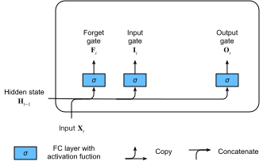

# Long Short Term Memory (LSTM)
:label:`sec_lstm`

The challenge to address long-term information preservation and short-term input
skipping in latent variable models has existed for a long time. One of the
earliest approaches to address this was the LSTM
:cite:`Hochreiter.Schmidhuber.1997`.  It shares many of the properties of the
Gated Recurrent Unit (GRU). Interestingly, LSTM's design is slightly more complex than GRU but predates GRU by almost two decades.

Arguably it is inspired by logic gates of a computer. To control a memory cell
we need a number of gates. One gate is needed to read out the entries from the
cell (as opposed to reading any other cell). We will refer to this as the
*output* gate. A second gate is needed to decide when to read data into the
cell. We refer to this as the *input* gate. Lastly, we need a mechanism to reset
the contents of the cell, governed by a *forget* gate. The motivation for such a
design is the same as before, namely to be able to decide when to remember and
when to ignore inputs in the latent state via a dedicated mechanism. Let us see
how LSTM works in practice.

## Gated Memory Cells

Three gates are introduced in LSTMs: the input gate, the forget gate, and the output gate. In addition to that we will introduce the memory cell that have the same shape as the hidden state. Strictly speaking this is just a fancy version of a hidden state, customized engineered to record additional information.

### Input Gates, Forget Gates, and Output Gates

Just like with GRUs, the data feeding into the LSTM gates is the input at the current timestep $\mathbf{X}_t$ and the hidden state of the previous timestep $\mathbf{H}_{t-1}$. These inputs are processed by a fully connected layer and a sigmoid activation function to compute the values of the input gates, the forget gates, and the output gates. As a result, the three gates all output values in the range of $[0,1]$. :numref:`lstm_0` has a graphical illustration of the data flow fot the input, forget, and output gates.


:label:`lstm_0`

We assume that there are $h$ hidden units, the minibatch is of size $n$, and number of inputs is $d$. Thus, the input is $\mathbf{X}_t \in \mathbb{R}^{n \times d}$ and the hidden state of the last timestep is $\mathbf{H}_{t-1} \in \mathbb{R}^{n \times h}$. Correspondingly, the gates are defined as follows: the input gate is $\mathbf{I}_t \in \mathbb{R}^{n \times h}$, the forget gate is $\mathbf{F}_t \in \mathbb{R}^{n \times h}$, and the output gate is $\mathbf{O}_t \in \mathbb{R}^{n \times h}$. They are calculated as follows:

$$
\begin{aligned}
\mathbf{I}_t &= \sigma(\mathbf{X}_t \mathbf{W}_{xi} + \mathbf{H}_{t-1} \mathbf{W}_{hi} + \mathbf{b}_i),\\
\mathbf{F}_t &= \sigma(\mathbf{X}_t \mathbf{W}_{xf} + \mathbf{H}_{t-1} \mathbf{W}_{hf} + \mathbf{b}_f),\\
\mathbf{O}_t &= \sigma(\mathbf{X}_t \mathbf{W}_{xo} + \mathbf{H}_{t-1} \mathbf{W}_{ho} + \mathbf{b}_o),
\end{aligned}
$$

where $\mathbf{W}_{xi}, \mathbf{W}_{xf}, \mathbf{W}_{xo} \in \mathbb{R}^{d \times h}$ and $\mathbf{W}_{hi}, \mathbf{W}_{hf}, \mathbf{W}_{ho} \in \mathbb{R}^{h \times h}$ are the weight parameters and $\mathbf{b}_i, \mathbf{b}_f, \mathbf{b}_o \in \mathbb{R}^{1 \times h}$ are bias parameters.


### Candidate Memory Cell

Next we design the memory cell. Since we have not specified the action of the various gates yet, we first introduce the *candidate* memory cell $\tilde{\mathbf{C}}_t \in \mathbb{R}^{n \times h}$. Its computation is similar to the three gates described above, but it uses a $\tanh$ function with a value range for $(-1, 1)$ as the activation function. This leads to the following equation at timestep $t$.

$$\tilde{\mathbf{C}}_t = \text{tanh}(\mathbf{X}_t \mathbf{W}_{xc} + \mathbf{H}_{t-1} \mathbf{W}_{hc} + \mathbf{b}_c)$$

Here $\mathbf{W}_{xc} \in \mathbb{R}^{d \times h}$ and $\mathbf{W}_{hc} \in \mathbb{R}^{h \times h}$ are weight parameters and $\mathbf{b}_c \in \mathbb{R}^{1 \times h}$ is the bias parameter.

As quick illustration of the candidate memory cell are shown in :numref:`lstm_1`.


:label:`lstm_1`


### Memory Cell

In GRUs, we had a single mechanism to govern the inputs and forgetting at a proper time. Here in LSTMs we have two parameters, $\mathbf{I}_t$ which governs how much we take new data into account via $\tilde{\mathbf{C}}_t$ and the forget parameter $\mathbf{F}_t$ which addresses how much of the old memory cell content $\mathbf{C}_{t-1} \in \mathbb{R}^{n \times h}$ we retain. Using the same pointwise multiplication trick as before, we arrive at the following update equation.

$$\mathbf{C}_t = \mathbf{F}_t \odot \mathbf{C}_{t-1} + \mathbf{I}_t \odot \tilde{\mathbf{C}}_t.$$

If the forget gate is always approximate to 1 and the input gate is always approximate to 0, the past memory cells $\mathbf{C}_{t-1} $ will be saved over time and be passed to the current timestep. This design was introduced to alleviate the vanishing gradient problem and to better capture dependencies for time series with long time dependencies. We thus arrive at the  flow diagram shown in :numref:`lstm_2`.


:label:`lstm_2`


### Hidden States

Lastly we need to define how to compute the hidden state $\mathbf{H}_t \in \mathbb{R}^{n \times h}$. This is where the output gate comes into play. In LSTM it is simply a gated version of the $\tanh$ of the memory cell. This ensures that the output values of $\mathbf{H}_t$ are always in the interval $(-1, 1)$. Whenever the output gate is $1$ we effectively pass all memory information through to the predictor, whereas for output $0$ we retain all the information only within the memory cell and perform no further processing. :numref:`lstm_3` has a graphical illustration of the data flow.

$$\mathbf{H}_t = \mathbf{O}_t \odot \tanh(\mathbf{C}_t).$$


:label:`lstm_3`


## Implementation from Scratch

Now let us implement an LSTM from scratch. As same as the experiments in the previous sections, we first load data of *The Time Machine*.

```{.python .input  n=1}
import d2l
from mxnet import np, npx
from mxnet.gluon import rnn
npx.set_np()

batch_size, num_steps = 32, 35
train_iter, vocab = d2l.load_data_time_machine(batch_size, num_steps)
```

### Initialize Model Parameters

Next we need to define and initialize the model parameters. As previously, the hyperparameter `num_hiddens` defines the number of hidden units. We initialize the weights following a Gaussian distribution with $0.01$ standard deviation, and we set the biases to be $0$.

```{.python .input  n=2}
def get_lstm_params(vocab_size, num_hiddens, ctx):
    num_inputs = num_outputs = vocab_size
    normal = lambda shape : np.random.normal(scale=0.01, size=shape, ctx=ctx)
    three = lambda : (normal((num_inputs, num_hiddens)),
                      normal((num_hiddens, num_hiddens)),
                      np.zeros(num_hiddens, ctx=ctx))
    W_xi, W_hi, b_i = three()  # Input gate parameters
    W_xf, W_hf, b_f = three()  # Forget gate parameters
    W_xo, W_ho, b_o = three()  # Output gate parameters
    W_xc, W_hc, b_c = three()  # Candidate cell parameters
    # Output layer parameters
    W_hq = normal((num_hiddens, num_outputs))
    b_q = np.zeros(num_outputs, ctx=ctx)
    # Attach gradients
    params = [W_xi, W_hi, b_i, W_xf, W_hf, b_f, W_xo, W_ho, b_o, W_xc, W_hc,
              b_c, W_hq, b_q]
    for param in params:
        param.attach_grad()
    return params
```

### Define the Model

In the initialization function, the hidden state of the LSTM needs to return an additional memory cell with a value of $0$ and a shape of (batch size, number of hidden units). Hence we get the following LSTM state initialization.

```{.python .input  n=3}
def init_lstm_state(batch_size, num_hiddens, ctx):
    return (np.zeros(shape=(batch_size, num_hiddens), ctx=ctx),
            np.zeros(shape=(batch_size, num_hiddens), ctx=ctx))
```

The actual model is defined like what we discussed before: providing three gates and an auxiliary memory cell. Note that only the hidden state is passed to the output layer. The memory cells $\mathbf{C}_t$ do not participate in the output computation directly.

```{.python .input  n=4}
def lstm(inputs, state, params):
    [W_xi, W_hi, b_i, W_xf, W_hf, b_f, W_xo, W_ho, b_o, W_xc, W_hc, b_c,
     W_hq, b_q] = params
    (H, C) = state
    outputs = []
    for X in inputs:
        I = npx.sigmoid(np.dot(X, W_xi) + np.dot(H, W_hi) + b_i)
        F = npx.sigmoid(np.dot(X, W_xf) + np.dot(H, W_hf) + b_f)
        O = npx.sigmoid(np.dot(X, W_xo) + np.dot(H, W_ho) + b_o)
        C_tilda = np.tanh(np.dot(X, W_xc) + np.dot(H, W_hc) + b_c)
        C = F * C + I * C_tilda
        H = O * np.tanh(C)
        Y = np.dot(H, W_hq) + b_q
        outputs.append(Y)
    return np.concatenate(outputs, axis=0), (H, C)
```

### Training and Prediction

Let us train a LSTM as same as what we did in :numref:`sec_gru`, by calling the `RNNModelScratch` function as introduced in :numref:`sec_rnn_scratch`.

```{.python .input  n=9}
vocab_size, num_hiddens, ctx = len(vocab), 256, d2l.try_gpu()
num_epochs, lr = 500, 1
model = d2l.RNNModelScratch(len(vocab), num_hiddens, ctx, get_lstm_params,
                            init_lstm_state, lstm)
d2l.train_ch8(model, train_iter, vocab, lr, num_epochs, ctx)
```

## Concise Implementation

In Gluon, we can directly call the `LSTM` class in the `rnn` module. This encapsulates all the configuration details that we made explicit above. The code is significantly faster as it uses compiled operators rather than Python for many details that we spelled out in detail before.

```{.python .input  n=10}
lstm_layer = rnn.LSTM(num_hiddens)
model = d2l.RNNModel(lstm_layer, len(vocab))
d2l.train_ch8(model, train_iter, vocab, lr, num_epochs, ctx)
```

Interestingly, LSTMs are the prototypical latent variable autoregressive model with nontrivial state control. Many variants thereof have been proposed over the years, e.g., multiple layers, residual connections, different types of regularization. However, training LSTMs and other sequence models (such as GRU) are quite costly due to the long dependency of the sequence. Later we will encounter alternative models such as transformers that can be used in some cases.

## Summary

* LSTMs have three types of gates: input gates, forget gates, and output gates which control the flow of information.
* The hidden layer output of LSTM includes hidden states and memory cells. Only hidden states are passed into the output layer computation. Memory cells contribute to entirely internal gates updates.
* LSTMs can help us cope with vanishing and exploding gradients due to long range dependencies and short range irrelevant data.
* In many cases, LSTMs perform slightly better than GRUs but they are more costly to train and execute due to the larger latent state size.


## Exercises

1. Adjust the LSTM hyperparameters. Observe and analyze the impact on runtime, perplexity, and the generated output.
1. How would you need to change the model to generate proper words as opposed to sequences of characters?
1. Compare the computational cost for GRUs, LSTMs, and regular RNNs for a given hidden dimension. Pay special attention to the training and inference cost.
1. Since the candidate memory cells ensure that the value range is between $-1$ and $1$ by  using the $\tanh$ function, why does the hidden state need to use the $\tanh$ function again to ensure that the output value range is between $-1$ and $1$?
1. Implement an LSTM for a time series prediction besides the character sequences prediction.


## [Discussions](https://discuss.mxnet.io/t/2368)


```{.python .input}

```
