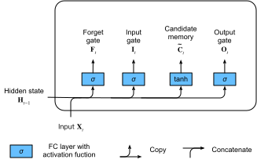
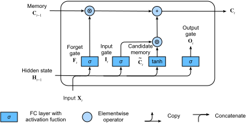
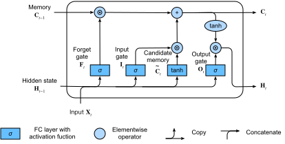

# Long Short-term Memory (LSTM)


This section describes another commonly used gated recurrent neural network: long short-term memory (LSTM) [1]. Its structure is slightly more complicated than that of a gated recurrent unit.


## Long Short-term Memory

Three gates are introduced in LSTM: the input gate, the forget gate, and the output gate, as well as memory cells in the same shape as the hidden state (some literature treats memory cells as a special kind of hidden state) used to record additional information.


### Input Gates, Forget Gates, and Output Gates

Like the reset gate and the update gate in the gated recurrent unit, as shown in Figure 6.7, the input of LSTM gates is the current time step input $\boldsymbol{X}_t$ and the hidden state of the previous time step $\boldsymbol{H}_{t-1}$. The output is computed by the fully connected layer with a sigmoid function as its activation function. As a result, the three gate elements all have a value range of $[0,1]$.


Here, we assume there are $h$ hidden units and, for a given time step $t$, the mini-batch input is $\boldsymbol{X}_t \in \mathbb{R}^{n \times d}$ (number of examples: $n$, number of inputs: $d$）and the hidden state of the last time step is $\boldsymbol{H}_{t-1} \in \mathbb{R}^{n \times h}$.
For time step $t$, the input gate $\boldsymbol{I}_t \in \mathbb{R}^{n \times h}$, forget gate $\boldsymbol{F}_t \in \mathbb{R}^{n \times h}$, and output gate $\boldsymbol{O}_t \in \mathbb{R}^{n \times h}$ are calculated as follows:

$$
\begin{aligned}
\boldsymbol{I}_t &= \sigma(\boldsymbol{X}_t \boldsymbol{W}_{xi} + \boldsymbol{H}_{t-1} \boldsymbol{W}_{hi} + \boldsymbol{b}_i),\\
\boldsymbol{F}_t &= \sigma(\boldsymbol{X}_t \boldsymbol{W}_{xf} + \boldsymbol{H}_{t-1} \boldsymbol{W}_{hf} + \boldsymbol{b}_f),\\
\boldsymbol{O}_t &= \sigma(\boldsymbol{X}_t \boldsymbol{W}_{xo} + \boldsymbol{H}_{t-1} \boldsymbol{W}_{ho} + \boldsymbol{b}_o),
\end{aligned}
$$

Here, $\boldsymbol{W}_{xi}, \boldsymbol{W}_{xf}, \boldsymbol{W}_{xo} \in \mathbb{R}^{d \times h}$ and $\boldsymbol{W}_{hi}, \boldsymbol{W}_{hf}, \boldsymbol{W}_{ho} \in \mathbb{R}^{h \times h}$ are weight parameters and $\boldsymbol{b}_i, \boldsymbol{b}_f, \boldsymbol{b}_o \in \mathbb{R}^{1 \times h}$ is a bias parameter.


### Candidate Memory Cells

Next, LSTM needs to compute the candidate memory cell $\tilde{\boldsymbol{C}}_t$. Its computation is similar to the three gates described above, but using a tanh function with a value range for $[-1, 1] as activation function, as shown in Figure 6.8.




For time step $t$, the candidate memory cell $\tilde{\boldsymbol{C}}_t \in \mathbb{R}^{n \times h}$ is calculated by the following formula:

$\tilde{\boldsymbol{C}}_t = \text{tanh}(\boldsymbol{X}_t \boldsymbol{W}_{xc} + \boldsymbol{H}_{t-1} \boldsymbol{W}_{hc} + \boldsymbol{b}_c),$

Here, $\boldsymbol{W}_{xc} \in \mathbb{R}^{d \times h}$ and $\boldsymbol{W}_{hc} \in \mathbb{R}^{h \times h}$ are weight parameters and $\boldsymbol{b}_c \in \mathbb{R}^{1 \times h}$ is a bias parameter.


### Memory Cells

We can control flow of information in the hidden state use input, forget, and output gates with an element value range between $[0, 1]$. This is also generally achieved by using multiplication by element (symbol $\odot$). The computation of the current time step memory cell $\boldsymbol{C}_t \in \mathbb{R}^{n \times h}$ combines the information of the previous time step memory cells and the current time step candidate memory cells, and controls the flow of information through forget gate and input gate:

$\boldsymbol{C}_t = \boldsymbol{F}_t \odot \boldsymbol{C}_{t-1} + \boldsymbol{I}_t \odot \tilde{\boldsymbol{C}}_t.$


As shown in Figure 6.9, the forget gate controls whether the information in the memory cell $\boldsymbol{C}_{t-1}$ of the last time step is passed to the current time step, and the input gate can control how the input of the current time step $\boldsymbol{X}_t$ flows into the memory cells of the current time step through the candidate memory cell $\tilde{\boldsymbol{C}}_t$. If the forget gate is always approximately 1 and the input gate is always approximately 0, the past memory cells will be saved over time and passed to the current time step. This design can cope with the vanishing gradient problem in recurrent neural networks and better capture dependencies for time series with large time step distances.




### Hidden States

With memory cells, we can also control the flow of information from memory cells to the hidden state $\boldsymbol{H}_t \in \mathbb{R}^{n \times h}$ through the output gate:

$\boldsymbol{H}_t = \boldsymbol{O}_t \odot \text{tanh}(\boldsymbol{C}_t).$

The tanh function here ensures that the hidden state element value is between -1 and 1. It should be noted that when the output gate is approximately 1, the memory cell information will be passed to the hidden state for use by the output layer; and when the output gate is approximately 0, the memory cell information is only retained by itself. Figure 6.10 shows the computation of the hidden state in LSTM.




## Read the Data Set

Below we begin to implement and display LSTM. As with the experiments in the previous sections, we still use the lyrics of the Jay Chou data set to train the model to write lyrics.

```{.python .input  n=1}
import gluonbook as gb
from mxnet import nd
from mxnet.gluon import rnn

(corpus_indices, char_to_idx, idx_to_char,
 vocab_size) = gb.load_data_jay_lyrics()
```

## Implementation from Scratch

First, we will discuss how to implement LSTM from scratch.

### Initialize Model Parameters

The code below initializes the model parameters. The hyper-parameter `num_hiddens` defines the number of hidden units.

```{.python .input  n=2}
num_inputs, num_hiddens, num_outputs = vocab_size, 256, vocab_size
ctx = gb.try_gpu()

def get_params():
    def _one(shape):
        return nd.random.normal(scale=0.01, shape=shape, ctx=ctx)

    def _three():
        return (_one((num_inputs, num_hiddens)),
                _one((num_hiddens, num_hiddens)),
                nd.zeros(num_hiddens, ctx=ctx))

    W_xi, W_hi, b_i = _three()  # Input gate parameters
    W_xf, W_hf, b_f = _three()  # Forget gate parameters
    W_xo, W_ho, b_o = _three()  # Output gate parameters
    W_xc, W_hc, b_c = _three()  # Candidate cell parameters
    # Output layer parameters
    W_hq = _one((num_hiddens, num_outputs))
    b_q = nd.zeros(num_outputs, ctx=ctx)
    # Create gradient
    params = [W_xi, W_hi, b_i, W_xf, W_hf, b_f, W_xo, W_ho, b_o, W_xc, W_hc,
              b_c, W_hq, b_q]
    for param in params:
        param.attach_grad()
    return params
```

## Define the Model

In the initialization function, the hidden state of the LSTM needs to return an additional memory cell with a value of 0 and a shape of (batch size, number of hidden units).

```{.python .input  n=3}
def init_lstm_state(batch_size, num_hiddens, ctx):
    return (nd.zeros(shape=(batch_size, num_hiddens), ctx=ctx),
            nd.zeros(shape=(batch_size, num_hiddens), ctx=ctx))
```

Below, we defined the model based on LSTM computing expressions. It should be noted that only the hidden state will be passed into the output layer, and the memory cells do not participate in the computation of the output layer.

```{.python .input  n=4}
def lstm(inputs, state, params):
    [W_xi, W_hi, b_i, W_xf, W_hf, b_f, W_xo, W_ho, b_o, W_xc, W_hc, b_c,
     W_hq, b_q] = params
    (H, C) = state
    outputs = []
    for X in inputs:
        I = nd.sigmoid(nd.dot(X, W_xi) + nd.dot(H, W_hi) + b_i)
        F = nd.sigmoid(nd.dot(X, W_xf) + nd.dot(H, W_hf) + b_f)
        O = nd.sigmoid(nd.dot(X, W_xo) + nd.dot(H, W_ho) + b_o)
        C_tilda = nd.tanh(nd.dot(X, W_xc) + nd.dot(H, W_hc) + b_c)
        C = F * C + I * C_tilda
        H = O * C.tanh()
        Y = nd.dot(H, W_hq) + b_q
        outputs.append(Y)
    return outputs, (H, C)
```

### Train the Model and Write Lyrics

As in the previous section, during model training, we only use adjacent sampling. After setting the hyper-parameters, we train and model and create a 50 character string of lyrics based on the prefixes "separate" and "not separated".

```{.python .input  n=5}
num_epochs, num_steps, batch_size, lr, clipping_theta = 160, 35, 32, 1e2, 1e-2
pred_period, pred_len, prefixes = 40, 50, ['分开', '不分开']
```

We create a string of lyrics based on the currently trained model every 40 epochs.

```{.python .input}
gb.train_and_predict_rnn(lstm, get_params, init_lstm_state, num_hiddens,
                         vocab_size, ctx, corpus_indices, idx_to_char,
                         char_to_idx, False, num_epochs, num_steps, lr,
                         clipping_theta, batch_size, pred_period, pred_len,
                         prefixes)
```

## Gluon Implementation

In Gluon, we can directly call the `LSTM` class in the `rnn` module.

```{.python .input  n=6}
lstm_layer = rnn.LSTM(num_hiddens)
model = gb.RNNModel(lstm_layer, vocab_size)
gb.train_and_predict_rnn_gluon(model, num_hiddens, vocab_size, ctx,
                               corpus_indices, idx_to_char, char_to_idx,
                               num_epochs, num_steps, lr, clipping_theta,
                               batch_size, pred_period, pred_len, prefixes)
```

## Summary

* The hidden layer output of LSTM includes hidden states and memory cells. Only hidden states are passed into the output layer.
* The input, forget, and output gates in LSTM can control the flow of information.
* LSTM can cope with the gradient attenuation problem in the recurrent neural networks and better capture dependencies for time series with large time step distances.


## exercise

* Adjust the hyper-parameters and observe and analyze the impact on running time, perplexity, and the written lyrics.
* Under the same conditions, compare the running time of an LSTM, GRU and recurrent neural network without gates.
* Since the candidate memory cells ensure that the value range is between -1 and 1 using the tanh function, why does the hidden state need to use the tanh function again to ensure that the output value range is between -1 and 1?


## Scan the QR Code to Access [Discussions](https://discuss.gluon.ai/t/topic/4049)


## References

[1] Hochreiter, S., & Schmidhuber, J. (1997). Long short-term memory. Neural computation, 9(8), 1735-1780.
