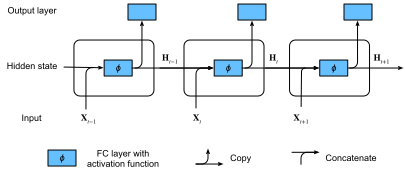

# Recurrent Neural Networks
:label:`sec_plain_rnn`

In :numref:`sec_language_model` we introduced $n$-gram models, where the conditional probability of word $x_t$ at position $t$ only depends on the $n-1$ previous words. If we want to check the possible effect of words earlier than $t-(n-1)$ on $x_t$, we need to increase $n$. However, the number of model parameters would also increase exponentially with it, as we need to store $|V|^n$ numbers for a vocabulary $V$. Hence, rather than modeling $p(x_t \mid x_{t-1}, \ldots, x_{t-n+1})$ it is preferable to use a *latent variable model* in which we have

$$p(x_t \mid x_{t-1}, \ldots, x_1) \approx p(x_t \mid x_{t-1}, h_{t}).$$

Here $h_t$ is a *latent variable* that stores the sequence information. A latent variable is also called as *hidden variable*, *hidden state* or *hidden state variable*. The hidden state at time $t$ could be computed based on both input $x_{t}$ and hidden state $h_{t-1}$, that is

$$h_t = f(x_{t}, h_{t-1}).$$

For a sufficiently powerful function $f$, the latent variable model is not an approximation. After all, $h_t$ could simply store all the data it observed so far. We discussed this in :numref:`sec_sequence`. But it could potentially makes both computation and storage expensive.

Note that we also use $h$ to denote by the number of hidden units of a hidden layer. Hidden layers and hidden states refer to two very different concepts. Hidden layers are, as explained, layers that are hidden from view on the path from input to output. Hidden states are technically speaking *inputs* to whatever we do at a given step. Instead, they can only be computed by looking at data at previous iterations. In this sense they have much in common with latent variable models in statistics, such as clustering or topic models where the clusters affect the output but cannot be directly observed.

Recurrent neural networks are neural networks with hidden states. Before introducing this model, let us first revisit the multi-layer perceptron introduced in :numref:`sec_mlp`.

## Recurrent Networks Without Hidden States

Let us take a look at a multilayer perceptron with a single hidden layer. Given a minibatch of the instances $\mathbf{X} \in \mathbb{R}^{n \times d}$ with sample size $n$ and $d$ inputs. Let the hidden layer's activation function be $\phi$. Hence, the hidden layer's output $\mathbf{H} \in \mathbb{R}^{n \times h}$ is calculated as

$$\mathbf{H} = \phi(\mathbf{X} \mathbf{W}_{xh} + \mathbf{b}_h).$$

:eqlabel:`rnn_h_without_state`

Here, we have the weight parameter $\mathbf{W}_{xh} \in \mathbb{R}^{d \times h}$, bias parameter $\mathbf{b}_h \in \mathbb{R}^{1 \times h}$, and the number of hidden units $h$, for the hidden layer.

The hidden variable $\mathbf{H}$ is used as the input of the output layer. The output layer is given by

$$\mathbf{O} = \mathbf{H} \mathbf{W}_{hq} + \mathbf{b}_q.$$

Here, $\mathbf{O} \in \mathbb{R}^{n \times q}$ is the output variable, $\mathbf{W}_{hq} \in \mathbb{R}^{h \times q}$ is the weight parameter, and $\mathbf{b}_q \in \mathbb{R}^{1 \times q}$ is the bias parameter of the output layer.  If it is a classification problem, we can use $\text{softmax}(\mathbf{O})$ to compute the probability distribution of the output category.

This is entirely analogous to the regression problem we solved previously in :numref:`sec_sequence`, hence we omit details. Suffice it to say that we can pick $(x_t, x_{t-1})$ pairs at random and estimate the parameters $\mathbf{W}$ and $\mathbf{b}$ of our network via autograd and stochastic gradient descent.

## Recurrent Networks with Hidden States

Matters are entirely different when we have hidden states. Let us look at the structure in some more detail. Remember that we often call iteration $t$ as time $t$ in an optimization algorithm, time in a recurrent neural network refers to steps within an iteration. Assume that we have $\mathbf{X}_t \in \mathbb{R}^{n \times d}$, $t=1,\ldots,T$, in an iteration. And $\mathbf{H}_t  \in \mathbb{R}^{n \times h}$ is the hidden variable of timestep $t$ from the sequence.  Unlike the multilayer perceptron, here we save the hidden variable $\mathbf{H}_{t-1}$ from the previous timestep and introduce a new weight parameter $\mathbf{W}_{hh} \in \mathbb{R}^{h \times h}$, to describe how to use the hidden variable of the previous timestep in the current timestep. Specifically, the calculation of the hidden variable of the current timestep is determined by the input of the current timestep together with the hidden variable of the previous timestep:

$$\mathbf{H}_t = \phi(\mathbf{X}_t \mathbf{W}_{xh} + \mathbf{H}_{t-1} \mathbf{W}_{hh}  + \mathbf{b}_h).$$

Compared with :eqref:`rnn_h_without_state`, we added one more $\mathbf{H}_{t-1} \mathbf{W}_{hh}$ here. From the relationship between hidden variables $\mathbf{H}_t$ and $\mathbf{H}_{t-1}$ of adjacent timesteps, we know that those variables captured and retained the sequence's historical information up to the current timestep, just like the state or memory of the neural network's current timestep. Therefore, such a hidden variable is called a *hidden state*. Since the hidden state uses the same definition of the previous timestep in the current timestep, the computation of the equation above is recurrent, hence the name recurrent neural network (RNN).

There are many different RNN construction methods.  RNNs with a hidden state defined by the equation above are very common. For timestep $t$, the output of the output layer is similar to the computation in the multilayer perceptron:

$$\mathbf{O}_t = \mathbf{H}_t \mathbf{W}_{hq} + \mathbf{b}_q$$

RNN parameters include the weight $\mathbf{W}_{xh} \in \mathbb{R}^{d \times h}, \mathbf{W}_{hh} \in \mathbb{R}^{h \times h}$ of the hidden layer with the bias $\mathbf{b}_h \in \mathbb{R}^{1 \times h}$, and the weight $\mathbf{W}_{hq} \in \mathbb{R}^{h \times q}$ of the output layer with the bias $\mathbf{b}_q \in \mathbb{R}^{1 \times q}$. It is worth mentioning that RNNs always use these model parameters, even for different timesteps. Therefore, the number of RNN model parameters does not grow as the number of timesteps increases.

:numref:`fig_rnn` shows the computational logic of an RNN at three adjacent timesteps. In timestep $t$, the computation of the hidden state can be treated as an entry of a fully connected layer with the activation function $\phi$ after concatenating the input $\mathbf{X}_t$ with the hidden state $\mathbf{H}_{t-1}$ of the previous timestep.  The output of the fully connected layer is the hidden state of the current timestep $\mathbf{H}_t$. Its model parameter is the concatenation of $\mathbf{W}_{xh}$ and $\mathbf{W}_{hh}$, with a bias of $\mathbf{b}_h$. The hidden state of the current timestep $t$, $\mathbf{H}_t$, will participate in computing the hidden state $\mathbf{H}_{t+1}$ of the next timestep $t+1$. What is more, $\mathbf{H}_t$ will become the input for $\mathbf{O}_t$, the fully connected output layer of the current timestep.

:label:`fig_rnn`

## Steps in a Language Model

Now we illustrate how RNNs can be used to build a language model. For simplicity of illustration we use words rather than characters as the inputs, since the former are easier to comprehend. Let the minibatch size be 1, and the sequence of the text be the beginning of our dataset, i.e., "the time machine by H. G. Wells". The figure below illustrates how to estimate the next word based on the present and previous words. During the training process, we run a softmax operation on the output from the output layer for each timestep, and then use the cross-entropy loss function to compute the error between the result and the label. Due to the recurrent computation of the hidden state in the hidden layer, the output of timestep 3,  $\mathbf{O}_3$, is determined by the text sequence "the", "time", and "machine" respectively. Since the next word of the sequence in the training data is "by", the loss of timestep 3 will depend on the probability distribution of the next word generated based on the feature sequence "the", "time", "machine" and the label "by" of this timestep.

In practice, each word is presented by a $d$ dimensional vector, and we use a batch size $n>1$. Therefore, the input $\mathbf X_t$ at timestep $t$ will be a $n\times d$ matrix, which is identical to what we discussed before.

## Perplexity

Last, let us discuss about how to measure the sequence model quality. One way is to check how surprising the text is. A good language model is able to predict with high accuracy tokens that what we will see next. Consider the following continuations of the phrase "It is raining", as proposed by different language models:

1. "It is raining outside"
1. "It is raining banana tree"
1. "It is raining piouw;kcj pwepoiut"

In terms of quality, example 1 is clearly the best. The words are sensible and logically coherent. While it might not quite accurately reflect which word follows semantically ("in San Francisco" and "in winter" would have been perfectly reasonable extensions), the model is able to capture which kind of word follows. Example 2 is considerably worse by producing a nonsensical extension. Nonetheless, at least the model has learned how to spell words and some degree of correlation between words. Last, example 3 indicates a poorly trained model that does not fit data properly.

We might measure the quality of the model by computing $p(w)$, i.e., the likelihood of the sequence. Unfortunately this is a number that is hard to understand and difficult to compare. After all, shorter sequences are much more likely to occur than the longer ones, hence evaluating the model on Tolstoy's magnum opus ['War and Peace'](https://www.gutenberg.org/files/2600/2600-h/2600-h.htm) will inevitably produce a much smaller likelihood than, say, on Saint-Exupery's novella ['The Little Prince'](https://en.wikipedia.org/wiki/The_Little_Prince). What is missing is the equivalent of an average.

Information theory comes handy here and we will introduce more in :numref:`sec_information_theory`. If we want to compress text, we can ask about estimating the next symbol given the current set of symbols. A lower bound on the number of bits is given by $-\log_2 p(x_t \mid x_{t-1}, \ldots, x_1)$. A good language model should allow us to predict the next word quite accurately. Thus, it should allow us to spend very few bits on compressing the sequence. So we can measure it by the average number of bits that we need to spend.

$$\frac{1}{n} \sum_{t=1}^n -\log p(x_t \mid x_{t-1}, \ldots, x_1) $$

This makes the performance on documents of different lengths comparable. For historical reasons, scientists in natural language processing prefer to use a quantity called *perplexity* rather than bitrate. In a nutshell, it is the exponential of the above:

$$\mathrm{PPL} := \exp\left(-\frac{1}{n} \sum_{t=1}^n \log p(x_t \mid x_{t-1}, \ldots, x_1)\right)$$

It can be best understood as the harmonic mean of the number of real choices that we have when deciding which word to pick next. Note that perplexity naturally generalizes the notion of the cross-entropy loss defined when we introduced the softmax regression (:numref:`sec_softmax`). That is, for a single symbol both definitions are identical bar the fact that one is the exponential of the other. Let us look at a number of cases:

* In the best case scenario, the model always estimates the probability of the next symbol as $1$. In this case the perplexity of the model is $1$.
* In the worst case scenario, the model always predicts the probability of the label category as 0. In this situation, the perplexity is infinite.
* At the baseline, the model predicts a uniform distribution over all tokens. In this case, the perplexity equals the size of the dictionary `len(vocab)`. In fact, if we were to store the sequence without any compression, this would be the best we could do to encode it. Hence, this provides a nontrivial upper bound that any model must satisfy.

## Summary

* A network that uses recurrent computation is called a recurrent neural network (RNN).
* The hidden state of the RNN can capture historical information of the sequence up to the current timestep.
* The number of RNN model parameters does not grow as the number of timesteps increases.
* We can create language models using a character-level RNN.

## Exercises

1. If we use an RNN to predict the next character in a text sequence, how many output dimensions do we need?
1. Can you design a mapping for which an RNN with hidden states is exact? Hint - what about a finite number of words?
1. What happens to the gradient if you backpropagate through a long sequence?
1. What are some of the problems associated with the simple sequence model described above?

## [Discussions](https://discuss.mxnet.io/t/2362)

