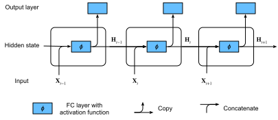

# Recurrent Neural Networks
:label:`sec_rnn`


In :numref:`sec_language-model` we described Markov models and $n$-grams for language modeling, where the conditional probability of token $x_t$ at time step $t$ only depends on the $n-1$ previous tokens.
If we want to incorporate the possible effect of tokens earlier than time step $t-(n-1)$ on $x_t$,
we need to increase $n$.
However, the number of model parameters would also increase exponentially with it, as we need to store $|\mathcal{V}|^n$ numbers for a vocabulary set $\mathcal{V}$.
Hence, rather than modeling $P(x_t \mid x_{t-1}, \ldots, x_{t-n+1})$ it is preferable to use a latent variable model:

$$P(x_t \mid x_{t-1}, \ldots, x_1) \approx P(x_t \mid h_{t-1}),$$

where $h_{t-1}$ is a *hidden state*  that stores the sequence information up to time step $t-1$.
In general,
the hidden state at any time step $t$ could be computed based on both the current input $x_{t}$ and the previous hidden state $h_{t-1}$:

$$h_t = f(x_{t}, h_{t-1}).$$
:eqlabel:`eq_ht_xt`

For a sufficiently powerful function $f$ in :eqref:`eq_ht_xt`, the latent variable model is not an approximation. After all, $h_t$ may simply store all the data it has observed so far.
However, it could potentially make both computation and storage expensive.

Recall that we have discussed hidden layers with hidden units in :numref:`chap_perceptrons`.
It is noteworthy that
hidden layers and hidden states refer to two very different concepts.
Hidden layers are, as explained, layers that are hidden from view on the path from input to output.
Hidden states are technically speaking *inputs* to whatever we do at a given step,
and they can only be computed by looking at data at previous time steps.

*Recurrent neural networks* (RNNs) are neural networks with hidden states. Before introducing the RNN model, we first revisit the MLP model introduced in :numref:`sec_mlp`.

```{.python .input}
%load_ext d2lbook.tab
tab.interact_select('mxnet', 'pytorch', 'tensorflow', 'jax')
```

```{.python .input}
%%tab mxnet
from d2l import mxnet as d2l
from mxnet import np, npx
npx.set_np()
```

```{.python .input}
%%tab pytorch
from d2l import torch as d2l
import torch
```

```{.python .input}
%%tab tensorflow
from d2l import tensorflow as d2l
import tensorflow as tf
```

```{.python .input}
%%tab jax
from d2l import jax as d2l
import jax
from jax import numpy as jnp
```

## Neural Networks without Hidden States

Let's take a look at an MLP with a single hidden layer.
Let the hidden layer's activation function be $\phi$.
Given a minibatch of examples $\mathbf{X} \in \mathbb{R}^{n \times d}$ with batch size $n$ and $d$ inputs, the hidden layer output $\mathbf{H} \in \mathbb{R}^{n \times h}$ is calculated as

$$\mathbf{H} = \phi(\mathbf{X} \mathbf{W}_{xh} + \mathbf{b}_h).$$
:eqlabel:`rnn_h_without_state`

In :eqref:`rnn_h_without_state`, we have the weight parameter $\mathbf{W}_{xh} \in \mathbb{R}^{d \times h}$, the bias parameter $\mathbf{b}_h \in \mathbb{R}^{1 \times h}$, and the number of hidden units $h$, for the hidden layer.
Thus, broadcasting (see :numref:`subsec_broadcasting`) is applied during the summation.
Next, the hidden layer output $\mathbf{H}$ is used as input of the output layer. The output layer is given by

$$\mathbf{O} = \mathbf{H} \mathbf{W}_{hq} + \mathbf{b}_q,$$

where $\mathbf{O} \in \mathbb{R}^{n \times q}$ is the output variable, $\mathbf{W}_{hq} \in \mathbb{R}^{h \times q}$ is the weight parameter, and $\mathbf{b}_q \in \mathbb{R}^{1 \times q}$ is the bias parameter of the output layer.  If it is a classification problem, we can use $\text{softmax}(\mathbf{O})$ to compute the probability distribution of the output categories.

This is entirely analogous to the regression problem we solved previously in :numref:`sec_sequence`, hence we omit details.
Suffice it to say that we can pick feature-label pairs at random and learn the parameters of our network via automatic differentiation and stochastic gradient descent.

## Recurrent Neural Networks with Hidden States
:label:`subsec_rnn_w_hidden_states`

Matters are entirely different when we have hidden states. Let's look at the structure in some more detail.

Assume that we have
a minibatch of inputs
$\mathbf{X}_t \in \mathbb{R}^{n \times d}$
at time step $t$.
In other words,
for a minibatch of $n$ sequence examples,
each row of $\mathbf{X}_t$ corresponds to one example at time step $t$ from the sequence.
Next,
denote by $\mathbf{H}_t  \in \mathbb{R}^{n \times h}$ the hidden layer output of time step $t$.
Unlike the MLP, here we save the hidden layer output $\mathbf{H}_{t-1}$ from the previous time step and introduce a new weight parameter $\mathbf{W}_{hh} \in \mathbb{R}^{h \times h}$ to describe how to use the hidden layer output of the previous time step in the current time step. Specifically, the calculation of the hidden layer output of the current time step is determined by the input of the current time step together with the hidden layer output of the previous time step:

$$\mathbf{H}_t = \phi(\mathbf{X}_t \mathbf{W}_{xh} + \mathbf{H}_{t-1} \mathbf{W}_{hh}  + \mathbf{b}_h).$$
:eqlabel:`rnn_h_with_state`

Compared with :eqref:`rnn_h_without_state`, :eqref:`rnn_h_with_state` adds one more term $\mathbf{H}_{t-1} \mathbf{W}_{hh}$ and thus
instantiates :eqref:`eq_ht_xt`.
From the relationship between hidden layer outputs $\mathbf{H}_t$ and $\mathbf{H}_{t-1}$ of adjacent time steps,
we know that these variables captured and retained the sequence's historical information up to their current time step, just like the state or memory of the neural network's current time step. Therefore, such a hidden layer output is called a *hidden state*.
Since the hidden state uses the same definition of the previous time step in the current time step, the computation of :eqref:`rnn_h_with_state` is *recurrent*. Hence, as we said, neural networks with hidden states
based on recurrent computation are named
*recurrent neural networks*.
Layers that perform
the computation of :eqref:`rnn_h_with_state`
in RNNs
are called *recurrent layers*.


There are many different ways for constructing RNNs.
RNNs with a hidden state defined by :eqref:`rnn_h_with_state` are very common.
For time step $t$,
the output of the output layer is similar to the computation in the MLP:

$$\mathbf{O}_t = \mathbf{H}_t \mathbf{W}_{hq} + \mathbf{b}_q.$$

Parameters of the RNN
include the weights $\mathbf{W}_{xh} \in \mathbb{R}^{d \times h}, \mathbf{W}_{hh} \in \mathbb{R}^{h \times h}$,
and the bias $\mathbf{b}_h \in \mathbb{R}^{1 \times h}$
of the hidden layer,
together with the weights $\mathbf{W}_{hq} \in \mathbb{R}^{h \times q}$
and the bias $\mathbf{b}_q \in \mathbb{R}^{1 \times q}$
of the output layer.
It is worth mentioning that
even at different time steps,
RNNs always use these model parameters.
Therefore, the parameterization cost of an RNN
does not grow as the number of time steps increases.

:numref:`fig_rnn` illustrates the computational logic of an RNN at three adjacent time steps.
At any time step $t$,
the computation of the hidden state can be treated as:
(i) concatenating the input $\mathbf{X}_t$ at the current time step $t$ and the hidden state $\mathbf{H}_{t-1}$ at the previous time step $t-1$;
(ii) feeding the concatenation result into a fully connected layer with the activation function $\phi$.
The output of such a fully connected layer is the hidden state $\mathbf{H}_t$ of the current time step $t$.
In this case,
the model parameters are the concatenation of $\mathbf{W}_{xh}$ and $\mathbf{W}_{hh}$, and a bias of $\mathbf{b}_h$, all from :eqref:`rnn_h_with_state`.
The hidden state of the current time step $t$, $\mathbf{H}_t$, will participate in computing the hidden state $\mathbf{H}_{t+1}$ of the next time step $t+1$.
What is more, $\mathbf{H}_t$ will also be
fed into the fully connected output layer
to compute the output
$\mathbf{O}_t$ of the current time step $t$.


:label:`fig_rnn`

We just mentioned that the calculation of $\mathbf{X}_t \mathbf{W}_{xh} + \mathbf{H}_{t-1} \mathbf{W}_{hh}$ for the hidden state is equivalent to
matrix multiplication of
concatenation of $\mathbf{X}_t$ and $\mathbf{H}_{t-1}$
and
concatenation of $\mathbf{W}_{xh}$ and $\mathbf{W}_{hh}$.
Though this can be proven in mathematics,
in the following we just use a simple code snippet to show this.
To begin with,
we define matrices `X`, `W_xh`, `H`, and `W_hh`, whose shapes are (3, 1), (1, 4), (3, 4), and (4, 4), respectively.
Multiplying `X` by `W_xh`, and `H` by `W_hh`, respectively, and then adding these two multiplications,
we obtain a matrix of shape (3, 4).

```{.python .input}
%%tab mxnet, pytorch
X, W_xh = d2l.randn(3, 1), d2l.randn(1, 4)
H, W_hh = d2l.randn(3, 4), d2l.randn(4, 4)
d2l.matmul(X, W_xh) + d2l.matmul(H, W_hh)
```

```{.python .input}
%%tab tensorflow
X, W_xh = d2l.normal((3, 1)), d2l.normal((1, 4))
H, W_hh = d2l.normal((3, 4)), d2l.normal((4, 4))
d2l.matmul(X, W_xh) + d2l.matmul(H, W_hh)
```

```{.python .input}
%%tab jax
X, W_xh = jax.random.normal(d2l.get_key(), (3, 1)), jax.random.normal(
                                                        d2l.get_key(), (1, 4))
H, W_hh = jax.random.normal(d2l.get_key(), (3, 4)), jax.random.normal(
                                                        d2l.get_key(), (4, 4))
d2l.matmul(X, W_xh) + d2l.matmul(H, W_hh)
```

Now we concatenate the matrices `X` and `H`
along columns (axis 1),
and the matrices
`W_xh` and `W_hh` along rows (axis 0).
These two concatenations
result in
matrices of shape (3, 5)
and of shape (5, 4), respectively.
Multiplying these two concatenated matrices,
we obtain the same output matrix of shape (3, 4)
as above.

```{.python .input}
%%tab all
d2l.matmul(d2l.concat((X, H), 1), d2l.concat((W_xh, W_hh), 0))
```

## RNN-based Character-Level Language Models

Recall that for language modeling in :numref:`sec_language-model`,
we aim to predict the next token based on
the current and past tokens,
thus we shift the original sequence by one token
as the targets (labels).
:citet:`Bengio.Ducharme.Vincent.ea.2003` first proposed
to use a neural network for language modeling.
In the following we illustrate how RNNs can be used to build a language model.
Let the minibatch size be one, and the sequence of the text be "machine".
To simplify training in subsequent sections,
we tokenize text into characters rather than words
and consider a *character-level language model*.
:numref:`fig_rnn_train` demonstrates how to predict the next character based on the current and previous characters via an RNN for character-level language modeling.


:label:`fig_rnn_train`

During the training process,
we run a softmax operation on the output from the output layer for each time step, and then use the cross-entropy loss to compute the error between the model output and the target.
Due to the recurrent computation of the hidden state in the hidden layer, the output of time step 3 in :numref:`fig_rnn_train`,
$\mathbf{O}_3$, is determined by the text sequence "m", "a", and "c". Since the next character of the sequence in the training data is "h", the loss of time step 3 will depend on the probability distribution of the next character generated based on the feature sequence "m", "a", "c" and the target "h" of this time step.

In practice, each token is represented by a $d$-dimensional vector, and we use a batch size $n>1$. Therefore, the input $\mathbf X_t$ at time step $t$ will be a $n\times d$ matrix, which is identical to what we discussed in :numref:`subsec_rnn_w_hidden_states`.

In the following sections, we will implement RNNs
for character-level language models.


## Summary

A neural network that uses recurrent computation for hidden states is called a recurrent neural network (RNN).
The hidden state of an RNN can capture historical information of the sequence up to the current time step. With recurrent computation, the number of RNN model parameters does not grow as the number of time steps increases. As for applications, an RNN can be used to create character-level language models.


## Exercises

1. If we use an RNN to predict the next character in a text sequence, what is the required dimension for any output?
1. Why can RNNs express the conditional probability of a token at some time step based on all the previous tokens in the text sequence?
1. What happens to the gradient if you backpropagate through a long sequence?
1. What are some of the problems associated with the language model described in this section?


:begin_tab:`mxnet`
[Discussions](https://discuss.d2l.ai/t/337)
:end_tab:

:begin_tab:`pytorch`
[Discussions](https://discuss.d2l.ai/t/1050)
:end_tab:

:begin_tab:`tensorflow`
[Discussions](https://discuss.d2l.ai/t/1051)
:end_tab:
