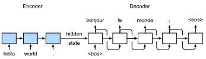

#  Sequence to Sequence
:label:`sec_seq2seq`

The sequence to sequence (seq2seq) model is based on the encoder-decoder architecture to generate a sequence output for a sequence input. Both the encoder and the decoder use recurrent neural networks (RNNs) to handle sequence inputs with different length. The hidden state of the encoder is used directly to initialize the decoder hidden state to pass information from the encoder to the decoder.


The layers in the encoder and the decoder are illustrated in the following figure.


In this section we will explain and implement the seq2seq model to train on the machine translation dataset.

```{.python .input  n=1}
import d2l
from mxnet import np, npx, init, gluon, autograd
from mxnet.gluon import nn, rnn
npx.set_np()
```

## Encoder

Recall that the encoder of seq2seq can transform the inputs with different length to a universal fixed length content vector $\mathbf{c}$ by encoding the sequence information inside $\mathbf{c}$. We usually use RNN layers within the encoder.

Let us think of an input sequence $x_1, \ldots, x_T$, where $x_t$ is $t$-th word of the inputs. At timestep $t$, the RNN will have two vectors as input: the $x_t$'s feature vector $\mathbf{x_t}$ and the hidden state of the last timestep $\mathbf{h_t}$. Let us denote the transformation of the RNN's hidden states by a function $f$: 

$$\mathbf{h_t} = f (\mathbf{x_t}, \mathbf{h_{t-1}}).$$

Next, the encoder absorbs the information of all the hidden states and encodes into the content vector $\mathbf{c}$ by a function $q$:

$$\mathbf{c} = q (\mathbf{h_1}, \ldots, \mathbf{h_T}).$$

For example, if we choose $q$ as $q (\mathbf{h_1}, \ldots, \mathbf{h_T}) = \mathbf{h_T}$, then the content vector will be the final hidden state $\mathbf{h_T}$.

So far what we describe above is a signle directional RNN, where each timestep's hidden state only depends on the previous tiemsteps'. We can also use other forms of RNNs such as GRUs, LSTMs and, bidirectional RNNs to encode the sequential information.


Let us implement the seq2seq's encoder together! Here, we use the word embedding layer to obtain a feature index from the word index of the input language and then input it into a multi-layer LSTM recurrent neural network. The input for the encoder is a batch of sequences, which is 2-D tensor with shape (batch size, sequence length). It outputs both the LSTM outputs, e.g., the hidden state for each time step, as well as the hidden state and memory cell of the last time step.

```{.python .input  n=2}
# Saved in the d2l package for later use
class Seq2SeqEncoder(d2l.Encoder):
    def __init__(self, vocab_size, embed_size, num_hiddens, num_layers,
                 dropout=0, **kwargs):
        super(Seq2SeqEncoder, self).__init__(**kwargs)
        self.embedding = nn.Embedding(vocab_size, embed_size)
        self.rnn = rnn.LSTM(num_hiddens, num_layers, dropout=dropout)

    def forward(self, X, *args):
        X = self.embedding(X) # X shape: (batch_size, seq_len, embed_size)
        X = X.swapaxes(0, 1)  # RNN needs first axes to be timestep, i.e., seq_len
        state = self.rnn.begin_state(batch_size=X.shape[1], ctx=X.context)
        out, state = self.rnn(X, state)
        # out shape: (seq_len, batch_size, num_hiddens)
        # stae shape: (num_layers, batch_size, num_hiddens),
        # where "state" contains the hidden state and the memory cell        
        return out, state
```

Next, we will create a mini-batch sequence input with a batch size of 4 and 7 timesteps. We assume that the number of hidden layers of the LSTM neural network is 2 and the number of hidden units is 16. The output shape after performing forward calculation on the input by the encoder  is (number of time steps, batch size, number of hidden units). 

```{.python .input  n=14}
encoder = Seq2SeqEncoder(vocab_size=10, embed_size=8,
                         num_hiddens=16, num_layers=2)
encoder.initialize()
X = np.zeros((4, 7))
output, state = encoder(X)
output.shape
```

```{.json .output n=14}
[
 {
  "data": {
   "text/plain": "(7, 4, 16)"
  },
  "execution_count": 14,
  "metadata": {},
  "output_type": "execute_result"
 }
]
```

Since long short term memory (LSTM) is used, the `state` list will contain both the hidden state and the memory cell with same shape (number of hidden layers, batch size, number of hidden units). However, if gated recurrent unit (GRU) is used, the `state` list contains only one element - the hidden state in the final time step with shape (number of hidden layers, batch size, number of hidden units). 

```{.python .input  n=15}
len(state), state[0].shape, state[1].shape
```

```{.json .output n=15}
[
 {
  "data": {
   "text/plain": "(2, (2, 4, 16), (2, 4, 16))"
  },
  "execution_count": 15,
  "metadata": {},
  "output_type": "execute_result"
 }
]
```

## Decoder

As we just introduced, the content vector $\mathbf{c}$ encodes the information from the whole input sequence $x_1, \ldots, x_T$. Suppose that the given outputs in the training set are $y_1, \ldots, y_{T'}$. At each timestep $t'$, the conditional probability of output $y_{t'}$ will base on the previous output sequences $y_1, \ldots, y_{t'-1}$ and the content vector $\mathbf{c}$, i.e., $$P(y_{t'} \mid y_1, \ldots, y_{t'-1}, \mathbf{c}).$$

Hence, we can use another RNN as the decoder. At timestep $t'$, the decoder will update its hidden state $\mathbf{s_{t'}}$ by three inputs: $y_{t'-1}$'s feature vector $\mathbf{y_{t'-1}}$, the content vector $\mathbf{c}$, and the hidden state of the last timestep $\mathbf{s_{t'}}$. Let us denote the transformation of the RNN's hidden states within the decoder by a function $g$: 

$$\mathbf{s_{t'}} = f (\mathbf{y_{t'-1}}, \mathbf{c}, \mathbf{s_{t'-1}}).$$


Now let us implement the seq2seq's decoder together. We directly use the hidden state of the encoder in the final time step as the initial hidden state of the decoder. This requires that the encoder and decoder RNNs have the same numbers of layers and hidden units.

The LSTM forward calculation of the decoder is similar to the encoder's. The only difference is that we add a dense layer after the LSTM layers, with the hidden size to be the vocabulary size. The dense layer will output the predicted confidence score for each word.

```{.python .input  n=4}
# Saved in the d2l package for later use
class Seq2SeqDecoder(d2l.Decoder):
    def __init__(self, vocab_size, embed_size, num_hiddens, num_layers,
                 dropout=0, **kwargs):
        super(Seq2SeqDecoder, self).__init__(**kwargs)
        self.embedding = nn.Embedding(vocab_size, embed_size)
        self.rnn = rnn.LSTM(num_hiddens, num_layers, dropout=dropout)
        self.dense = nn.Dense(vocab_size, flatten=False)

    def init_state(self, enc_outputs, *args):
        return enc_outputs[1]

    def forward(self, X, state):
        X = self.embedding(X).swapaxes(0, 1)
        out, state = self.rnn(X, state)
        # Make the batch to be the first dimension to simplify loss computation.
        out = self.dense(out).swapaxes(0, 1)
        return out, state
```

We create an decoder with the same hyper-parameters as the encoder. As we can see, the output shape is changed to (batch size, the sequence length, vocabulary size).

```{.python .input  n=5}
decoder = Seq2SeqDecoder(vocab_size=10, embed_size=8,
                         num_hiddens=16, num_layers=2)
decoder.initialize()
state = decoder.init_state(encoder(X))
out, state = decoder(X, state)
out.shape, len(state), state[0].shape, state[1].shape
```

```{.json .output n=5}
[
 {
  "data": {
   "text/plain": "((4, 7, 10), 2, (2, 4, 16), (2, 4, 16))"
  },
  "execution_count": 5,
  "metadata": {},
  "output_type": "execute_result"
 }
]
```

## The Loss Function

For each time step, the decoder outputs a vocabulary size confidence score vector to predict words. Similar to language modeling, we can apply softmax to obtain the probabilities and then use cross-entropy loss to calculate the loss. But note that we padded the target sentences to make them have the same length, but we do not need to compute the loss on the padding symbols.

To implement the loss function that filters out some entries, we will use an operator called `SequenceMask`. It can specify to mask the first dimension (`axis=0`) or the second one (`axis=1`). If the second one is chosen, given a valid length vector `len` and 2-dim input `X`, this operator sets `X[i, len[i]:] = 0` for all $i$'s.

```{.python .input  n=6}
X = np.array([[1,2,3], [4,5,6]])
npx.sequence_mask(X, np.array([1,2]), True, axis=1)
```

```{.json .output n=6}
[
 {
  "data": {
   "text/plain": "array([[1., 0., 0.],\n       [4., 5., 0.]])"
  },
  "execution_count": 6,
  "metadata": {},
  "output_type": "execute_result"
 }
]
```

Apply to $n$-dim tensor $X$, it sets `X[i, len[i]:, :, ..., :] = 0`. In addition, we can specify the filling value such as $-1$ as showing below.

```{.python .input  n=7}
X = np.ones((2, 3, 4))
npx.sequence_mask(X, np.array([1,2]), True, value=-1, axis=1)
```

```{.json .output n=7}
[
 {
  "data": {
   "text/plain": "array([[[ 1.,  1.,  1.,  1.],\n        [-1., -1., -1., -1.],\n        [-1., -1., -1., -1.]],\n\n       [[ 1.,  1.,  1.,  1.],\n        [ 1.,  1.,  1.,  1.],\n        [-1., -1., -1., -1.]]])"
  },
  "execution_count": 7,
  "metadata": {},
  "output_type": "execute_result"
 }
]
```

Now we can implement the masked version of the softmax cross-entropy loss. Note that each Gluon loss function allows to specify per-example weights, in default they are 1s. Then we can just use a zero weight for each example we would like to remove. So our customized loss function accepts an additional `valid_length` argument to ignore some failing elements in each sequence.

```{.python .input  n=8}
# Saved in the d2l package for later use
class MaskedSoftmaxCELoss(gluon.loss.SoftmaxCELoss):
    # pred shape: (batch_size, seq_len, vocab_size)
    # label shape: (batch_size, seq_len)
    # valid_length shape: (batch_size, )
    def forward(self, pred, label, valid_length):
        # weights shape should be (batch_size, seq_len, 1)
        weights = np.expand_dims(np.ones_like(label),axis=-1)
        weights = npx.sequence_mask(weights, valid_length, True, axis=1)
        return super(MaskedSoftmaxCELoss, self).forward(pred, label, weights)
```

For a sanity check, we create identical three sequences, keep 4 elements for the first sequence, 2 elements for the second sequence, and none for the last one. Then the first example loss should be 2 times larger than the second one, and the last loss should be 0.

```{.python .input  n=9}
loss = MaskedSoftmaxCELoss()
loss(np.ones((3, 4, 10)), np.ones((3, 4)), np.array([4, 2, 0]))
```

```{.json .output n=9}
[
 {
  "data": {
   "text/plain": "array([2.3025851, 1.1512926, 0.       ])"
  },
  "execution_count": 9,
  "metadata": {},
  "output_type": "execute_result"
 }
]
```

## Training

During training, if the target sequence has length $n$, we feed the first $n-1$ tokens into the decoder as inputs, and the last $n-1$ tokens are used as ground truth label.

```{.python .input  n=10}
# Saved in the d2l package for later use
def train_s2s_ch8(model, data_iter, lr, num_epochs, ctx):
    model.initialize(init.Xavier(), force_reinit=True, ctx=ctx)
    trainer = gluon.Trainer(model.collect_params(),
                            'adam', {'learning_rate': lr})
    loss = MaskedSoftmaxCELoss()
    animator = d2l.Animator(xlabel='epoch', ylabel='loss',
                            xlim=[1, num_epochs], ylim=[0, 0.25])
    for epoch in range(1, num_epochs+1):
        timer = d2l.Timer()
        metric = d2l.Accumulator(2)  # loss_sum, num_tokens
        for batch in data_iter:
            X, X_vlen, Y, Y_vlen = [x.as_in_context(ctx) for x in batch]
            Y_input, Y_label, Y_vlen = Y[:,:-1], Y[:,1:], Y_vlen-1
            with autograd.record():
                Y_hat, _ = model(X, Y_input, X_vlen, Y_vlen)
                l = loss(Y_hat, Y_label, Y_vlen)
            l.backward()
            d2l.grad_clipping(model, 1)
            num_tokens = Y_vlen.sum()
            trainer.step(num_tokens)
            metric.add(l.sum(), num_tokens)
        if epoch % 10 == 0:
            animator.add(epoch, (metric[0]/metric[1],))
    print('loss %.3f, %d tokens/sec on %s ' % (
        metric[0]/metric[1], metric[1]/timer.stop(), ctx))
```

Next, we create a model instance and set hyper-parameters. Then, we can train the model.

```{.python .input  n=11}
embed_size, num_hiddens, num_layers, dropout = 32, 32, 2, 0.0
batch_size, num_steps = 64, 10
lr, num_epochs, ctx = 0.005, 300, d2l.try_gpu()

src_vocab, tgt_vocab, train_iter = d2l.load_data_nmt(batch_size, num_steps)
encoder = Seq2SeqEncoder(
    len(src_vocab), embed_size, num_hiddens, num_layers, dropout)
decoder = Seq2SeqDecoder(
    len(tgt_vocab), embed_size, num_hiddens, num_layers, dropout)
model = d2l.EncoderDecoder(encoder, decoder)
train_s2s_ch8(model, train_iter, lr, num_epochs, ctx)
```

```{.json .output n=11}
[
 {
  "name": "stdout",
  "output_type": "stream",
  "text": "loss 0.027, 7591 tokens/sec on cpu(0) \n"
 },
 {
  "data": {
   "image/svg+xml": "<?xml version=\"1.0\" encoding=\"utf-8\" standalone=\"no\"?>\n<!DOCTYPE svg PUBLIC \"-//W3C//DTD SVG 1.1//EN\"\n  \"http://www.w3.org/Graphics/SVG/1.1/DTD/svg11.dtd\">\n<!-- Created with matplotlib (https://matplotlib.org/) -->\n<svg height=\"184.455469pt\" version=\"1.1\" viewBox=\"0 0 262.1875 184.455469\" width=\"262.1875pt\" xmlns=\"http://www.w3.org/2000/svg\" xmlns:xlink=\"http://www.w3.org/1999/xlink\">\n <defs>\n  <style type=\"text/css\">\n*{stroke-linecap:butt;stroke-linejoin:round;}\n  </style>\n </defs>\n <g id=\"figure_1\">\n  <g id=\"patch_1\">\n   <path d=\"M 0 184.455469 \nL 262.1875 184.455469 \nL 262.1875 -0 \nL 0 -0 \nz\n\" style=\"fill:none;\"/>\n  </g>\n  <g id=\"axes_1\">\n   <g id=\"patch_2\">\n    <path d=\"M 50.14375 146.899219 \nL 245.44375 146.899219 \nL 245.44375 10.999219 \nL 50.14375 10.999219 \nz\n\" style=\"fill:#ffffff;\"/>\n   </g>\n   <g id=\"matplotlib.axis_1\">\n    <g id=\"xtick_1\">\n     <g id=\"line2d_1\">\n      <path clip-path=\"url(#p0817584cf6)\" d=\"M 82.149436 146.899219 \nL 82.149436 10.999219 \n\" style=\"fill:none;stroke:#b0b0b0;stroke-linecap:square;stroke-width:0.8;\"/>\n     </g>\n     <g id=\"line2d_2\">\n      <defs>\n       <path d=\"M 0 0 \nL 0 3.5 \n\" id=\"m273603325f\" style=\"stroke:#000000;stroke-width:0.8;\"/>\n      </defs>\n      <g>\n       <use style=\"stroke:#000000;stroke-width:0.8;\" x=\"82.149436\" xlink:href=\"#m273603325f\" y=\"146.899219\"/>\n      </g>\n     </g>\n     <g id=\"text_1\">\n      <!-- 50 -->\n      <defs>\n       <path d=\"M 10.796875 72.90625 \nL 49.515625 72.90625 \nL 49.515625 64.59375 \nL 19.828125 64.59375 \nL 19.828125 46.734375 \nQ 21.96875 47.46875 24.109375 47.828125 \nQ 26.265625 48.1875 28.421875 48.1875 \nQ 40.625 48.1875 47.75 41.5 \nQ 54.890625 34.8125 54.890625 23.390625 \nQ 54.890625 11.625 47.5625 5.09375 \nQ 40.234375 -1.421875 26.90625 -1.421875 \nQ 22.3125 -1.421875 17.546875 -0.640625 \nQ 12.796875 0.140625 7.71875 1.703125 \nL 7.71875 11.625 \nQ 12.109375 9.234375 16.796875 8.0625 \nQ 21.484375 6.890625 26.703125 6.890625 \nQ 35.15625 6.890625 40.078125 11.328125 \nQ 45.015625 15.765625 45.015625 23.390625 \nQ 45.015625 31 40.078125 35.4375 \nQ 35.15625 39.890625 26.703125 39.890625 \nQ 22.75 39.890625 18.8125 39.015625 \nQ 14.890625 38.140625 10.796875 36.28125 \nz\n\" id=\"DejaVuSans-53\"/>\n       <path d=\"M 31.78125 66.40625 \nQ 24.171875 66.40625 20.328125 58.90625 \nQ 16.5 51.421875 16.5 36.375 \nQ 16.5 21.390625 20.328125 13.890625 \nQ 24.171875 6.390625 31.78125 6.390625 \nQ 39.453125 6.390625 43.28125 13.890625 \nQ 47.125 21.390625 47.125 36.375 \nQ 47.125 51.421875 43.28125 58.90625 \nQ 39.453125 66.40625 31.78125 66.40625 \nz\nM 31.78125 74.21875 \nQ 44.046875 74.21875 50.515625 64.515625 \nQ 56.984375 54.828125 56.984375 36.375 \nQ 56.984375 17.96875 50.515625 8.265625 \nQ 44.046875 -1.421875 31.78125 -1.421875 \nQ 19.53125 -1.421875 13.0625 8.265625 \nQ 6.59375 17.96875 6.59375 36.375 \nQ 6.59375 54.828125 13.0625 64.515625 \nQ 19.53125 74.21875 31.78125 74.21875 \nz\n\" id=\"DejaVuSans-48\"/>\n      </defs>\n      <g transform=\"translate(75.786936 161.497656)scale(0.1 -0.1)\">\n       <use xlink:href=\"#DejaVuSans-53\"/>\n       <use x=\"63.623047\" xlink:href=\"#DejaVuSans-48\"/>\n      </g>\n     </g>\n    </g>\n    <g id=\"xtick_2\">\n     <g id=\"line2d_3\">\n      <path clip-path=\"url(#p0817584cf6)\" d=\"M 114.808298 146.899219 \nL 114.808298 10.999219 \n\" style=\"fill:none;stroke:#b0b0b0;stroke-linecap:square;stroke-width:0.8;\"/>\n     </g>\n     <g id=\"line2d_4\">\n      <g>\n       <use style=\"stroke:#000000;stroke-width:0.8;\" x=\"114.808298\" xlink:href=\"#m273603325f\" y=\"146.899219\"/>\n      </g>\n     </g>\n     <g id=\"text_2\">\n      <!-- 100 -->\n      <defs>\n       <path d=\"M 12.40625 8.296875 \nL 28.515625 8.296875 \nL 28.515625 63.921875 \nL 10.984375 60.40625 \nL 10.984375 69.390625 \nL 28.421875 72.90625 \nL 38.28125 72.90625 \nL 38.28125 8.296875 \nL 54.390625 8.296875 \nL 54.390625 0 \nL 12.40625 0 \nz\n\" id=\"DejaVuSans-49\"/>\n      </defs>\n      <g transform=\"translate(105.264548 161.497656)scale(0.1 -0.1)\">\n       <use xlink:href=\"#DejaVuSans-49\"/>\n       <use x=\"63.623047\" xlink:href=\"#DejaVuSans-48\"/>\n       <use x=\"127.246094\" xlink:href=\"#DejaVuSans-48\"/>\n      </g>\n     </g>\n    </g>\n    <g id=\"xtick_3\">\n     <g id=\"line2d_5\">\n      <path clip-path=\"url(#p0817584cf6)\" d=\"M 147.467161 146.899219 \nL 147.467161 10.999219 \n\" style=\"fill:none;stroke:#b0b0b0;stroke-linecap:square;stroke-width:0.8;\"/>\n     </g>\n     <g id=\"line2d_6\">\n      <g>\n       <use style=\"stroke:#000000;stroke-width:0.8;\" x=\"147.467161\" xlink:href=\"#m273603325f\" y=\"146.899219\"/>\n      </g>\n     </g>\n     <g id=\"text_3\">\n      <!-- 150 -->\n      <g transform=\"translate(137.923411 161.497656)scale(0.1 -0.1)\">\n       <use xlink:href=\"#DejaVuSans-49\"/>\n       <use x=\"63.623047\" xlink:href=\"#DejaVuSans-53\"/>\n       <use x=\"127.246094\" xlink:href=\"#DejaVuSans-48\"/>\n      </g>\n     </g>\n    </g>\n    <g id=\"xtick_4\">\n     <g id=\"line2d_7\">\n      <path clip-path=\"url(#p0817584cf6)\" d=\"M 180.126024 146.899219 \nL 180.126024 10.999219 \n\" style=\"fill:none;stroke:#b0b0b0;stroke-linecap:square;stroke-width:0.8;\"/>\n     </g>\n     <g id=\"line2d_8\">\n      <g>\n       <use style=\"stroke:#000000;stroke-width:0.8;\" x=\"180.126024\" xlink:href=\"#m273603325f\" y=\"146.899219\"/>\n      </g>\n     </g>\n     <g id=\"text_4\">\n      <!-- 200 -->\n      <defs>\n       <path d=\"M 19.1875 8.296875 \nL 53.609375 8.296875 \nL 53.609375 0 \nL 7.328125 0 \nL 7.328125 8.296875 \nQ 12.9375 14.109375 22.625 23.890625 \nQ 32.328125 33.6875 34.8125 36.53125 \nQ 39.546875 41.84375 41.421875 45.53125 \nQ 43.3125 49.21875 43.3125 52.78125 \nQ 43.3125 58.59375 39.234375 62.25 \nQ 35.15625 65.921875 28.609375 65.921875 \nQ 23.96875 65.921875 18.8125 64.3125 \nQ 13.671875 62.703125 7.8125 59.421875 \nL 7.8125 69.390625 \nQ 13.765625 71.78125 18.9375 73 \nQ 24.125 74.21875 28.421875 74.21875 \nQ 39.75 74.21875 46.484375 68.546875 \nQ 53.21875 62.890625 53.21875 53.421875 \nQ 53.21875 48.921875 51.53125 44.890625 \nQ 49.859375 40.875 45.40625 35.40625 \nQ 44.1875 33.984375 37.640625 27.21875 \nQ 31.109375 20.453125 19.1875 8.296875 \nz\n\" id=\"DejaVuSans-50\"/>\n      </defs>\n      <g transform=\"translate(170.582274 161.497656)scale(0.1 -0.1)\">\n       <use xlink:href=\"#DejaVuSans-50\"/>\n       <use x=\"63.623047\" xlink:href=\"#DejaVuSans-48\"/>\n       <use x=\"127.246094\" xlink:href=\"#DejaVuSans-48\"/>\n      </g>\n     </g>\n    </g>\n    <g id=\"xtick_5\">\n     <g id=\"line2d_9\">\n      <path clip-path=\"url(#p0817584cf6)\" d=\"M 212.784887 146.899219 \nL 212.784887 10.999219 \n\" style=\"fill:none;stroke:#b0b0b0;stroke-linecap:square;stroke-width:0.8;\"/>\n     </g>\n     <g id=\"line2d_10\">\n      <g>\n       <use style=\"stroke:#000000;stroke-width:0.8;\" x=\"212.784887\" xlink:href=\"#m273603325f\" y=\"146.899219\"/>\n      </g>\n     </g>\n     <g id=\"text_5\">\n      <!-- 250 -->\n      <g transform=\"translate(203.241137 161.497656)scale(0.1 -0.1)\">\n       <use xlink:href=\"#DejaVuSans-50\"/>\n       <use x=\"63.623047\" xlink:href=\"#DejaVuSans-53\"/>\n       <use x=\"127.246094\" xlink:href=\"#DejaVuSans-48\"/>\n      </g>\n     </g>\n    </g>\n    <g id=\"xtick_6\">\n     <g id=\"line2d_11\">\n      <path clip-path=\"url(#p0817584cf6)\" d=\"M 245.44375 146.899219 \nL 245.44375 10.999219 \n\" style=\"fill:none;stroke:#b0b0b0;stroke-linecap:square;stroke-width:0.8;\"/>\n     </g>\n     <g id=\"line2d_12\">\n      <g>\n       <use style=\"stroke:#000000;stroke-width:0.8;\" x=\"245.44375\" xlink:href=\"#m273603325f\" y=\"146.899219\"/>\n      </g>\n     </g>\n     <g id=\"text_6\">\n      <!-- 300 -->\n      <defs>\n       <path d=\"M 40.578125 39.3125 \nQ 47.65625 37.796875 51.625 33 \nQ 55.609375 28.21875 55.609375 21.1875 \nQ 55.609375 10.40625 48.1875 4.484375 \nQ 40.765625 -1.421875 27.09375 -1.421875 \nQ 22.515625 -1.421875 17.65625 -0.515625 \nQ 12.796875 0.390625 7.625 2.203125 \nL 7.625 11.71875 \nQ 11.71875 9.328125 16.59375 8.109375 \nQ 21.484375 6.890625 26.8125 6.890625 \nQ 36.078125 6.890625 40.9375 10.546875 \nQ 45.796875 14.203125 45.796875 21.1875 \nQ 45.796875 27.640625 41.28125 31.265625 \nQ 36.765625 34.90625 28.71875 34.90625 \nL 20.21875 34.90625 \nL 20.21875 43.015625 \nL 29.109375 43.015625 \nQ 36.375 43.015625 40.234375 45.921875 \nQ 44.09375 48.828125 44.09375 54.296875 \nQ 44.09375 59.90625 40.109375 62.90625 \nQ 36.140625 65.921875 28.71875 65.921875 \nQ 24.65625 65.921875 20.015625 65.03125 \nQ 15.375 64.15625 9.8125 62.3125 \nL 9.8125 71.09375 \nQ 15.4375 72.65625 20.34375 73.4375 \nQ 25.25 74.21875 29.59375 74.21875 \nQ 40.828125 74.21875 47.359375 69.109375 \nQ 53.90625 64.015625 53.90625 55.328125 \nQ 53.90625 49.265625 50.4375 45.09375 \nQ 46.96875 40.921875 40.578125 39.3125 \nz\n\" id=\"DejaVuSans-51\"/>\n      </defs>\n      <g transform=\"translate(235.9 161.497656)scale(0.1 -0.1)\">\n       <use xlink:href=\"#DejaVuSans-51\"/>\n       <use x=\"63.623047\" xlink:href=\"#DejaVuSans-48\"/>\n       <use x=\"127.246094\" xlink:href=\"#DejaVuSans-48\"/>\n      </g>\n     </g>\n    </g>\n    <g id=\"text_7\">\n     <!-- epoch -->\n     <defs>\n      <path d=\"M 56.203125 29.59375 \nL 56.203125 25.203125 \nL 14.890625 25.203125 \nQ 15.484375 15.921875 20.484375 11.0625 \nQ 25.484375 6.203125 34.421875 6.203125 \nQ 39.59375 6.203125 44.453125 7.46875 \nQ 49.3125 8.734375 54.109375 11.28125 \nL 54.109375 2.78125 \nQ 49.265625 0.734375 44.1875 -0.34375 \nQ 39.109375 -1.421875 33.890625 -1.421875 \nQ 20.796875 -1.421875 13.15625 6.1875 \nQ 5.515625 13.8125 5.515625 26.8125 \nQ 5.515625 40.234375 12.765625 48.109375 \nQ 20.015625 56 32.328125 56 \nQ 43.359375 56 49.78125 48.890625 \nQ 56.203125 41.796875 56.203125 29.59375 \nz\nM 47.21875 32.234375 \nQ 47.125 39.59375 43.09375 43.984375 \nQ 39.0625 48.390625 32.421875 48.390625 \nQ 24.90625 48.390625 20.390625 44.140625 \nQ 15.875 39.890625 15.1875 32.171875 \nz\n\" id=\"DejaVuSans-101\"/>\n      <path d=\"M 18.109375 8.203125 \nL 18.109375 -20.796875 \nL 9.078125 -20.796875 \nL 9.078125 54.6875 \nL 18.109375 54.6875 \nL 18.109375 46.390625 \nQ 20.953125 51.265625 25.265625 53.625 \nQ 29.59375 56 35.59375 56 \nQ 45.5625 56 51.78125 48.09375 \nQ 58.015625 40.1875 58.015625 27.296875 \nQ 58.015625 14.40625 51.78125 6.484375 \nQ 45.5625 -1.421875 35.59375 -1.421875 \nQ 29.59375 -1.421875 25.265625 0.953125 \nQ 20.953125 3.328125 18.109375 8.203125 \nz\nM 48.6875 27.296875 \nQ 48.6875 37.203125 44.609375 42.84375 \nQ 40.53125 48.484375 33.40625 48.484375 \nQ 26.265625 48.484375 22.1875 42.84375 \nQ 18.109375 37.203125 18.109375 27.296875 \nQ 18.109375 17.390625 22.1875 11.75 \nQ 26.265625 6.109375 33.40625 6.109375 \nQ 40.53125 6.109375 44.609375 11.75 \nQ 48.6875 17.390625 48.6875 27.296875 \nz\n\" id=\"DejaVuSans-112\"/>\n      <path d=\"M 30.609375 48.390625 \nQ 23.390625 48.390625 19.1875 42.75 \nQ 14.984375 37.109375 14.984375 27.296875 \nQ 14.984375 17.484375 19.15625 11.84375 \nQ 23.34375 6.203125 30.609375 6.203125 \nQ 37.796875 6.203125 41.984375 11.859375 \nQ 46.1875 17.53125 46.1875 27.296875 \nQ 46.1875 37.015625 41.984375 42.703125 \nQ 37.796875 48.390625 30.609375 48.390625 \nz\nM 30.609375 56 \nQ 42.328125 56 49.015625 48.375 \nQ 55.71875 40.765625 55.71875 27.296875 \nQ 55.71875 13.875 49.015625 6.21875 \nQ 42.328125 -1.421875 30.609375 -1.421875 \nQ 18.84375 -1.421875 12.171875 6.21875 \nQ 5.515625 13.875 5.515625 27.296875 \nQ 5.515625 40.765625 12.171875 48.375 \nQ 18.84375 56 30.609375 56 \nz\n\" id=\"DejaVuSans-111\"/>\n      <path d=\"M 48.78125 52.59375 \nL 48.78125 44.1875 \nQ 44.96875 46.296875 41.140625 47.34375 \nQ 37.3125 48.390625 33.40625 48.390625 \nQ 24.65625 48.390625 19.8125 42.84375 \nQ 14.984375 37.3125 14.984375 27.296875 \nQ 14.984375 17.28125 19.8125 11.734375 \nQ 24.65625 6.203125 33.40625 6.203125 \nQ 37.3125 6.203125 41.140625 7.25 \nQ 44.96875 8.296875 48.78125 10.40625 \nL 48.78125 2.09375 \nQ 45.015625 0.34375 40.984375 -0.53125 \nQ 36.96875 -1.421875 32.421875 -1.421875 \nQ 20.0625 -1.421875 12.78125 6.34375 \nQ 5.515625 14.109375 5.515625 27.296875 \nQ 5.515625 40.671875 12.859375 48.328125 \nQ 20.21875 56 33.015625 56 \nQ 37.15625 56 41.109375 55.140625 \nQ 45.0625 54.296875 48.78125 52.59375 \nz\n\" id=\"DejaVuSans-99\"/>\n      <path d=\"M 54.890625 33.015625 \nL 54.890625 0 \nL 45.90625 0 \nL 45.90625 32.71875 \nQ 45.90625 40.484375 42.875 44.328125 \nQ 39.84375 48.1875 33.796875 48.1875 \nQ 26.515625 48.1875 22.3125 43.546875 \nQ 18.109375 38.921875 18.109375 30.90625 \nL 18.109375 0 \nL 9.078125 0 \nL 9.078125 75.984375 \nL 18.109375 75.984375 \nL 18.109375 46.1875 \nQ 21.34375 51.125 25.703125 53.5625 \nQ 30.078125 56 35.796875 56 \nQ 45.21875 56 50.046875 50.171875 \nQ 54.890625 44.34375 54.890625 33.015625 \nz\n\" id=\"DejaVuSans-104\"/>\n     </defs>\n     <g transform=\"translate(132.565625 175.175781)scale(0.1 -0.1)\">\n      <use xlink:href=\"#DejaVuSans-101\"/>\n      <use x=\"61.523438\" xlink:href=\"#DejaVuSans-112\"/>\n      <use x=\"125\" xlink:href=\"#DejaVuSans-111\"/>\n      <use x=\"186.181641\" xlink:href=\"#DejaVuSans-99\"/>\n      <use x=\"241.162109\" xlink:href=\"#DejaVuSans-104\"/>\n     </g>\n    </g>\n   </g>\n   <g id=\"matplotlib.axis_2\">\n    <g id=\"ytick_1\">\n     <g id=\"line2d_13\">\n      <path clip-path=\"url(#p0817584cf6)\" d=\"M 50.14375 146.899219 \nL 245.44375 146.899219 \n\" style=\"fill:none;stroke:#b0b0b0;stroke-linecap:square;stroke-width:0.8;\"/>\n     </g>\n     <g id=\"line2d_14\">\n      <defs>\n       <path d=\"M 0 0 \nL -3.5 0 \n\" id=\"m7941825bad\" style=\"stroke:#000000;stroke-width:0.8;\"/>\n      </defs>\n      <g>\n       <use style=\"stroke:#000000;stroke-width:0.8;\" x=\"50.14375\" xlink:href=\"#m7941825bad\" y=\"146.899219\"/>\n      </g>\n     </g>\n     <g id=\"text_8\">\n      <!-- 0.00 -->\n      <defs>\n       <path d=\"M 10.6875 12.40625 \nL 21 12.40625 \nL 21 0 \nL 10.6875 0 \nz\n\" id=\"DejaVuSans-46\"/>\n      </defs>\n      <g transform=\"translate(20.878125 150.698437)scale(0.1 -0.1)\">\n       <use xlink:href=\"#DejaVuSans-48\"/>\n       <use x=\"63.623047\" xlink:href=\"#DejaVuSans-46\"/>\n       <use x=\"95.410156\" xlink:href=\"#DejaVuSans-48\"/>\n       <use x=\"159.033203\" xlink:href=\"#DejaVuSans-48\"/>\n      </g>\n     </g>\n    </g>\n    <g id=\"ytick_2\">\n     <g id=\"line2d_15\">\n      <path clip-path=\"url(#p0817584cf6)\" d=\"M 50.14375 119.719219 \nL 245.44375 119.719219 \n\" style=\"fill:none;stroke:#b0b0b0;stroke-linecap:square;stroke-width:0.8;\"/>\n     </g>\n     <g id=\"line2d_16\">\n      <g>\n       <use style=\"stroke:#000000;stroke-width:0.8;\" x=\"50.14375\" xlink:href=\"#m7941825bad\" y=\"119.719219\"/>\n      </g>\n     </g>\n     <g id=\"text_9\">\n      <!-- 0.05 -->\n      <g transform=\"translate(20.878125 123.518437)scale(0.1 -0.1)\">\n       <use xlink:href=\"#DejaVuSans-48\"/>\n       <use x=\"63.623047\" xlink:href=\"#DejaVuSans-46\"/>\n       <use x=\"95.410156\" xlink:href=\"#DejaVuSans-48\"/>\n       <use x=\"159.033203\" xlink:href=\"#DejaVuSans-53\"/>\n      </g>\n     </g>\n    </g>\n    <g id=\"ytick_3\">\n     <g id=\"line2d_17\">\n      <path clip-path=\"url(#p0817584cf6)\" d=\"M 50.14375 92.539219 \nL 245.44375 92.539219 \n\" style=\"fill:none;stroke:#b0b0b0;stroke-linecap:square;stroke-width:0.8;\"/>\n     </g>\n     <g id=\"line2d_18\">\n      <g>\n       <use style=\"stroke:#000000;stroke-width:0.8;\" x=\"50.14375\" xlink:href=\"#m7941825bad\" y=\"92.539219\"/>\n      </g>\n     </g>\n     <g id=\"text_10\">\n      <!-- 0.10 -->\n      <g transform=\"translate(20.878125 96.338437)scale(0.1 -0.1)\">\n       <use xlink:href=\"#DejaVuSans-48\"/>\n       <use x=\"63.623047\" xlink:href=\"#DejaVuSans-46\"/>\n       <use x=\"95.410156\" xlink:href=\"#DejaVuSans-49\"/>\n       <use x=\"159.033203\" xlink:href=\"#DejaVuSans-48\"/>\n      </g>\n     </g>\n    </g>\n    <g id=\"ytick_4\">\n     <g id=\"line2d_19\">\n      <path clip-path=\"url(#p0817584cf6)\" d=\"M 50.14375 65.359219 \nL 245.44375 65.359219 \n\" style=\"fill:none;stroke:#b0b0b0;stroke-linecap:square;stroke-width:0.8;\"/>\n     </g>\n     <g id=\"line2d_20\">\n      <g>\n       <use style=\"stroke:#000000;stroke-width:0.8;\" x=\"50.14375\" xlink:href=\"#m7941825bad\" y=\"65.359219\"/>\n      </g>\n     </g>\n     <g id=\"text_11\">\n      <!-- 0.15 -->\n      <g transform=\"translate(20.878125 69.158437)scale(0.1 -0.1)\">\n       <use xlink:href=\"#DejaVuSans-48\"/>\n       <use x=\"63.623047\" xlink:href=\"#DejaVuSans-46\"/>\n       <use x=\"95.410156\" xlink:href=\"#DejaVuSans-49\"/>\n       <use x=\"159.033203\" xlink:href=\"#DejaVuSans-53\"/>\n      </g>\n     </g>\n    </g>\n    <g id=\"ytick_5\">\n     <g id=\"line2d_21\">\n      <path clip-path=\"url(#p0817584cf6)\" d=\"M 50.14375 38.179219 \nL 245.44375 38.179219 \n\" style=\"fill:none;stroke:#b0b0b0;stroke-linecap:square;stroke-width:0.8;\"/>\n     </g>\n     <g id=\"line2d_22\">\n      <g>\n       <use style=\"stroke:#000000;stroke-width:0.8;\" x=\"50.14375\" xlink:href=\"#m7941825bad\" y=\"38.179219\"/>\n      </g>\n     </g>\n     <g id=\"text_12\">\n      <!-- 0.20 -->\n      <g transform=\"translate(20.878125 41.978437)scale(0.1 -0.1)\">\n       <use xlink:href=\"#DejaVuSans-48\"/>\n       <use x=\"63.623047\" xlink:href=\"#DejaVuSans-46\"/>\n       <use x=\"95.410156\" xlink:href=\"#DejaVuSans-50\"/>\n       <use x=\"159.033203\" xlink:href=\"#DejaVuSans-48\"/>\n      </g>\n     </g>\n    </g>\n    <g id=\"ytick_6\">\n     <g id=\"line2d_23\">\n      <path clip-path=\"url(#p0817584cf6)\" d=\"M 50.14375 10.999219 \nL 245.44375 10.999219 \n\" style=\"fill:none;stroke:#b0b0b0;stroke-linecap:square;stroke-width:0.8;\"/>\n     </g>\n     <g id=\"line2d_24\">\n      <g>\n       <use style=\"stroke:#000000;stroke-width:0.8;\" x=\"50.14375\" xlink:href=\"#m7941825bad\" y=\"10.999219\"/>\n      </g>\n     </g>\n     <g id=\"text_13\">\n      <!-- 0.25 -->\n      <g transform=\"translate(20.878125 14.798437)scale(0.1 -0.1)\">\n       <use xlink:href=\"#DejaVuSans-48\"/>\n       <use x=\"63.623047\" xlink:href=\"#DejaVuSans-46\"/>\n       <use x=\"95.410156\" xlink:href=\"#DejaVuSans-50\"/>\n       <use x=\"159.033203\" xlink:href=\"#DejaVuSans-53\"/>\n      </g>\n     </g>\n    </g>\n    <g id=\"text_14\">\n     <!-- loss -->\n     <defs>\n      <path d=\"M 9.421875 75.984375 \nL 18.40625 75.984375 \nL 18.40625 0 \nL 9.421875 0 \nz\n\" id=\"DejaVuSans-108\"/>\n      <path d=\"M 44.28125 53.078125 \nL 44.28125 44.578125 \nQ 40.484375 46.53125 36.375 47.5 \nQ 32.28125 48.484375 27.875 48.484375 \nQ 21.1875 48.484375 17.84375 46.4375 \nQ 14.5 44.390625 14.5 40.28125 \nQ 14.5 37.15625 16.890625 35.375 \nQ 19.28125 33.59375 26.515625 31.984375 \nL 29.59375 31.296875 \nQ 39.15625 29.25 43.1875 25.515625 \nQ 47.21875 21.78125 47.21875 15.09375 \nQ 47.21875 7.46875 41.1875 3.015625 \nQ 35.15625 -1.421875 24.609375 -1.421875 \nQ 20.21875 -1.421875 15.453125 -0.5625 \nQ 10.6875 0.296875 5.421875 2 \nL 5.421875 11.28125 \nQ 10.40625 8.6875 15.234375 7.390625 \nQ 20.0625 6.109375 24.8125 6.109375 \nQ 31.15625 6.109375 34.5625 8.28125 \nQ 37.984375 10.453125 37.984375 14.40625 \nQ 37.984375 18.0625 35.515625 20.015625 \nQ 33.0625 21.96875 24.703125 23.78125 \nL 21.578125 24.515625 \nQ 13.234375 26.265625 9.515625 29.90625 \nQ 5.8125 33.546875 5.8125 39.890625 \nQ 5.8125 47.609375 11.28125 51.796875 \nQ 16.75 56 26.8125 56 \nQ 31.78125 56 36.171875 55.265625 \nQ 40.578125 54.546875 44.28125 53.078125 \nz\n\" id=\"DejaVuSans-115\"/>\n     </defs>\n     <g transform=\"translate(14.798437 88.607031)rotate(-90)scale(0.1 -0.1)\">\n      <use xlink:href=\"#DejaVuSans-108\"/>\n      <use x=\"27.783203\" xlink:href=\"#DejaVuSans-111\"/>\n      <use x=\"88.964844\" xlink:href=\"#DejaVuSans-115\"/>\n      <use x=\"141.064453\" xlink:href=\"#DejaVuSans-115\"/>\n     </g>\n    </g>\n   </g>\n   <g id=\"line2d_25\">\n    <path clip-path=\"url(#p0817584cf6)\" d=\"M 56.022345 29.240592 \nL 62.554118 48.973055 \nL 69.08589 60.276538 \nL 75.617663 69.54188 \nL 82.149436 77.856776 \nL 88.681208 84.256176 \nL 95.212981 89.782303 \nL 101.744753 94.849537 \nL 108.276526 99.128614 \nL 114.808298 102.710486 \nL 121.340071 107.163553 \nL 127.871844 111.012587 \nL 134.403616 114.179884 \nL 140.935389 116.55008 \nL 147.467161 118.709475 \nL 153.998934 121.265759 \nL 160.530707 122.895697 \nL 167.062479 124.692362 \nL 173.594252 126.114577 \nL 180.126024 127.054399 \nL 186.657797 128.102558 \nL 193.189569 128.632682 \nL 199.721342 129.488405 \nL 206.253115 129.861742 \nL 212.784887 130.532704 \nL 219.31666 130.918264 \nL 225.848432 131.139475 \nL 232.380205 131.537379 \nL 238.911977 132.017319 \nL 245.44375 132.219494 \n\" style=\"fill:none;stroke:#1f77b4;stroke-linecap:square;stroke-width:1.5;\"/>\n   </g>\n   <g id=\"patch_3\">\n    <path d=\"M 50.14375 146.899219 \nL 50.14375 10.999219 \n\" style=\"fill:none;stroke:#000000;stroke-linecap:square;stroke-linejoin:miter;stroke-width:0.8;\"/>\n   </g>\n   <g id=\"patch_4\">\n    <path d=\"M 245.44375 146.899219 \nL 245.44375 10.999219 \n\" style=\"fill:none;stroke:#000000;stroke-linecap:square;stroke-linejoin:miter;stroke-width:0.8;\"/>\n   </g>\n   <g id=\"patch_5\">\n    <path d=\"M 50.14375 146.899219 \nL 245.44375 146.899219 \n\" style=\"fill:none;stroke:#000000;stroke-linecap:square;stroke-linejoin:miter;stroke-width:0.8;\"/>\n   </g>\n   <g id=\"patch_6\">\n    <path d=\"M 50.14375 10.999219 \nL 245.44375 10.999219 \n\" style=\"fill:none;stroke:#000000;stroke-linecap:square;stroke-linejoin:miter;stroke-width:0.8;\"/>\n   </g>\n  </g>\n </g>\n <defs>\n  <clipPath id=\"p0817584cf6\">\n   <rect height=\"135.9\" width=\"195.3\" x=\"50.14375\" y=\"10.999219\"/>\n  </clipPath>\n </defs>\n</svg>\n",
   "text/plain": "<Figure size 252x180 with 1 Axes>"
  },
  "metadata": {
   "needs_background": "light"
  },
  "output_type": "display_data"
 }
]
```

## Predicting

Here we implement the simplest method, greedy search, to generate an output
sequence.
During predicting, we feed the same "&lt;bos&gt;" token to the decoder as training at time step 0. But the input token for a later time step is the predicted token from the previous time step.



```{.python .input  n=12}
# Saved in the d2l package for later use
def predict_s2s_ch8(model, src_sentence, src_vocab, tgt_vocab, num_steps, ctx):
    src_tokens = src_vocab[src_sentence.lower().split(' ')]
    enc_valid_length = np.array([len(src_tokens)], ctx=ctx)
    src_tokens = d2l.trim_pad(src_tokens, num_steps, src_vocab.pad)
    enc_X = np.array(src_tokens, ctx=ctx)
    # add the batch_size dimension.
    enc_outputs = model.encoder(np.expand_dims(enc_X, axis=0),
                                enc_valid_length)
    dec_state = model.decoder.init_state(enc_outputs, enc_valid_length)
    dec_X = np.expand_dims(np.array([tgt_vocab.bos], ctx=ctx), axis=0)
    predict_tokens = []
    for _ in range(num_steps):
        Y, dec_state = model.decoder(dec_X, dec_state)
        # The token with highest score is used as the next time step input.
        dec_X = Y.argmax(axis=2)
        py = dec_X.squeeze(axis=0).astype('int32').item()
        if py == tgt_vocab.eos:
            break
        predict_tokens.append(py)
    return ' '.join(tgt_vocab.to_tokens(predict_tokens))
```

Try several examples:

```{.python .input  n=13}
for sentence in ['Go .', 'Wow !', "I'm OK .", 'I won !']:
    print(sentence + ' => ' + predict_s2s_ch8(
        model, sentence, src_vocab, tgt_vocab, num_steps, ctx))
```

```{.json .output n=13}
[
 {
  "name": "stdout",
  "output_type": "stream",
  "text": "Go . => va !\nWow ! => <unk> !\nI'm OK . => je vais bien .\nI won ! => j'ai gagn\u00e9 !\n"
 }
]
```

## Summary
* The sequence to sequence (seq2seq) model is based on the encoder-decoder architecture to generate a sequence output from a sequence input.
* We use multiple LSTM layers for both encoder and decoder.

## Exercise
1. Can you think of the other use cases of seq2seq model besides neural machine translation?
1. What will happen if the input sequence in our example is longer? 
1. If we do not use the "SequenceMask" in the loss function, we may happen?


## Scan the QR Code to [Discuss](https://discuss.mxnet.io/t/4357)


