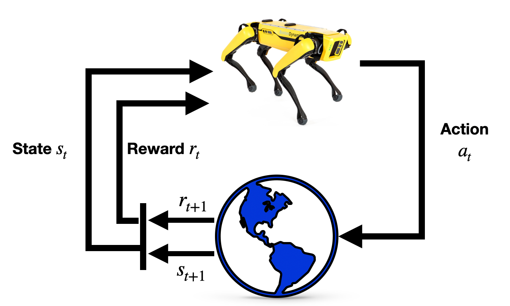

# Reinforcement Learning
:label:`chap_reinforcement_learning`


**Pratik Chaudhari** (*University of Pennsylvania and Amazon*), **Rasool Fakoor** (*Amazon*), and **Kavosh Asadi** (*Amazon*)

Reinforcement Learning (RL) is a suite of techniques that allows us to build machine learning systems that take decisions sequentially. For example, a package containing new clothes that you purchased from an online retailer arrives at your doorstep after a sequence of decisions, e.g., the retailer finding the clothes in the warehouse closest to your house, putting the clothes in a box, transporting the box via land or by air, and delivering it to your house within the city. There are many variables that affect the delivery of the package along the way, e.g., whether or not the clothes were available in the warehouse, how long it took to transport the box, whether it arrived in your city before the daily delivery truck left, etc. The key idea is that at each stage these variables that we do not often control affect the entire sequence of events in the future, e.g., if there were delays in packing the box in the warehouse the retailer may need to send the package via air instead of ground to ensure a timely delivery. Reinforcement Learning methods allow us to take the appropriate action at each stage of a sequential decision making problem in order to maximize some utility eventually, e.g., the timely delivery of the package to you.

Such sequential decision making problems are seen in numerous other places, e.g., while playing [Go](https://en.wikipedia.org/wiki/Go_(game)) your current move determines the next moves and the opponent's moves are the variables that you cannot control... a sequence of moves eventually determines whether or not you win; the movies that Netflix recommends to you now determine what you watch, whether you like the movie or not is unknown to Netflix, eventually a sequence of movie recommendations determines how satisfied you are with Netflix. Reinforcement learning is being used today to develop effective solutions to these problems :cite:`mnih2013playing,silver2016mastering`. The key distinction between reinforcement learning and standard deep learning is that in standard deep learning the prediction of a trained model on one test datum does not affect the predictions on a future test datum; in reinforcement learning decisions at future instants (in RL, decisions are also called actions) are affected by what decisions were made in the past.

In this chapter, we will develop the fundamentals of reinforcement learning and obtain hands-on experience in implementing some popular reinforcement learning methods. We will first develop a concept called a Markov Decision Process (MDP) which allows us to think of such sequential decision making problems. An algorithm called Value Iteration will be our first insight into solving reinforcement learning problems under the assumption that we know how the uncontrolled variables in an MDP (in RL, these controlled variables are called the environment) typically behave. Using the more general version of Value Iteration, an algorithm called Q-Learning, we will be able to take appropriate actions even when we do not necessarily have full knowledge of the environment. We will then study how to use deep networks for reinforcement learning problems by imitating the actions of an expert. And finally, we will develop a reinforcement learning method that uses a deep network to take actions in unknown environments. These techniques form the basis of more advanced RL algorithms that are used today in a variety of real-world applications, some of which we will point to in the chapter.


:width:`400px`
:label:`fig_rl_big`

```toc
:maxdepth: 2

mdp
value-iter
qlearning
```
