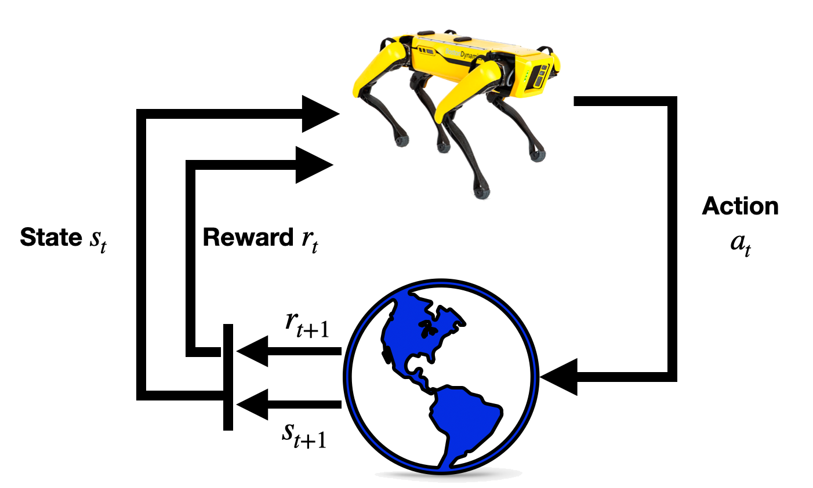

# Reinforcement Learning
:label:`chap_reinforcement_learning`

Reinforcement learning (RL) refers to techniques by which an agent learns a policy that optimizes a given performance metric from a sequence of interactions with an environment.  Each of the agent's actions effects the state of the environment which the agent observes. After executing an action, the agent will also receive some scalar value which is called reward. Using this feedback, the agent has to determine which action to take in order to maximize the rewards obtained through the interaction with the environment. By maximizing rewards, the agent can determine the optimal policy. It is worth noting that in contrast to other classes of machine learning methods, like Supervised learning in which a training set has been provided, an RL agent should act in the environment in order to explore its actions' effects and maximize the reward. More importantly, in interactive problems, it is often infeasible to collect data that represent all the cases in which the agent has to act.


:width:`400px`
:label:`fig_rl_big-picture`

```toc
:maxdepth: 2

mdp
value-iter
```