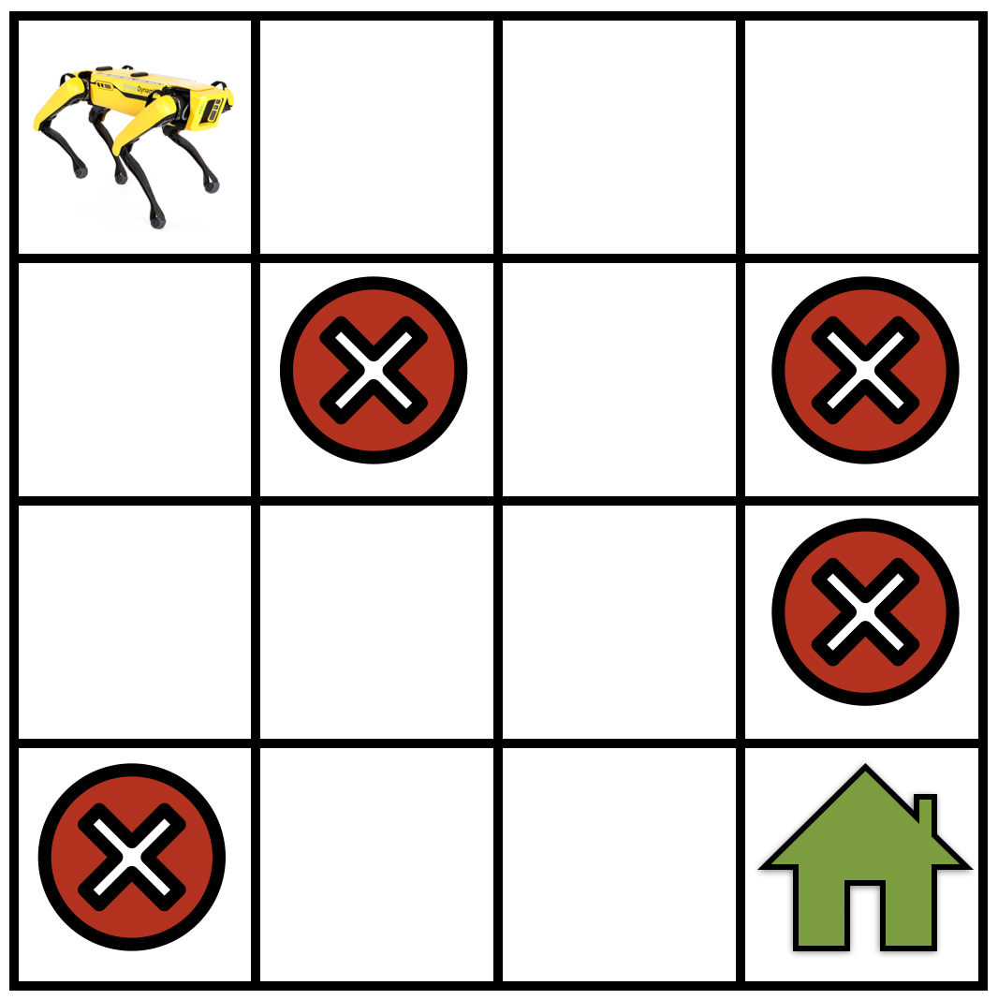

# Markov Decision Process (MDP)
:label:`sec_mdp`
In this section, we will discuss how to formulate reinforcement learning problems using Markov decision processes (MDPs) and describe in detail various components of MDPs. 

## Definition of an MDP

A Markov decision process (MDP) is a model for how the state of a system evolves as different actions are applied to it. A few different quantities come together to form an MDP as follows.

:width:`250px`
:label:`fig_mdp`

- Let $\mathcal{S}$ be the set of states in the MDP. As a concrete example see :numref:`fig_mdp`, for a robot that is navigating a gridworld. In this case, $\mathcal{S}$ corresponds to the set of locations that the robot can be at any given timestep.
- Let $\mathcal{A}$ be the set of actions that the robot can take at each state, e.g., "go forward", "turn right", "turn left", "stay at the same location", etc. Actions can change the current state of the robot to some other state within the set $\mathcal{S}$.
- It may happen that we do not know how the robot moves *exactly* but know it up to some approximation. We model this situation in reinforcement learning using the concept of a transition probability, e.g., if the robot takes an action "go forward", there might be a small probability that it stays at the current state. Mathematically, this amounts to defining a "transition function" $T: \mathcal{S} \times \mathcal{A} \times \mathcal{S} \to [0,1]$
$$T(s, a, s') = P(s' \mid s, a)$$

using the conditional probability of reaching a state $s'$ given that the robot was at state $s$ and took an action $a$ there. Since the transition function is a probability distribution, we have $\sum_{s' \in \mathcal{S}} T(s, a, s') = 1$ for all $s \in \mathcal{S}$ and $a \in \mathcal{A}$, i.e., the robot has to go to some state if it takes an action.
- We would like to construct some notion of which actions are more useful and which ones are not. In order to do so, we define the concept of a reward $r: \mathcal{S} \times \mathcal{A} \to \mathbb{R}$. At a state $s$, if the robot takes an action $a$, it gets a reward $r(s, a)$. If $r(s, a)$ is large, this indicates that taking the action $a$ at state $s$ is more useful to achieve the goal of the robot, e.g., going from one location to another in the gridworld. If the reward $r(s, a)$ is small, then the action is less useful to achieve this goal. It is important to note that the reward is designed by the user (the person who codes up the reinforcement learning algorithm).

## Return and Discount Factor

The different components above together form a Markov decision process (MDP)
$$\text{MDP}: (\mathcal{S}, \mathcal{A}, T, r).$$

Let's now consider the situation when the robot starts at a particular state $s_0 \in \mathcal{S}$ and continues taking actions to result in a trajectory
$$\tau = (s_0, a_0, r_0, s_1, a_1, r_1, s_2, a_2, r_2, \ldots).$$

At each time step $t$ the robot is at a state $s_t$ and takes an action $a_t$ which results in a reward $r_t = r(s_t, a_t)$. The *return* of a trajectory is the total reward obtained by the robot along such a trajectory
$$R(\tau) = r_0 + r_1 + r_2 + \cdots.$$

The goal in reinforcement learning is to find a trajectory that has the largest *return*.

Think of the situation when the robot continues to travel in the gridworld without ever reaching the goal location. The sequence of states and actions in a trajectory can be infinitely long in this case and the *return* of any such infinitely long trajectory will be infinite. In order to keep the reinforcement learning formulation meaningful even for such trajectories, we introduce the notion of a discount factor $\gamma < 1$. We write the discounted *return* as
$$R(\tau) = r_0 + \gamma r_1 + \gamma^2 r_2 + \cdots = \sum_{t=0}^\infty \gamma^t r_t.$$

Note that if $\gamma$ is very small, the rewards earned by the robot in the far future, say $t = 1000$, are heavily discounted by the factor $\gamma^{1000}$. This encourages the robot to select short trajectories that achieve its goal, namely that of going to the green house in the gridwold example (see :numref:`fig_mdp`). For large values of the discount factor, say $\gamma = 0.99$, the robot is encouraged to *explore* and then find the best trajectory to go to the goal location instead of simply *rushing out* of the current location.

## Markov Assumption in an MDP

We next study the transition function $T(s, a, s') = P(s' \mid s, a)$ in greater detail. Let us think of the state $s_t$ as the location of the robot, as above. And think of the action of the robot as the acceleration that it applies to its wheels instead of an abstract command like "go forward". If the robot has some non-zero velocity at state $s_t$, then the next location $s_{t+1}$ is a function of the past location $s_t$, the acceleration $a_t$, also the velocity of the robot at time $t$ which is proportional to $s_t - s_{t-1}$. This indicates that we should have
$$s_{t+1} = \text{function}(s_t, a_t, s_{t-1})$$

which is quite different from our transition function that simply depends upon $s_t$ and $a_t$.

*Markov systems* are all systems where the next state $s_{t+1}$ is only a function of the current state $s_t$ and the action $a_t$ taken at the current state; the next state does not depend on which actions were taken in the past or the states that the robot was at in the past. Assuming that the transition function is Markovian, for example the system above is not Markovian because the next location $s_{t+1}$ depends upon the previous state $s_{t-1}$ through the velocity. However this is not a restrictive assumption. MDPs are still capable of modeling a very large class of interesting systems. For example, in the system above, if we chose our state $s_t$ to the tuple $(\text{location}, \text{velocity})$ then the example above is Markovian because its next state depends only upon the current state and the action at the current state.

## Summary
* The reinforcement learning problem is typically modeled using MDPs.
* A Markov decision process (MDP) is defined by a tuple of four entities $(\mathcal{S}, \mathcal{A}, T, r)$ where $\mathcal{S}$ is the state space, $\mathcal{A}$ is the action space, $T$ encodes transition probabilities of the MDP, $r$ is the immediate reward obtained by taking action $a$ in state $s$.

## Exercises

1. Assume that we want to design a MDP to model [MountainCar](https://gym.openai.com/envs/MountainCar-v0/) problem:
    1. What would be the set of actions?
    1. What would be the possible reward functions?
    1. What would be the set of states?
1. How would you design a MDP for an Atari game like [Pong game](https://gym.openai.com/envs/Pong-v0/)?