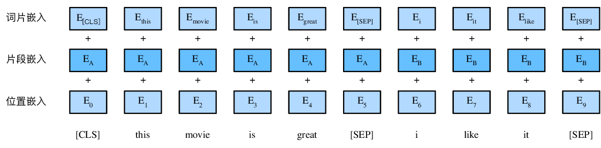
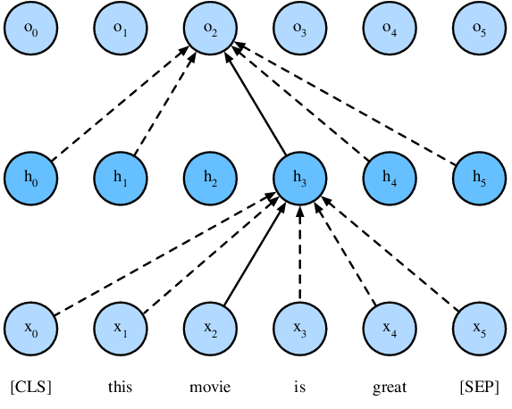
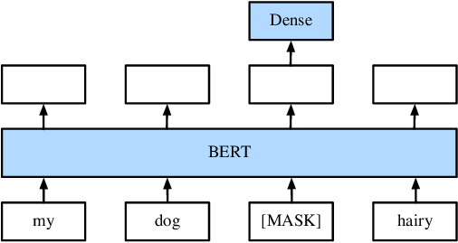
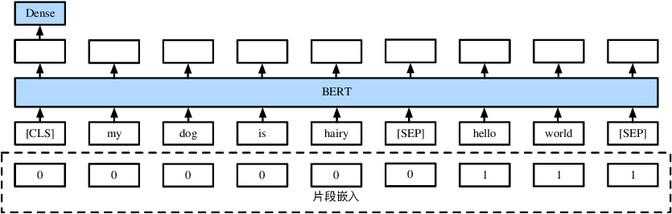

...

```{.python .input  n=3}
import d2l
from mxnet import gluon, np, npx
from mxnet.gluon import nn

npx.set_np()
```

...


...

```{.python .input  n=4}
# Saved in the d2l package for later use
class BERTEncoder(nn.Block):
    def __init__(self, vocab_size, units, hidden_size,
                 num_heads, num_layers, dropout, **kwargs):
        super(BERTEncoder, self).__init__(**kwargs)
        self.word_embedding = gluon.nn.Embedding(vocab_size, units)
        self.segment_embedding = gluon.nn.Embedding(2, units)
        self.pos_encoding = d2l.PositionalEncoding(units, dropout)
        self.blks = gluon.nn.Sequential()
        for i in range(num_layers):
            self.blks.add(d2l.EncoderBlock(units, hidden_size, num_heads, dropout))

    def forward(self, words, segments, mask):
        X = self.word_embedding(words) + self.segment_embedding(segments)
        X = self.pos_encoding(X)
        for blk in self.blks:
            X = blk(X, mask)
        return X
```

...

```{.python .input  n=5}
encoder = BERTEncoder(vocab_size=10000, units=768, hidden_size=1024,
                      num_heads=4, num_layers=2, dropout=0.1)
encoder.initialize()
num_samples, num_words = 2, 8
words = np.random.randint(0, 10000, (2, 8))
segments = np.array([[0, 0, 0, 0, 1, 1, 1, 1],
                     [0, 0, 0, 1, 1, 1, 1, 1]])
encodings = encoder(words, segments, None)
print(encodings.shape)
```

...



...


...

```{.python .input  n=6}
# Saved in the d2l package for later use
class MaskLMDecoder(nn.Block):
    def __init__(self, vocab_size, units, **kwargs):
        super(MaskLMDecoder, self).__init__(**kwargs)
        self.decoder = gluon.nn.Sequential()
        self.decoder.add(gluon.nn.Dense(units, flatten=False, activation='relu'))
        self.decoder.add(gluon.nn.LayerNorm())
        self.decoder.add(gluon.nn.Dense(vocab_size, flatten=False))

    def forward(self, X, masked_positions):
        ctx = masked_positions.context
        dtype = masked_positions.dtype
        num_masked_positions = masked_positions.shape[1]
        masked_positions = masked_positions.reshape((1, -1))
        batch_size = X.shape[0]
        batch_idx = np.arange(0, batch_size)
        batch_idx = np.repeat(batch_idx, num_masked_positions)
        batch_idx = batch_idx.reshape((1, -1))
        encoded = X[batch_idx, masked_positions]
        encoded = encoded.reshape((batch_size, num_masked_positions, X.shape[-1]))
        pred = self.decoder(encoded)
        return pred
```

...

```{.python .input  n=30}
mlm_decoder = MaskLMDecoder(vocab_size=10000, units=768)
mlm_decoder.initialize()

mlm_positions = np.array([[0, 1], [4, 8]])
mlm_label = np.array([[100, 200], [100, 200]])
mlm_pred = mlm_decoder(encodings, mlm_positions)
mlm_loss_fn = gluon.loss.SoftmaxCrossEntropyLoss()
mlm_loss = mlm_loss_fn(mlm_pred, mlm_label)
print(mlm_pred.shape, mlm_loss.shape)
```

...


```{.python .input  n=18}
# Saved in the d2l package for later use
class NextSentenceClassifier(nn.Block):
    def __init__(self, units=768, **kwargs):
        super(NextSentenceClassifier, self).__init__(**kwargs)
        self.classifier = gluon.nn.Sequential()
        self.classifier.add(gluon.nn.Dense(units=units, flatten=False,
                                           activation='tanh'))
        self.classifier.add(gluon.nn.Dense(units=2, flatten=False))

    def forward(self, X):
        X = X[:, 0, :]
        return self.classifier(X)
```

...

```{.python .input  n=19}
ns_classifier = NextSentenceClassifier()
ns_classifier.initialize()

ns_pred = ns_classifier(encodings)
ns_label = np.array([0, 1])
ns_loss_fn = gluon.loss.SoftmaxCrossEntropyLoss()
ns_loss = ns_loss_fn(ns_pred, ns_label)
print(ns_pred.shape, ns_loss.shape)
```

...

```{.python .input  n=20}
# Saved in the d2l package for later use
class BERTModel(nn.Block):
    def __init__(self, vocab_size=None, embed_size=128, hidden_size=512,
                 num_heads=2, num_layers=4, dropout=0.1):
        super(BERTModel, self).__init__()
        self.encoder = BERTEncoder(vocab_size=vocab_size, units=embed_size, hidden_size=hidden_size,
                                   num_heads=num_heads, num_layers=num_layers, dropout=dropout)
        self.ns_classifier = NextSentenceClassifier()
        self.mlm_decoder = MaskLMDecoder(vocab_size=vocab_size, units=embed_size)

    def forward(self, inputs, token_types, valid_length=None, masked_positions=None):
        seq_out = self.encoder(inputs, token_types, valid_length)
        next_sentence_classifier_out = self.ns_classifier(seq_out)
        if not masked_positions is None:
            mlm_decoder_out = self.mlm_decoder(seq_out, masked_positions)
        else:
            mlm_decoder_out = None
        return seq_out, next_sentence_classifier_out, mlm_decoder_out
```

...
