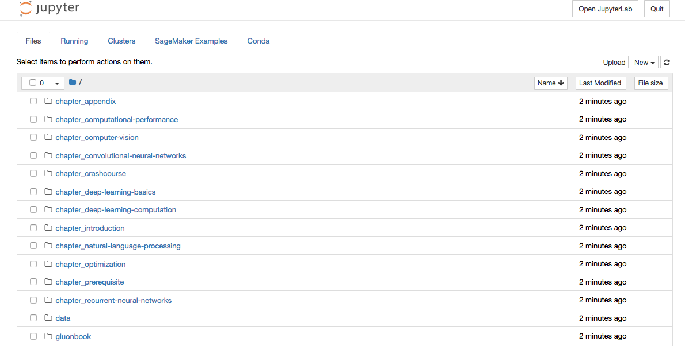

# Run on Amazon SageMaker

This tutorial will guide you through Amazon SageMaker: a service that allows you to be up and running with MXNet in 5 minutes and to do Machine Learning at large scale in the quickest and easiest way possible.

Deep Learning projects usually consist of a set of problem tasks: for instance you may have to create training datasets, train and evaluate your model, tune its hyperparameters and finally deploy the model to a production ready cluster. This workflow can be quite cumbersome and time consuming. For this reason AWS provides Amazon SageMaker a fully managed machine learning service that accelerates the overall Deep Learning workflow.

This chapter will give a high level overview about Amazon SageMaker, in-depth tutorials can be found on the [Sagemaker website](https://docs.aws.amazon.com/sagemaker/latest/dg/whatis.html).


SageMaker offers Jupyter notebooks and supports MXNet out-of-the box. You can run your notebooks on CPU instances and as such profit from  the free tier. However, more powerful CPU instances or GPU instances are charged by time.
Within this notebook you can [fetch, explore and prepare training data](https://docs.aws.amazon.com/sagemaker/latest/dg/how-it-works-notebooks-instances.html). 
```
import mxnet as mx
import sagemaker
mx.test_utils.get_cifar10() # Downloads Cifar-10 dataset to ./data
sagemaker_session = sagemaker.Session()
inputs = sagemaker_session.upload_data(path='data/cifar',
                                       key_prefix='data/cifar10')
```
Once the data is ready, you can easily launch training via the SageMaker SDK. So there is no need to manually configure and log into EC2 instances. You can either bring your own model or use SageMaker's [built-in algorithms](https://docs.aws.amazon.com/sagemaker/latest/dg/algos.html) that are tailored to specific use cases such as computer vision, NLP etc. SageMaker encapsulates the process of training into the class ```Estimator``` and we can now start the training on the local notebook instance:
```
from sagemaker.mxnet import MXNet as MXNetEstimator
estimator = MXNetEstimator(entry_point='train.py', 
                           role=sagemaker.get_execution_role(),
                           train_instance_count=1, 
                           train_instance_type='local',
                           hyperparameters={'batch_size': 1024, 
                                            'epochs': 30})
estimator.fit(inputs)
```
If you require a more powerful platform for training, then you only need to change the ```train_instance_type```. Once you call ```fit```, SageMaker will automatically create the required EC2 instances, train your model within a Docker container and then immediately shutdown these instances. ```Fit()``` requires an entry point (here ```train.py```) that describes the model and training loop. This script needs to provide certain functions, that will be automatically executed by SageMaker. More information about the entry point script can be found [here](https://docs.aws.amazon.com/sagemaker/latest/dg/mxnet-training-inference-code-template.html).
When the model is ready for deployment you can use [SageMaker's hosting services](https://docs.aws.amazon.com/sagemaker/latest/dg/how-it-works-hosting.html) that create an HTTPS endpoint where model inference is provided.
```
predictor = estimator.deploy(initial_instance_count=1,
                             instance_type='ml.m4.xlarge')
```

The following links show more advanced uses cases in SageMaker:
  - [Distributed training on multiple machines](https://medium.com/apache-mxnet/94-accuracy-on-cifar-10-in-10-minutes-with-amazon-sagemaker-754e441d01d7) 
  - [Hyperparameter Tuning Jobs](https://docs.aws.amazon.com/sagemaker/latest/dg/automatic-model-tuning-ex.html)
  - [Optimize a model with SageMaker Neo](https://docs.aws.amazon.com/sagemaker/latest/dg/neo.html)
  - [Build Groundtruth Datasets](https://docs.aws.amazon.com/sagemaker/latest/dg/sms-getting-started.html)
  - [Getting started with SageMaker](https://medium.com/apache-mxnet/getting-started-with-sagemaker-ebe1277484c9)

## Acquire the Code for this Book and activate MXNet GPU environment

Next, download the code for this book and and unzip it. Go to you notebook instance and create a new cell with the following content:

```%%bash
%%bash
wget https://www.diveintodeeplearning.org/d2l-en-1.0.zip 
unzip d2l-en-1.0.zip 
```

When you open Jupyter, you will find the downloaded and unzipped chapters. Now you can pick any available notebook. 


## Summary

* You can use cloud computing services to obtain more powerful computing resources and use them to run the deep learning code in this document.

## Problem

* The cloud offers convenience, but it does not come cheap. Research the prices of cloud services and find ways to reduce overhead.

## Discuss on our Forum

<div id="discuss" topic_id="2399"></div>
